# CI/CD Database Version Backward Compatibility Testing - Implementation Plan

## Summary

This plan implements automated testing for database version backward compatibility in Gravitee AM. The solution uses a **manual trigger** (via zx script or label) to start a CircleCI workflow that:

1. **Deploys** version N of AM (Management API + Gateways) to a test environment via ArgoCD (push tags to cloud-am repo)
2. **Seeds** test data and validates functionality for version N
3. **Upgrades** to version N+1 (MAPI first, then Gateways) via ArgoCD and validates compatibility
4. **Downgrades** back to version N via ArgoCD and validates backward compatibility

**Key Features**:
- **MongoDB only** (JDBC as future work)
- **N to N+1 testing** with version parameters (e.g., `--from 4.10 --to master`, where master is always latest)
- **Manual trigger** via command line or PR label
- **Jest test suites** for seeding, migration validation, and functional testing
- **ArgoCD-based deployment** via cloud-am GitOps repository
- **Readiness detection** via ArgoCD sync status (no manual polling needed)

The workflow ensures that upgrades don't break existing functionality and downgrades handle incompatible data gracefully (filtering, warnings, or controlled failures).

## End-to-End Process Flow

```mermaid
flowchart TD
    Start([Developer/CI Engineer]) --> Trigger{Manual Trigger}
    
    Trigger -->|Option A: zx Script| ZxScript[yarn run migration-test<br/>--from-tag 4.10.5 --to-tag latest]
    Trigger -->|Option B: PR Label| PRLabel[Add label to PR<br/>e.g., 'test-migration']
    Trigger -->|Option C: CircleCI API| CircleCIAPI[Direct API call<br/>with parameters]
    
    ZxScript --> CircleCIWorkflow[CircleCI Workflow Triggered<br/>Parameters: from_tag, to_tag]
    PRLabel --> CircleCIWorkflow
    CircleCIAPI --> CircleCIWorkflow
    
    CircleCIWorkflow --> CleanEnv[🧹 Clean Test Environment<br/>- Delete cluster resources<br/>- Clean MongoDB database]
    
    CleanEnv --> DeployN[📤 Push Version N Tag to cloud-am<br/>Update values.yaml imageTag<br/>Commit & push to cloud-am repo]
    
    DeployN --> ArgoCDSyncN[⏳ Wait for ArgoCD Sync<br/>Check ArgoCD sync status<br/>Version N deployed]
    
    ArgoCDSyncN --> CheckoutN[💻 Checkout Version N Codebase<br/>git checkout v4.10.x]
    
    CheckoutN --> SeedN[🌱 Run Seed/Migration Tests N<br/>Jest Suite 'a' + 'b'<br/>- MAPI seeding<br/>- Gateway seeding<br/>- Validate data]
    
    SeedN --> UpgradeMAPI[📤 Push Version N+1 MAPI Tag<br/>Update MAPI imageTag only<br/>Commit & push to cloud-am]
    
    UpgradeMAPI --> ArgoCDSyncMAPI[⏳ Wait for ArgoCD Sync<br/>MAPI upgraded to N+1]
    
    ArgoCDSyncMAPI --> TestNGW[🏃 Run Version N Gateway Tests<br/>Jest Suite 'b'<br/>Validate GW with old tests]
    
    TestNGW --> UpgradeGW[📤 Push Version N+1 GW Tag<br/>Update Gateway imageTag<br/>Commit & push to cloud-am]
    
    UpgradeGW --> ArgoCDSyncGW[⏳ Wait for ArgoCD Sync<br/>Gateways upgraded to N+1]
    
    ArgoCDSyncGW --> CheckoutN1[💻 Checkout Version N+1 Codebase<br/>git checkout master<br/>master = latest]
    
    CheckoutN1 --> TestN1[🏃 Run Version N+1 Tests<br/>Jest Suite 'a' + 'b' + 'c'<br/>- Full functional validation<br/>- New features work]
    
    TestN1 --> Downgrade[📤 Push Version N Tag to cloud-am<br/>Downgrade MAPI + Gateways<br/>Commit & push to cloud-am]
    
    Downgrade --> ArgoCDSyncDowngrade[⏳ Wait for ArgoCD Sync<br/>Downgraded to version N]
    
    ArgoCDSyncDowngrade --> CheckoutN2[💻 Checkout Version N Codebase<br/>git checkout v4.10.x]
    
    CheckoutN2 --> TestNDowngrade[🏃 Run Version N Tests<br/>Jest Suite 'a' + 'b' + 'c'<br/>- Validate backward compatibility<br/>- Incompatible data filtered]
    
    TestNDowngrade --> CollectResults[📊 Collect Test Results<br/>- Store logs<br/>- Store artifacts<br/>- Generate report]
    
    CollectResults --> Success{All Tests Pass?}
    
    Success -->|Yes| Pass[✅ Workflow Success<br/>Version compatibility verified]
    Success -->|No| Fail[❌ Workflow Failed<br/>Store error details<br/>Notify team]
    
    Pass --> End([End])
    Fail --> End
    
    style Start fill:#e1f5ff
    style CircleCIWorkflow fill:#fff4e1
    style CleanEnv fill:#ffe1e1
    style DeployN fill:#e1ffe1
    style ArgoCDSyncN fill:#fff9e1
    style SeedN fill:#e1ffe1
    style ArgoCDSyncMAPI fill:#fff9e1
    style ArgoCDSyncGW fill:#fff9e1
    style TestN1 fill:#e1ffe1
    style ArgoCDSyncDowngrade fill:#fff9e1
    style TestNDowngrade fill:#e1ffe1
    style Pass fill:#d4edda
    style Fail fill:#f8d7da
    style End fill:#e1f5ff
```



## Scope

- **Database**: MongoDB only (JDBC databases as future work)
- **Version Testing**: N to N+1 only (e.g., 4.10.x → master latest)
- **Trigger**: Manual only (command line or label-based)
- **Test Scenarios**: Documented separately (see `MIGRATION_TEST_SCENARIOS.md`)

## Architecture

### Components

1. **zx Script** - Trigger workflow via CircleCI API with version parameters (similar to release script)
2. **CircleCI Workflow** - Orchestrates deployment and testing
3. **ArgoCD GitOps** - Deploys/upgrades AM via cloud-am repository (push tags to update values.yaml)
4. **Jest Test Suites** - Seeding and migration validation tests

## Implementation Details

### 1. zx Script for Workflow Trigger

**Location**: `scripts/migration-test.mjs` (or similar)

```javascript
// Usage: yarn run migration-test -- --from-tag 4.10.5 --to-tag latest --db-type mongodb
// --from-tag: Source image tag (e.g., "4.10.5", "4.9.10")
// --to-tag: Target image tag (e.g., "latest" for master, or specific tag like "4.11.0")
// --db-type: Database type (default: "mongodb")
// Triggers CircleCI workflow via API with pipeline parameters
```

**Features**:
- Accepts image tag parameters (`from-tag`, `to-tag`)
- `latest` tag represents master/latest build
- Triggers CircleCI workflow via API with pipeline parameters
- Returns workflow URL for monitoring
- **Future**: Auto-detect latest tags from version numbers (e.g., `--from 4.10` → latest 4.10.x tag)

### 2. CircleCI Workflow

**Location**: `.circleci/workflows.yml`

**Pipeline Parameters**:
- `from_tag`: Source image tag (e.g., "4.10.5", "4.9.10")
- `to_tag`: Target image tag (e.g., "latest" for master, or specific tag)
- `db_type`: Database type (default: "mongodb")

**Workflow Steps**:
1. Checkout AM codebase (latest)
2. Clean test environment (cluster + MongoDB)
3. Push from_tag to cloud-am repo (update values.yaml imageTag for MAPI + GWs)
4. Wait for ArgoCD sync status (version N deployed)
5. Checkout version N codebase (based on from_tag)
6. Run seed/migration tests for version N (Jest suites a + b)
7. Push to_tag MAPI imageTag to cloud-am (MAPI only)
8. Wait for ArgoCD sync status (MAPI upgraded)
9. Run version N functional tests (GW tests b)
10. Push to_tag GW imageTag to cloud-am (Gateways)
11. Wait for ArgoCD sync status (Gateways upgraded)
12. Checkout version N+1 codebase (if to_tag is "latest", checkout master; otherwise checkout matching tag)
13. Run version N+1 functional tests (suites a + b + c)
14. Push from_tag to cloud-am (downgrade MAPI + GWs)
15. Wait for ArgoCD sync status (downgraded)
16. Checkout version N codebase
17. Run version N functional tests (suites a + b + c)
18. Capture test results and artifacts

**Manual Trigger Options**:
- **Option A**: Command line via zx script (recommended)
- **Option B**: Label-based trigger on master branch PR
- **Option C**: CircleCI API with pipeline parameters

### 3. Jest Test Suites

**Test Suite Structure**:

- **Suite "a"**: Management API seeding and validation
  - Idempotent seeding
  - Migration validation
  - Functional tests

- **Suite "b"**: Gateway seeding and validation
  - Idempotent seeding
  - Migration validation
  - Functional tests
  - Example: Enum values for ReferenceType in Gateway

- **Suite "c"**: Standard functional tests (excluded from seeding)
  - Existing CI test script (`yarn run test`) excludes seeding/migration tests
  - Used for validation after upgrades/downgrades

**Test Guidelines**:
- Seeding tests must be idempotent
- Migration tests must account for data seeded in previous version
- Standard tests ("c") may need cleanup after running
- Tests should fail workflow early on failure

### 4. ArgoCD GitOps Deployment

**Deployment Process** (similar to `gitops-deploy.sh`):
1. Clone cloud-am repository
2. Update `values.yaml` with target imageTag (for MAPI and/or GWs)
3. Commit and push changes to cloud-am branch
4. ArgoCD automatically syncs the changes

**Readiness Detection**:
- Check ArgoCD sync status via ArgoCD API
- Wait for application to be "Synced" and "Healthy"
- No manual healthcheck polling needed
- Timeout handling with clear error messages

**Version Handling**:
- Image tags are parameters (`from_tag`, `to_tag`)
- `latest` tag represents master/latest build
- **Initial POC**: Explicit image tags required (e.g., `--from-tag 4.10.5 --to-tag latest`)
- **Future Work**: Auto-detection from version numbers (e.g., `--from 4.10` → latest 4.10.x tag)

## Key Considerations

### Environment Setup

- Dedicated test environment with ArgoCD application
- cloud-am GitOps repository with test environment branch
  - ApplicationSet/environment setup handled separately in cloud-am repo
- Docker image tags provided as parameters (auto-detection as future work)
- MongoDB dependency (choose one):
  - **Option A (Recommended)**: Internal dependency via ArgoCD in cloud-am (in-cluster/in-namespace MongoDB instance, recreatable for each test run)
  - **Option B**: Keep MongoDB deployment, clean database (drop collections/database) between test runs
- ArgoCD API access for sync status checking

### Workflow Structure (POC Approach)

**Modular Components** (reusable, organized in subfolders):
- `.circleci/migration-test/` - Migration testing workflow components
  - `jobs/` - Reusable job definitions
  - `scripts/` - Shared scripts (ArgoCD sync, version checkout, etc.)
  - `commands/` - Reusable command definitions
- Workflow optimization and advanced features deferred to future work
- Focus on POC: functional end-to-end testing first

### Test Data Management

- Seeding tests must be version-aware
- Migration tests must validate data from previous version
- Guidelines needed for writing/maintaining tests across versions

### Failure Handling

- Fail workflow early on test failures
- Store logs and test results as artifacts
- Clear error messages for troubleshooting

## Future Enhancements

- **Workflow Optimization**: Advanced features, parallelization, caching
- **Auto Tag Detection**: Automatically detect latest 4.10.x and master latest build tags
- **JDBC Database Support**: PostgreSQL, MySQL, etc.
- **Multi-Version Testing**: N to N+2, N to N+3
- **Automated Scheduling**: Nightly runs
- **Gateway with Different Backends**: MongoDB + PostgreSQL in same test run

## Next Steps

1. **Review & Approval**: Team review of high-level approach
2. **Test Scenarios**: Define detailed test scenarios (separate document)
3. **Spike**: Proof-of-concept for single version pair (4.10.x → master)
4. **Implementation**: Build components incrementally
5. **Documentation**: Create guidelines for test writing/maintenance

## Open Questions & Planning Aspects

### 1. MongoDB Cleanup Strategy
**Decision Needed**: Choose between Option A (recreate MongoDB) or Option B (clean database)
- **Option A**: Recreate MongoDB instance via ArgoCD (cleaner, isolated)
  - Pros: Complete isolation, no data leakage
  - Cons: Slower startup, requires ArgoCD ApplicationSet for MongoDB
- **Option B**: Keep MongoDB, clean database/collections
  - Pros: Faster, simpler
  - Cons: Potential for data leakage if cleanup incomplete
- **Recommendation**: Option A for POC (cleaner), Option B for optimization later

### 2. Test Data Seeding Strategy
**Questions**:
- What specific test data should be seeded? (roles, memberships, applications, users?)
- Should seeding include version-specific data (e.g., PROTECTED_RESOURCE enum for 4.10+)?
- How to ensure idempotency across multiple test runs?
- Should we seed minimal data or comprehensive datasets?

**Recommendation**: Start with minimal critical data (roles, memberships with PROTECTED_RESOURCE), expand as needed

### 3. Test Suite Organization
**Questions**:
- Where should Jest test suites live? (`gravitee-am-ui/` or separate test directory?)
- How to structure suites "a", "b", "c" for maintainability?
- Should migration tests be separate files or integrated with functional tests?
- How to handle test data cleanup between suites?

**Recommendation**: Create `tests/migration/` directory with clear separation of suites

### 4. Version Resolution Logic
**Questions**:
- How to map version numbers to tags (e.g., `--from 4.10` → "4.10.5")?
- Should we query Docker registry for latest tag matching pattern?
- How to handle "latest" → actual latest build tag resolution?
- Fallback strategy if tag not found?

**Recommendation**: For POC, require explicit image tags (e.g., `--from-tag 4.10.5`); implement auto-detection from version numbers as future work

### 5. Failure Handling & Cleanup
**Questions**:
- What happens if test fails mid-way? (partial upgrade state)
- Should we always attempt cleanup/rollback on failure?
- How to handle ArgoCD sync failures? (retry logic, timeout values)
- What artifacts/logs to collect for debugging?

**Recommendation**: Always attempt cleanup, collect ArgoCD logs + application logs + test results

### 6. Timeout & Resource Management
**Questions**:
- Timeout for ArgoCD sync? (5 min? 10 min?)
- Timeout for test execution? (30 min? 60 min?)
- Should we run tests sequentially or in parallel?
- Resource class for CircleCI jobs? (medium, large?)

**Recommendation**: Start conservative (10 min sync, 60 min tests), optimize based on POC results

### 7. Test Environment Isolation
**Questions**:
- One test run at a time or support parallel runs?
- How to handle concurrent test triggers?
- Should we use separate namespaces per test run?
- How to prevent test interference?

**Recommendation**: Single test at a time for POC, add locking/queuing mechanism later

### 8. Notification & Reporting
**Questions**:
- Who should be notified on test failures? (Slack channel? Team email?)
- What level of detail in notifications? (summary vs full logs)
- Should we create GitHub issues for failures?
- Dashboard/reporting for test history?

**Recommendation**: Slack notification with summary + link to CircleCI job, expand later

### 9. Test Scenarios Definition
**Questions**:
- What specific upgrade scenarios to test? (enum compatibility, schema changes, data migration)
- What downgrade scenarios? (incompatible data filtering, graceful degradation)
- Edge cases to cover? (empty database, corrupted data, partial migrations)
- Success criteria for each scenario?

**Recommendation**: Document in separate `MIGRATION_TEST_SCENARIOS.md` (as noted in scope)

### 10. cloud-am Repository Dependencies
**Note**: This work will be handled separately in cloud-am repository
- ApplicationSet configuration for test environment
- MongoDB ApplicationSet (if Option A chosen)
- Environment-specific values.yaml structure
- Branch strategy for test environment

### 11. Cost & Performance Considerations
**Questions**:
- Estimated test duration? (affects CircleCI compute costs)
- How often will tests run? (manual triggers only initially)
- Should we implement test result caching? (skip unchanged scenarios)
- Resource usage optimization strategies?

**Recommendation**: Monitor costs during POC, optimize based on usage patterns

## Implementation Priorities

### Phase 1: POC (Initial Implementation)
1. ✅ Modular workflow structure with reusable components
2. ✅ Basic ArgoCD deployment (push tags to cloud-am)
3. ✅ ArgoCD sync status checking
4. ✅ MongoDB cleanup/recreation strategy
5. ✅ Basic test suite structure (suites a, b, c)
6. ✅ Manual trigger via zx script
7. ✅ Image tags as parameters

### Phase 2: Refinement (Post-POC)
1. Auto tag detection
2. Enhanced failure handling
3. Notification system
4. Test scenario expansion
5. Performance optimization

### Phase 3: Future Enhancements
1. Workflow optimization
2. Parallel test execution
3. JDBC database support
4. Automated scheduling

## References

- [Backward Compatibility Implementation Plan](./BACKWARD_COMPATIBILITY_IMPLEMENTATION_PLAN.md)
- [Migration Test Scenarios](./MIGRATION_TEST_SCENARIOS.md) (to be created)
- [cloud-am Repository](https://github.com/gravitee-io/cloud-am) - ApplicationSet and environment setup
