# CI/CD Database Version Backward Compatibility Testing - Implementation Plan

> **Document Navigation**:
> - 📋 **[This Document](./CI_CD_DATABASE_VERSION_TESTING_RESEARCH.md)** - High-level architecture, workflow design, and key decisions
> - 🔧 **[Implementation Plan](./MIGRATION_TEST_IMPLEMENTATION_PLAN.md)** - Detailed task breakdown, dependencies, and parallel work suggestions
> - 🧪 **[Test Scenarios](./MIGRATION_TEST_SCENARIOS.md)** - Test scenarios, data seeding strategies, and success criteria
> - ☁️ **[cloud-am Setup Plan](./CLOUD_AM_ENVIRONMENT_SETUP_PLAN.md)** - Prerequisite work in cloud-am repository (MUST COMPLETE FIRST)

## Summary

This plan implements automated testing for database version backward compatibility in Gravitee AM. The solution uses a **manual trigger** (via zx script or label) to start a CircleCI workflow that:

1. **Deploys** version N of AM (Management API + Gateways) to a test environment via ArgoCD (push tags to cloud-am repo)
2. **Seeds** test data and validates functionality for version N
3. **Upgrades** to version N+1 (MAPI first, then Gateways) via ArgoCD and validates compatibility
4. **Downgrades** back to version N via ArgoCD and validates backward compatibility

**Key Features (POC)**:
- **MongoDB only** (🔮 **FUTURE**: JDBC database support)
- **N to N+1 testing** with explicit image tag parameters (e.g., `--from-tag 4.10.5 --to-tag latest`)
- **Manual trigger** via command line or PR label
- **Existing Jest tests** from current branch (🔮 **FUTURE**: Migration-specific test suites)
- **ArgoCD-based deployment** via cloud-am GitOps repository
- **Readiness detection** via ArgoCD sync status polling (🔮 **FUTURE**: Timeout handling)
- **Manual result checking** (🔮 **FUTURE**: Slack notifications)

The workflow ensures that upgrades don't break existing functionality and downgrades handle incompatible data gracefully (filtering, warnings, or controlled failures).

## End-to-End Process Flow

```mermaid
flowchart TD
    Start([Developer/CI Engineer]) --> Trigger{Manual Trigger}
    
    Trigger -->|Option A: zx Script| ZxScript[yarn run migration-test<br/>--from-tag 4.10.5 --to-tag latest]
    Trigger -->|Option B: PR Label| PRLabel[Add label to PR<br/>e.g., 'test-migration']
    Trigger -->|Option C: CircleCI API| CircleCIAPI[Direct API call<br/>with parameters]
    
    ZxScript --> CircleCIWorkflow[CircleCI Workflow Triggered<br/>Parameters: from_tag, to_tag]
    PRLabel --> CircleCIWorkflow
    CircleCIAPI --> CircleCIWorkflow
    
    CircleCIWorkflow --> CleanEnv[🧹 Clean Test Environment<br/>- Delete cluster resources<br/>- Connect to MongoDB<br/>- Drop collections/database]
    
    CleanEnv --> DeployN[📤 Push Version N Tag to cloud-am<br/>Update values.yaml imageTag<br/>Commit & push to cloud-am repo]
    
    DeployN --> ArgoCDSyncN[⏳ Wait for ArgoCD Sync<br/>Check ArgoCD sync status<br/>Version N deployed]
    
    ArgoCDSyncN --> RunTestsN[🏃 Run Existing Jest Tests<br/>Using current branch codebase<br/>- MAPI tests<br/>- Gateway tests<br/>- Fail early on failure]
    
    RunTestsN --> UpgradeMAPI[📤 Push Version N+1 MAPI Tag<br/>Update MAPI imageTag only<br/>Commit & push to cloud-am]
    
    UpgradeMAPI --> ArgoCDSyncMAPI[⏳ Wait for ArgoCD Sync<br/>Poll ArgoCD API/CLI<br/>MAPI upgraded to N+1]
    
    ArgoCDSyncMAPI --> RunTestsAfterMAPI[🏃 Run Existing Jest Tests<br/>Validate after MAPI upgrade<br/>- Fail early on failure]
    
    RunTestsAfterMAPI --> UpgradeGW[📤 Push Version N+1 GW Tag<br/>Update Gateway imageTag<br/>Commit & push to cloud-am]
    
    UpgradeGW --> ArgoCDSyncGW[⏳ Wait for ArgoCD Sync<br/>Poll ArgoCD API/CLI<br/>Gateways upgraded to N+1]
    
    ArgoCDSyncGW --> RunTestsN1[🏃 Run Existing Jest Tests<br/>Validate after full upgrade<br/>- Fail early on failure<br/>- Full functional validation]
    
    RunTestsN1 --> Downgrade[📤 Push Version N Tag to cloud-am<br/>Downgrade MAPI + Gateways<br/>Commit & push to cloud-am]
    
    Downgrade --> ArgoCDSyncDowngrade[⏳ Wait for ArgoCD Sync<br/>Poll ArgoCD API/CLI<br/>Downgraded to version N]
    
    ArgoCDSyncDowngrade --> RunTestsDowngrade[🏃 Run Existing Jest Tests<br/>CRITICAL: Complete full suite<br/>- Collect all failures<br/>- Validate backward compatibility<br/>- Incompatible data filtered]
    
    RunTestsDowngrade --> CollectResults[📊 Collect Test Results<br/>- Store logs<br/>- Store artifacts<br/>- Generate report]
    
    CollectResults --> Success{All Tests Pass?}
    
    Success -->|Yes| Pass[✅ Workflow Success<br/>Version compatibility verified]
    Success -->|No| Fail[❌ Workflow Failed<br/>Store error details<br/>Manual check required]
    
    Pass --> End([End])
    Fail --> End
    
    style Start fill:#e1f5ff
    style CircleCIWorkflow fill:#fff4e1
    style CleanEnv fill:#ffe1e1
    style DeployN fill:#e1ffe1
    style ArgoCDSyncN fill:#fff9e1
    style RunTestsN fill:#e1ffe1
    style ArgoCDSyncMAPI fill:#fff9e1
    style RunTestsAfterMAPI fill:#e1ffe1
    style ArgoCDSyncGW fill:#fff9e1
    style RunTestsN1 fill:#e1ffe1
    style ArgoCDSyncDowngrade fill:#fff9e1
    style RunTestsDowngrade fill:#e1ffe1
    style Pass fill:#d4edda
    style Fail fill:#f8d7da
    style End fill:#e1f5ff
```



## Scope

### POC Scope (What We're Building)
- **Database**: MongoDB only
- **Version Testing**: N to N+1 only (e.g., 4.10.x → master latest)
- **Trigger**: Manual only (command line or label-based)
- **Tests**: Existing Jest tests from current branch
- **Image Tags**: Explicit tags required as parameters (e.g., `--from-tag 4.10.5`)
- **ArgoCD Sync**: Polling without timeout (manual monitoring)
- **Results**: Manual checking (no notifications)
- **Test Scenarios**: Documented separately (see `MIGRATION_TEST_SCENARIOS.md`)

### 🔮 Out of POC Scope (Future Work)
- JDBC database support (PostgreSQL, MySQL, etc.)
- Auto tag detection from version numbers
- Timeout handling for ArgoCD sync and test execution
- Notification system (Slack, email)
- Migration-specific test suites
- Version branch checkout for version-specific tests
- Workflow optimization, parallelization, caching
- Automated scheduling
- Multi-version testing (N to N+2, etc.)

## Architecture

### Components

1. **zx Script** - Trigger workflow via CircleCI API with version parameters (similar to release script)
2. **CircleCI Workflow** - Orchestrates deployment and testing
3. **ArgoCD GitOps** - Deploys/upgrades AM via cloud-am repository (push tags to update values.yaml)
4. **Jest Test Suites** - Seeding and migration validation tests

## Implementation Details

### 1. zx Script for Workflow Trigger

**Location**: `scripts/migration-test.mjs` (or similar)

```javascript
// Usage: yarn run migration-test -- --from-tag 4.10.5 --to-tag latest --db-type mongodb
// --from-tag: Source image tag (e.g., "4.10.5", "4.9.10")
// --to-tag: Target image tag (e.g., "latest" for master, or specific tag like "4.11.0")
// --db-type: Database type (default: "mongodb")
// Triggers CircleCI workflow via API with pipeline parameters
```

**Features (POC)**:
- Accepts explicit image tag parameters (`from-tag`, `to-tag`)
- `latest` tag represents master/latest build
- Triggers CircleCI workflow via API with pipeline parameters
- Returns workflow URL for monitoring

🔮 **FUTURE WORK**: Auto-detect latest tags from version numbers (e.g., `--from 4.10` → latest 4.10.x tag)

### 2. CircleCI Workflow

**Location**: `.circleci/workflows.yml`

**Pipeline Parameters**:
- `from_tag`: Source image tag (e.g., "4.10.5", "4.9.10")
- `to_tag`: Target image tag (e.g., "latest" for master, or specific tag)
- `db_type`: Database type (default: "mongodb")

**Workflow Steps (POC - using current branch)**:
1. Checkout AM codebase (current branch - used for all test runs)
2. Clean test environment (cluster resources)
3. **Clean MongoDB database** (connect to MongoDB, drop collections/database)
4. Push from_tag to cloud-am repo (update values.yaml imageTag for MAPI + GWs)
5. Wait for ArgoCD sync status (poll ArgoCD API/CLI until "Synced" and "Healthy") - 🔮 **FUTURE**: Timeout handling
6. Run existing Jest tests (using current branch codebase) - **fail early if critical**
7. Push to_tag MAPI imageTag to cloud-am (MAPI only)
8. Wait for ArgoCD sync status (MAPI upgraded) - 🔮 **FUTURE**: Timeout handling
9. Run existing Jest tests (validate after MAPI upgrade) - **fail early if critical**
10. Push to_tag GW imageTag to cloud-am (Gateways)
11. Wait for ArgoCD sync status (Gateways upgraded) - 🔮 **FUTURE**: Timeout handling
12. Run existing Jest tests (validate after full upgrade) - **fail early if critical**
13. Push from_tag to cloud-am (downgrade MAPI + GWs)
14. Wait for ArgoCD sync status (downgraded) - 🔮 **FUTURE**: Timeout handling
15. Run existing Jest tests (validate backward compatibility) - **complete full suite, collect all failures**
16. Capture test results and artifacts

🔮 **FUTURE WORK**: Checkout different version branches for version-specific tests

**Manual Trigger Options**:
- **Option A**: Command line via zx script (recommended)
- **Option B**: Label-based trigger on master branch PR
- **Option C**: CircleCI API with pipeline parameters

### 3. Jest Test Execution

**POC Approach**:
- Run existing Jest tests from current branch
- No new migration-specific tests initially
- Tests execute against deployed versions (from_tag → to_tag → from_tag)
- Manual checking of test results (no notifications)

🔮 **FUTURE WORK - Test Structure**:
- Migration-specific tests will live in folders similar to existing Jest tests
- Tests will only execute with migration job (excluded from general CI process)
- Test suites organization:
  - **Suite "a"**: Management API seeding and validation
  - **Suite "b"**: Gateway seeding and validation
  - **Suite "c"**: Standard functional tests (excluded from seeding)
- Tests will be version-aware and can checkout different branches for version-specific validation

### 4. ArgoCD GitOps Deployment

**Deployment Process** (similar to `gitops-deploy.sh`):
1. Clone cloud-am repository
2. Update `values.yaml` with target imageTag (for MAPI and/or GWs)
3. Commit and push changes to cloud-am branch
4. ArgoCD automatically syncs the changes

**Readiness Detection**:
- Check ArgoCD sync status programmatically via ArgoCD API or CLI
- Poll ArgoCD application status until "Synced" and "Healthy" states are reached
- Implementation options:
  - **ArgoCD CLI**: `argocd app get <app-name>` and parse output for sync status
  - **ArgoCD REST API**: `GET /api/v1/applications/<app-name>` and check `status.sync.status` and `status.health.status`
- Script will poll at intervals (e.g., every 10-30 seconds) until sync completes
- Check for both conditions: `sync.status == "Synced"` AND `health.status == "Healthy"`
- 🔮 **FUTURE WORK**: Timeout handling with clear error messages

**Version Handling (POC)**:
- Image tags are parameters (`from_tag`, `to_tag`)
- `latest` tag represents master/latest build
- Explicit image tags required (e.g., `--from-tag 4.10.5 --to-tag latest`)

🔮 **FUTURE WORK**: Auto-detection from version numbers (e.g., `--from 4.10` → latest 4.10.x tag)

## Key Considerations

### Environment Setup

- Dedicated test environment with ArgoCD application
- cloud-am GitOps repository with test environment branch
  - ApplicationSet/environment setup handled separately in cloud-am repo
- Docker image tags provided as explicit parameters (🔮 **FUTURE**: Auto-detection)
- MongoDB dependency:
  - MongoDB instance deployed via ArgoCD (persistent deployment)
  - **Database cleanup at job start**: Clean database (drop collections/database) at the beginning of each test run
  - ArgoCD doesn't know when to recreate instances, so cleanup is handled by workflow script
  - Cleanup script connects to MongoDB and drops/cleans database before starting tests
- ArgoCD API/CLI access for sync status checking

### Workflow Structure (POC Approach)

**Modular Components** (reusable, organized in subfolders):
- `.circleci/migration-test/` - Migration testing workflow components
  - `jobs/` - Reusable job definitions
  - `scripts/` - Shared scripts (ArgoCD sync, version checkout, etc.)
  - `commands/` - Reusable command definitions
- Workflow optimization and advanced features deferred to future work
- Focus on POC: functional end-to-end testing first

### Test Data Management

🔮 **FUTURE WORK**:
- Seeding tests must be version-aware
- Migration tests must validate data from previous version
- Guidelines needed for writing/maintaining tests across versions

**POC**: Using existing Jest tests, no custom seeding initially

### Failure Handling

**Strategy**:
- **Non-critical stages**: Fail early on test failures (e.g., initial deployment tests, upgrade tests)
  - Allows quick feedback on obvious issues
  - Saves time and resources
- **Critical stages**: Complete full test suite even if some tests fail (e.g., downgrade and backward compatibility tests)
  - Collect all test failures for comprehensive analysis
  - Critical for understanding full impact of downgrade scenarios
- Store logs and test results as artifacts regardless of failure point
- Clear error messages for troubleshooting

## 🔮 Future Enhancements (NOT in POC)

- **Workflow Optimization**: Advanced features, parallelization, caching
- **Auto Tag Detection**: Automatically detect latest 4.10.x and master latest build tags
- **JDBC Database Support**: PostgreSQL, MySQL, etc.
- **Multi-Version Testing**: N to N+2, N to N+3
- **Automated Scheduling**: Nightly runs
- **Gateway with Different Backends**: MongoDB + PostgreSQL in same test run
- **Timeout Handling**: ArgoCD sync timeouts, test execution timeouts
- **Notification System**: Slack integration, email notifications
- **Migration-Specific Test Suites**: Dedicated tests excluded from general CI
- **Version Branch Checkout**: Checkout different branches for version-specific tests

## Next Steps

1. **Review & Approval**: Team review of high-level approach
2. **Test Scenarios**: Define detailed test scenarios (separate document)
3. **Spike**: Proof-of-concept for single version pair (4.10.x → master)
4. **Implementation**: Build components incrementally
5. **Documentation**: Create guidelines for test writing/maintenance

## Open Questions & Planning Aspects

### 1. MongoDB Cleanup Strategy
**Decision**: Clean database at job start (not rely on ArgoCD recreation)
- MongoDB instance is deployed via ArgoCD (persistent)
- ArgoCD doesn't know when to recreate instances
- **Approach**: Workflow script connects to MongoDB and cleans database at job start
  - Drop collections or drop entire database
  - Ensures clean state for each test run
  - Faster than recreating instance
  - Script handles cleanup logic (can be idempotent)

### 2. Test Data Seeding Strategy
🔮 **FUTURE WORK** (not in POC):
- What specific test data should be seeded? (roles, memberships, applications, users?)
- Should seeding include version-specific data (e.g., PROTECTED_RESOURCE enum for 4.10+)?
- How to ensure idempotency across multiple test runs?
- Should we seed minimal data or comprehensive datasets?

**POC**: Using existing Jest tests, no custom seeding initially

### 3. Test Suite Organization
**POC**: Use existing Jest tests from current branch

🔮 **FUTURE WORK**:
- Migration-specific tests will live in folders similar to existing Jest tests
- Tests will only execute with migration job (excluded from general CI)
- How to structure suites "a", "b", "c" for maintainability?
- Should migration tests be separate files or integrated with functional tests?
- How to handle test data cleanup between suites?

### 4. Version Resolution Logic
**POC**: Require explicit image tags (e.g., `--from-tag 4.10.5`)

🔮 **FUTURE WORK**:
- How to map version numbers to tags (e.g., `--from 4.10` → "4.10.5")?
- Should we query Docker registry for latest tag matching pattern?
- How to handle "latest" → actual latest build tag resolution?
- Fallback strategy if tag not found?

### 5. Failure Handling & Cleanup
**Strategy**:
- **Non-critical stages**: Fail early (initial tests, upgrade tests)
  - Quick feedback, saves resources
- **Critical stages**: Complete full suite (downgrade tests)
  - Collect all failures for comprehensive analysis
- What happens if test fails mid-way? (partial upgrade state)
  - Always attempt cleanup/rollback on failure
  - Store state information for debugging
- How to handle ArgoCD sync failures? (retry logic, timeout values)
  - Poll ArgoCD API/CLI at intervals
  - 🔮 **FUTURE WORK**: Implement timeout and retry logic
- What artifacts/logs to collect for debugging?
  - ArgoCD logs + application logs + test results
  - MongoDB state (if applicable)

**Recommendation**: Implement fail-early for non-critical, full-suite for critical stages

### 6. Timeout & Resource Management
**POC**: No timeout handling initially (manual monitoring)

🔮 **FUTURE WORK**:
- Timeout for ArgoCD sync? (5 min? 10 min?)
- Timeout for test execution? (30 min? 60 min?)
- Should we run tests sequentially or in parallel?
- Resource class for CircleCI jobs? (medium, large?)

### 7. Test Environment Isolation
**POC**: Single test run at a time

🔮 **FUTURE WORK**:
- Support parallel runs?
- How to handle concurrent test triggers?
- Should we use separate namespaces per test run?
- How to prevent test interference?
- Add locking/queuing mechanism

### 8. Notification & Reporting
**POC**: Manual checking of CircleCI build results (no notifications)

🔮 **FUTURE WORK**:
- Slack integration for test failures
- Who should be notified? (Slack channel? Team email?)
- What level of detail in notifications? (summary vs full logs)
- Should we create GitHub issues for failures?
- Dashboard/reporting for test history?

### 9. Test Scenarios Definition
**Questions**:
- What specific upgrade scenarios to test? (enum compatibility, schema changes, data migration)
- What downgrade scenarios? (incompatible data filtering, graceful degradation)
- Edge cases to cover? (empty database, corrupted data, partial migrations)
- Success criteria for each scenario?

**Recommendation**: Document in separate `MIGRATION_TEST_SCENARIOS.md` (as noted in scope)

### 10. cloud-am Repository Dependencies
**Note**: This work will be handled separately in cloud-am repository
- ApplicationSet configuration for test environment
- MongoDB ApplicationSet (if Option A chosen)
- Environment-specific values.yaml structure
- Branch strategy for test environment

### 11. Cost & Performance Considerations
**Questions**:
- Estimated test duration? (affects CircleCI compute costs)
- How often will tests run? (manual triggers only initially)
- Should we implement test result caching? (skip unchanged scenarios)
- Resource usage optimization strategies?

**Recommendation**: Monitor costs during POC, optimize based on usage patterns

## Implementation Priorities

### Phase 1: POC (Initial Implementation)
1. ✅ Modular workflow structure with reusable components
2. ✅ Basic ArgoCD deployment (push tags to cloud-am)
3. ✅ ArgoCD sync status checking
4. ✅ MongoDB cleanup/recreation strategy
5. ✅ Run existing Jest tests (using current branch)
6. ✅ Manual trigger via zx script
7. ✅ Image tags as parameters
8. ✅ Manual result checking (no notifications)

### Phase 2: Refinement (Post-POC)
1. Auto tag detection
2. Enhanced failure handling
3. Timeout handling
4. Notification system (Slack integration)
5. Migration-specific test suites (excluded from general CI)
6. Version branch checkout for version-specific tests
7. Test scenario expansion
8. Performance optimization

### Phase 3: Future Enhancements
1. Workflow optimization
2. Parallel test execution
3. JDBC database support
4. Automated scheduling

## References

- [Migration Test Implementation Plan](./MIGRATION_TEST_IMPLEMENTATION_PLAN.md) - Detailed task breakdown for POC implementation
- [Migration Test Scenarios](./MIGRATION_TEST_SCENARIOS.md) - Test scenarios and data seeding strategies
- [cloud-am Environment Setup Plan](./CLOUD_AM_ENVIRONMENT_SETUP_PLAN.md) - Prerequisite work in cloud-am repository
- [cloud-am Repository](https://github.com/gravitee-io/cloud-am) - ApplicationSet and environment setup
