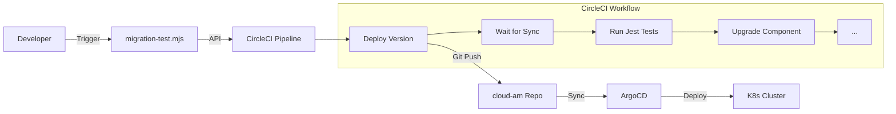

# Migration Test Tool - Usage Guide

This guide describes how to use the automated Migration Test Tool for Gravitee Access Management.

## Overview

The Migration Test Tool automates the process of validating database backward compatibility during upgrades. It runs a full upgrade/downgrade cycle using GitOps deployments and existing Jest tests.

**Workflow Stages:**
1.  **Deploy Source Version** (e.g., 4.10.5) -> Run Tests
2.  **Upgrade Management API** to Target Version (e.g., latest) -> Run Tests
3.  **Upgrade Gateways** to Target Version -> Run Tests
4.  **Downgrade All** to Source Version -> Run Tests (Backward Compatibility Check)

## Prerequisites

Before running the tool, ensure you have:

1.  **CircleCI Token**: A personal API token from CircleCI.
2.  **Node.js**: Installed locally to run the trigger script.
3.  **Permissions**: Access to trigger pipelines on the `gravitee-access-management` repository.

## Quick Start

The tool is triggered via a helper script in the repository.

1.  **Export your CircleCI Token**:
    ```bash
    export CIRCLECI_TOKEN="your-personal-api-token"
    ```

2.  **Run the Test**:
    ```bash
    npx zx scripts/migration-test.mjs --from-tag 4.10.5 --to-tag latest
    ```

    *Note: `latest` refers to the latest build on the `master` branch.*

## Command Reference

### `scripts/migration-test.mjs`

| Parameter | Required | Default | Description |
| :--- | :---: | :---: | :--- |
| `--from-tag` | Yes | - | The starting version tag (e.g., `4.10.5`). Must typically be a released version. |
| `--to-tag` | Yes | - | The target version tag (e.g., `latest` or `4.11.0-alpha.1`). |
| `--db-type` | No | `mongodb` | The database type to test against (`mongodb`). |

**Example:**
```bash
# Test upgrade from 4.10.0 to a specific alpha version
npx zx scripts/migration-test.mjs --from-tag 4.10.0 --to-tag 4.11.0-alpha.1
```

## Monitoring Results

When you trigger the script, it will output a link to the CircleCI workflow.

```text
🚀 Triggering Migration Test: 4.10.5 -> latest (mongodb)
✅ Pipeline triggered successfully!
Pipeline ID: ...
🔗 Dashboard: https://app.circleci.com/pipelines/gh/gravitee-io/gravitee-access-management/12345
```

Click the link to monitor the progress.

### Understanding Deployment Steps

The workflow uses **ArgoCD** to manage deployments.
- **`deploy-version` steps**: The workflow pushes a commit to the `cloud-am` GitOps repository, changing the image tags in `values.yaml`.
- **`wait-argocd-sync` steps**: The workflow waits for ArgoCD to sync the changes and report a "Healthy" status.

### Troubleshooting

- **"CircleCI API Request Failed"**: Check that your `CIRCLECI_TOKEN` is valid and exported in your shell.
- **Timeout Waiting for Sync**: If the workflow fails at `wait-argocd-sync`, check the ArgoCD dashboard (if accessible) or logs to see why the pods aren't starting.
- **Test Failures**: Check the `run-tests` step in CircleCI to see which Jest tests failed.

## Architecture


