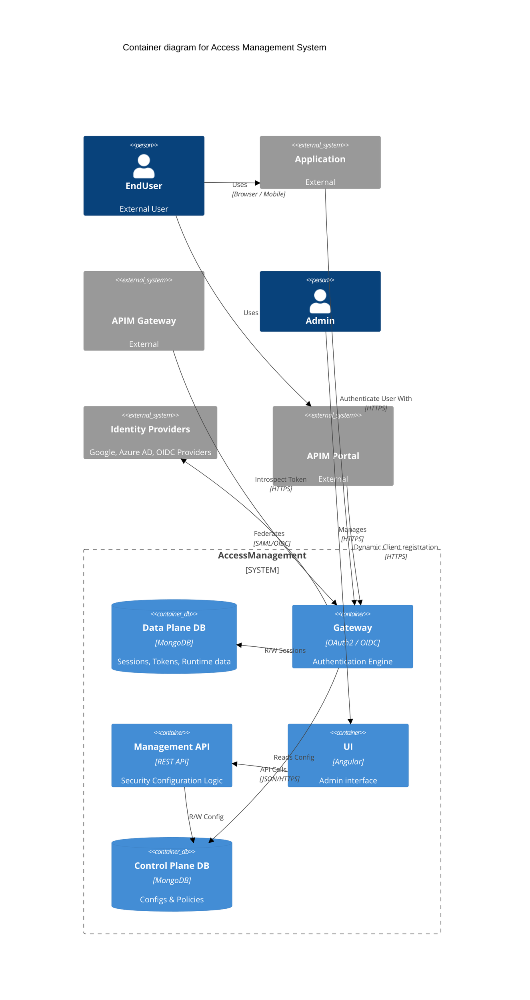

# AM - C4 Container Diagram

This document provides a Container diagram focusing on the Gravitee Access Management with some external services highlighting the relation they have with the AM containers.

## Container Diagram

