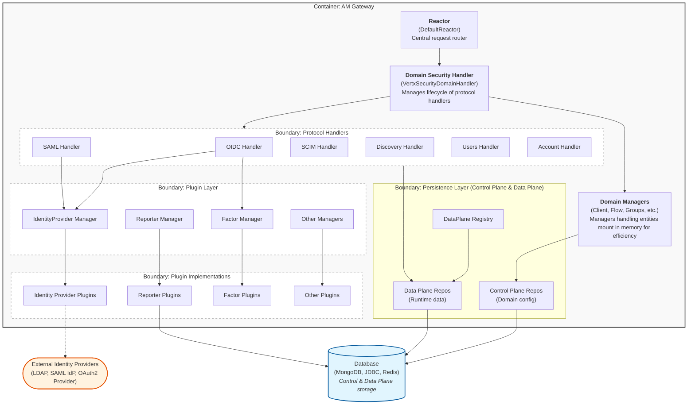

# AM Gateway - C4 Component Diagram

This document provides a Component diagram focusing on the Gravitee Access Management Gateway architecture.

## Component Diagram



## Architecture Overview

### 1. Reactor Layer
The **Reactor** (`DefaultReactor`) is the entry point for all HTTP requests. It:
- Listens to domain events (DEPLOY, UPDATE, UNDEPLOY)
- Routes requests to the appropriate security domain based on path or virtual host
- Returns 404 for unmatched routes

### 2. Domain Security Handler
The **VertxSecurityDomainHandler** manages each security domain's lifecycle:
- Initializes and starts protocol handlers (OIDC, SAML, SCIM, etc.)
- Manages domain-specific authenticators
- Provides the Vert.x Router for the domain
- Coordinates with 22+ domain managers for various features

### 3. Protocol Handlers
Multiple protocol implementations handle different authentication and provisioning standards:
- **OIDC Handler**: OAuth2 & OpenID Connect (authorization, token, userinfo, DCR, JWK)
- **SAML Handler**: SAML 2.0 Service Provider with metadata endpoints
- **SCIM Handler**: User provisioning via SCIM 2.0
- **Discovery Handler**: Provider configuration discovery
- **Users Handler**: User management REST API
- **Account Handler**: Self-service account management

### 4. Plugin Layer
The plugin architecture enables extensibility through managed components:

#### IdentityProvider Plugins
- Purpose: External authentication and user provisioning
- Examples: LDAP, SAML, OAuth2, JDBC, HTTP, Inline
- Managed by: `IdentityProviderPluginManager`
- Provides: `AuthenticationProvider` and `UserProvider` interfaces

#### Reporter Plugins
- Purpose: Audit event persistence and reporting
- Examples: File, MongoDB, TCP, HTTP
- Managed by: `ReporterPluginManager`
- Provides: `AuditReporter` interface

#### Factor Plugins
- Purpose: Multi-factor authentication implementations
- Examples: TOTP, SMS, Email, WebAuthn, OTP
- Managed by: `FactorPluginManager`
- Provides: `FactorProvider` interface

#### Other Plugins
- **Resources**: Policy engine resources
- **Policies**: Custom policy implementations
- **Certificates**: Certificate providers for JWT signing
- **Bot Detection**: Bot detection strategies
- **Device Identifiers**: Device fingerprinting
- **Authentication Device Notifiers**: Device notification channels

### 5. Repository Layer: Control Plane & Data Plane
The repository layer consists of two main parts:

#### Control Plane

- **Purpose**: Stores configuration and metadata
- **Contains**: Domain configurations, Application definitions, IdentityProvider configurations, Client settings, Policies, Forms, Emails
- **Characteristics**: Less frequently updated, typically managed through Management API
- **Scope**: the control plane is identified by the management scope

#### Data Plane

The data plane manage to store runtime data. There are two scopes for it: gateway and oauth2

##### Gateway scope 

The repository layer with the gateway scope is partially abstracted through the **DataPlaneRegistry**.

- **Purpose**: Stores user runtime data
- **Contains**: Users, Credentials, Devices, Groups, ScopeApprovals, UserActivity, LoginAttempts, AccessPolicies, Resources, PermissionTickets, PasswordHistory
- **Characteristics**: High-frequency read/write operations, subject to data residency requirements
- **Flexibility**: Can be deployed separately from control plane (e.g., EU data plane, US data plane)

##### OAuth2 scope

- **Purpose**: Stores runtime data mainly related to OAuth2 protocol
- **Contains**: AccessToken references, AuthorizationCodes, PAR object...
- **Characteristics**: High-frequency read/write operations, subject to data residency requirements
- **Flexibility**: Can be deployed separately from control plane (e.g., EU data plane, US data plane)

The **DataPlaneRegistry** provides domain-scoped access to these repositories and supports multiple database implementations (MongoDB, JDBC). 
A gateway can access to only one DataPlane instance, the DataPlaneRegistry loaded by the Gateway will only have one instance of data plane plugin. 
(Contrary to the Management API which can manage multiple data plane plugins)

### 6. Domain Managers
Each domain has multiple managers handling specific features:
- `ClientManager`: OAuth2/OIDC client management
- `CertificateManager`: Domain certificates
- `FlowManager`: Authentication flow definitions
- `EmailManager`: Email sending service
- `FormManager`: Login/consent forms
- `PasswordPolicyManager`: Password validation rules
- `ThemeManager`: UI themes
- `I18nDictionaryManager`: Internationalization
- And 14+ more managers...

## Key Architectural Principles

1. **Plugin-Based Extensibility**: All major features (authentication, MFA, reporting) are plugin-based
2. **Domain Isolation**: Each security domain has its own Spring ApplicationContext with isolated configuration
3. **Repository Abstraction**: The DataPlane layer allows switching database implementations without code changes
4. **Control/Data Plane Separation**: Configuration (control plane) is separate from runtime user data (data plane) for flexibility and compliance
5. **Protocol Flexibility**: Multiple authentication protocols can coexist in the same domain
6. **Reactive Design**: Built on Vert.x for high-performance async I/O

## Component Relationships

```
HTTP Request
  → Reactor
    → DomainSecurityHandler
      → Protocol Handlers (OIDC/SAML/SCIM/etc.)
        → Plugin Managers (IDP/Factor/Reporter/etc.)
          → Plugin Implementations
        → Domain Managers
          → Control Plane Repositories (config)
            → Database
          → DataPlane Registry
            → Data Plane Repositories (runtime data)
              → Database
```

## References

- **Reactor**: `gravitee-am-gateway/gravitee-am-gateway-reactor/`
- **Domain Handler**: `gravitee-am-gateway/gravitee-am-gateway-handler/gravitee-am-gateway-handler-core/`
- **Protocol Handlers**: `gravitee-am-gateway/gravitee-am-gateway-handler/gravitee-am-gateway-handler-{oidc,saml2,scim,etc.}/`
- **Plugin Managers**: `gravitee-am-plugins-handlers/`
- **DataPlane**: `gravitee-am-plugins-handlers/gravitee-am-plugins-handlers-dataplane/` & `gravitee-am-dataplane/`
- **Repositories**: `gravitee-am-repository/`
