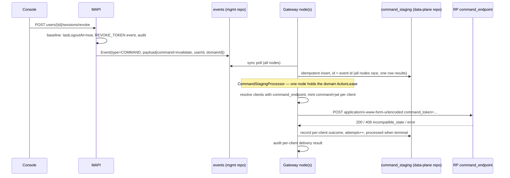

# OpenID Provider Commands: cross-RP session invalidation and account lifecycle propagation

Status: **Draft for review**
Spec: [OpenID Provider Commands 1.0 (draft)](https://openid.net/specs/openid-provider-commands-1_0.html)

---

## 1. Problem statement

### Context

AM acts as the OpenID Provider (OP) for the applications registered in a security domain.
When an administrator needs to terminate a user's access — compromised credentials,
offboarding, device theft — AM can today destroy only the state **it** holds:

| State | Where it lives | Can AM revoke it today? |
|---|---|---|
| Gateway SSO session | AM (cookie + `lastLogoutAt` check) | Yes — lazily, via `SSOSessionHandler` |
| Refresh tokens | AM token repository | Yes |
| Opaque / introspected access tokens | AM token repository | Yes |
| Self-contained JWT access tokens validated offline | RP infrastructure | **No** — valid until `exp` |
| RP-local application sessions | RP infrastructure | **No** |

The last two rows are the gap: after completing an OIDC flow, most applications establish
their own local session and never consult AM again until it expires. A user whose account
was just disabled or "logged out everywhere" by an admin **stays logged in** to every
application with a live local session or an unexpired locally-validated JWT — potentially
for hours.

There is currently **no OP→RP notification mechanism in AM at all**: OIDC Back-Channel
Logout and Front-Channel Logout are not implemented (the `backChannelLogout` method in
`LogoutEndpoint` is the opposite direction — AM acting as RP toward a delegated upstream
IdP; all `backchannel_*` client/discovery metadata is CIBA).

### What we will build

Implement the OP side of **OpenID Provider Commands 1.0**: a per-application
`command_endpoint` client metadata property, and a command-agnostic pipeline through
which AM mints signed command tokens and POSTs them to registered RP endpoints.

**Primary use case** — a "Revoke all sessions" button on the user profile page in the
console, backed by a new Management API endpoint, which:

1. Invalidates the user's AM SSO sessions (baseline — works with zero RP cooperation).
2. Revokes all the user's tokens (baseline).
3. Sends the spec's **Invalidate** command to every application in the domain that has
   registered a `command_endpoint`.

**Secondary use case** — propagate account disable/enable: the existing
`PUT .../users/{user}/status` operation (the backend of the console's *enable user*
toggle) additionally emits **Suspend** / **Reactivate** commands.

### Goals

- Admin-triggered "revoke all sessions" for a domain user, effective at AM immediately
  and at command-supporting RPs within seconds.
- Command pipeline is **command-agnostic**: adding a new command is a payload constant
  plus (at most) a trigger, not new plumbing.
- Baseline behavior (SSO session + token revocation) works for every customer with no
  RP-side work; commands are the opt-in completeness layer.
- Per-RP delivery outcomes are auditable.

### Non-goals (v1)

- Tenant commands (suspend/archive/delete/audit tenant), streaming responses.
- The Metadata command / capability negotiation, and the OP `callback_endpoint`.
- Delete/Archive/Restore lifecycle commands (pipeline supports them; no trigger wired).
- AM acting as command **receiver** (RP role toward upstream IdPs).
- OP discovery metadata: the spec deliberately defines none — capability discovery is the
  Metadata command, which is out of scope. We will not invent a non-standard
  `.well-known` field.
- Targeted fan-out (see Decisions).

---

## 2. Party mapping and prior decisions

- **OP** = the AM gateway, scoped to a security domain. Command tokens are signed with
  the domain's ID-token certificate (`JWTService` + `CertificateManager`), with header
  `typ: "command+jwt"`.
- **RP** = each application registered in the domain that opts in by registering a
  `command_endpoint`. The RP-side implementation is the customer's responsibility.
- **Management API** = trigger/control plane only; not a party in spec terms.

Decisions already made during design exploration:

| Decision | Rationale |
|---|---|
| `command_endpoint` is a **static URL** (no EL) | It is DCR client metadata and the `aud` of every command token; matches `redirect_uris` / CIBA notification endpoint precedent; validated at save time (absolute HTTPS, no fragment); avoids an SSRF-shaped surface. Per-tenant routing is the RP's job via `sub`/`tenant` claims. |
| **Blast all** clients with a `command_endpoint`; no targeting | No complete user↔app ledger exists (consents miss scopeless auth, token records expire, `user.client` is last-app-only, devices/activity are feature side effects). For a security control, a false negative (missed live session) is a failure; a false positive costs one POST answered by the spec-defined `409 {"account_state":"unknown","error":"incompatible_state"}`, which is benign and idempotent. Fan-out is small (opt-in clients only). |
| Privacy note | AM supports only the `public` subject type, so blasting discloses account existence to opted-in RPs the user never used. Acceptable for customer-owned apps in their own domain; revisit (targeting or pairwise subjects) only if a domain hosts third-party RPs. Spec privacy considerations are still "to be completed". |
| Presence of `command_endpoint` **is** the opt-in | No additional domain/application feature flag. |
| CIMD clients: opt-in is **document-declared only** | Synthesized CIMD clients never inherit `command_endpoint` from the template application — the opt-in must appear in the RP's own metadata document. Otherwise a template-level endpoint would be blasted once per CIMD client, for RPs that never opted in. Fan-out enumerates the domain's persisted (non-expired) CIMD metadata documents, since synthesized clients never enter the `ClientManager`. |

---

## 3. Architecture

### 3.1 Why an event, and why events alone are not enough

Since the data-plane split, MAPI has no direct access to the OAuth2/gateway repository
scopes; the established bridge is the events table (see `RevokeTokenEvent`, introduced
for exactly this reason: MAPI asks, the gateway executes). Command dispatch must
therefore run on the gateway — which is also correct network-wise: RP endpoints are
typically reachable from the data plane, not the control plane.

However, the sync pipeline is a **broadcast**: every gateway node polls
`eventRepository.findByTimeFrameAndDataPlaneId(...)` and publishes matching events to its
local `EventManager` (`SyncManager#processEvents`), with only per-node in-memory dedup.
That is fine for `REVOKE_TOKEN` (idempotent delete against a shared DB) but wrong for
outbound HTTP: N nodes would each POST a distinctly-signed JWT per RP, and a failed POST
would be lost.

The repo already solves single-node batch processing with retries:
`EmailStagingProcessor` + `EmailStaging` (durable rows with `attempts`/`processed`) + a
distributed **ActionLease** per domain. We reuse that pattern.

### 3.2 Pipeline

Stages:

1. **Trigger (MAPI).** Performs the baseline synchronously (see 3.4), then persists a
   `COMMAND` event. The event payload carries `command`, `userId`, `domainId`, and the
   triggering principal (for audit); it never carries a signed token — tokens are minted
   at dispatch time so `iat`/`exp`/`jti` are fresh, including on retries.
2. **Transport.** Existing sync loop; new `Type.COMMAND` + `CommandEvent` enum
   (mirroring `RevokeTokenEvent`), consumed by a domain-scoped gateway service
   (mirroring `RevokeTokenGatewayServiceImpl`).
3. **Staging (dedup across nodes).** On event receipt, each node attempts an insert of a
   `CommandStaging` row **keyed by the event id** (unique constraint / upsert). N racing
   nodes yield exactly one job. Rows live in the data-plane (gateway) repository scope,
   Mongo + JDBC.
4. **Dispatch (single node, retries).** `CommandStagingProcessor`, modeled on
   `EmailStagingProcessor`: acquire the domain `ActionLease`, fetch unprocessed jobs,
   and for each job:
   - Resolve the targets: deployed clients of the domain (excluding templates and,
     on a master domain, other domains' clients) having a non-empty `command_endpoint`,
     plus CIMD clients synthesized from the domain's persisted metadata documents whose
     document declares a `command_endpoint` (see Decisions — CIMD clients never enter
     the `ClientManager`, so they are enumerated from the CIMD document store).
   - Per client, mint a command token: `iss` (domain issuer), `aud` (the client's
     command endpoint URL), `client_id`, `sub` (user id), `iat`, `exp` (short — minutes),
     `jti`, `command`, `tenant` (domain id/hrid). Header `typ: "command+jwt"`, signed
     with the domain certificate. **No `nonce`** (spec prohibition).
   - POST `command_token=<jwt>` form-encoded to the endpoint.
   - Outcome per client: `2xx` → delivered; `409 incompatible_state` → recorded as
     benign no-op (not a failure); network error / `5xx` → retry with backoff up to
     `attempts` cap, then recorded failed.
   - Every terminal outcome produces an audit event.

### 3.3 Command-agnostic core, commands as data

The pipeline knows nothing about specific commands; a command is a string constant in
the event payload and the token's `command` claim. v1 wires two triggers:

- **`invalidate`** (primary) — from the new revoke-sessions MAPI endpoint.
- **`suspend` / `reactivate`** (secondary) — from `ManagementUserService.updateStatus`
  (the backend of `PUT .../users/{user}/status`, i.e. the console's enable toggle):
  `enabled=false` → `suspend`, `enabled=true` → `reactivate`.

Per the spec, Suspend implies invalidate semantics at the RP; on the AM side, disabling
a user already kills SSO sessions lazily (`SSOSessionHandler#checkAccountStatus` rejects
disabled accounts). See open question OQ-2 on also revoking tokens on disable.

### 3.4 Baseline (no RP cooperation) — mostly assembled already

The revoke-sessions endpoint's AM-side half reuses existing mechanics:

- **SSO sessions**: set `lastLogoutAt = now` on the user. `SSOSessionHandler` destroys
  any session whose login predates it on next touch — the same lazy "not-before" pattern
  already used for password/username resets. No session enumeration needed.
- **Tokens**: existing `RevokeTokenManagementService.sendProcessRequest(domain,
  RevokeToken.byUser(...))` → `REVOKE_TOKEN` event → gateway deletes from the token
  repository. Kills refresh tokens and opaque/introspected access tokens.
- **Audit**: `USER_LOGOUT`-style event with the acting principal, plus new
  command-delivery audit types.

This baseline ships value on day one for every customer; commands add completeness per
opted-in application.

---

## 4. Client metadata: `command_endpoint`

One new property, surfaced through all three registration paths:

| Path | Change |
|---|---|
| Console (application OIDC settings) | New optional field; save-time validation: absolute HTTPS URI, no fragment |
| DCR | `command_endpoint` in `DynamicClientRegistrationRequest`/`Response` + validation in `DynamicClientRegistrationServiceImpl` (template: CIBA's `backchannel_client_notification_endpoint`) |
| CIMD | New field in the `CimdClientMetadata` projection + mapping where the stored `metadataJson` is re-parsed into application settings |

Model plumbing: `ApplicationOAuthSettings` → `Client` (+ `asSafeClient` copy) → Mongo
(`ApplicationOAuthSettingsMongo`) and JDBC mappers.

---

## 5. Implementation plan

### WS1 — Model & persistence
- `command_endpoint` on `ApplicationOAuthSettings`, `Client`, Mongo/JDBC mappings.
- Validation in `ApplicationServiceImpl` (and shared validator used by DCR/CIMD).

### WS2 — Registration surfaces
- DCR request/response + `DynamicClientRegistrationServiceImpl` validation.
- CIMD: `CimdClientMetadata` field + metadata→settings mapping.
- Console UI: application settings field (with help text linking RP obligations).

### WS3 — Event & staging plumbing
- `Type.COMMAND`, `CommandEvent` enum (`actionOf` mapping like `RevokeTokenEvent`),
  payload model (command, userId, domainId, principal).
- `CommandStaging` model + data-plane repositories (Mongo + JDBC), unique key on
  event id; `attempts`, `processed`, per-client outcome records.
- MAPI producer service (`CommandManagementService`), mirroring
  `RevokeTokenManagementServiceImpl`.

### WS4 — Gateway dispatcher
- Domain-scoped event listener (mirror `RevokeTokenGatewayServiceImpl`) performing the
  idempotent staging insert.
- `CommandStagingProcessor` (mirror `EmailStagingProcessor`): ActionLease, batch fetch,
  retry/backoff policy, terminal-state handling.
- `CommandTokenService`: claims assembly + `typ: command+jwt` signing via
  `JWTService`/`CertificateManager`; WebClient POST; response classification
  (delivered / unknown-account / failed).
- Audit builders for command scheduling and per-client delivery outcomes.

### WS5 — Management API triggers
- `POST /organizations/{org}/environments/{env}/domains/{domain}/users/{user}/sessions/revoke`
  (final path/verb to bikeshed in PR): baseline (lastLogoutAt + `REVOKE_TOKEN`) +
  `invalidate` command event. Permission: existing domain-user update permission.
- Hook in `updateStatus`: emit `suspend`/`reactivate` command events on enabled-flag
  transitions (only when value actually changes).
- OAS update (`docs/mapi/openapi.yaml`) + breaking-change check.

### WS6 — Console UI
- "Revoke all sessions" button on the user profile page (confirm dialog; wired to WS5).
- Application settings field (WS2).
- Surface command-delivery audit events in the user/application audit views.

### WS7 — Tests & docs
- Unit: token claims/typ, staging idempotency (concurrent insert), response
  classification (incl. 409-unknown-as-benign), retry cap.
- Integration: MAPI→event→staging→dispatch against a stub RP (local-stack); multi-node
  dedup via lease.
- Docs: RP implementer guide (what a command endpoint must do, spec references,
  baseline-vs-command coverage table from §1).

Suggested sequencing: WS1 → WS3 → WS4 → WS5 (primary use case end-to-end) → WS2/WS6 →
secondary triggers in WS5 → WS7 throughout.

---

## 6. Open questions

- **OQ-1 — Retry policy numbers**: attempts cap, backoff base, token `exp` per attempt.
  Proposal: 3 attempts, exponential from 10 s, `exp` = 2 min, mint fresh token per attempt.
- **OQ-2 — Token revocation on disable**: spec Suspend implies invalidation at the RP;
  should AM also revoke the user's tokens when an admin disables the account (today it
  only blocks new logins and kills SSO sessions)? Proposal: yes, for consistency —
  behavior change to flag in release notes.
- **OQ-3 — Staging retention**: TTL for processed command jobs (they duplicate audit
  data). Proposal: TTL index, 7 days.
- **OQ-4 — Spec maturity**: the spec is a draft; claim names (`command`, `tenant`) and
  the response envelope could still change. Mitigation: isolate spec constants in one
  place (`gravitee-am-common`), version the RP guide.
