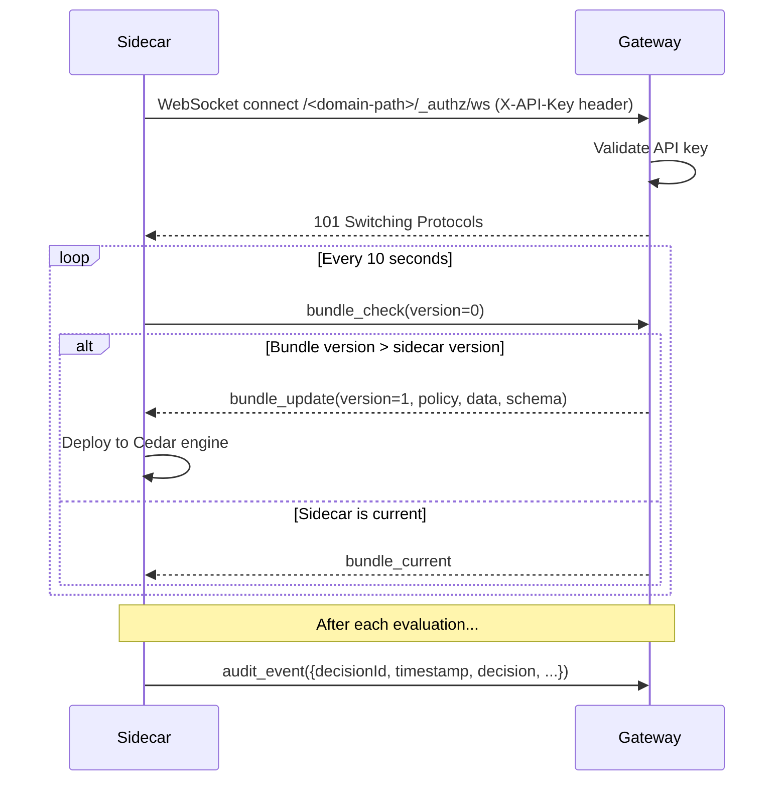
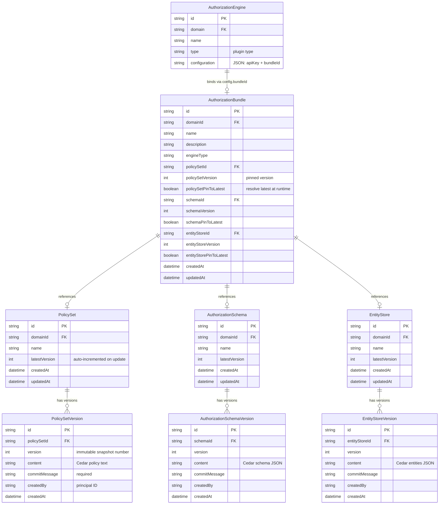
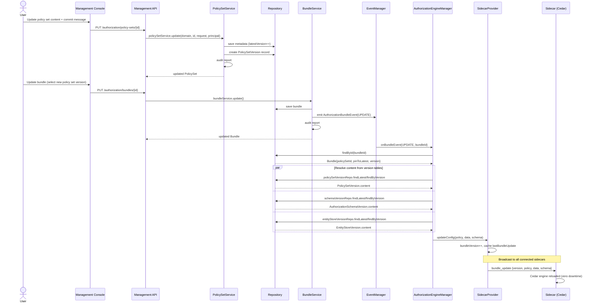
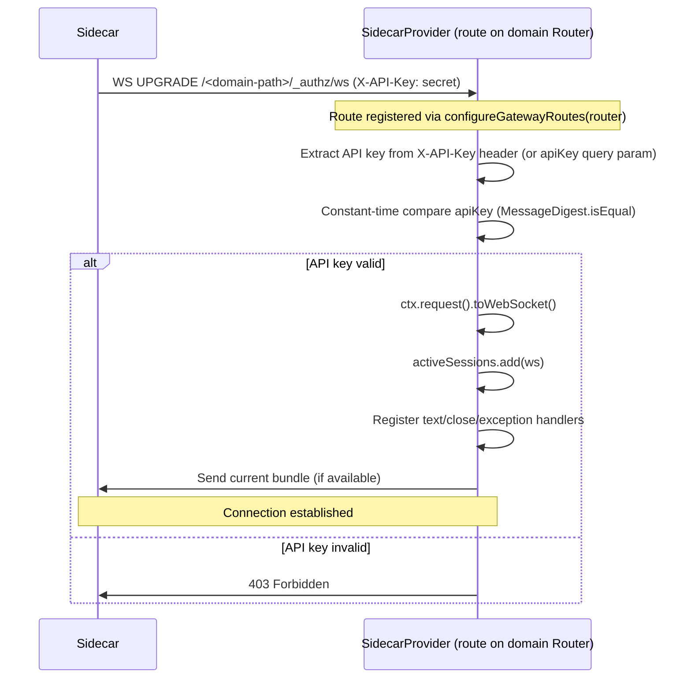
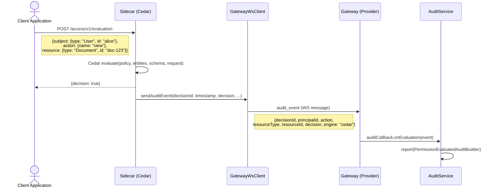
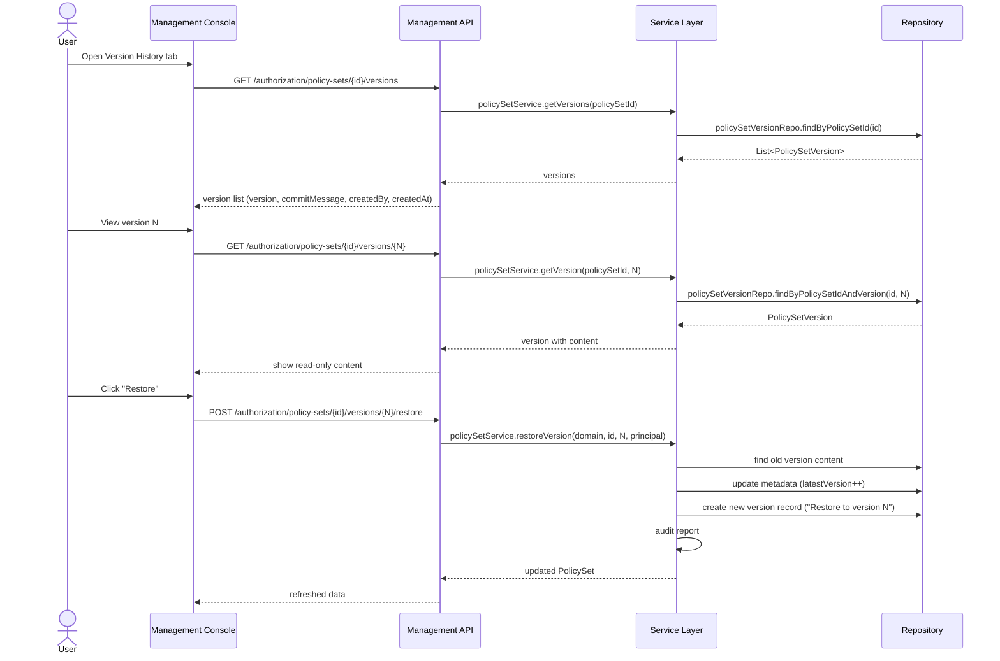

# Authorization Engine Architecture (WebSocket)

## High-Level Overview

```mermaid
graph TB
    subgraph UI["Management Console (Angular)"]
        PS_UI["Policy Sets<br/>CRUD + versioned content editor"]
        SC_UI["Schemas<br/>CRUD + versioned content editor"]
        ES_UI["Entity Stores<br/>CRUD + versioned content editor"]
        BN_UI["Bundles<br/>compose components + pin-to-latest"]
        ENG_UI["Sidecar Engine<br/>API Key + Bundle dropdown + Domain ID"]
    end

    subgraph MAPI["Management API (REST / Jersey)"]
        PS_R["PolicySetsResource<br/>POST / GET"]
        PS_R1["PolicySetResource<br/>GET / PUT / DELETE / versions"]
        SC_R["AuthorizationSchemasResource"]
        SC_R1["AuthorizationSchemaResource<br/>+ versions"]
        ES_R["EntityStoresResource"]
        ES_R1["EntityStoreResource<br/>+ versions"]
        BN_R["AuthorizationBundlesResource"]
        BN_R1["AuthorizationBundleResource"]
    end

    subgraph SVC["Service Layer (RxJava)"]
        PS_S["PolicySetServiceImpl<br/>metadata + version records<br/>+ audit"]
        SC_S["AuthorizationSchemaServiceImpl<br/>+ audit"]
        ES_S["EntityStoreServiceImpl<br/>+ audit"]
        BN_S["AuthorizationBundleServiceImpl<br/>emits BundleEvent + audit"]
    end

    subgraph REPO["Repository Layer"]
        direction LR
        subgraph MONGO["MongoDB"]
            PS_M["MongoPolicySetRepository"]
            PSV_M["MongoPolicySetVersionRepository"]
            SC_M["MongoAuthorizationSchemaRepository"]
            SCV_M["MongoAuthorizationSchemaVersionRepository"]
            ES_M["MongoEntityStoreRepository"]
            ESV_M["MongoEntityStoreVersionRepository"]
            BN_M["MongoAuthorizationBundleRepository"]
        end
        subgraph JDBC["JDBC (Postgres/MySQL/...)"]
            PS_J["JdbcPolicySetRepository"]
            PSV_J["JdbcPolicySetVersionRepository"]
            SC_J["JdbcAuthorizationSchemaRepository"]
            SCV_J["JdbcAuthorizationSchemaVersionRepository"]
            ES_J["JdbcEntityStoreRepository"]
            ESV_J["JdbcEntityStoreVersionRepository"]
            BN_J["JdbcAuthorizationBundleRepository"]
        end
    end

    subgraph GW["Gateway (Runtime)"]
        EM["EventManager<br/>listens for BundleEvent"]
        AEM["AuthorizationEngineManagerImpl<br/>resolves bundle content<br/>caches ResolvedBundleSnapshot"]
        PROVIDER["SidecarAuthorizationEngineProvider<br/>manages WS sessions"]
        WSEP["WebSocket Endpoint<br/>/_authz/ws<br/>API Key auth"]
    end

    subgraph SIDECAR["Sidecar (External Process)"]
        WSCLIENT["GatewayWsClient<br/>WS connection + reconnect"]
        EVAL["/access/v1/evaluation<br/>AuthZEN evaluation"]
        HEALTH["/health<br/>health check"]
        ENGINE["Cedar Engine<br/>evaluates policies"]
    end

    CLIENT["Client Application<br/>sends AuthZEN requests"]

    %% UI -> API
    PS_UI -->|"POST/PUT/GET/DELETE<br/>/authorization/policy-sets"| PS_R
    SC_UI -->|"/authorization/schemas"| SC_R
    ES_UI -->|"/authorization/entity-stores"| ES_R
    BN_UI -->|"/authorization/bundles"| BN_R
    ENG_UI -->|"/authorization-engines"| MAPI

    %% API -> Service
    PS_R --> PS_S
    PS_R1 --> PS_S
    SC_R --> SC_S
    SC_R1 --> SC_S
    ES_R --> ES_S
    ES_R1 --> ES_S
    BN_R --> BN_S
    BN_R1 --> BN_S

    %% Service -> Repo
    PS_S --> PS_M
    PS_S --> PSV_M
    PS_S --> PS_J
    PS_S --> PSV_J
    SC_S --> SC_M
    SC_S --> SCV_M
    SC_S --> SC_J
    SC_S --> SCV_J
    ES_S --> ES_M
    ES_S --> ESV_M
    ES_S --> ES_J
    ES_S --> ESV_J
    BN_S --> BN_M
    BN_S --> BN_J

    %% Event flow
    BN_S -->|"AuthorizationBundleEvent<br/>(DEPLOY/UPDATE/UNDEPLOY)"| EM
    EM --> AEM

    %% Gateway resolves bundle
    AEM -->|"1. findById(bundleId)"| BN_M
    AEM -->|"2. resolve versions"| PSV_M
    AEM -->|"3. cache ResolvedBundleSnapshot"| PROVIDER

    %% WS connection (sidecar initiates)
    WSCLIENT ==>|"WebSocket<br/>/&lt;domain-path&gt;/_authz/ws<br/>X-API-Key header"| WSEP
    WSEP -->|"validate apiKey"| PROVIDER

    %% WS messages
    PROVIDER -.->|"bundle_update<br/>{version, policy, data, schema}"| WSCLIENT
    WSCLIENT -.->|"bundle_check(version)"| PROVIDER
    WSCLIENT -.->|"audit_event"| PROVIDER

    %% Bundle -> Engine
    WSCLIENT -->|"deploy(policy, data, schema)"| ENGINE

    %% Client -> Sidecar
    CLIENT -->|"POST /access/v1/evaluation<br/>{subject, action, resource}"| EVAL
    EVAL --> ENGINE

    %% Styles
    classDef ui fill:#4a90d9,stroke:#2c5f8a,color:#fff
    classDef api fill:#50b87a,stroke:#2d7a4c,color:#fff
    classDef svc fill:#f5a623,stroke:#c17d0e,color:#fff
    classDef repo fill:#9b59b6,stroke:#6c3483,color:#fff
    classDef gw fill:#e74c3c,stroke:#a93226,color:#fff
    classDef sidecar fill:#1abc9c,stroke:#148f77,color:#fff
    classDef client fill:#95a5a6,stroke:#707b7c,color:#fff

    class PS_UI,SC_UI,ES_UI,BN_UI,ENG_UI ui
    class PS_R,PS_R1,SC_R,SC_R1,ES_R,ES_R1,BN_R,BN_R1 api
    class PS_S,SC_S,ES_S,BN_S svc
    class PS_M,SC_M,ES_M,BN_M,PS_J,SC_J,ES_J,BN_J,PSV_M,SCV_M,ESV_M,PSV_J,SCV_J,ESV_J repo
    class EM,AEM,PROVIDER,WSEP gw
    class WSCLIENT,EVAL,HEALTH,ENGINE sidecar
    class CLIENT client
```



## WebSocket Protocol

The sidecar connects to the gateway via WebSocket. All communication flows over a single persistent connection per sidecar instance.

### Connection

```
ws://<gateway-host>:<gateway-port>/<domain-path>/_authz/ws
Header: X-API-Key: <apiKey>
```

The sidecar sends the API key via the `X-API-Key` HTTP header during the WebSocket upgrade handshake. The gateway's `SidecarAuthorizationEngineProvider` validates it using constant-time comparison (`MessageDigest.isEqual`), then upgrades the connection to WebSocket.

### Message Types

All messages are JSON with a `"type"` discriminator field.

| Type | Direction | Fields | Purpose |
|------|-----------|--------|---------|
| `bundle_check` | Sidecar → Gateway | `version` (int) | Request bundle if version differs |
| `bundle_current` | Gateway → Sidecar | — | Sidecar is up to date |
| `bundle_update` | Gateway → Sidecar | `version`, `policy`, `data`, `schema` | New bundle content |
| `audit_event` | Sidecar → Gateway | `event` (object) | Evaluation audit report |
| `error` | Gateway → Sidecar | `code`, `message` | Error notification |

### Message Flow



### Reconnection

On disconnect, the sidecar reconnects with exponential backoff:
- Initial delay: 1 second
- Doubles each attempt: 1s → 2s → 4s → 8s → 16s → 30s (max)
- On successful reconnect, resets to 1s
- The sidecar continues evaluating with the last known bundle during disconnection

## Data Model

Content is separated from metadata into immutable version records. Each update creates a new version snapshot.



## Versioning Model

Each component (PolicySet, AuthorizationSchema, EntityStore) follows the same pattern:

- **Metadata table** stores only name + `latestVersion` counter
- **Version table** stores immutable snapshots: content, commitMessage, createdBy, createdAt
- On **create**: metadata record (latestVersion=1) + first version record
- On **update**: metadata latestVersion++ + new version record (with content or copied from previous)
- On **restore**: equivalent to update with content from an old version record
- On **delete**: cascade delete all version records, then metadata

### Version API Endpoints (per component)

| Method | Path | Description |
|--------|------|-------------|
| GET | `/{id}/versions` | List all version records |
| GET | `/{id}/versions/{version}` | Get specific version (with content) |
| POST | `/{id}/versions/{version}/restore` | Create new version from old content |

### Pin-to-Latest (Bundles)

Bundles reference components with optional `pinToLatest` flags:

- **`pinToLatest=true`**: Gateway resolves content from the latest version at runtime (`findLatestByXxxId`)
- **`pinToLatest=false`**: Gateway resolves content from a specific pinned version (`findByXxxIdAndVersion`)

This allows bundles to either track the latest changes automatically or lock to a known-good version.

## Hot-Reload Flow (Bundle Update via WebSocket)



## WebSocket Connection Flow



## AuthZEN Evaluation Flow (with WebSocket Audit)



## Version History Flow



## Sidecar Deployment

### Environment Variables

| Variable | Required | Description |
|----------|----------|-------------|
| `GATEWAY_URL` | Yes | AM Gateway base URL (e.g., `http://gateway:8092`) |
| `SIDECAR_DOMAIN_PATH` | Yes | Security domain path (e.g., `mydom`) |
| `SIDECAR_API_KEY` | Yes | API key (must match gateway engine configuration) |
| `SIDECAR_PORT` | No | HTTP port for evaluation endpoint (default: 8081) |

### Docker Example

```yaml
services:
  cedar-sidecar:
    image: gravitee/am-sidecar-cedar:latest
    environment:
      GATEWAY_URL: http://gateway:8092
      SIDECAR_DOMAIN_PATH: mydom
      SIDECAR_API_KEY: ${SIDECAR_API_KEY}
      SIDECAR_PORT: 8081
    ports:
      - "8081:8081"
```

### Key Properties

- **Self-healing**: Automatic reconnect with exponential backoff on disconnect
- **Offline resilience**: Continues evaluating with last known bundle if gateway is unreachable
- **Zero-config updates**: Bundle changes pushed automatically via WebSocket
- **Stateless sidecar**: No local storage needed, all state received from gateway

## Component Inventory

### Gateway Side

| Component | File | Role |
|-----------|------|------|
| Route Registration | `AuthorizationEngineManagerImpl` | Calls `provider.configureGatewayRoutes(router)` on deploy |
| WS Route + Auth + Sessions | `SidecarAuthorizationEngineProvider` | Registers `/_authz/ws` route, API key validation, session management, bundle broadcasting |
| Health Resource | `SidecarManagementResource` | `GET /health` — connected sidecars, bundle version |

### Sidecar Side

| Component | File | Role |
|-----------|------|------|
| WS Client | `GatewayWsClient` | Connects to gateway, periodic bundle check, audit send |
| Engine | `CedarEngineManager` | Cedar policy deploy/evaluate with read-write lock |
| Evaluation | `AuthZenEvaluationHandler` | `POST /access/v1/evaluation` — AuthZEN endpoint |
| Health | `HealthHandler` | `GET /health` — engine status + metrics |

### WS Protocol

| Component | File | Role |
|-----------|------|------|
| Message Types | `WsMessage.java` | Sealed interface with 5 record types |
| Codec | `WsMessageCodec.java` | JSON encode/decode with `type` discriminator |
| Bundle Snapshot | `ResolvedBundleSnapshot.java` | Immutable record: version + policy + data + schema |

## Audit Logging

All C/U/D operations emit audit events via dedicated AuditBuilders:

| Entity | AuditBuilder | Event Types |
|--------|-------------|-------------|
| PolicySet | `PolicySetAuditBuilder` | CREATED / UPDATED / DELETED |
| AuthorizationSchema | `AuthorizationSchemaAuditBuilder` | CREATED / UPDATED / DELETED |
| EntityStore | `EntityStoreAuditBuilder` | CREATED / UPDATED / DELETED |
| AuthorizationBundle | `AuthorizationBundleAuditBuilder` | CREATED / UPDATED / DELETED |
| Permission Evaluation | `PermissionEvaluatedAuditBuilder` | PERMISSION_EVALUATED |

Audit logging is implemented in the **Service layer** (not Resources). Resources pass the authenticated `User principal` to service methods.

Permission evaluation audits flow from the sidecar through the WebSocket connection to the gateway's audit pipeline.

## Architecture Comparison: HTTP Push vs WebSocket

| Aspect | HTTP Push (old) | WebSocket (current) |
|--------|----------------|---------------------|
| Connection direction | Gateway → Sidecar | Sidecar → Gateway |
| Config delivery | `PUT /config` on sidecar | `bundle_update` WS message |
| Audit delivery | HTTP callback from sidecar | `audit_event` WS message |
| Sidecar URL needed | Yes (configured in engine) | No |
| Reconnection | Manual/none | Automatic with exponential backoff |
| Real-time updates | Requires gateway to push | Gateway broadcasts to active sessions |
| Multiple sidecars | Each needs separate URL config | All connect to same WS endpoint |
| Firewall friendly | Requires sidecar port open | Sidecar initiates outbound connection |
