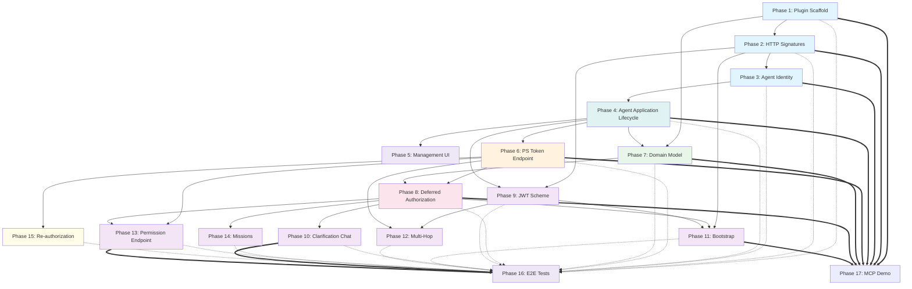

# AAUTH Protocol Support for Gravitee Access Management

## What is AAUTH?

AAUTH (draft-hardt-aauth-protocol, draft-hardt-httpbis-signature-key) is a next-generation authorization protocol for agent-to-resource access. It replaces OAuth 2.0's bearer token model with cryptographic proof-of-possession via HTTP Message Signatures (RFC 9421), introduces missions for scoped authorization governance, and supports four adoption modes — from simple two-party agent-resource identity verification to full cross-domain federation.

### Core Differences from OAuth 2.0

| Aspect | OAuth 2.0 | AAUTH |
|--------|-----------|-------|
| Token binding | Bearer tokens (theft = full access) | Every token bound to signing key via HTTP Message Signatures |
| Client registration | Pre-registration required | No pre-registration; agents identified by `aauth:local@domain` URI scheme |
| Authentication | Token exchange flows | Per-request cryptographic proof-of-possession |
| Async approval | Limited (CIBA) | First-class `202 Accepted` deferred responses across all endpoints |
| Multi-hop | Not natively supported | Call chaining with upstream token presentation through the PS |
| Identity + Authz | Separate (OAuth + OIDC) | Unified auth tokens with both claims and scopes |
| Cross-domain | Single authorization server | PS-to-AS federation across trust domains |
| Governance | None | Optional missions for scoped authorization contexts |

### Three Token Types

```
+------------------+     +-------------------+     +------------------+
|   Agent Token    |     |  Resource Token   |     |   Auth Token     |
|   (aa-agent+jwt) |     |  (aa-resource+jwt)|     |   (aa-auth+jwt)  |
+------------------+     +-------------------+     +------------------+
| Binds agent's    |     | Cryptographic     |     | Grants resource  |
| signing key to   |     | challenge from    |     | access, carries  |
| its identity     |     | resource, binds   |     | identity claims  |
|                  |     | request context   |     | and scopes       |
| Issued by:       |     | Issued by:        |     | Issued by:       |
| Agent Server     |     | Resource Server   |     | PS or AS         |
+------------------+     +-------------------+     +------------------+
```

### Resource Access Modes

| Mode | Parties | Description |
|------|---------|-------------|
| Identity-based | Agent, Resource | Agent signs requests; resource verifies identity and handles auth directly |
| Resource-managed | Agent, Resource | Resource publishes an authorization endpoint; may return `AAuth-Access` opaque token |
| PS-managed | Agent, Resource, PS | Resource issues resource_token to PS; PS issues auth_token directly |
| Federated | Agent, Resource, PS, AS | Resource has its own AS; PS federates with AS |

### Agent Governance (orthogonal to resource access)

Missions, permissions, and audit are **orthogonal** to resource access modes. An agent with a PS can use governance features (mission proposal, permission endpoint, audit endpoint) regardless of which resource access mode is in use. The PS manages the governance lifecycle; resources participate by including mission context in resource tokens when the agent sends the `AAuth-Mission` header.

### Key Roles

| Role | What it does | Well-known metadata |
|------|-------------|---------------------|
| **Agent Server** | Issues agent tokens binding agents' keys to their identities | `/.well-known/aauth-agent.json` |
| **Person Server (PS)** | Represents the legal person. Manages missions, handles consent, asserts user identity, brokers authorization | `/.well-known/aauth-person.json` |
| **Access Server (AS)** | Policy engine for resources. Issues auth tokens. Only called by PSes. | `/.well-known/aauth-access.json` |
| **Resource** | Protects APIs/data. Issues resource tokens. | `/.well-known/aauth-resource.json` |

## Implementation Strategy

We implement AAUTH as a **new protocol plugin** in Gravitee AM, following the same plugin architecture as SAML2 and OIDC. Gravitee AM implements the **Person Server (PS)** role using an incremental strategy:

- **Strategy A (this plan)**: AM as PS only, three-party mode. Agent sends resource_token to AM, AM issues auth_token directly. Covers single-domain deployments and the demo.
- **Strategy B (future)**: AM also acts as AS, accepting requests from external PSes. Additive — does not break Strategy A.
- **Strategy C (future)**: AM-as-PS federates outbound to external ASes for four-party mode. Additive — does not break A or B.

The implementation is split into **16 phases** (Strategy A), each independently testable. Three additional phases are reserved for Strategies B and C.

## Phase Overview

| Phase | Name | What it Adds |
|-------|------|-------------|
| [01](./01-plugin-scaffold-and-metadata.md) | Plugin Scaffold + PS Metadata | Module structure, `/.well-known/aauth-person.json` |
| [02](./02-http-message-signatures.md) | HTTP Message Signatures | RFC 9421 verification, `aa-*` token type awareness |
| [03](./03-agent-identity-jwks.md) | Agent Identity + JWKS | `aa-agent+jwt` verification, `ps` claim, PS JWKS endpoint |
| [04](./04-agent-application-lifecycle.md) | Agent Application Lifecycle | `Application(type=AAUTH_AGENT)` per Agent Server, auto-discovery |
| [05](./05-management-ui.md) | Management Console UI | AAUTH_AGENT type in AM console, creation wizard, adapted settings tabs |
| [06](./06-autonomous-authorization.md) | PS Token Endpoint — Three-Party | Agent sends resource_token, PS issues `aa-auth+jwt` directly |
| [07](./07-domain-model-settings.md) | Domain Model + Settings | PS configuration per domain, scope validation pipeline |
| [08](./08-deferred-authorization.md) | Deferred Authorization + Interaction | 202 + pending URL, user login + consent via AM's standard flow |
| [09](./09-jwt-scheme-agent-tokens.md) | JWT Scheme + Agent Tokens | Agent delegation via `aa-agent+jwt` |
| [10](./10-clarification-chat.md) | Clarification Chat | `requirement=clarification`, user-agent dialog during consent |
| [11](./11-bootstrap.md) | Bootstrap (PS-side) | `POST /bootstrap`, bootstrap_token, pairwise sub, agent binding |
| [12](./12-token-exchange.md) | Multi-Hop / Call Chaining | Intermediary resources act as agents, upstream_token |
| [13](./13-permission-endpoint.md) | Permission Endpoint — First-Party | Agent requests permission for local actions (tool calls, file writes) |
| [14](./14-missions.md) | Missions | Scoped authorization contexts, `AAuth-Mission` header, mission lifecycle |
| [15](./15-re-authorization.md) | Re-authorization | Auth token renewal via fresh resource_token (no refresh tokens) |
| [16](./16-e2e-tests.md) | E2E Tests | TypeScript/Jest tests in `gravitee-am-test/specs/gateway/aauth/` |
| [17](./17-mcp-demo.md) | MCP Demo | Java/Spring Boot demo with AM as PS, bootstrap, three-party mode |

**Deferred phases (Strategy B/C):**

| Future # | Name | Strategy |
|----------|------|----------|
| 18 | AS Token Endpoint + `aauth-access.json` | B |
| 19 | PS-to-AS Outbound Federation | C |

## Dependency Graph



## Spec References

**Authoritative specs:**

- [AAUTH Protocol draft-01](https://www.ietf.org/archive/id/draft-hardt-aauth-protocol-01.txt) — Core protocol, token types, endpoints, flows, missions, PS-AS federation
- [HTTP Signature Headers](https://dickhardt.github.io/signature-key/) — Signature-Key header, schemes (hwk, jwks_uri, jwt), Signature-Error header
- [RFC 9421](https://www.rfc-editor.org/rfc/rfc9421) — HTTP Message Signatures
- [RFC 9530](https://www.rfc-editor.org/rfc/rfc9530) — Content-Digest header
- [RFC 8941](https://www.rfc-editor.org/rfc/rfc8941) — Structured Field Values (for AAuth headers)
- [RFC 7638](https://www.rfc-editor.org/rfc/rfc7638) — JWK Thumbprint (for agent_jkt claim)

**Local spec copies** in `specs/`:
- `draft-hardt-aauth-protocol-01.txt` — current authoritative version (draft-01, published 2026-04-13)
- `draft-hardt-aauth-protocol-00_2026-04-02.txt` — previous version (for reference only)

## Source of Truth

The [AAUTH Protocol draft-01](https://www.ietf.org/archive/id/draft-hardt-aauth-protocol-01.txt) is the **sole source of truth** for implementation correctness.
