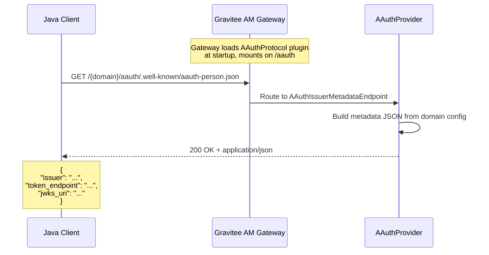

# Phase 1: Plugin Scaffold + PS Metadata Endpoint

## Goal

Create the minimal AAUTH protocol plugin that registers on the Gravitee AM gateway and serves the AAUTH issuer metadata endpoint. This is the foundation upon which all other phases build.

```
+------------------------------------------------------+
|                  Gravitee AM Gateway                 |
|                                                      |
|  +----------+  +----------+  +------------------+    |
|  | OAuth2   |  | SAML2    |  | AAUTH (new!)     |    |
|  | /oauth/* |  | /saml2/* |  | /aauth/*         |    |
|  +----------+  +----------+  +------------------+    |
|                              | /.well-known/    |    |
|                              | aauth-person.json|    |
|                              +------------------+    |
+------------------------------------------------------+
```

## Discovery

Before writing any code, understand how existing protocol plugins are structured.

**Files to study:**
- `gravitee-am-gateway-handler-saml2/` -- Simplest protocol plugin (skeleton to copy)
  - `SAML2Protocol.java` -- Plugin entry point
  - `SAML2Provider.java` -- Router setup and lifecycle
  - `spring/SAMLConfiguration.java` -- Spring bean declarations
  - `pom.xml` -- Maven dependencies
  - `plugin.properties` -- Plugin manifest
  - `plugin-assembly.xml` -- Packaging descriptor
- `gravitee-am-gateway-handler/pom.xml` -- Parent module listing all handler modules
- `gravitee-am-gateway-handler-api/` -- Protocol, ProtocolProvider, AbstractProtocolProvider interfaces

**Authoritative source (always takes precedence over reference projects):**
- [AAUTH Protocol spec (2026-04-09) -- Metadata Documents](https://github.com/dickhardt/AAuth) -- PS metadata at `aauth-person.json`

## Design

### Module Structure

```
gravitee-am-gateway-handler-aauth/
  pom.xml
  src/main/
    assembly/
      plugin-assembly.xml
    resources/
      plugin.properties
    java/io/gravitee/am/gateway/handler/aauth/
      AAuthProtocol.java
      AAuthProvider.java
      spring/
        AAuthConfiguration.java
      resources/endpoint/
        AAuthIssuerMetadataEndpoint.java
      service/metadata/
        AAuthIssuerMetadata.java
```

### Well-Known Metadata Format

Per the AAUTH protocol specification (2026-04-09, [PS Metadata section](https://github.com/dickhardt/AAuth)), the Person Server (PS) metadata document is served at `/.well-known/aauth-person.json`:

```json
{
  "issuer": "https://am.gravitee.io/mydomain/aauth",
  "token_endpoint": "https://am.gravitee.io/mydomain/aauth/token",
  "jwks_uri": "https://am.gravitee.io/mydomain/aauth/.well-known/jwks.json"
}
```

**Required fields:** `issuer`, `token_endpoint`, `jwks_uri`.

**Optional fields** (served when the corresponding feature is enabled on the domain):
- `mission_endpoint` — URL for mission lifecycle operations (Phase 13)
- `permission_endpoint` — URL where agents request permission for local actions (Phase 12)
- `audit_endpoint` — URL where agents log actions performed
- `mission_control_endpoint` — URL for mission administrative interface
- `revocation_endpoint` — URL for revoking issued auth tokens

Phase 1 serves only the three required fields. Optional fields are added by later phases as the corresponding endpoints are implemented.

### Sequence Diagram



## Implementation

### 1. Maven Module (`pom.xml`)

Create `gravitee-am-gateway-handler-aauth/pom.xml`:
- Parent: `gravitee-am-gateway-handler`
- Dependencies (all `provided` scope):
  - `gravitee-am-gateway-handler-api`
  - `gravitee-am-gateway-handler-common`
  - `gravitee-am-common`
  - `gravitee-am-model`
  - Vert.x core, web (rxjava3)
  - Spring context
  - Jackson

### 2. Plugin Manifest

`src/main/resources/plugin.properties`:
```properties
id=aauth
name=Gravitee AM - AAUTH Protocol
version=${project.version}
description=AAUTH Protocol support for Gravitee Access Management
class=io.gravitee.am.gateway.handler.aauth.AAuthProtocol
type=protocol
```

### 3. Plugin Entry Point

`AAuthProtocol.java`:
```java
public class AAuthProtocol extends Protocol<AAuthConfiguration, AAuthProvider> {
    @Override
    public Class<AAuthConfiguration> configuration() {
        return AAuthConfiguration.class;
    }
    @Override
    public Class<AAuthProvider> provider() {
        return AAuthProvider.class;
    }
}
```

### 4. Protocol Provider

`AAuthProvider.java`:
```java
public class AAuthProvider extends AbstractProtocolProvider {
    @Autowired private Vertx vertx;
    @Autowired private Router router;
    @Autowired private CorsHandler corsHandler;
    @Autowired private Domain domain;

    @Override
    public String path() { return "/aauth"; }

    @Override
    protected void doStart() throws Exception {
        super.doStart();
        final Router aAuthRouter = Router.router(vertx);

        // Well-known metadata endpoint (per spec Section 14)
        aAuthRouter.route(HttpMethod.GET, "/.well-known/aauth-person.json")
            .handler(corsHandler)
            .handler(new AAuthIssuerMetadataEndpoint(domain));

        router.mountSubRouter(path(), aAuthRouter);
    }
}
```

### 5. Metadata Endpoint

`AAuthIssuerMetadataEndpoint.java`:
- Build base URL from domain configuration
- Construct metadata POJO
- Serialize to JSON and return with `Content-Type: application/json`
- Include `Cache-Control: public, max-age=3600`

### 6. Register Module

Add to `gravitee-am-gateway-handler/pom.xml`:
```xml
<module>gravitee-am-gateway-handler-aauth</module>
```

## Validation

### Unit Tests

Add the following `*Test.java` classes under `gravitee-am-gateway-handler-aauth/src/test/java/io/gravitee/am/gateway/handler/aauth/`. Conventions follow existing OIDC handler tests (`@RunWith(MockitoJUnitRunner.class)`, `@Mock`/`@InjectMocks`, RxJava `TestObserver`, and `extends RxWebTestBase` for HTTP endpoints).

**`resources/endpoint/AAuthIssuerMetadataEndpointTest`** (`extends RxWebTestBase`)
- Mounts `AAuthIssuerMetadataEndpoint` on a stub Vert.x router and exercises it via `testRequest(HttpMethod.GET, "/.well-known/aauth-person.json", 200, ...)`.
- Test methods:
  - `shouldReturn200_withApplicationJsonContentType()` -- asserts `Content-Type: application/json` and `Cache-Control: public, max-age=3600`.
  - `shouldReturnExactlyTheThreeRequiredFields()` -- asserts the JSON body has `issuer`, `token_endpoint`, `jwks_uri` and **no other fields** (per spec Section 14.2).
  - `shouldReturnAbsoluteUrls_basedOnDomainBaseUrl()` -- asserts each URL is absolute, uses HTTPS-friendly scheme, and contains the test domain's base path.
  - `shouldUseLowercaseIssuerWithoutTrailingSlash()` -- per spec Section 8.1.

**`AAuthProviderTest`** (`@RunWith(MockitoJUnitRunner.class)`)
- Test methods:
  - `shouldReturnSlashAauthAsPath()` -- `provider.path()` returns `"/aauth"`.
  - `shouldRegisterWellKnownRoute_onDoStart()` -- mocks the Vert.x `Router`, calls `doStart()`, verifies a `GET /.well-known/aauth-person.json` route is mounted.
  - `shouldUseDomainAauthSettings_whenPresent()` -- prepares a Domain with stub `AAuthSettings` (anticipating Phase 7) and verifies the provider does not crash.

### Test Fixtures

This phase introduces the shared test-fixture package at `gravitee-am-gateway-handler-aauth/src/test/java/io/gravitee/am/gateway/handler/aauth/test/fixtures/`. Subsequent phases will add to it.

- `TestAAuthDomainFactory` -- builder that creates a `Domain` instance with a known id, hrid, base URL, and an `AAuthSettings` placeholder. Used by every subsequent phase that needs a Domain. Mirrors the OIDC `dummies/` package convention.

### Checklist

- [ ] Module compiles with `mvn clean install -pl gravitee-am-gateway-handler-aauth -am`
- [ ] Plugin is loaded by Gravitee AM at startup (check logs for AAUTH registration)
- [ ] `GET /{domain}/aauth/.well-known/aauth-person.json` returns 200 with valid JSON
- [ ] Metadata contains exactly the three required fields: `issuer`, `token_endpoint`, `jwks_uri`
- [ ] URLs in metadata are absolute and match the domain's base URL
- [ ] All Phase 1 unit tests pass via `mvn test -pl gravitee-am-gateway-handler-aauth`
