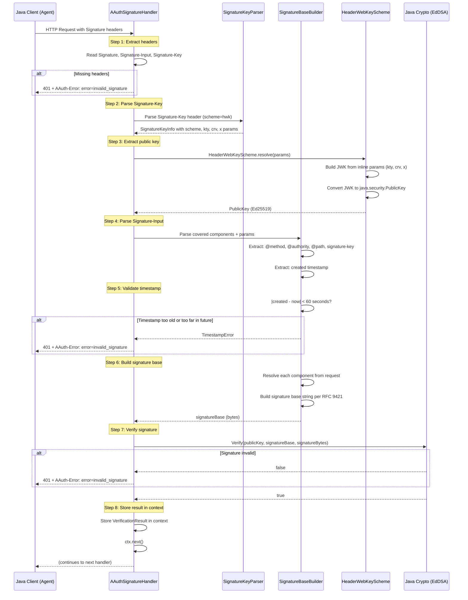

# Phase 2: HTTP Message Signature Verification (HWK Scheme)

## Goal

Implement the cryptographic foundation of AAUTH: a Vert.x handler that verifies HTTP Message Signatures per RFC 9421, starting with the `hwk` (Header Web Key) scheme. After this phase, any endpoint can be protected by requiring a valid signature -- the sender proves possession of a private key.

**HWK scope:** Per the spec (Section 12.7.2), the HWK scheme is for pseudonymous agent-to-resource communication (identity-based and two-party resource-managed modes). PS endpoints require `scheme=jwt` (Section 7.1.3). This phase builds the shared signature verification infrastructure; the scheme-specific enforcement at PS endpoints is handled by Phase 9 when the `jwt` scheme is introduced.

```
+-----------+                              +------------------+
|           |  GET /aauth/...              |  Gravitee AM     |
|   Agent   |  + Signature-Key:             |                  |
|           |    sig=hwk;                  |  AAuthSignature  |
|   (key)   |    kty="OKP";                |  Handler         |
|           |    crv="Ed25519";            |                  |
|           |    x="<public-key>"          |  1. Parse headers|
|           |  + Signature-Input: sig=(    |  2. Build base   |
|           |      "@method" "@authority"  |  3. Verify sig   |
|           |      "@path"                 |  4. OK or 401    |
|           |      "signature-key")        |                  |
|           |      ;created=1712345678     |                  |
|           |  + Signature: sig=:<base64>: |                  |
+-----------+                              +------------------+
        |                                        |
        |       200 OK (valid signature)         |
        |<---------------------------------------|
        |   or  401 + AAuth-Error header         |
        |<---------------------------------------|
```

## Discovery

**Specification references:**
- [RFC 9421](https://www.rfc-editor.org/rfc/rfc9421) -- HTTP Message Signatures (signature base, covered components, signature-input)
- [RFC 9530](https://www.rfc-editor.org/rfc/rfc9530) -- Content-Digest (body integrity)
- [RFC 8941](https://www.rfc-editor.org/rfc/rfc8941) -- Structured Field Values (header format for Signature-Key, AAuth-Error)
- AAUTH Headers spec: [Section 5 -- HTTP Message Signatures Profile](https://github.com/dickhardt/AAuth) -- Covered components, signature parameters, verification
- AAUTH Headers spec: [Section 6 -- AAuth-Error](https://github.com/dickhardt/AAuth) -- Error codes and header format
- AAUTH Headers spec: [Section 5.2 -- Keying Material](https://github.com/dickhardt/AAuth) -- Signature-Key header format

**Key cryptographic requirements** (per [Section 5.1 -- Signature Algorithms](https://github.com/dickhardt/AAuth) and [Section 5.3 -- Signing](https://github.com/dickhardt/AAuth)):
- Required algorithm: EdDSA with Ed25519
- Recommended algorithm: ECDSA with P-256 (deterministic, [RFC 6979](https://www.rfc-editor.org/rfc/rfc6979))
- Signature timestamp must be within 60 seconds of server time
- Covered components must include at minimum: `@method`, `@authority`, `@path`, `signature-key`

## Design

### Signature Verification Pipeline



### Signature Base Format (RFC 9421)

For a signed GET request to a resource endpoint on `localhost:8092`:

```
"@method": GET
"@authority": localhost:8092
"@path": /api/data
"signature-key": sig=hwk;kty="OKP";crv="Ed25519";x="JrQLj..."
"@signature-params": ("@method" "@authority" "@path" "signature-key");created=1712345678
```

For a POST with body, add `content-type` and `content-digest`:

```
"@method": POST
"@authority": localhost:8092
"@path": /mydomain/aauth/token
"content-type": application/json
"content-digest": sha-256=:X4BI4dl2iOkMAnOAiyP0GgBX01OkmEmauc6Nm6DTbwE=:
"signature-key": sig=hwk;kty="OKP";crv="Ed25519";x="JrQLj..."
"@signature-params": ("@method" "@authority" "@path" "content-type" "content-digest" "signature-key");created=1712345678
```

### AAuth-Error Header Format

Per the AAUTH Headers spec ([Section 6 -- AAuth-Error](https://github.com/dickhardt/AAuth)), error responses use [RFC 8941](https://www.rfc-editor.org/rfc/rfc8941) Dictionary format:

```
AAuth-Error: error=invalid_signature
AAuth-Error: error=invalid_key
AAuth-Error: error=expired_jwt
AAuth-Error: error=unsupported_algorithm; supported_algorithms="EdDSA, ES256"
AAuth-Error: error=invalid_input; required_input="signature, signature-input, signature-key"
```

## Implementation

### Files to Create

```
aauth/
  signing/
    SignatureKeyParser.java          -- Parse Signature-Key header (RFC 8941 structured fields)
    SignatureKeyInfo.java            -- POJO: scheme, label, params map
    SignatureBaseBuilder.java        -- Build RFC 9421 signature base from request
    ContentDigestValidator.java      -- Validate Content-Digest (RFC 9530, SHA-256/SHA-512)
    AAuthSignatureVerifier.java      -- Orchestrator: parse, build, verify
    VerificationResult.java          -- POJO: agentId, publicKey, scheme, label
    schemes/
      SignatureScheme.java           -- Interface: resolve(params) -> PublicKey + agentId
      SignatureSchemeFactory.java    -- Dispatch to correct scheme by name
      HeaderWebKeyScheme.java        -- HWK: extract inline JWK, convert to PublicKey
  resources/handler/
    AAuthSignatureHandler.java       -- Vert.x Handler<RoutingContext>
  resources/error/
    AAuthErrorHeaderBuilder.java     -- Build AAuth-Error and AAuth-Requirement headers
```

### Key Implementation Details

**SignatureKeyParser** -- Parse the RFC 8941 Inner List format:
```
sig=hwk;kty="OKP";crv="Ed25519";x="base64url-encoded-key"
```
Extract label (`sig`), scheme (`hwk`), and all parameters as a `Map<String, String>`.

**HeaderWebKeyScheme** -- Convert inline JWK to `java.security.PublicKey`:
- For `kty=OKP, crv=Ed25519`: Use `KeyFactory.getInstance("Ed25519")` with `EdECPublicKeySpec`
- For `kty=EC, crv=P-256`: Use `KeyFactory.getInstance("EC")` with `ECPublicKeySpec`
- Compute JWK Thumbprint (RFC 7638) for later `agent_jkt` matching

**AAuthSignatureVerifier** -- Orchestration:
1. Parse `Signature-Key` header -> `SignatureKeyInfo`
2. Resolve public key via `SignatureSchemeFactory` -> `SignatureScheme` -> `PublicKey`
3. Parse `Signature-Input` header -> covered components + created timestamp
4. Validate timestamp (within 60 seconds of server time)
5. Build signature base string from request + covered components
6. Decode `Signature` header (base64url between `:` delimiters)
7. Verify with `java.security.Signature` (Ed25519 or SHA256withECDSA)

**ContentDigestValidator** -- For requests with body:
1. Read body bytes
2. Compute `SHA-256` or `SHA-512` digest
3. Compare against `Content-Digest` header value
4. Format: `sha-256=:<base64>:` or `sha-512=:<base64>:`

**AAuthSignatureHandler** -- Vert.x handler:
```java
public void handle(RoutingContext ctx) {
    try {
        VerificationResult result = verifier.verify(ctx.request(), ctx.body());
        ctx.put("aauth.verification", result);
        ctx.next();
    } catch (SignatureVerificationException e) {
        ctx.response()
            .setStatusCode(401)
            .putHeader("AAuth-Error", e.toAAuthErrorHeader())
            .end();
    }
}
```

### Wire into AAuthProvider

Phase 2 ships the signature verification machinery as a Spring bean (`AAuthSignatureHandler`) exposed via `AAuthConfiguration`. Phase 6 (token endpoint) and later phases compose it into their own route chains. The Phase 1 metadata route is unchanged.

## Validation

### Unit Tests

Add the following `*Test.java` classes under `gravitee-am-gateway-handler-aauth/src/test/java/io/gravitee/am/gateway/handler/aauth/`. Conventions follow existing OIDC handler tests.

**`signing/SignatureKeyParserTest`** (plain class, `@RunWith(MockitoJUnitRunner.class)`)
- `shouldParseHwkOkpEd25519()` -- parses `sig=hwk;kty="OKP";crv="Ed25519";x="..."` into `SignatureKeyInfo(scheme=hwk, kty=OKP, crv=Ed25519, x=...)`.
- `shouldParseHwkEcP256()` -- parses EC variant including `y` parameter.
- `shouldRejectMalformedHeader()` -- missing closing brace, missing required parameter, unknown scheme name.
- `shouldRejectAlgParameterPresence()` -- per Signature-Key spec Section 2.3, `alg` MUST NOT appear with `hwk`.

**`signing/SignatureBaseBuilderTest`**
- `shouldBuildBaseForGetRequest_withMethodAuthorityPathAndSignatureKey()` -- builds the canonical base string for a GET request, asserts byte-exact equality against an RFC 9421 fixture.
- `shouldIncludeContentDigest_whenBodyPresent()` -- POST with body produces a base that contains `"content-digest"` and `"content-type"` lines.
- `shouldRejectMissingMandatoryComponent()` -- if covered components do not include `@method`, `@authority`, `@path`, or `signature-key`, throws `InvalidInputException` with `required_input` populated.
- `shouldEmitSignatureParamsLineWithCreatedTimestamp()` -- the `@signature-params` line carries `created=<unix>`.

**`signing/ContentDigestValidatorTest`**
- `shouldAcceptValidSha256Digest()`.
- `shouldAcceptValidSha512Digest()`.
- `shouldRejectMismatchedDigest()` -- tampered body bytes produce mismatch.
- `shouldRejectUnsupportedAlgorithm()` -- e.g. `md5`.

**`signing/schemes/HeaderWebKeySchemeTest`**
- `shouldResolveEd25519PublicKey_fromInlineJwk()`.
- `shouldResolveP256PublicKey_fromInlineJwk()`.
- `shouldRejectUnsupportedCurve()` -- e.g. P-384 throws.
- `shouldComputeJwkThumbprint_perRfc7638()` -- known fixture matches a precomputed thumbprint.

**`signing/AAuthSignatureVerifierTest`**
- `shouldVerifyValidEd25519Signature()`.
- `shouldVerifyValidP256Signature()`.
- `shouldRejectTamperedSignature()` -- bit-flip in signature bytes throws `SignatureVerificationException` with code `invalid_signature`.
- `shouldRejectExpiredTimestamp()` -- `created` outside the ±60s window.
- `shouldRejectFutureTimestamp()` -- `created` more than 60s in the future.
- `shouldRejectMissingSignatureHeader()` -- throws with `invalid_request`.
- `shouldRejectMissingSignatureKeyHeader()` -- throws with `invalid_request`.
- `shouldRejectMissingSignatureInputHeader()` -- throws with `invalid_request`.
- `shouldRejectLabelMismatch()` -- label in `Signature-Input` does not match label in `Signature` or `Signature-Key`, throws `invalid_signature`.

**`resources/handler/AAuthSignatureHandlerTest`** (`extends RxWebTestBase`)
- Mounts `AAuthSignatureHandler` plus a stub downstream success route owned by the test class (e.g. `/_test_protected`) on a Vert.x router. Helper methods build signed requests using `TestSignatureBuilder` from the fixtures package.
- `shouldReturn200_forValidSignedGetRequest()`.
- `shouldReturn200_forValidSignedPostWithContentDigest()`.
- `shouldReturn401WithPseudonymRequirement_forUnsignedRequest()` -- per Headers spec Section 4.3, response includes `AAuth-Requirement: requirement=pseudonym`.
- `shouldReturn401WithInvalidSignatureError_forTamperedSignature()` -- response includes `AAuth-Error: error=invalid_signature`.
- `shouldReturn401WithExpiredJwtError_forExpiredTimestamp()`.
- `shouldReturn401WithInvalidInputError_includingRequiredInputList()` -- when covered components are missing.
- `shouldReturn401WithUnsupportedAlgorithmError_includingSupportedAlgorithmsList()`.
- `shouldStoreVerificationResultInRoutingContext_onSuccess()` -- asserts `ctx.get("aauth.verification")` is populated.

**`signing/ReplayDetectorTest`**
- `shouldRejectDuplicateThumbprintCreatedPair()`.
- `shouldAcceptDifferentCreatedTimestamp_sameKey()`.
- `shouldEvictAfterTtlWindow()` -- entries beyond 120s are removed.
- `shouldHandleConcurrentInsertion()` -- spawns multiple threads inserting the same key+timestamp, only one succeeds.

**`util/AAuthIdentifierValidatorTest`** (per spec Section 8)
- `shouldAcceptValidServerIdentifier()` -- HTTPS, lowercase, no port/path/query/fragment.
- `shouldRejectHttpScheme()`.
- `shouldRejectIdentifierWithPort()`.
- `shouldRejectIdentifierWithPath()`.
- `shouldRejectIdentifierWithTrailingSlash()`.
- `shouldRejectIdentifierWithUppercase()`.
- `shouldRejectIdentifierWithUnicodeNotInAceForm()` -- IDN must use A-labels.

### Test Fixtures

This phase contributes to `gravitee-am-gateway-handler-aauth/src/test/java/io/gravitee/am/gateway/handler/aauth/test/fixtures/`:

- `TestAgentKeyPairFactory` -- generates Ed25519 and P-256 keypairs deterministically (fixed seed for reproducible tests). Used by every later phase that needs to sign or verify requests.
- `TestSignatureBuilder` -- given a Vert.x `HttpServerRequest` (or method/authority/path/body), builds a complete RFC 9421 signature including `Signature-Input`, `Signature`, `Signature-Key` (HWK scheme) and `Content-Digest` headers. Used by handler tests in this phase and signature-related handler tests in later phases.
- `RFC9421TestVectors` -- a small set of known input/output pairs taken from RFC 9421 examples, used to assert canonical signature base building.

### Checklist

- [ ] Ed25519 signed GET request returns 200
- [ ] Unsigned request returns 401 with `AAuth-Error` header
- [ ] Unsigned request returns 401 with `AAuth-Requirement: requirement=pseudonym` challenge (per [Headers spec Section 4.3](https://github.com/dickhardt/AAuth))
- [ ] Tampered signature returns 401
- [ ] Timestamp older than 60 seconds is rejected
- [ ] POST with correct `Content-Digest` is accepted
- [ ] POST with incorrect `Content-Digest` is rejected
- [ ] P-256 (ECDSA) signed request is also accepted
- [ ] Error header follows RFC 8941 Dictionary format
- [ ] Replay detection: duplicate `(key_thumbprint, created)` pairs rejected (per [Headers spec Section 8.2](https://github.com/dickhardt/AAuth) -- MUST-level requirement)
- [ ] Label consistency: `Signature`, `Signature-Input`, `Signature-Key` use the same label (per [Signature-Key spec Section 2.1](https://www.ietf.org/archive/id/draft-hardt-httpbis-signature-key-02.html#section-2.1))
- [ ] `invalid_input` error includes `required_input` parameter listing needed covered components
- [ ] `unsupported_algorithm` error includes `supported_algorithms` parameter

### Spec Requirements Added in This Phase

**Replay Detection** (per [Headers spec Section 8.2](https://github.com/dickhardt/AAuth)):
Servers MUST maintain a cache of recently-seen `(key_thumbprint, created)` pairs and reject duplicates. Implement as:
- `ReplayDetector` with a time-windowed cache (120s window: 60s tolerance in each direction)
- Key: `SHA-256(JWK Thumbprint + created_timestamp)`
- Reject with `AAuth-Error: error=invalid_signature` on replay

**Pseudonym Challenge Emission** (per [Headers spec Section 4.3](https://github.com/dickhardt/AAuth)):
When a request lacks signature headers, return:
```
HTTP/1.1 401 Unauthorized
AAuth-Requirement: requirement=pseudonym
```

**Label Consistency Validation** (per [Signature-Key spec Section 2.1](https://www.ietf.org/archive/id/draft-hardt-httpbis-signature-key-02.html#section-2.1)):
Verify that the same label (e.g., `sig`) appears in all three headers: `Signature`, `Signature-Input`, and `Signature-Key`.

**Identifier/URL Validation Utility** (per [Protocol spec Section 8](https://github.com/dickhardt/AAuth)):
Create a reusable `AAuthIdentifierValidator` for use in all subsequent phases:
- Server identifiers: HTTPS, no port/path/query/fragment, lowercase, ACE-encoded for IDN, exact string comparison
- Endpoint URLs: HTTPS, no fragment
- `jwks_uri`, `tos_uri`, etc.: must use HTTPS
