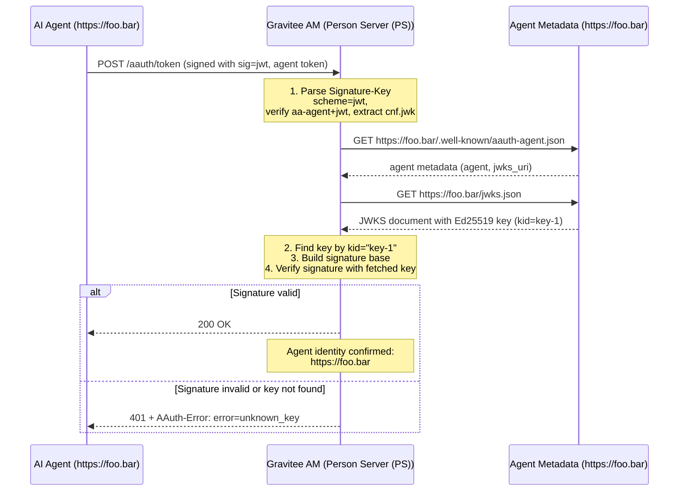
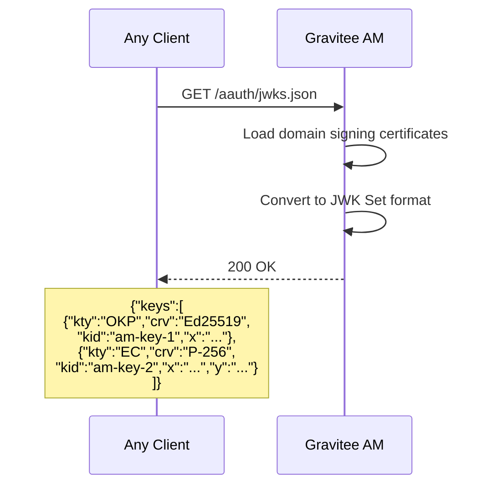

# Phase 3: Agent Identity via JWKS + Person Server (PS) JWKS Endpoint

## Goal

Upgrade from pseudonymous (HWK) authentication to verified agent identity. Agents identify themselves via HTTPS URLs -- the server fetches the agent's public keys from a well-known endpoint and verifies that the request was signed by one of those keys. This phase also adds the auth server's own JWKS endpoint so other parties can verify tokens it signs.

```
+------------------+                         +------------------+
|                  |  1. Signed request      |  Gravitee AM     |
|   AI Agent       |  Signature-Key:         |  (Person Server (PS))   |
|                  |   sig=jwks_uri;         |                  |
|  https://foo.bar |   id="https://foo.bar"; |  2. Fetch agent  |
|                  |   well-known=           |     metadata     |
|  /.well-known/   |   "aauth-agent";        |                  |
|  aauth-agent.json|   kid="key-1"           |  3. Fetch JWKS   |
|  /jwks.json      |                         |                  |
|                  |                         |  4. Verify sig   |
|                  |                         |     with fetched |
|                  |                         |     public key   |
+------------------+                         +------------------+
       ^                                        |
       |  GET /.well-known/aauth-agent.json     |
       |  GET /jwks.json                        |
       |<---------------------------------------|
```

After this phase, the server knows **who** the agent is (verified HTTPS identity), not just that someone has a private key.

## Discovery

**Specification references:**
- AAUTH Protocol spec: [Section 14 -- Metadata Documents](https://github.com/dickhardt/AAuth) -- Metadata discovery
- AAUTH Headers spec: [Section 5.2 -- Keying Material](https://github.com/dickhardt/AAuth) -- `jwks_uri` scheme in Signature-Key
- AAUTH Headers spec: [Section 4.4 -- Identity Required](https://github.com/dickhardt/AAuth) -- Identity challenge level
- [RFC 7517](https://www.rfc-editor.org/rfc/rfc7517) -- JSON Web Key (JWK) format
- [RFC 7638](https://www.rfc-editor.org/rfc/rfc7638) -- JWK Thumbprint calculation

**Agent metadata format** (`/.well-known/aauth-agent.json`):
```json
{
  "agent": "https://foo.bar",
  "jwks_uri": "https://foo.bar/jwks.json",
  "name": "My AI Agent",
  "description": "An intelligent assistant"
}
```

## Design

### Identity Verification Flow



### Person Server (PS) JWKS Endpoint



### Caching Strategy

Agent metadata and JWKS are cached to avoid fetching on every request:
- Cache TTL: 5 minutes (configurable)
- Cache key: agent URL
- On `unknown_key` error, re-fetch JWKS once before returning error (per spec)

## Implementation

### Files to Create

```
aauth/
  signing/
    schemes/
      JWKSScheme.java                -- Resolve key by fetching agent metadata + JWKS
  service/
    AgentMetadataFetcher.java        -- HTTP client for metadata + JWKS with caching
    AgentMetadata.java               -- POJO: agent, jwks_uri, name, description
    JWKSDocument.java                -- POJO: keys list, findByKid()
  resources/endpoint/
    AAuthJWKSEndpoint.java           -- GET /aauth/jwks -- domain signing keys
```

### Files to Modify

```
aauth/
  signing/
    schemes/
      SignatureSchemeFactory.java     -- Add "jwks_uri" scheme dispatch
  AAuthProvider.java                 -- Add /jwks.json route
  service/metadata/
    AAuthIssuerMetadata.java         -- Set jwks_uri to /aauth/jwks.json
```

### Key Implementation Details

**JWKSScheme.java:**
```java
public class JWKSScheme implements SignatureScheme {
    
    @Override
    public ResolvedKey resolve(SignatureKeyInfo keyInfo) {
        String agentId = keyInfo.getParam("id");     // e.g., "https://foo.bar"
        String kid = keyInfo.getParam("kid");          // e.g., "key-1"
        String wellKnown = keyInfo.getParam("well-known"); // e.g., "aauth-agent"
        
        // 1. Fetch agent metadata from {agentId}/.well-known/{wellKnown}.json (note: well-known value does NOT include .json)
        AgentMetadata meta = fetcher.fetchMetadata(agentId, wellKnown);
        
        // 2. Fetch JWKS from meta.jwks_uri
        JWKSDocument jwks = fetcher.fetchJWKS(meta.getJwksUri());
        
        // 3. Find key by kid
        JWK key = jwks.findByKid(kid);
        if (key == null) {
            // Per spec: re-fetch once before returning unknown_key
            jwks = fetcher.fetchJWKS(meta.getJwksUri(), forceRefresh=true);
            key = jwks.findByKid(kid);
            if (key == null) throw new UnknownKeyException(kid);
        }
        
        // 4. Convert to PublicKey and return with agent identity
        return new ResolvedKey(key.toPublicKey(), agentId, kid);
    }
}
```

**AgentMetadataFetcher.java:**
- Use Vert.x `WebClient` for async HTTP calls
- Cache with `ConcurrentHashMap<String, CachedEntry<T>>` + TTL expiry
- Handle HTTPS and HTTP (for dev/testing)
- Timeout: 5 seconds per request

**AAuthJWKSEndpoint.java:**
- Reuse Gravitee's existing `JWKService` or `CertificateProvider`
- Convert domain certificates to JWK Set format
- Return with `Content-Type: application/jwk-set+json`
- Cache-Control: `public, max-age=3600`

## Validation

### Unit Tests

Add the following `*Test.java` classes under `gravitee-am-gateway-handler-aauth/src/test/java/io/gravitee/am/gateway/handler/aauth/`. WireMock 3.x is used to stand up a fake agent metadata server (already a test dependency in OIDC handler).

**`signing/schemes/JWKSSchemeTest`** (`@RunWith(MockitoJUnitRunner.class)`, uses WireMock)
- Sets up a WireMock server (via `MockAgentMetadataServer` fixture) that serves `/.well-known/aauth-agent.json` and `/jwks.json` for a known Ed25519 key.
- `shouldResolveKey_whenKnownKid()` -- parses `sig=jwks_uri;id="https://...";well-known="aauth-agent";kid="key-1"`, fetches metadata, fetches JWKS, returns the matching `PublicKey` plus the agent identity from the `id` parameter.
- `shouldRefetchJwksOnce_whenKidUnknown()` -- per spec Section 15.1.4, on `unknown_key` the verifier MUST re-fetch the JWKS once before failing. WireMock asserts the `/jwks.json` endpoint was called twice.
- `shouldThrowUnknownKey_whenKidStillMissingAfterRefetch()`.
- `shouldThrowInvalidKey_whenAgentMetadataUnreachable()` -- WireMock returns 500 or refuses connection.
- `shouldUseLowercaseAgentIdentity()` -- per spec Section 8.

**`service/AgentMetadataFetcherTest`** (uses WireMock)
- `shouldFetchAndCacheMetadata()` -- two consecutive calls trigger only one HTTP request.
- `shouldHonorMinimumOneMinuteFloor()` -- repeated calls within 60s use the cache, even if cache headers say otherwise (per spec Section 15.1.4).
- `shouldDiscardCacheAfter24Hours()` -- entries older than 24h are evicted (per spec Section 15.1.4).
- `shouldRetryWithExponentialBackoff_onTransientFailure()` -- WireMock fails twice then succeeds; the fetcher backs off 1s, 2s, 4s.
- `shouldParseAllAgentMetadataFields()` -- per spec Agent Server Metadata section, asserts: `issuer`, `jwks_uri`, `client_name`, `logo_uri`, `logo_dark_uri`, `login_endpoint`, `callback_endpoint`, `localhost_callback_allowed`, `tos_uri`, `policy_uri`.

**`service/JWKSDocumentTest`**
- `shouldFindKeyByKid()`.
- `shouldReturnNull_whenKidNotFound()`.
- `shouldHandleMultipleKeysOfDifferentTypes()` -- a JWKS with both Ed25519 and P-256 keys.

**`resources/endpoint/AAuthJWKSEndpointTest`** (`extends RxWebTestBase`)
- `shouldReturnDomainSigningKeysAsJWKS()` -- mounts the endpoint with a stub `JWKService`, asserts the response contains the expected keys.
- `shouldUseApplicationJwkSetJsonContentType()`.
- `shouldIncludePublicMaxAge3600CacheControl()`.
- `shouldNotLeakPrivateKeyMaterial()` -- response JSON has no `d`, `p`, `q`, `dp`, `dq`, `qi` fields.

**`signing/schemes/SignatureSchemeFactoryTest`**
- `shouldDispatchToHwkScheme()`.
- `shouldDispatchToJwksUriScheme()`.
- `shouldThrowForUnknownSchemeName()`.

**`resources/handler/AAuthSignatureHandlerJwksSchemeTest`** (`extends RxWebTestBase`, uses WireMock)
- `shouldAcceptRequestSignedWithJwksUriScheme()`.
- `shouldRejectIdentityRequiringEndpoint_whenSignedWithHwkOnly()` -- if the endpoint is configured to require verified identity, an HWK-only request returns `401 + AAuth-Requirement: requirement=identity`.

### Test Fixtures

Adds to `gravitee-am-gateway-handler-aauth/src/test/java/io/gravitee/am/gateway/handler/aauth/test/fixtures/`:

- `MockAgentMetadataServer` -- WireMock-backed helper that exposes `/.well-known/aauth-agent.json` and `/jwks.json` for a configurable agent identity and key set. Provides `start(int port)`, `stop()`, `withAgent(String id, KeyPair kp)`, `withKid(String kid)`, `withMetadataField(String name, Object value)` builder methods. Used by Phases 3, 4, 8, 9, 12 wherever a remote agent must be mocked.
- `TestSignatureBuilder` (extended from Phase 2) -- adds support for the `jwks_uri` scheme alongside the existing `hwk` scheme.

### Checklist

- [ ] Request signed with `scheme=jwks_uri` is accepted when agent metadata + JWKS are reachable
- [ ] Agent identity is correctly extracted from the `id` parameter
- [ ] Unknown `kid` returns 401 with `AAuth-Error: error=unknown_key` (after one JWKS re-fetch per spec)
- [ ] Unreachable agent URL returns 401 with appropriate error
- [ ] JWKS and metadata are cached (second request does not trigger re-fetch)
- [ ] `GET /aauth/jwks.json` returns valid JWK Set with domain signing keys
- [ ] HWK scheme (Phase 2) still works alongside JWKS scheme
- [ ] Unsigned request to identity-requiring endpoint returns `AAuth-Requirement: requirement=identity` (per [Headers spec Section 4.4](https://github.com/dickhardt/AAuth))
- [ ] Agent metadata parser handles all fields: `issuer`, `jwks_uri`, `client_name`, `logo_uri`, `logo_dark_uri`, `login_endpoint`, `callback_endpoint`, `localhost_callback_allowed`, `tos_uri`, `policy_uri` (per [Protocol spec Agent Server Metadata](https://github.com/dickhardt/AAuth)). Note: `clarification_supported` has been removed from metadata; agents now declare capabilities via the `AAuth-Capabilities` request header.
- [ ] JWKS caching respects: MUST NOT fetch more than once per minute, retry with exponential backoff on failure, discard after 24 hours (per [Protocol spec Section 15.1.4](https://github.com/dickhardt/AAuth))

### Spec Requirements Added in This Phase

**Identity Challenge Emission** (per [Headers spec Section 4.4](https://github.com/dickhardt/AAuth)):
When a request has HWK-level identity but the endpoint requires verified identity:
```
HTTP/1.1 401 Unauthorized
AAuth-Requirement: requirement=identity
```

**Full Agent Metadata Parsing** (per [Protocol spec Agent Server Metadata](https://github.com/dickhardt/AAuth)):
Parse all fields from `/.well-known/aauth-agent.json`. Store `client_name` and `logo_uri` for use in Phase 8 consent pages. Store `callback_endpoint` for use in Phase 8 interaction callbacks. Store `login_endpoint` for third-party login flows. Note: `clarification_supported` has been removed from agent metadata; agents now declare capabilities via the `AAuth-Capabilities` request header (see Phase 10).

**JWKS Caching Constraints** (per [Protocol spec Section 15.1.4](https://github.com/dickhardt/AAuth)):
- MUST NOT fetch a given issuer's JWKS more frequently than once per minute
- Retry with exponential backoff on fetch failure
- Discard cached JWKS after 24 hours regardless of cache headers
