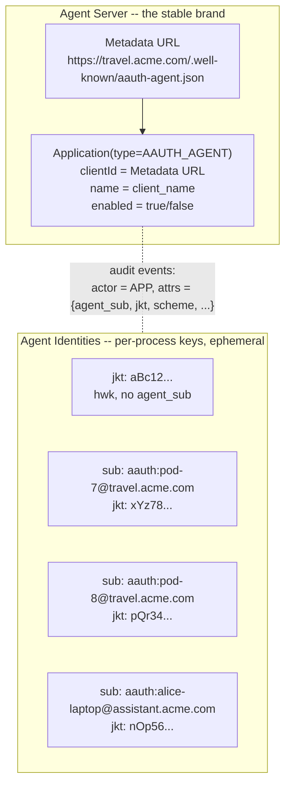
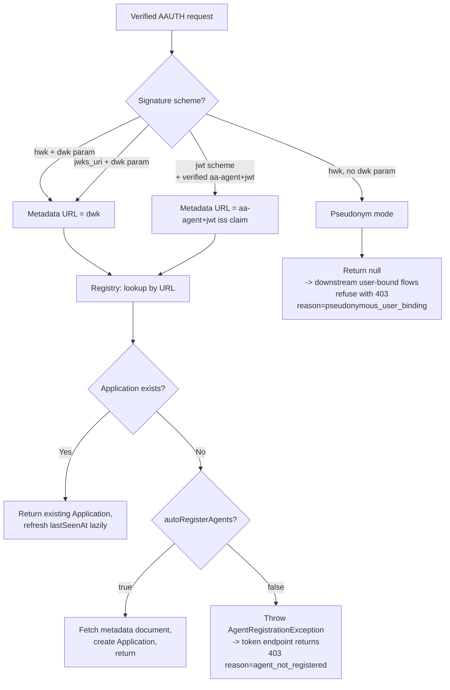

# Phase 4: Agent Application Lifecycle

## Goal

Give Gravitee AM a first-class entity for AAUTH agents so that token issuance, consent caching, audit, and admin operations can all reference a real, browsable record -- not a free-floating identity URL string. Agents are not pre-registered (per the AAUTH spec), so AM auto-discovers them on first verified contact and creates one `Application(type=AAUTH_AGENT)` per **Agent Server**, keyed by the agent's metadata URL. Per-request **Agent Identities** (signing-key thumbprints, schemes, aa-agent+jwt jtis) live as audit-event attributes, not as separate entities.

```
+------------------+   1. Signed request           +------------------------+
|                  | ----------------------------> | Gravitee AM            |
|   AI Agent       |   Phase 3:                    |                        |
|                  |   verify signature +          |  AAuthSignatureHandler |
|  https://foo.bar |   resolve agent metadata URL  |          |             |
|                  |                               |          v             |
|                  |                               |  AAuthAgentRegistry    |
|                  |                               |   .resolveOrCreate()   |
|                  |                               |          |             |
|                  |                               |          v             |
|                  |                               |  Application(type=AAUTH_AGENT|
|                  |                               |    clientId =          |
|                  |                               |      metadata URL)     |
|                  |                               |          |             |
|                  |                               |          v             |
|                  |                               |  routing context:      |
|                  |                               |   "aauth.application"  |
+------------------+                               +------------------------+
                                                              |
                                                              v
                                              Phase 6+ token endpoint /
                                              Phase 8 consent / audit
```

After this phase, every verified AAUTH request that resolves to a real Agent Server identity (any of the four "named" canonical scenarios) is backed by an `Application` row that admins can browse, audit can point at, and consent can hang from. Pseudonymous requests still pass signature verification but resolve to no Application and are refused for any user-bound flow.

## Discovery

**Specification references:**
- AAUTH Protocol spec: [Section 4 -- Identity Levels](https://github.com/dickhardt/AAuth) -- Verified identity vs pseudonymous mode (Section 4.3)
- AAUTH Protocol spec: [Section 14 -- Metadata Documents](https://github.com/dickhardt/AAuth) -- The agent metadata URL is the canonical identity
- AAUTH Headers spec: [Section 5.2 -- Keying Material](https://github.com/dickhardt/AAuth) -- The `dwk` parameter declares the metadata URL for `hwk`/`jwks_uri`; the `aa-agent+jwt`'s `iss` claim plays the same role for the `jwt` scheme

**Files to study (Gravitee AM):**
- `gravitee-am-model/src/main/java/io/gravitee/am/model/application/ApplicationType.java` -- the enum that needs a new `AAUTH_AGENT` value
- `gravitee-am-model/src/main/java/io/gravitee/am/model/Application.java` -- the entity Phase 4 will reuse, with the existing `metadata` (`Map<String,Object>`) field for AAUTH-specific data
- `gravitee-am-service/src/main/java/io/gravitee/am/service/ApplicationService.java` and its `impl/ApplicationServiceImpl.java`
- `gravitee-am-service/src/main/java/io/gravitee/am/service/impl/application/ApplicationServiceTemplate.java`, `ApplicationWebTemplate.java`, etc. -- the existing per-type template pattern Phase 4 will follow
- `gravitee-am-gateway-handler-oidc/src/main/java/.../client/ClientSyncService` and the existing **Dynamic Client Registration** flow (`DynamicClientRegistrationService` + `DynamicClientRegistrationEndpoint`) -- the OIDC precedent for "client appears at runtime, AM auto-creates an Application row"
- `gravitee-am-common/src/main/java/io/gravitee/am/common/audit/EntityType.java` -- AAUTH agents reuse `EntityType.APPLICATION` for audit

## Design

### Agent Server vs Agent Identity



**The rule**: one `Application` per metadata URL. Signing keys, pods, user-installed processes are observed as audit attributes. The `ScopeApproval` cache (Phase 8) keys on the metadata URL string, so per-process identities never affect consent matching.

### Resolution rules per signature scheme



### Five canonical scenarios (must all flow through one registry)

| # | Topology | Scheme | Metadata URL source | Application count |
|---|----------|--------|---------------------|-------------------|
| 1 | Single-instance long-lived agent | `hwk` or `jwks_uri` | `dwk` parameter | 1 (per agent process; if the same key rotates, same Application) |
| 2 | Delegated multi-instance (data-center pods) | `jwt` | `aa-agent+jwt.iss` | 1 per Agent Server, regardless of pod count |
| 3 | Two independent Agent Servers running the same software | `hwk` or `jwks_uri` | per-server URL | 2 (one per metadata URL) |
| 4 | Centralized brand, distributed user-installed processes | `jwt` | `aa-agent+jwt.iss` (centralized) | 1 per Agent Server, regardless of user count |
| 5 | Truly local pseudonymous agent (no centralized identity) | `hwk` (no `dwk`) | none -- pseudonym mode | 0 (no Application created) |

The same `AAuthAgentRegistry.resolveOrCreate(...)` call handles all five. The dispatch on signature scheme happens internally via a small `AgentServerUrlResolver` strategy. See `agent-modeling.md` for the full walkthrough of each scenario and what AM does at each step.

### Auto-register vs closed mode

`AAuthSettings.autoRegisterAgents` defaults to `true`, matching the AAUTH spec's "agents are not pre-registered" assumption. When set to `false`, the registry refuses to create new Applications and the token endpoint returns `403 forbidden` with `reason=agent_not_registered` for any agent that does not already have a manually-created Application row in the domain. This is the enterprise "closed mode" lever for environments that want to whitelist agents explicitly. Signature verification (Phase 2/3) is unaffected: signatures from unknown agents still verify cryptographically, the refusal happens at the application-resolution step.

### Lazy metadata refresh

To avoid hammering `Application` writes on every AAUTH request, the registry uses two cheap strategies:

- `lastSeenAt` updates are sampled with a 60-second in-memory debounce: at most one write per Application per minute, regardless of how many requests come through.
- `client_name` and `client_description` are pulled from the agent's metadata document on a TTL (default 24h, matching the JWKS cache TTL from Phase 3). The registry trusts Phase 3's `AgentMetadataFetcher` cache and does not duplicate it.

### Audit attribute schema

Phase 4 itself does not write audit events -- it provides the `Application` for downstream phases to point at. The downstream contract is documented here so that the Phase 6 (token endpoint) and Phase 8 (consent + deferred) can adopt it consistently:

| Field | Source | Always present? |
|-------|--------|-----------------|
| `actor.entityType` | Constant `APPLICATION` | yes |
| `actor.id` | `Application.id` | yes (`null` only for pseudonymous agents in pure-machine flows) |
| `actor.alternativeId` | `Application.metadata.aauth.metadataUrl` (the agent metadata URL) | yes |
| `actor.displayName` | `Application.name` | yes |
| `attributes.agent_jkt` | JWK thumbprint of the request's signing key (RFC 7638) | yes |
| `attributes.signature_scheme` | `hwk` / `jwks_uri` / `jwt` | yes |
| `attributes.agent_sub` | `aa-agent+jwt.sub` — the agent identifier ([Section 9.1](https://github.com/dickhardt/AAuth)), stable across key rotations | only for `jwt` scheme |
| `attributes.agent_jti` | `aa-agent+jwt.jti` | only for `jwt` scheme |
| `attributes.source_ip` | `X-Forwarded-For` or remote address | yes |
| `attributes.user_agent` | `User-Agent` header if present | best-effort |

## Implementation

### Files to Create

```
gravitee-am-gateway-handler-aauth/src/main/java/.../aauth/service/registry/
  AAuthAgentRegistry.java                  -- public service interface
  AAuthAgentRegistryImpl.java              -- implementation
  AgentServerUrlResolver.java              -- per-scheme strategy interface
  HwkOrJwksUriUrlResolver.java             -- reads dwk parameter
  JwtSchemeUrlResolver.java                -- reads aa-agent+jwt.iss (registered in Phase 9)
  AgentRegistrationException.java          -- thrown when autoRegisterAgents=false
gravitee-am-gateway-handler-aauth/src/main/java/.../aauth/service/registry/audit/
  AAuthAuditAttributes.java                -- attribute key constants used by P6/P8
gravitee-am-service/src/main/java/.../service/impl/application/
  ApplicationAgentTemplate.java            -- AGENT-type defaults
```

### Files to Modify

```
gravitee-am-model/src/main/java/io/gravitee/am/model/application/
  ApplicationType.java                     -- add AAUTH_AGENT enum value

gravitee-am-service/src/main/java/.../service/impl/application/
  ApplicationServiceImpl.java              -- register ApplicationAgentTemplate

gravitee-am-gateway-handler-aauth/src/main/java/.../aauth/
  resources/handler/AAuthSignatureHandler.java
                                            -- after successful signature verification, call
                                               agentRegistry.resolveOrCreate(verificationResult, settings)
                                               and stash the result on the routing context as
                                               "aauth.application" (absent in pseudonym mode)
  spring/AAuthConfiguration.java           -- wire AAuthAgentRegistry bean and resolvers
```

### Key Implementation Details

**`AAuthAgentRegistry.java`** -- public contract:

```java
public interface AAuthAgentRegistry {

    /**
     * Given a verified AAUTH request context, resolve the canonical Agent
     * Server URL and return-or-create the corresponding Application(type=AAUTH_AGENT).
     *
     * @return a Maybe that emits the resolved Application, or completes empty
     *         if the request is in pseudonym mode (no metadata URL could be
     *         resolved). Returns Maybe.error(AgentRegistrationException) if
     *         the agent is unknown and autoRegisterAgents is disabled for the
     *         domain.
     */
    Maybe<Application> resolveOrCreate(VerificationResult verification,
                                        AAuthSettings settings);
}
```

The return type is `Maybe<Application>` (not `Single<Application>`) because pseudonym mode is a legitimate "no result" outcome, not an error: `Single` does not allow null emissions, and shoehorning pseudonym mode into a sentinel exception would conflate "no Application" with actual failures.

**`AAuthAgentRegistryImpl.java`** -- core algorithm:

```java
public Maybe<Application> resolveOrCreate(VerificationResult v, AAuthSettings settings) {
    AgentServerUrlResolver resolver = resolversByScheme.get(v.getScheme());
    String metadataUrl = resolver.resolve(v); // null for pseudonym mode

    if (metadataUrl == null) {
        return Maybe.empty(); // pseudonym -- caller must enforce no user binding
    }

    // applicationService.findByDomainAndClientId returns Maybe<Application>
    // (the existing OIDC sync service contract).
    return applicationService.findByDomainAndClientId(domainId, metadataUrl)
        .doOnSuccess(existing -> updateLastSeenIfDebounced(existing))
        .switchIfEmpty(Maybe.defer(() -> {
            if (!settings.isAutoRegisterAgents()) {
                return Maybe.error(new AgentRegistrationException(metadataUrl));
            }
            return autoCreateApplication(metadataUrl, v).toMaybe();
        }));
}

private Single<Application> autoCreateApplication(String metadataUrl, VerificationResult v) {
    return metadataFetcher.fetchMetadata(metadataUrl)  // reuses Phase 3 cache
        .map(meta -> agentTemplate.build(domainId, metadataUrl, meta))
        .flatMap(applicationService::create);
}
```

**`ApplicationAgentTemplate.java`** -- defaults for AAUTH-discovered agents:

```java
public class ApplicationAgentTemplate {

    public Application build(String domainId, String metadataUrl, AgentMetadata meta) {
        Application app = new Application();
        app.setDomain(domainId);
        app.setType(ApplicationType.AAUTH_AGENT);
        app.setEnabled(true);
        // The "client_id" of an AAUTH agent is its metadata URL.
        // ScopeApproval.clientId (Phase 8) keys on this exact value.
        app.getSettings().getOauth().setClientId(metadataUrl);
        app.setName(meta.getClientName() != null ? meta.getClientName() : metadataUrl);
        app.setDescription(meta.getClientDescription());
        app.getMetadata().put("aauth.metadataUrl", metadataUrl);
        app.getMetadata().put("aauth.firstSeenAt", Instant.now().toString());
        app.getMetadata().put("aauth.lastSeenAt", Instant.now().toString());
        // No client secret, no OAuth grant types, no redirect URIs.
        // AGENT applications are AAUTH-only and authenticate via signatures.
        return app;
    }
}
```

**`AAuthSignatureHandler.java`** -- post-verification hook (one new block, no change to verification logic):

```java
// existing code: signature verification produces VerificationResult v
// ...

agentRegistry.resolveOrCreate(v, settings)
    .subscribe(
        // onSuccess -- Application resolved (named agent)
        app -> {
            ctx.put("aauth.application", app);
            ctx.next();
        },
        // onError
        err -> {
            if (err instanceof AgentRegistrationException) {
                ctx.response().setStatusCode(403)
                    .putHeader("Content-Type", "application/json")
                    .end("{\"error\":\"forbidden\",\"reason\":\"agent_not_registered\"}");
            } else {
                ctx.fail(err);
            }
        },
        // onComplete -- pseudonym mode, no Application
        () -> {
            // routing context entry is left absent; downstream handlers
            // (Phase 6 token endpoint) check for absence and refuse user-bound
            // flows with 403 reason=pseudonymous_user_binding.
            ctx.next();
        }
    );
```

### Pseudonym-mode handling

**Spec note:** Per Section 7.1.3, the PS token endpoint requires `scheme=jwt` (agent token). Once Phase 9 enforces this, pseudonymous agents (HWK) cannot reach PS endpoints at all. The registry's pseudonymous handling below serves as defense-in-depth and supports the general-purpose signature verification infrastructure.

The registry returns `Maybe.empty()` for pseudonymous requests, and the signature handler leaves the `aauth.application` routing-context entry absent. **Phase 4 does not enforce the rejection** -- the Phase 6 (token endpoint) does, in its user-binding decision branch:

```java
// in the token endpoint, after looking up aauth.application from the routing context
Application app = ctx.get("aauth.application"); // null when key absent (pseudonym mode)
if (app == null && willBindToUser(tokenRequest)) {
    return error403("pseudonymous_user_binding");
}
```

This split keeps Phase 4's responsibility narrow ("resolve or empty") and lets Phase 6/7 decide what to do with the absent Application based on the flow being requested. Self-auth (Phase 8) and pure machine flows accept the absent Application and proceed.

## Validation

### Unit Tests

Add the following `*Test.java` classes under `gravitee-am-gateway-handler-aauth/src/test/java/io/gravitee/am/gateway/handler/aauth/`.

**`service/registry/AAuthAgentRegistryImplTest`** (`@RunWith(MockitoJUnitRunner.class)`)
- `shouldCreateApplication_onFirstVerifiedContact_withMetadataUrl()` -- Scenario 1: a verified `hwk`/`jwks_uri` request with a `dwk` parameter creates one Application keyed by the dwk URL.
- `shouldReturnExistingApplication_onSecondContact_withSameMetadataUrl()` -- idempotency: the second call returns the same Application instance, no new row.
- `shouldReuseSameApplication_acrossDifferentSigningKeys_underJwksUriScheme()` -- key rotation variant: same agent URL, different `kid`, same Application.
- `shouldReuseSameApplication_acrossDifferentPodKeys_underJwtScheme()` -- Scenario 2: two requests with different pod signing keys but the same `aa-agent+jwt.iss` resolve to the same Application.
- `shouldCreateTwoApplications_forTwoDistinctMetadataUrls()` -- Scenario 3: two distinct dwk URLs, two Application rows.
- `shouldReturnNull_forPseudonymousRequest()` -- Scenario 5: a verified `hwk` request with no `dwk` parameter returns `null` and creates no Application row.
- `shouldUpdateLastSeenAt_lazily_withDebounce()` -- ten consecutive calls within 60s trigger exactly one `applicationService.update(...)` call.
- `shouldRefreshClientName_lazilyOnTtlExpiry()` -- after the metadata cache TTL expires, the next lookup re-fetches metadata and propagates a changed `client_name` into the Application row.
- `shouldThrowAgentRegistrationException_whenAutoRegisterDisabled_andUnknownAgent()` -- closed-mode path; the exception carries the metadata URL.
- `shouldNotThrow_whenAutoRegisterDisabled_butApplicationExists()` -- pre-registered admin path: the closed-mode setting only blocks auto-create, not existing rows.
- `shouldUseAgentJwtIssClaim_underJwtScheme_evenWhenSigningKeyHasDifferentJkt()` -- regression guard for the per-scheme resolver.

**`service/registry/AAuthAgentRegistryPseudonymRejectionTest`** (`extends RxWebTestBase`)
- `shouldRefuseUserBoundTokenIssuance_forPseudonymousAgent()` -- end-to-end through the Phase 6 token endpoint: a pseudonymous request with a resource_token bearing a `sub` claim returns `403 reason=pseudonymous_user_binding`.
- `shouldAllowSelfAuthTokenIssuance_forPseudonymousAgent()` -- pure machine flows still mint a token for a pseudonymous agent because no user binding is involved.

**`model/application/ApplicationTypeAgentTest`**
- `shouldDeclareAgentValue()` -- regression guard that `ApplicationType.AAUTH_AGENT` exists and serializes to JSON as `"AAUTH_AGENT"`.
- `shouldRoundTripViaJackson()` -- an Application with `type=AAUTH_AGENT` round-trips through Jackson without loss.

**`service/impl/application/ApplicationAgentTemplateTest`**
- `shouldSetAaauthDefaults()` -- type=AAUTH_AGENT, enabled=true, no client secret, no OAuth grant types, no redirect URIs, `clientId == metadataUrl`, name from metadata `client_name`.
- `shouldFallBackToMetadataUrl_asName_whenClientNameAbsent()`.
- `shouldStoreFirstSeenAt_andLastSeenAt_inMetadataMap()`.

**`resources/handler/AAuthSignatureHandlerRegistryHookTest`** (`extends RxWebTestBase`)
- `shouldStashApplicationOnRoutingContext_afterSuccessfulVerification()` -- mocked registry returns a fixture Application; the handler sets `aauth.application` and calls `next()`.
- `shouldStashNull_forPseudonymousRequests()` -- registry returns null; routing context entry is `null`, handler still calls `next()`.
- `shouldRespond403_whenAgentRegistrationExceptionThrown()` -- closed mode + unknown agent path; response body is `{"error":"forbidden","reason":"agent_not_registered"}`.
- `shouldFailRoutingContext_onUnexpectedRegistryError()` -- non-`AgentRegistrationException` errors propagate to the standard failure handler.

### Test Fixtures

Adds to `gravitee-am-gateway-handler-aauth/src/test/java/io/gravitee/am/gateway/handler/aauth/test/fixtures/`:

- `TestAgentApplicationFactory` -- builds an `Application(type=AAUTH_AGENT)` instance with sensible defaults and a configurable metadata URL, for unit tests in P6/P7/P8/P9 that need an Application without going through the registry.
- `TestAgentRegistryFactory` -- builds an in-memory `AAuthAgentRegistry` pre-seeded with a configurable set of `(metadataUrl -> Application)` mappings. Used by the P6/P8/P9 endpoint tests so they can exercise the "Application already exists" branch without going through the resolver or `ApplicationService`.
- Updates `MockAgentMetadataServer` (from Phase 3) so that the new registry tests can stand up a real metadata document for the auto-create path.

### Checklist

- [ ] `ApplicationType.AAUTH_AGENT` enum value exists, round-trips through Jackson, has no consent-bypass implications
- [ ] `AAuthAgentRegistry` resolves Scenarios 1, 2, 3, 4 to a single Application keyed by the metadata URL
- [ ] `AAuthAgentRegistry` returns empty for Scenario 5 (pseudonym mode)
- [ ] First verified contact creates exactly one `Application(type=AAUTH_AGENT)` row when `autoRegisterAgents=true`
- [ ] Subsequent contacts (same metadata URL) reuse the existing Application
- [ ] `autoRegisterAgents=false` blocks auto-create and surfaces `403 reason=agent_not_registered` at the token endpoint
- [ ] `autoRegisterAgents=false` does NOT block requests for agents whose Applications already exist
- [ ] `lastSeenAt` writes are debounced (1 write per minute per Application maximum)
- [ ] `client_name` updates from the metadata document propagate after the metadata cache TTL expires
- [ ] `AAuthSignatureHandler` stashes `aauth.application` on the routing context after successful verification (or `null` for pseudonym mode)
- [ ] Renumbered Phase 6 token endpoint refuses user-bound flows for pseudonymous agents with `403 reason=pseudonymous_user_binding`
- [ ] Phase 6 token endpoint allows pure machine flows for pseudonymous agents
- [ ] Audit events written by Phases 5 and 8 carry `actor.entityType=APPLICATION`, `actor.id=Application.id`, plus the `agent_jkt` / `signature_scheme` / `agent_jti?` attributes documented in the Audit attribute schema table
- [ ] `ScopeApproval.clientId` (Phase 8) continues to use the metadata URL string (unchanged from the previous Phase 8 design)

### Spec Requirements Added in This Phase

**No new wire-protocol behavior.** Phase 4 is purely an internal modeling phase: it does not change the AAUTH HTTP responses on the happy path. It only:

1. Adds one new error response on the unhappy path: `403 reason=agent_not_registered` when `autoRegisterAgents=false` and the agent is unknown.
2. Adds one new error response on the unhappy path: `403 reason=pseudonymous_user_binding` (enforced in Phase 6) when a pseudonymous agent requests a user-bound token.

Both responses follow the same JSON shape as the rest of the AAUTH error responses (`{"error":"forbidden","reason":"..."}`).

**Why no spec section drives this phase**: the AAUTH spec is silent on what an Authorization Server stores internally about agents. It defines the wire protocol -- metadata URLs, signature schemes, token formats -- and leaves persistence and admin tooling to the implementation. Phase 4 fills that gap for Gravitee AM by reusing the existing `Application` infrastructure, mirroring how OIDC's Dynamic Client Registration auto-creates `Application(type=WEB|NATIVE|...)` rows on first contact.
