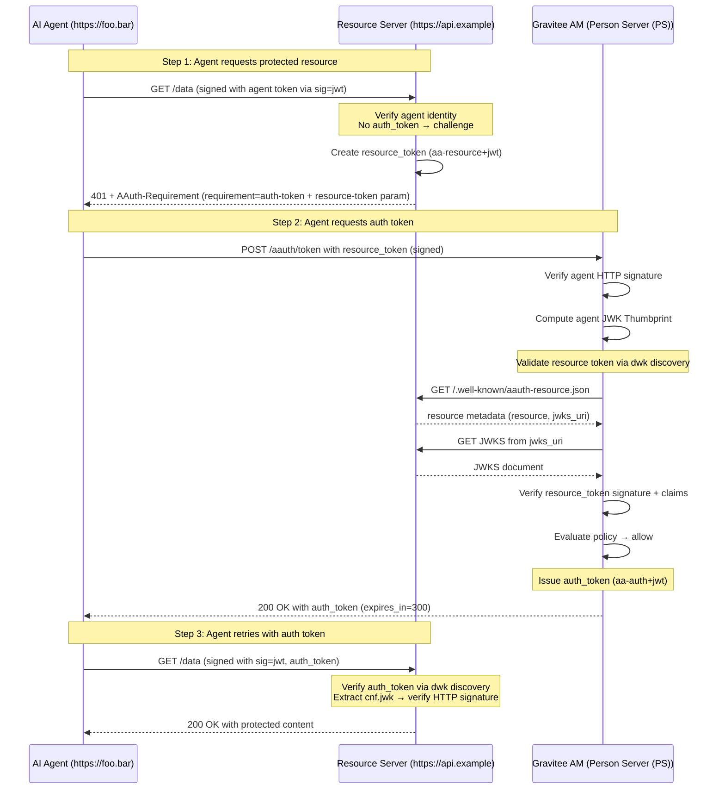

# Phase 6: PS Token Endpoint — Three-Party Mode

## Goal

Implement the core AAUTH authorization flow: an agent presents a `resource_token` (a cryptographic challenge from a Resource Server) to the Person Server (PS)'s token endpoint and receives an `auth_token` granting access to that resource. This is the fundamental three-party AAUTH flow -- the equivalent of OAuth 2.0's token endpoint but with cryptographic proof-of-possession binding.

```
+------------------+                           +------------------+        +------------------+
|                  |                           |                  |        |                  |
|   AI Agent       |-------------------------->|   Resource       |        |  Gravitee AM     |
|                  | 1. GET /data              |   Server         |        |  (Person Server (PS))   |
|  https://foo.bar |                           |                  |        |                  |
|                  |                           |                  |        |                  |
|                  |<--------------------------|                  |        |                  |
|                  |   2. 401 + resource_token |                  |        |                  |
|                  |   + auth_server URL.      |                  |        |                  |
|                  |                           |                  |        |                  |
|                  |                           |                  |        |                  |
|                  |------------------------------------------------------>|                  |
|                  |   3. POST /aauth/token    |                  |        |                  |
|                  |   resource_token=<jwt>    |                  |        |                  |
|                  |   (signed with agent key) |                  |        |                  |
|                  |                           |                  |        |                  |
|                  |<------------------------------------------------------|                  |
|                  |   4. 200 OK               |                  |        |                  |
|                  |   + auth_token=<jwt>      |                  |        |                  |
|                  |                           |                  |        |                  |
|                  |-------------------------->|                  |        |                  |
|                  |   5. GET /data            |                  |        |                  |
|                  |   + sig=jwt (auth_token)  |                  |        |                  |
|                  |                           |                  |        |                  |
|                  |                           |                  |        |                  |
|                  |                           |                  |        |                  |
|                  |<--------------------------|                  |        |                  |
|                  |   6.                      |                  |        |                  |
|                  |  200 OK                   |                  |        |                  |
+------------------+                           +------------------+        +------------------+
```

## Discovery

**Specification references:**
- AAUTH Protocol spec: [Section 7.1 -- Auth Token Required](https://github.com/dickhardt/AAuth) -- `requirement=auth-token` challenge with `resource-token` parameter
- AAUTH Protocol spec: [Section 13 -- Token Endpoint](https://github.com/dickhardt/AAuth) -- Token endpoint request/response
- AAUTH Protocol spec: [Section 10 -- Resource Tokens](https://github.com/dickhardt/AAuth) -- Resource tokens (aa-resource+jwt), including 10.2 Resource Token Usage
- AAUTH Protocol spec: [Section 11 -- Auth Tokens](https://github.com/dickhardt/AAuth) -- Auth tokens (aa-auth+jwt)
- AAUTH Protocol spec: [Section 15 -- Request Verification](https://github.com/dickhardt/AAuth) -- How to verify signed requests
- [RFC 7638](https://www.rfc-editor.org/rfc/rfc7638) -- JWK Thumbprint for `agent_jkt` claim

**Scheme enforcement:** Per spec Section 7.1.3, the PS token endpoint requires `scheme=jwt` (agent token). This phase builds the token endpoint logic but does not yet enforce the scheme constraint — it accepts any verified signature (including HWK and jwks_uri) to allow incremental testing. Phase 9 introduces the `jwt` scheme and adds the enforcement that rejects non-jwt schemes at PS endpoints.

**Dependency on Phase 4:** by the time the token endpoint runs, Phase 3's `AAuthSignatureHandler` has already verified the request signature **and** Phase 4's `AAuthAgentRegistry` has resolved (or auto-created) the `Application(type=AAUTH_AGENT)` representing the calling Agent Server. The token endpoint reads this Application from the routing context as `ctx.get("aauth.application")`. The value is `null` only for pseudonymous requests (Scenario 5 in [04-agent-application-lifecycle.md](./04-agent-application-lifecycle.md)). When a pseudonymous request asks for a user-bound auth token (i.e. the `sub` claim would be set), the token endpoint refuses with `403 forbidden` and `reason=pseudonymous_user_binding`. When a known agent request hits the closed-mode setting (`autoRegisterAgents=false`), Phase 4 has already failed the request earlier in the pipeline with `403 reason=agent_not_registered` -- the token endpoint never sees it. Audit events emitted by the token endpoint use `Application.id` as the actor and add the `agent_jkt`, `signature_scheme`, and (when applicable) `agent_jti` attributes documented in Phase 4's audit attribute schema table. The resource_token carries no user identifier ([Section 10.1](https://github.com/dickhardt/AAuth)). When the PS policy decides the auth_token must be user-bound, the token endpoint hands the request off to Phase 8's deferred flow rather than attempting to derive a user from the resource_token -- the user is established only when they authenticate to the PS interaction endpoint.

**Gravitee AM token infrastructure:**
- `gravitee-am-jwt/` -- JWT service, signing, parsing
- `gravitee-am-certificate/` -- Certificate management for signing keys
- `OAuth2Provider.java` -- Token endpoint handler chain pattern

## Design

### Full Authorization Flow



**Detailed request/response at each step:**

**Step 1 -- Agent requests resource (signed with agent token, no auth token yet):**
```
GET /data HTTP/1.1
Signature-Key: sig=jwt;jwt="eyJhbGciOiJFZERTQSIsInR5cCI6ImFhLWFnZW50K2p3dCJ9..."
Signature-Input: sig=("@method" "@authority" "@path" "signature-key");created=1712345678
Signature: sig=:base64url:
```

**Step 1 -- Resource responds with 401 challenge:**
```
HTTP/1.1 401 Unauthorized
AAuth-Requirement: requirement=auth-token; resource-token="eyJhbGciOiJFZERTQSIsInR5cCI6InJlc291cmNlK2p3dCJ9..."
```

Per [Protocol spec Section 7.1](https://github.com/dickhardt/AAuth) and [Section 10.2](https://github.com/dickhardt/AAuth), the resource server includes the resource token directly in the `AAuth-Requirement` header as the `resource-token` parameter. The Protocol spec defines `requirement=auth-token` as a new requirement level extending the `pseudonym` and `identity` levels from the Headers spec. The agent extracts the resource token from the header and presents it to its auth server's token endpoint.

**Step 2 -- Agent requests auth token from PS (per spec Section 7.1.3, scheme=jwt required):**
```
POST /aauth/token HTTP/1.1
Content-Type: application/json
Content-Digest: sha-256=:hash:
Signature-Key: sig=jwt;jwt="eyJhbGciOiJFZERTQSIsInR5cCI6ImFhLWFnZW50K2p3dCJ9..."
Signature-Input: sig=("@method" "@authority" "@path" "content-type" "content-digest" "signature-key");created=1712345678
Signature: sig=:base64url:

{"resource_token": "eyJhbGciOiJFZERTQSIsInR5cCI6InJlc291cmNlK2p3dCJ9..."}
```

**Step 2 -- AS responds with auth token:**
```
HTTP/1.1 200 OK
Content-Type: application/json
Cache-Control: no-store

{"auth_token": "eyJhbGciOiJFZERTQSIsInR5cCI6ImF1dGgrand0In0...", "expires_in": 300}
```

**Step 3 -- Agent retries resource with auth token:**
```
GET /data HTTP/1.1
Signature-Key: sig=jwt;jwt="eyJhbGciOiJFZERTQSIsInR5cCI6ImF1dGgrand0In0..."
Signature-Input: sig=("@method" "@authority" "@path" "signature-key");created=1712345679
Signature: sig=:base64url:
```

### Token Structures

#### Resource Token (`aa-resource+jwt`)

```json
// Header
{"typ": "aa-resource+jwt", "alg": "EdDSA", "kid": "resource-key-1"}

// Payload (per spec Section 10)
{
  "iss": "https://api.example",          // Resource Server identity
  "dwk": "aauth-resource.json",          // Well-known metadata document for key discovery
  "aud": "https://am.gravitee.io/...",   // The auth server URL
  "jti": "uuid-1234",                    // Unique token ID
  "agent": "https://foo.bar",            // Agent that made the request
  "agent_jkt": "zAkRaFpm...",           // JWK Thumbprint of agent's signing key (RFC 7638)
  "iat": 1712345678,                     // Issued at
  "exp": 1712345978,                     // Expires (SHOULD NOT exceed 5 minutes per spec)
  "scope": "data.read data.write"        // Requested scopes (optional)
}
```

#### Auth Token (`aa-auth+jwt`)

```json
// Header
{"typ": "aa-auth+jwt", "alg": "EdDSA", "kid": "am-signing-key-1"}

// Payload (per spec Section 11)
{
  "iss": "https://am.gravitee.io/...",   // This auth server
  "dwk": "aauth-person.json",            // Well-known metadata document for key discovery
  "aud": "https://api.example",          // Target resource
  "jti": "uuid-5678",                    // Unique token ID
  "agent": "aauth:assistant@foo.bar",     // Authorized agent (always required)
  "act": {                               // Actor claim (REQUIRED, per RFC 8693 Section 4.1)
    "sub": "aauth:assistant@foo.bar"     // Agent that requested the token; nests in call chaining
  },
  "cnf": {                               // Proof-of-possession binding
    "jwk": {
      "kty": "OKP",
      "crv": "Ed25519",
      "x": "v4w1nfeU2IV9Mi7N_pLDbBvNMerWhlMwagF1Dw_7wXQ"
    }
  },
  "iat": 1712345680,
  "exp": 1712349280,                     // Expires (MUST NOT exceed 1 hour per spec)
  "scope": "data.read data.write",       // Granted scopes (at least one of sub or scope required)
  "sub": "user@example.com"              // Only present for user-bound flows established via Phase 8 interaction
}
```

**Note:** Per the spec, the `agent` claim is always required. At least one of `sub` or `scope` must be present in the auth token. There is no user claim of any kind in a `resource_token` ([Section 10.1](https://github.com/dickhardt/AAuth)), so the AS cannot derive `sub` from a resource_token alone. A user-bound auth_token (one that carries `sub`) can only be issued after the user has authenticated directly to the AS via the deferred interaction flow described in Phase 8.

## Implementation

### Files to Create

```
aauth/
  service/token/
    AAuthTokenService.java               -- Create and sign aa-auth+jwt tokens
    ResourceTokenValidator.java          -- Validate aa-resource+jwt tokens
    ResourceTokenClaims.java             -- POJO for parsed resource token claims
  resources/endpoint/
    AAuthTokenEndpoint.java              -- POST /aauth/token handler
  resources/handler/
    AAuthTokenRequestParseHandler.java   -- Parse and validate token request body
  model/
    AAuthTokenRequest.java               -- Token request POJO (resource_token, scope, ...)
    AAuthTokenResponse.java              -- Token response POJO (auth_token, expires_in)
```

### Files to Modify

```
aauth/
  AAuthProvider.java                     -- Add POST /token route with handler chain
  spring/AAuthConfiguration.java         -- Register new service beans
  service/AgentMetadataFetcher.java      -- Add resource metadata fetching
```

### Key Implementation Details

**AAuthTokenEndpoint** handler chain in `AAuthProvider.doStart()`:
```java
aAuthRouter.route(HttpMethod.POST, "/token")
    .handler(corsHandler)
    .handler(bodyHandler)
    .handler(signatureHandler)           // Verify HTTP Message Signature
    .handler(tokenRequestParseHandler)   // Parse body params
    .handler(tokenEndpoint);             // Process and respond
```

**ResourceTokenValidator:**
1. Decode resource token JWT (without verification first to read header)
2. Check `typ` == `aa-resource+jwt`
3. Read `dwk` claim (= `"aauth-resource.json"`) and `iss` claim to discover resource server
4. Fetch resource's metadata from `{iss}/.well-known/{dwk}` (i.e., `{iss}/.well-known/aauth-resource.json`)
5. Fetch resource's JWKS from metadata's `jwks_uri`
6. Verify JWT signature against resource's public key (using `kid` from JOSE header)
7. Validate claims:
   - `aud` must match this auth server's issuer URL
   - `agent` must match the agent identity from the HTTP signature
   - `agent_jkt` must match the JWK Thumbprint of the agent's signing key
   - `exp` must be in the future (and SHOULD NOT exceed 5 minutes from `iat`)
8. Return `ResourceTokenClaims`

**AAuthTokenService:**
1. Build `aa-auth+jwt` claims (per [spec Section 11](https://github.com/dickhardt/AAuth)):
   - `iss` = this auth server's issuer URL
   - `dwk` = `"aauth-person.json"` (metadata document for key discovery)
   - `aud` = resource token's `iss` (the resource)
   - `jti` = unique token ID
   - `agent` = verified agent identity, `aauth:local@domain` format (always required)
   - `act` = actor claim per RFC 8693 Section 4.1: `{"sub": "<agent identifier>"}`. In call chaining (Phase 11), nests to preserve the delegation chain.
   - `cnf.jwk` = agent's public signing key (the key that signed the request)
   - `iat`, `exp` (MUST NOT exceed 1 hour per spec)
   - At least one of `sub` or `scope`. `scope` comes from the resource_token. `sub` is set only when the token endpoint has been resumed via the Phase 8 interaction endpoint, where the PS has authenticated the user; it is never derived from the resource_token
2. Sign with domain's certificate (EdDSA recommended)
3. Set `typ` = `aa-auth+jwt` in JOSE header

**AAuthTokenEndpoint:**
```java
public void handle(RoutingContext ctx) {
    VerificationResult agentSig = ctx.get("aauth.verification");
    AAuthTokenRequest tokenReq = ctx.get("aauth.token.request");
    Application agentApp = ctx.get("aauth.application"); // from Phase 4

    // Validate resource token (no user claim is read -- the spec does not put one in)
    ResourceTokenClaims rtClaims = resourceTokenValidator
        .validate(tokenReq.getResourceToken(), agentSig);

    // Decide whether the resulting auth_token must carry a sub.
    boolean userBound = policyEvaluator.requiresUserBinding(agentApp, rtClaims, settings);

    if (userBound) {
        // The resource_token does NOT carry user identity (Section 10.1). The only
        // way to bind a user is to send them through the interaction endpoint. Hand
        // off to Phase 8's deferred handler, which creates the pending request and
        // returns 202.
        deferredHandler.startUserBoundFlow(ctx, agentSig, agentApp, rtClaims);
        return;
    }

    // Pure machine-to-machine path -- no sub, scope only.
    String authToken = tokenService.createAuthToken(
        rtClaims.getIss(),       // aud = resource
        agentSig.getAgentId(),   // agent
        agentSig.getPublicKey(), // cnf.jwk
        rtClaims.getScope(),     // scope (no sub)
        /* sub */ null
    );

    ctx.response()
        .putHeader("Content-Type", "application/json")
        .putHeader("Cache-Control", "no-store")
        .end(new AAuthTokenResponse(authToken, tokenTTL).toJson());
}
```

## Validation

### Unit Tests

Add the following `*Test.java` classes under `gravitee-am-gateway-handler-aauth/src/test/java/io/gravitee/am/gateway/handler/aauth/`. Resource server discovery is mocked via WireMock through the `TestResourceServer` fixture.

**`service/token/ResourceTokenValidatorTest`** (`@RunWith(MockitoJUnitRunner.class)`, uses WireMock)
- Sets up `TestResourceServer` exposing `/.well-known/aauth-resource.json` and `/jwks.json` for a known resource keypair.
- `shouldAcceptValidResourceToken()` -- well-formed `aa-resource+jwt` is parsed into `ResourceTokenClaims`.
- `shouldValidateDwkClaim_asAauthResourceJson()` -- per spec Section 15.1.3.
- `shouldRejectMissingDwk()`.
- `shouldRejectWrongDwkValue()` -- e.g. `dwk: "aauth-agent.json"` rejected.
- `shouldRejectMissingTyp()` -- JOSE header lacking `typ: aa-resource+jwt`.
- `shouldRejectInvalidResourceTokenSignature()` -- token signed by an untrusted key throws with `invalid_resource_token`.
- `shouldRejectExpiredResourceToken()` -- `exp` in the past throws with `expired_resource_token`.
- `shouldRejectResourceTokenWithFutureIat()`.
- `shouldRejectResourceTokenWithExpExceeding5Minutes()` -- per spec Section 10.1.
- `shouldRejectAudMismatch()` -- `aud` is not this auth server's issuer URL.
- `shouldRejectAgentMismatch()` -- `agent` claim does not match the agent identity from the HTTP signature.
- `shouldRejectAgentJktMismatch()` -- `agent_jkt` does not match the JWK Thumbprint of the signer's key.
- `shouldRejectDuplicateJti()` -- per spec Section 10.1, single-use enforcement.
- `shouldFetchResourceJwksViaDwkDiscovery()` -- WireMock asserts the resource's `/.well-known/aauth-resource.json` was fetched.

**`service/token/AAuthTokenServiceTest`** (`@RunWith(MockitoJUnitRunner.class)`)
- Mocks `JWTService` and `CertificateProvider`.
- `shouldCreateAuthTokenWithAllRequiredClaims()` -- asserts `iss`, `dwk: "aauth-person.json"`, `aud`, `jti`, `agent`, `cnf.jwk`, `iat`, `exp` are all set.
- `shouldSetTypToAuthJwtInJoseHeader()`.
- `shouldEmbedAgentPublicKeyInCnfJwk()` -- given an Ed25519 `PublicKey`, asserts `cnf.jwk` has correct `kty`, `crv`, `x`.
- `shouldRequireAtLeastOneOfSubOrScope()` -- if neither is provided, throws.
- `shouldRespectAuthTokenLifespanFromSettings()` -- when `AAuthSettings.authTokenLifespan = 600`, `exp - iat == 600`.
- `shouldNotExceed24HourMaxLifespan()` -- per spec Section 11.1.
- `shouldSignWithDomainCertificate()` -- verifies the signing key is fetched from the configured `CertificateProvider`.

**`resources/handler/AAuthTokenRequestParseHandlerTest`** (`extends RxWebTestBase`)
- `shouldParseJsonBodyWithResourceToken()`.
- `shouldParseJsonBodyWithScopeOnly()` -- anticipating Phase 8.
- `shouldRejectNonJsonContentType()` -- 415 or 400 with `invalid_request`.
- `shouldRejectMalformedJson()` -- 400 with `invalid_request`.
- `shouldStoreParsedRequestInRoutingContext()`.

**`resources/endpoint/AAuthTokenEndpointTest`** (`extends RxWebTestBase`)
- Mounts the full token endpoint pipeline (signature handler + parse handler + endpoint) with mocked `ResourceTokenValidator`, `AAuthTokenService`, and `AAuthPolicyEvaluator`.
- `shouldReturn200_withAuthToken_forValidResourceToken()` -- happy path, response body has `auth_token` and `expires_in`.
- `shouldIncludeCacheControlNoStore()`.
- `shouldUseApplicationJsonContentType()`.
- `shouldReturn400InvalidResourceToken_whenValidatorRejects()` -- response body matches spec error format `{"error":"invalid_resource_token","error_description":"..."}`.
- `shouldReturn400ExpiredResourceToken_whenValidatorReportsExpired()`.
- `shouldReturn401_whenSignatureMissing()`.
- `shouldReturn400InvalidRequest_whenBothResourceTokenAndScopeMissing()`.

**`model/ResourceTokenClaimsTest`**
- `shouldDecodeAllClaimsFromJWT()`.
- `shouldExposeIssAudAgentAgentJktScopeExp()`.

### Test Fixtures

Adds to `gravitee-am-gateway-handler-aauth/src/test/java/io/gravitee/am/gateway/handler/aauth/test/fixtures/`:

- `TestResourceTokenBuilder` -- mints a `aa-resource+jwt` token with all required claims (`iss`, `dwk`, `aud`, `jti`, `agent`, `agent_jkt`, `iat`, `exp`, `scope`), signed by a configurable key. Provides fluent builder methods to construct invalid variants for negative tests.
- `TestResourceServer` -- WireMock-backed helper that exposes `/.well-known/aauth-resource.json` and `/jwks.json` for a configurable resource identity and signing key. Companion to `MockAgentMetadataServer` from Phase 3. Used by Phases 4, 9, 12.
- `TestAuthTokenAssertions` -- AssertJ-style helper offering chained assertions over a decoded `aa-auth+jwt` (`assertThat(authToken).hasIss(...).hasDwk(...).hasAgent(...).hasCnfJwkMatching(publicKey)`).

### Checklist

- [ ] `POST /aauth/token` with valid resource_token returns 200 + auth_token
- [ ] Auth token has `typ: aa-auth+jwt` in JOSE header
- [ ] Auth token includes `dwk: "aauth-person.json"` claim
- [ ] Auth token `cnf.jwk` matches agent's signing key
- [ ] Auth token `aud` matches resource token's `iss`
- [ ] Auth token `agent` matches verified agent identity
- [ ] Auth token contains at least one of `sub` or `scope`
- [ ] Resource token `dwk` claim validated as `"aauth-resource.json"` (per [spec Section 15.1.3](https://github.com/dickhardt/AAuth))
- [ ] Invalid resource token signature returns 400 with `error: invalid_resource_token` (per [spec Section 17.3](https://github.com/dickhardt/AAuth))
- [ ] `agent_jkt` mismatch returns 400 with `error: invalid_resource_token`
- [ ] Expired resource token returns 400 with `error: expired_resource_token`
- [ ] Missing HTTP signature on token request returns 401
- [ ] Token response includes `Cache-Control: no-store`
- [ ] Token endpoint error responses use JSON format: `{"error": "...", "error_description": "..."}` (per [spec Section 17.2](https://github.com/dickhardt/AAuth))
- [ ] Resource metadata `additional_signature_components` enforced if present (per [spec Section 14.3](https://github.com/dickhardt/AAuth))

### Spec Requirements Added in This Phase

**Token Endpoint Error Codes** (per [Protocol spec Section 17.3](https://github.com/dickhardt/AAuth)):
All token endpoint errors return JSON body `{"error": "<code>", "error_description": "<text>"}`:
- `invalid_request` (400): Malformed request
- `invalid_resource_token` (400): Invalid resource token signature or claims
- `expired_resource_token` (400): Resource token's `exp` is in the past
- `server_error` (500): Internal error

**`dwk` Claim Validation** (per [Protocol spec Section 15.1](https://github.com/dickhardt/AAuth)):
When verifying any JWT token, validate that the `dwk` claim matches the expected well-known document name:
- Resource tokens: `dwk` MUST be `"aauth-resource.json"`
- Auth tokens: `dwk` MUST be `"aauth-person.json"`
- Agent tokens: `dwk` MUST be `"aauth-agent.json"`

**Resource Metadata `additional_signature_components`** (per [Protocol spec Section 14.3](https://github.com/dickhardt/AAuth)):
If the resource metadata includes `additional_signature_components` (array of header names), the auth server SHOULD inform the agent that these components must be covered in requests to that resource.
