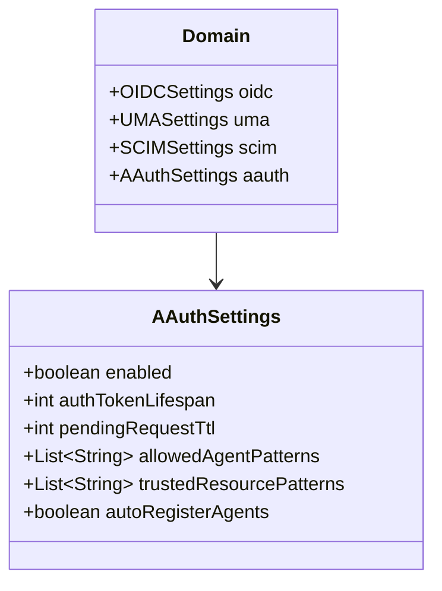
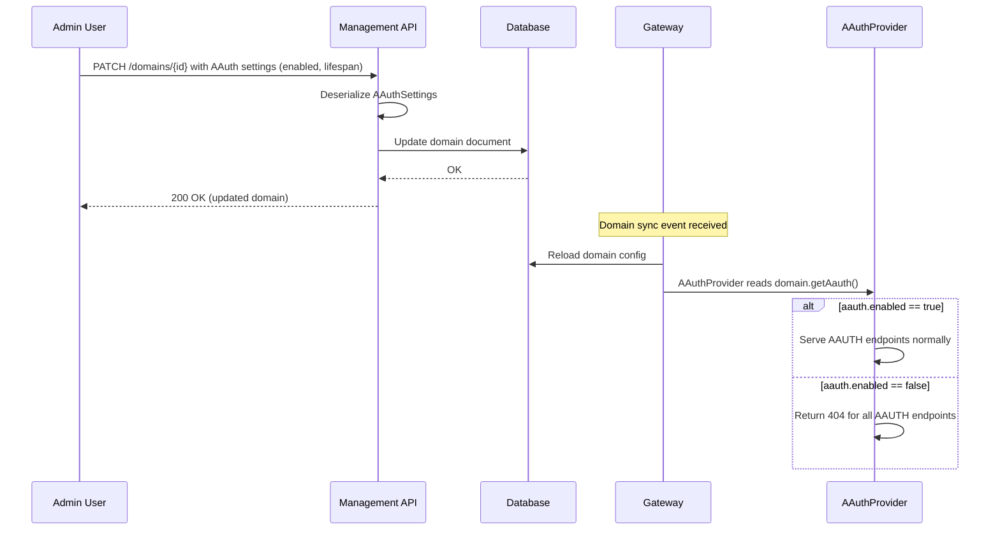

# Phase 7: Domain Model + AAuth Settings

## Goal

Add AAUTH configuration to Gravitee AM's domain model so administrators can enable, configure, and control AAUTH per domain. This phase is about the data model and management API -- no new protocol endpoints, but it wires configuration into the AAUTH provider so behavior becomes controllable.

```
+---------------------------------------------+
|             Gravitee AM Domain              |
|                                             |
|  +----------+  +------+  +------+  +-----+  |
|  | OIDC     |  | UMA  |  | SCIM |  |AAUTH|  |  <-- New!
|  | Settings |  | Sett.|  | Sett.|  |Sett.|  |
|  +----------+  +------+  +------+  +-----+  |
|                                             |
|  AAuth Settings:                            |
|  - enabled: true/false                      |
|  - authTokenLifespan: 300s                  |
|  - pendingRequestTtl: 600s                  |
|  - allowedAgentPatterns: [https://*.corp]   |
|  - trustedResourcePatterns: [https://api.*] |
|  - autoRegisterAgents: true                 |
|  (consent reuses OIDC ScopeApproval cache)  |
+---------------------------------------------+
```

## Discovery

**Files to study:**
- `gravitee-am-model/src/main/java/io/gravitee/am/model/Domain.java` -- Domain entity with settings fields
- `gravitee-am-model/src/main/java/io/gravitee/am/model/uma/UMASettings.java` -- Simple settings POJO to use as template
- `gravitee-am-model/src/main/java/io/gravitee/am/model/oidc/OIDCSettings.java` -- More complex settings example
- Management API REST endpoint for domain update (PATCH/PUT)
- Repository layer for domain persistence (MongoDB + JDBC)

**Domain.java currently has** (lines 137-157):
```java
private OIDCSettings oidc;
private UMASettings uma;
private LoginSettings loginSettings;
private WebAuthnSettings webAuthnSettings;
private SCIMSettings scim;
```

## Design

### Settings Model



### Configuration Flow



## Implementation

### Files to Create

```
gravitee-am-model/src/main/java/io/gravitee/am/model/aauth/
  AAuthSettings.java                     -- Settings POJO
```

### Files to Modify

```
gravitee-am-model/src/main/java/io/gravitee/am/model/
  Domain.java                            -- Add AAuthSettings field

gravitee-am-gateway-handler-aauth/src/.../aauth/
  AAuthProvider.java                     -- Read settings, conditionally enable
  service/token/AAuthTokenService.java   -- Use authTokenLifespan from settings
  spring/AAuthConfiguration.java         -- Expose settings as bean
```

### Key Implementation Details

**AAuthSettings.java:**
```java
package io.gravitee.am.model.aauth;

import java.util.List;

public class AAuthSettings {

    private boolean enabled;

    /** Auth token time-to-live in seconds (default: 300, MUST NOT exceed 3600 per spec) */
    private int authTokenLifespan = 300;

    /** Pending/deferred request TTL in seconds (default: 600) */
    private int pendingRequestTtl = 600;

    /** URL patterns for allowed agents (e.g., "https://*.corp.example") */
    private List<String> allowedAgentPatterns;

    /** URL patterns for trusted resource servers */
    private List<String> trustedResourcePatterns;

    /**
     * If true (default), agents that present a verified signature for the
     * first time are auto-registered as Application(type=AAUTH_AGENT) by Phase 4's
     * AAuthAgentRegistry. If false, the registry refuses to create new
     * Application rows and the token endpoint returns 403 reason=agent_not_registered
     * for unknown agents. Use false in locked-down deployments that require
     * admins to whitelist agents explicitly via the management API.
     * Has no impact on consent: this gates token issuance, not consent.
     */
    private boolean autoRegisterAgents = true;

    // getters, setters, builder
}
```

### Scope validation: reuse OIDC's existing pipeline

Scope validation in AAUTH is a four-step pipeline applied to every token request: **(1)** parse the requested scopes from the `scope` parameter, **(2)** check that each scope exists in the domain's scope catalog, **(3)** check that the calling agent is allowed to request it, and **(4)** if the resulting auth token will carry a `sub` claim, check that the user has either previously approved the scope (cached `ScopeApproval`) or grants approval interactively. AAUTH inherits all four steps verbatim from Gravitee AM's existing OAuth2/OIDC pipeline. The key insight is that the `Application(type=AAUTH_AGENT)` row that Phase 4's `AAuthAgentRegistry` creates for each verified agent is structurally identical to an OIDC `Client` -- same model, same `scopeSettings` field, same persistence -- so it slots into the existing pipeline as the `client` argument without any modification to the pipeline itself.

| Pipeline step | OIDC class AAUTH reuses | What AAUTH passes |
|---------------|-------------------------|-------------------|
| Resolve a scope name to its domain definition | `io.gravitee.am.gateway.handler.oauth2.service.scope.ScopeManager` (impl `ScopeManagerImpl`) -- per-domain in-memory cache, listens to scope events | The scope key from the token request |
| Existence check + per-application allowlist filter | `io.gravitee.am.gateway.handler.oauth2.service.request.AbstractRequestResolver.resolveAuthorizedScopes(R request, Client client, User endUser)` -- single method that filters requested scopes against `client.getScopeSettings()` and throws `InvalidScopeException` for unknown or disallowed scopes | The resolved `Application(type=AAUTH_AGENT)` as the `client` argument |
| Per-application scope catalog (where the allowlist lives) | `io.gravitee.am.model.application.ApplicationOAuthSettings.scopeSettings` -- a `List<ApplicationScopeSettings>` on every Application | Read straight from the auto-registered agent Application; admins edit it via the existing Application management API |
| Cached user-consent lookup | `io.gravitee.am.gateway.handler.oauth2.service.consent.UserConsentService.checkConsent(Client client, User user)` (impl `UserConsentServiceImpl`) -- returns the still-valid approved scopes for a `(domain, user, clientId)` tuple | The agent metadata URL as the `clientId` (the column is a plain `String` -- no schema change) |
| Persisting a new approval after the consent screen | `UserConsentService.saveConsent(Client client, List<ScopeApproval> approvals, User principal)` -- writes `ScopeApproval` rows | Called by Phase 8's deferred-consent handler when the user clicks Approve |
| Approval expiry resolution | `UserConsentServiceImpl.computeExpiry(...)` -- per-scope `ApplicationScopeSettings.scopeApproval` → per-domain `Scope.expiresIn` → handler default (~1 month) | Same fallback chain as OIDC, no AAUTH-specific behaviour |

The only AAUTH-specific glue is the bridge between the agent identity and the OIDC `clientId` slot: Phase 4's registry uses the verified agent metadata URL (e.g. `https://travel.acme.com/.well-known/aauth-agent.json`) as the `clientId` of the auto-registered `Application(type=AAUTH_AGENT)`, and Phase 8 uses the same URL as the `clientId` value when looking up and writing `ScopeApproval` rows. Because that column is a plain `String`, no schema change is required, and admins manage each agent's allowed scopes through `ApplicationOAuthSettings.scopeSettings` in the same management console screen they already use for OIDC clients today.

Because the pipeline is reused as-is, every security property of OIDC's pipeline applies automatically to AAUTH: unknown or disallowed scopes are rejected with the same `InvalidScopeException`, cached approvals expire on the same fallback chain, and user consent is **universal** at the domain level -- there is no global setting that disables it for trusted agents or pre-approved scopes. The `AAuthSettings` POJO above carries only protocol-shaped knobs (lifespans, agent/resource patterns, auto-registration); it has no consent-related fields.

**Domain.java update:**
```java
import io.gravitee.am.model.aauth.AAuthSettings;
// ...

/**
 * AAUTH protocol settings
 */
private AAuthSettings aauth;

public AAuthSettings getAauth() { return aauth; }
public void setAauth(AAuthSettings aauth) { this.aauth = aauth; }
```

**AAuthProvider.java update:**
```java
@Override
protected void doStart() throws Exception {
    super.doStart();
    
    AAuthSettings settings = domain.getAauth();
    if (settings == null || !settings.isEnabled()) {
        logger.info("AAUTH protocol is disabled for domain {}", domain.getName());
        // Mount a catch-all that returns 404
        Router aAuthRouter = Router.router(vertx);
        aAuthRouter.route().handler(ctx -> ctx.response().setStatusCode(404)
            .end("{\"error\":\"aauth_disabled\"}"));
        router.mountSubRouter(path(), aAuthRouter);
        return;
    }
    
    // Normal initialization with settings...
}
```

### Repository Considerations

Since `Domain` is serialized to JSON (MongoDB) or columns (JDBC), adding a new field typically requires:

**MongoDB:** No schema change needed -- Jackson will automatically serialize/deserialize the `aauth` field as a nested document. Verify that the `DomainMongo` mapping class (if one exists) includes the field.

**JDBC:** Check if there's a JSON column for domain settings or if each setting has its own column. Follow the existing pattern for `uma` or `scim` settings.

## Validation

### Unit Tests

This phase touches three modules: the model module (`gravitee-am-model`), the AAUTH gateway plugin (`gravitee-am-gateway-handler-aauth`), and -- for serialization round-trip checks -- existing repository test suites.

**`gravitee-am-model/src/test/java/io/gravitee/am/model/aauth/AAuthSettingsTest`**
- `shouldHaveDefaultsForUnsetFields()` -- `enabled=false`, `authTokenLifespan=300`, `pendingRequestTtl=600`, lists initialized empty.
- `shouldBuildViaBuilder()` -- if a builder is provided, asserts all fields can be set.
- `shouldSatisfyEqualsAndHashCode()` -- two instances with the same field values are equal.

**`gravitee-am-model/src/test/java/io/gravitee/am/model/aauth/AAuthSettingsSerializationTest`**
- `shouldRoundTripViaJackson()` -- serialize an instance to JSON, deserialize, assert equality.
- `shouldDeserializeFromMinimalJson()` -- `{"enabled":true}` produces a valid instance with defaults.
- `shouldIgnoreUnknownFields()` -- forward-compat: extra JSON fields do not crash.
- `shouldOmitNullFields_inOutput()` -- output JSON does not include null lists.

**`gravitee-am-model/src/test/java/io/gravitee/am/model/DomainAAuthFieldTest`**
- `shouldExposeAauthGetterAndSetter()`.
- `shouldDefaultAauthFieldToNull()` -- existing domains without AAUTH settings remain valid.
- `shouldRoundTripDomainWithAauthViaJackson()`.

**`gravitee-am-gateway-handler-aauth/src/test/java/.../AAuthProviderEnabledTest`** (`extends RxWebTestBase`)
- `shouldServeEndpoints_whenAauthEnabled()` -- with a Domain whose `aauth.enabled = true`, GET `/.well-known/aauth-person.json` returns 200.
- `shouldReturn404_whenAauthDisabled()` -- with `aauth.enabled = false`, GET returns 404 with `{"error":"aauth_disabled"}`.
- `shouldReturn404_whenAauthSettingsNull()` -- with `domain.getAauth() == null`, behavior is the same as disabled.
- `shouldUseConfiguredAuthTokenLifespan()` -- mounts the token endpoint with a stub `AAuthTokenService` and asserts that the configured lifespan from `AAuthSettings.authTokenLifespan` is passed through.
- `shouldUseConfiguredPendingRequestTtl()` -- anticipating Phase 8.

**Note on repository tests:** `Domain` serialization round-trips for MongoDB and JDBC are verified inside the existing repository module test suites (`gravitee-am-repository-mongodb`, `gravitee-am-repository-jdbc`). When adding the `aauth` field, those existing test classes (e.g. `MongoDomainRepositoryTest`, `JdbcDomainRepositoryTest`) should be extended with one method per backend that creates a domain with `AAuthSettings`, persists it, reloads, and asserts equality. This Phase 7 work item is tracked in the checklist below but the test code lives in those repository modules, not in the AAUTH plugin module.

### Test Fixtures

Adds to `gravitee-am-gateway-handler-aauth/src/test/java/io/gravitee/am/gateway/handler/aauth/test/fixtures/`:

- `TestAAuthSettingsFactory` -- builder providing common configurations: `defaults()`, `enabled()`, `disabled()`, `withAuthTokenLifespan(int)`, `withPendingRequestTtl(int)`, `withAllowedAgentPattern(String)`. Used by every later phase to construct domains with predictable AAUTH settings. **Does not** include any "consent required" or "auto approve" builder methods; consent triggering is universal and is controlled per (user, agent, scope) via cached `ScopeApproval` rows seeded through `TestScopeApprovalSeeder` (introduced in Phase 8 fixtures).
- Updates `TestAAuthDomainFactory` (introduced in Phase 1) so the produced `Domain` accepts an `AAuthSettings` argument and exposes `enabled()`/`disabled()` shorthands.

### Checklist

- [ ] `AAuthSettings` model compiles and unit tests pass
- [ ] `AAuthSettings` exposes only `enabled`, `authTokenLifespan`, `pendingRequestTtl`, `allowedAgentPatterns`, `trustedResourcePatterns`, `autoRegisterAgents` -- and no consent-related fields. Note that `autoRegisterAgents` is an agent-registration gate from Phase 4, not a consent bypass; it does not relax the universal consent rule for user-bound flows.
- [ ] `Domain` entity includes `aauth` field, round-trips via Jackson
- [ ] Management API PATCH accepts and returns AAUTH settings
- [ ] MongoDB and JDBC repository tests assert round-trip persistence of `AAuthSettings`
- [ ] AAUTH endpoints return 404 when `enabled=false`
- [ ] AAUTH endpoints work normally when `enabled=true`
- [ ] `authTokenLifespan` is respected in token creation
- [ ] `pendingRequestTtl` is respected in pending request creation
- [ ] Default values are applied when settings fields are omitted
- [ ] Domain settings UI: AAUTH section appears in navigation with enable toggle + config fields
- [ ] Creation wizard: AAUTH Agent card is hidden when AAUTH is disabled (same pattern as RESOURCE_SERVER / UMA)
- [ ] All Phase 7 unit tests pass via `mvn test -pl gravitee-am-model,gravitee-am-gateway-handler-aauth`
