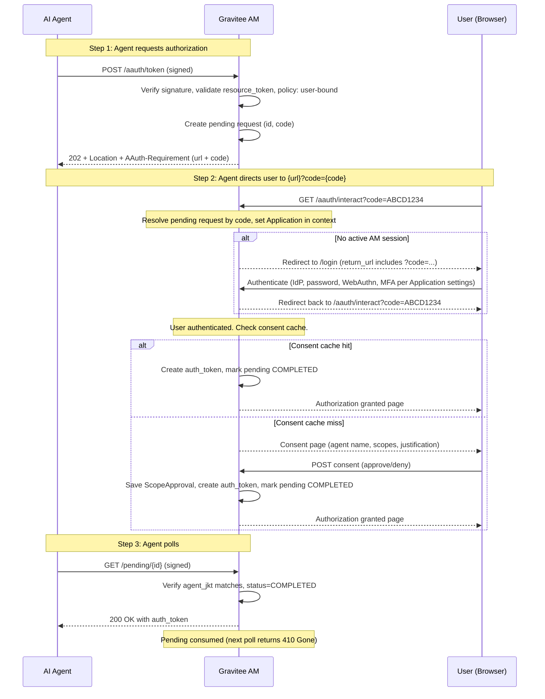
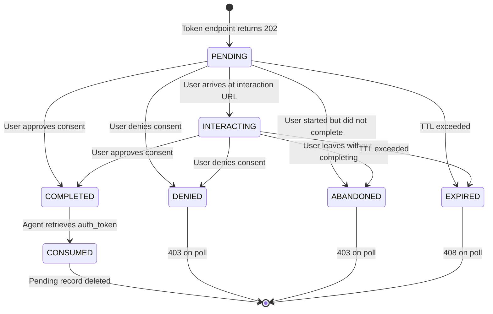

# Phase 8: Deferred Authorization (202 + Pending + User Consent)

## Goal

Implement the user-delegation flow where the auth server cannot issue a token immediately because user consent is required. Instead, it returns `202 Accepted` with a pending URL and an interaction code. The user visits the interaction URL to approve/deny, while the agent polls the pending URL until the decision is made. This is AAUTH's equivalent of the OAuth 2.0 authorization code flow, but without authorization codes in browser redirects.

```
+------------------+                         +------------------+                         +------------------+
|                  | 1.                      |                  |.                        |                  |
|   AI Agent       |------------------------>| Gravitee AM      |                         |     User         |
|                  | POST /token             |  (Person Server (PS))   |                         |   (Browser)      |
|  https://foo.bar |                         |                  |                         |                  |
|                  |                         |                  |                         |                  |
|                  |<------------------------|                  |                         |                  |
|                  | 2. 202 Accepted         |                  |                         |                  |
|                  |    Location: /pending   |                  |                         |                  |
|                  | AAuth-Requirement=      |                  |                         |                  |
|                  | interaction;code="ABCD" |                  |                         |                  |
|                  |                         |                  |                         |                  |
|                  |                         |                  | 3.                      |                  |
|                  |                         |                  |<------------------------|                  |
|                  |                         |                  |  GET {url}?code=ABCD    |                  |
|                  |                         |                  |                         |                  |
|                  |                         |                  |------------------------>|                  |
|                  |                         |                  | 4. Consent page.        |                  |
|                  |                         |                  |                         |                  |
|                  |                         |                  |<------------------------|                  |
|                  |                         |                  | 6. POST consent         |                  |
|                  |                         |                  |    [Yes] [No]           |                  |
|                  |------------------------>|                  |                         |                  |
|                  | 7. GET /pending/{id}    |                  |                         |                  |
|                  |    (polling)            |                  |                         |                  |
|                  |                         |                  |                         |                  |
|                  |<------------------------|                  |                         |                  |
|                  | 8. 200 OK + auth_token  |                  |                         |                  |
|                  |                         |                  |                         |                  |
+------------------+                         +------------------+                         +------------------+
```

This is one of the most important AAUTH flows -- it enables **user-delegated** access where the agent acts **on behalf of** a user with their explicit consent.

## Discovery

**Specification references:**
- AAUTH Protocol spec: [Section 12 -- Deferred Responses](https://github.com/dickhardt/AAuth) -- 202 Accepted, pending URLs, polling, terminal responses, state machine
- AAUTH Protocol spec: [Section 13.3 -- Person Server (PS) Response](https://github.com/dickhardt/AAuth) -- 202 response with AAuth-Requirement header and JSON body
- AAUTH Protocol spec: [Section 13.5 -- User Interaction](https://github.com/dickhardt/AAuth) -- How the agent constructs the user-facing URL `{url}?code={code}` and optional `&callback={callback_url}`
- AAUTH Headers spec: [Section 4.5 -- Interaction Required](https://github.com/dickhardt/AAuth) -- `AAuth-Requirement: requirement=interaction; url="..."; code="..."`
- AAUTH Headers spec: [Section 4.6 -- Approval Pending](https://github.com/dickhardt/AAuth) -- `AAuth-Requirement: requirement=approval` (polling phase)

**Dependency on Phase 4:** the deferred flow is only triggered for **user-bound** token requests, which by definition come from non-pseudonymous agents. Phase 4's `AAuthAgentRegistry` has already resolved the `Application(type=AAUTH_AGENT)` and stashed it on the routing context. Pending request entries created here reference `Application.id` (the actor) alongside the user, agent metadata URL, scope, and clarification state. The `ScopeApproval.clientId` cache key continues to use the agent metadata URL string (a plain `String` column on the existing OIDC `ScopeApproval` row), exactly as Phase 4 documents in its audit attribute schema -- the cache lookup works whether or not Phase 4 has materialized the `Application`, but every consent-grant audit event MUST point at the resolved `Application.id` as actor. Pseudonymous agents never reach this code path because the Phase 6 token endpoint refuses them upstream with `403 reason=pseudonymous_user_binding`.

**Important:** The AAUTH spec does NOT define any specific URL path for the user interaction endpoint. The auth server publishes its own URL via the `url` parameter of the `AAuth-Requirement` header. The path used by Gravitee AM (e.g. `/aauth/interact`) is an **implementation detail**, not a spec requirement. The spec only mandates:
- The auth server returns `url` and `code` in the AAuth-Requirement header
- The agent constructs the user-facing URL as `{url}?code={code}`
- The agent MAY append `&callback={callback_url}` if it has a `callback_endpoint` in its metadata

Similarly, the pending URL path (`/aauth/pending/{id}`) is implementation-defined; the spec only requires the auth server to return a `Location` header pointing to a pending URL on the same origin.

## Design

### Complete Deferred Authorization Flow



### Pending Request Lifecycle



Per [spec Section 12.2](https://github.com/dickhardt/AAuth), the spec defines two visible polling states: `pending` (waiting for user action) and `interacting` (user has arrived at the interaction endpoint). The agent uses the `interacting` status to stop prompting the user.

### Pending Endpoint Response Matrix

Per [Protocol spec Section 12.4 -- Terminal Responses](https://github.com/dickhardt/AAuth) and [Section 12.2 -- Pending Response](https://github.com/dickhardt/AAuth):

| Internal State | HTTP Code | Body fields (per Section 12.2) | Headers |
|----------------|-----------|--------------------------------|---------|
| Pending (waiting) | 202 | `status: "pending"`, `location`, optional `requirement: "approval"` | `Location`, `Retry-After`, `Cache-Control: no-store` |
| Interacting (user arrived) | 202 | `status: "interacting"`, `location` | `Location`, `Retry-After`, `Cache-Control: no-store` |
| Completed | 200 | `auth_token`, `expires_in` | `Cache-Control: no-store` |
| Denied / abandoned | 403 | `error: "denied"` or `error: "abandoned"` | -- |
| Expired | 408 | `error: "expired"` | -- |
| Gone (invalid code) | 410 | `error: "invalid_code"` | -- |
| Rate limited | 429 | `error: "slow_down"` | `Retry-After` |

**Note:** Per [spec Section 12.4](https://github.com/dickhardt/AAuth), terminal status codes are: 200, 400, 401, 402, 403, 408, 410, 429, 500, 503. Status 202 means the request is still pending. Default polling interval is 5 seconds (per Section 12.3).

## Implementation

### Implementation-Defined URLs

The AAUTH spec does not mandate specific URL paths for the pending endpoint or the user interaction endpoint -- both are at the auth server's discretion. Gravitee AM will use:

| Purpose | Path (implementation choice) | Spec requirement |
|---------|------------------------------|------------------|
| Pending URL | `/{domain}/aauth/pending/{id}` | Returned in `Location` header; same origin as auth server (Section 12.2) |
| User interaction URL | `/{domain}/aauth/interact` | Published in `url` parameter of `AAuth-Requirement` header (Section 13.5 / Headers spec 4.5) |

### Files to Create

```
aauth/
  model/
    AAuthPendingRequest.java             -- Pending request entity
    PendingRequestStatus.java            -- Enum: PENDING, INTERACTING, COMPLETED, DENIED, ABANDONED, EXPIRED
  service/pending/
    AAuthPendingRequestService.java      -- CRUD + lifecycle management
    InMemoryPendingRequestStore.java     -- ConcurrentHashMap-based store
  resources/handler/
    AAuthInteractionResolveHandler.java  -- Resolves pending request by code, sets Application in CLIENT_CONTEXT_KEY
  resources/endpoint/
    AAuthPendingEndpoint.java            -- GET/POST/DELETE /{domain}/aauth/pending/:id (polling + clarification + cancel)
    AAuthInteractionConsentHandler.java  -- GET /{domain}/aauth/interact (consent cache check + render)
    AAuthInteractionPostEndpoint.java    -- POST /{domain}/aauth/interact (consent submission)
  resources/
    templates/
      aauth_consent.html                 -- Thymeleaf consent page template
```

### Files to Modify

```
aauth/
  AAuthProvider.java                     -- Add /pending/:id, /interact routes
  resources/endpoint/
    AAuthTokenEndpoint.java              -- Return 202 when consent required
  spring/AAuthConfiguration.java         -- Register pending service beans
```

### Key Implementation Details

**AAuthPendingRequest.java:**
```java
public class AAuthPendingRequest {
    private String id;                    // UUID
    private PendingRequestStatus status;  // PENDING, COMPLETED, DENIED, EXPIRED
    private String agentId;               // Verified agent identity
    private String agentJkt;              // JWK Thumbprint of agent's key (for verification)
    private PublicKey agentPublicKey;      // Agent's signing key (for cnf.jwk)
    private String resourceId;            // Target resource (from resource token or null)
    private String scope;                 // Requested scopes
    private String interactionCode;       // Short human-readable code (e.g., "XKCD-4287")
    private String authToken;             // Populated when COMPLETED
    private Instant createdAt;
    private Instant expiresAt;
}
```

**AAuthPendingRequestService.java:**
```java
public class AAuthPendingRequestService {
    private final ConcurrentHashMap<String, AAuthPendingRequest> store = new ConcurrentHashMap<>();
    
    public AAuthPendingRequest create(String agentId, String agentJkt, 
            PublicKey agentKey, String resourceId, String scope, int ttlSeconds) {
        AAuthPendingRequest req = new AAuthPendingRequest();
        req.setId(UUID.randomUUID().toString());
        req.setStatus(PENDING);
        req.setInteractionCode(generateInteractionCode()); // "ABCD-1234"
        req.setExpiresAt(Instant.now().plusSeconds(ttlSeconds));
        // ... set other fields
        store.put(req.getId(), req);
        return req;
    }
    
    public AAuthPendingRequest getAndConsume(String id, String agentJkt) {
        AAuthPendingRequest req = store.get(id);
        if (req == null) return null;
        if (req.getExpiresAt().isBefore(Instant.now())) {
            req.setStatus(EXPIRED);
            store.remove(id);
            return req;
        }
        if (!req.getAgentJkt().equals(agentJkt)) {
            throw new ForbiddenException("Agent key mismatch");
        }
        if (req.getStatus() == COMPLETED) {
            store.remove(id); // consume once
        }
        return req;
    }
    
    public void approve(String interactionCode, String userId) { ... }
    public void deny(String interactionCode) { ... }
}
```

**AAuthTokenEndpoint** -- 202 branch (per [spec Section 13.3](https://github.com/dickhardt/AAuth)):

The response must match the format defined in the spec. Per the 2026-04-09 spec, `requirement` and `code` belong in the `AAuth-Requirement` **header only** — the JSON body contains just `status`:
```
HTTP/1.1 202 Accepted
Location: /pending/abc123
Retry-After: 0
Cache-Control: no-store
AAuth-Requirement: requirement=interaction; url="https://am.gravitee.io/.../aauth/interact"; code="ABCD1234"
Content-Type: application/json

{
  "status": "pending"
}
```

```java
// Entry point for user-bound resource_token flows.
// Called from Phase 6's AAuthTokenEndpoint when policyEvaluator.requiresUserBinding(...)
// returned true. By definition there is no user identity available here -- the
// resource_token (per spec Section 10.1) carries iss, dwk, aud, jti, agent,
// agent_jkt, iat, exp, and optional scope. None of these identify a user.
// The user is only established later, at the interaction endpoint, when a real
// human authenticates to the AS in their own browser.

public void startUserBoundFlow(RoutingContext ctx,
                                VerificationResult agentSig,
                                Application agentApp,
                                ResourceTokenClaims rtClaims) {

    // 1. Policy decision (allow / deny)
    PolicyDecision decision = policyEvaluator.evaluate(
        agentApp, rtClaims.getIss(), rtClaims.getScope(), /* userBound */ true, settings);
    if (decision.isDenied()) {
        ctx.response().setStatusCode(403)
            .putHeader("Content-Type", "application/json")
            .end("{\"error\":\"forbidden\"}");
        return;
    }

    // 2. Create the pending request. It carries everything we know NOW
    //    (the agent identity, the agent's signing-key thumbprint for later
    //    polling validation, the resource, the scope) and a placeholder for
    //    the user identity, which will be filled in at the interaction endpoint.
    AAuthPendingRequest pending = pendingService.create(
        agentApp,
        agentSig.getAgentJkt(),
        agentSig.getPublicKey(),
        rtClaims.getIss(),         // resource
        rtClaims.getScope(),
        /* userId */ null,         // unknown until interaction completes
        settings.getPendingRequestTtl()
    );

    // 3. Return 202 Accepted with the pending URL and the interaction code.
    //    The agent surfaces the URL to a real human (display, redirect, QR
    //    code, etc., per spec Section 13.5).
    String pendingUrl  = baseUrl + "/aauth/pending/" + pending.getId();
    String interactUrl = baseUrl + "/aauth/interact";

    ctx.response()
        .setStatusCode(202)
        .putHeader("Location", pendingUrl)
        .putHeader("Retry-After", "0")
        .putHeader("Cache-Control", "no-store")
        .putHeader("AAuth-Requirement",
            "requirement=interaction; url=\"" + interactUrl + "\"; code=\"" + pending.getInteractionCode() + "\"")
        .putHeader("Content-Type", "application/json")
        .end(json(Map.of(
            "status", "pending"
        )));
}
```

**AAuthInteractionResolveHandler** -- runs BEFORE authentication:

```java
// Resolves the pending request by interaction code and sets the Application
// in CLIENT_CONTEXT_KEY so that the login flow (IdP selection, MFA, WebAuthn,
// registration, password policy) is configured for this specific agent.

public class AAuthInteractionResolveHandler implements Handler<RoutingContext> {

    public void handle(RoutingContext ctx) {
        String code = ctx.request().getParam("code");
        if (code == null) {
            ctx.response().setStatusCode(400).end("{\"error\":\"missing_code\"}");
            return;
        }

        AAuthPendingRequest pending = pendingService.findByInteractionCode(code);
        if (pending == null || pending.getState() == EXPIRED) {
            ctx.response().setStatusCode(410).end("{\"error\":\"invalid_code\"}");
            return;
        }

        // CLIENT_CONTEXT_KEY ("client") is the standard AM context key that the
        // login flow, IdP selection, MFA policy evaluation, and consent service
        // all read from. By setting it here, every user-facing auth feature
        // configured on this Application(type=AAUTH_AGENT) via Phase 5's UI
        // applies automatically.
        ctx.put("aauth.pending", pending);
        ctx.put(CLIENT_CONTEXT_KEY, pending.getAgentApp());
        ctx.next();
    }
}
```

**AAuthInteractionConsentHandler** -- runs AFTER authentication:

```java
// By this point:
//   1. AAuthInteractionResolveHandler has resolved the pending request and set
//      the Application in CLIENT_CONTEXT_KEY
//   2. AuthenticationFlowHandler has ensured the user is authenticated (via
//      login redirect if needed — IdP, MFA, WebAuthn, registration all handled
//      by the standard AM login flow)
//   3. ctx.user() is populated with the authenticated AM User

public void handle(RoutingContext ctx) {
    AAuthPendingRequest pending = ctx.get("aauth.pending");
    io.gravitee.am.model.User user = ctx.user().getDelegate();

    pending.setUserId(user.getId());
    pending.setState(INTERACTING);

    // Consent cache check (see Phase 7 "Scope validation")
    Set<String> requestedScopes = parseScopes(pending.getScope());
    Application agentApp = pending.getAgentApp();

    userConsentService.checkConsent(agentApp, user)
        .subscribe(approvedScopes -> {
            if (approvedScopes.containsAll(requestedScopes)) {
                String authToken = tokenService.createAuthToken(
                    pending.getResourceId(),
                    agentApp,
                    pending.getAgentPublicKey(),
                    pending.getScope(),
                    user.getId());
                pendingService.approve(pending, authToken);
                renderApprovedPage(ctx, pending);
                return;
            }
            renderConsentScreen(ctx, pending, requestedScopes, approvedScopes);
        });
}

// In AAuthInteractionPostEndpoint, after the user clicks Approve:
//   1. userConsentService.saveConsent(agentApp, newApprovals, user)
//   2. String authToken = tokenService.createAuthToken(..., sub = user.getId())
//   3. pendingService.approve(pending, authToken)
//   4. The agent's next poll on the pending URL returns the auth_token.
```

### Reusing `UserConsentService` and `ScopeApproval` from OIDC

Per Phase 7's "Scope validation" section, AAUTH plugs into Gravitee AM's existing OIDC scope-validation pipeline rather than introducing its own consent persistence layer:

- **Cache check** (at the interaction endpoint, after the user has authenticated to AM): `userConsentService.checkConsent(agentApp, user)` returns the set of scopes the user has previously approved for this agent. If it covers all requested scopes, the consent screen is skipped, the pending request is marked approved, and the agent's next poll returns the auth_token directly.
- **Cache write** (at the interaction POST endpoint, after the user clicks Approve): `userConsentService.saveConsent(agentApp, approvals, principal)` persists `ScopeApproval` rows whose expiry is computed from the same fallback chain OIDC uses (per-domain `Scope.expiresIn`, then the handler-wide default of 1 month).

The cache lives in the interaction endpoint, not in the token endpoint. The token endpoint cannot run a cache check because the resource_token (per [spec Section 10.1](https://github.com/dickhardt/AAuth)) carries no user claim, so there is no user to key the lookup on. Every fresh user-bound `POST /aauth/token` therefore returns 202 Accepted -- the cache is a "skip the consent screen for a returning user who is already standing in front of the AS" optimization, not a "let the agent skip the interactive flow entirely" mechanism.

The `client` parameter on `UserConsentService` methods is typed as `Client`. In AAUTH, the `Application(type=AAUTH_AGENT)` that Phase 4's `AAuthAgentRegistry` resolved for the calling agent serves this role -- its `clientId` is the agent metadata URL (e.g. `https://travel.acme.com/.well-known/aauth-agent.json`), which becomes the `ScopeApproval.clientId` value. No virtual or throwaway object is needed; the same real Application that admins see in the management console is the one keying the consent cache. The `ScopeApproval` rows are stored in the same table OIDC uses; they can be inspected and revoked through Gravitee AM's existing Management API for `ScopeApproval`, exactly the same way OIDC consents are managed today.

This approach means:

- **Zero new persistence**, zero new schemas, zero new admin tooling for managing AAUTH consents.
- **Admins can pre-seed consents** for known (user, agent, scope) tuples through the existing OIDC `ScopeApproval` Management API.
- **A user who has approved an AAUTH agent stays approved** for the cache lifetime, just like OIDC. They are not nagged on every visit to the interaction endpoint for the same (agent, scope) tuple.
- **Revoking an AAUTH consent** is the same operation as revoking an OIDC consent: delete the `ScopeApproval` row.

If you ever need a "consent forever" approval, set `Scope.expiresIn` to a very large value on the relevant `Scope` entity in the AM domain. There is no AAUTH-specific knob to add.

**AAuthPendingEndpoint** (polling) -- response bodies follow [spec Section 12.2](https://github.com/dickhardt/AAuth):
```java
public void handle(RoutingContext ctx) {
    String pendingId = ctx.pathParam("id");
    VerificationResult agentSig = ctx.get("aauth.verification");
    String agentJkt = computeJwkThumbprint(agentSig.getPublicKey());
    
    AAuthPendingRequest pending = pendingService.getAndConsume(pendingId, agentJkt);
    String pendingUrl = baseUrl + "/aauth/pending/" + pendingId;
    
    if (pending == null) {
        // Spec Section 12.4: 410 Gone -- permanently invalid
        ctx.response().setStatusCode(410)
            .putHeader("Content-Type", "application/json")
            .end("{\"error\":\"invalid_code\"}");
        return;
    }
    
    switch (pending.getStatus()) {
        case PENDING:
            // Spec Section 12.2: status=pending, location required
            ctx.response().setStatusCode(202)
                .putHeader("Location", pendingUrl)
                .putHeader("Retry-After", "5")
                .putHeader("Cache-Control", "no-store")
                .putHeader("Content-Type", "application/json")
                .end(json(Map.of("status", "pending", "location", pendingUrl)));
            break;
        case INTERACTING:
            // Spec Section 12.2: status=interacting when user has arrived
            ctx.response().setStatusCode(202)
                .putHeader("Location", pendingUrl)
                .putHeader("Retry-After", "5")
                .putHeader("Cache-Control", "no-store")
                .putHeader("Content-Type", "application/json")
                .end(json(Map.of("status", "interacting", "location", pendingUrl)));
            break;
        case COMPLETED:
            // Spec Section 12.4: 200 = Success, body contains auth_token
            ctx.response().setStatusCode(200)
                .putHeader("Cache-Control", "no-store")
                .putHeader("Content-Type", "application/json")
                .end(json(Map.of("auth_token", pending.getAuthToken(), "expires_in", ttl)));
            break;
        case DENIED:
            // Spec Section 12.4: 403 Denied
            ctx.response().setStatusCode(403)
                .putHeader("Content-Type", "application/json")
                .end("{\"error\":\"denied\"}");
            break;
        case ABANDONED:
            ctx.response().setStatusCode(403)
                .putHeader("Content-Type", "application/json")
                .end("{\"error\":\"abandoned\"}");
            break;
        case EXPIRED:
            // Spec Section 12.4: 408 Expired
            ctx.response().setStatusCode(408)
                .putHeader("Content-Type", "application/json")
                .end("{\"error\":\"expired\"}");
            break;
    }
}
```

**Route registration in AAuthProvider:**
```java
// Pending endpoint -- spec requires signature-protected polling
// Path is implementation-defined; spec only requires it to be on the same origin
aAuthRouter.route(HttpMethod.GET, "/pending/:id")
    .handler(signatureHandler)
    .handler(pendingEndpoint);

// Clarification (POST) and cancel (DELETE) on the same pending URL (spec Section 13.4.2)
aAuthRouter.route(HttpMethod.POST, "/pending/:id")
    .handler(bodyHandler)
    .handler(signatureHandler)
    .handler(pendingPostEndpoint);
aAuthRouter.route(HttpMethod.DELETE, "/pending/:id")
    .handler(signatureHandler)
    .handler(pendingDeleteEndpoint);

// User interaction endpoint. The handler chain mirrors the OIDC authorization
// flow's authentication pipeline: resolve the Application first (so the login
// page knows which IdPs, MFA policies, etc. to apply), then authenticate the
// user via the standard AM login flow, then run the AAUTH consent logic.
// Path is implementation-defined (spec Section 13.5 / Headers spec 4.5).
aAuthRouter.route(HttpMethod.GET, "/interact")
    .handler(sessionHandler)
    .handler(interactionResolveHandler)    // resolve pending request by code,
                                           // put Application in CLIENT_CONTEXT_KEY
    .handler(authenticationFlowHandler)    // reused from OIDC: redirect to /login
                                           // if no active session
    .handler(interactionConsentHandler);   // consent cache check + render

aAuthRouter.route(HttpMethod.POST, "/interact")
    .handler(bodyHandler)
    .handler(sessionHandler)
    .handler(interactionPostEndpoint);
```

### Reusing the AM login flow for user authentication

The interaction endpoint does NOT implement its own login, IdP selection, MFA, WebAuthn, or registration flows. Instead, it reuses Gravitee AM's standard login pipeline by inserting `AuthenticationFlowHandler` (the same handler that `OAuth2Provider` uses in the OIDC `/authorize` chain) into the interaction route's handler chain.

When a user arrives at `GET /aauth/interact?code=...` without an active AM session, `AuthenticationFlowHandler` stores the full URL (including the `?code=...` parameter) as the return URL and redirects to `/login`. The user then goes through AM's standard login flow — which IdPs are shown, whether MFA is required, whether WebAuthn is offered, whether registration is allowed — all determined by the `Application(type=AAUTH_AGENT)` that `AAuthInteractionResolveHandler` placed in `CLIENT_CONTEXT_KEY` before the redirect. After the user completes authentication, AM redirects back to the original interaction URL. On this second pass, `AuthenticationFlowHandler` sees the active session and calls `ctx.next()`, reaching `AAuthInteractionConsentHandler`.

This means every user-facing auth feature that an admin configures on the AAUTH agent Application (via Phase 5's management UI tabs — Identity Providers, MFA, Login, User Accounts, Password Policy) applies automatically. No AAUTH-specific code is needed for any of them.

### Consent Page Template

The consent page is rendered by Gravitee AM at the implementation-defined interaction URL. It shows the agent's identity, requested scopes, and (if provided) the agent's `justification` (per [spec Section 13.2](https://github.com/dickhardt/AAuth)). Once the user submits, the agent receives the auth token via polling -- the user is NOT redirected back to the agent unless the agent provided a `callback_endpoint` in its metadata (per [spec Section 13.5](https://github.com/dickhardt/AAuth)).

```html
<!-- aauth_consent.html (Gravitee AM implementation) -->
<div class="consent-container">
    <h2>Authorization Request</h2>
    <p>Agent <strong>{{agentClientName}}</strong> ({{agentId}}) is requesting access to:</p>
    <ul>
        {{#each scopes}}
        <li>{{description}}</li>
        {{/each}}
    </ul>
    {{#if justification}}
    <p><strong>Reason:</strong> {{justification}}</p>
    {{/if}}
    <form method="POST" action="{{interactionUrl}}">
        <input type="hidden" name="code" value="{{interactionCode}}"/>
        <button type="submit" name="accept" value="true">Approve</button>
        <button type="submit" name="accept" value="false">Deny</button>
    </form>
</div>
```

## Validation

### Unit Tests

Add the following `*Test.java` classes under `gravitee-am-gateway-handler-aauth/src/test/java/io/gravitee/am/gateway/handler/aauth/`. This is the largest unit-test bundle of the project because Phase 8 introduces a complex stateful service plus four new HTTP routes.

**`service/pending/AAuthPendingRequestServiceTest`** (`@RunWith(MockitoJUnitRunner.class)`)
- `shouldCreatePendingRequest_withGeneratedIdAndInteractionCode()`.
- `shouldStoreAgentJktForLaterMatching()`.
- `shouldExpireAfterTtl()` -- uses a mocked clock; entries past TTL transition to `EXPIRED`.
- `shouldReturnNull_whenIdUnknown()`.
- `shouldThrowForbiddenException_onAgentJktMismatch()`.
- `shouldConsumeOnceOnCompletedRetrieval()` -- after a 200, the next call returns null (or the gone marker).
- `shouldTransitionToInteracting_whenUserArrivesAtInteractionUrl()`.
- `shouldHonorPreferWaitHeader_forLongPolling()` -- given `Prefer: wait=5`, the call blocks for up to 5 seconds before returning if still pending; returns immediately on state change.
- `shouldRateLimit_andReturnSlowDown()` -- after configured threshold of polls, subsequent polls are rejected.
- `shouldGenerateUnguessablePendingId()` -- IDs are UUIDs (or equivalent), not sequential.
- `shouldGenerateHumanReadableInteractionCode()` -- e.g. `XKCD-4287` format, single-use.

**`resources/endpoint/AAuthPendingEndpointTest`** (`extends RxWebTestBase`)
- For each row of the response matrix in the phase design, one test method:
- `shouldReturn202PendingStatus_withLocationHeader()`.
- `shouldReturn202InteractingStatus_whenUserArrived()`.
- `shouldReturn200WithAuthToken_whenCompleted()`.
- `shouldIncludeCacheControlNoStore_on200()`.
- `shouldReturn403Denied_whenUserDenied()`.
- `shouldReturn403Abandoned_whenUserStartedButDidNotComplete()`.
- `shouldReturn408Expired_whenTtlExceeded()`.
- `shouldReturn410Gone_whenConsumed()`.
- `shouldReturn410Gone_whenIdUnknown()`.
- `shouldReturn429SlowDown_whenRateLimited()`.
- `shouldReturn403_whenAgentJktMismatch()`.
- `shouldOmitAAuthRequirementAndAAuthErrorHeaders_on403()` -- per Headers spec Section 6.3.
- `shouldHonorPreferWaitHeader()` -- requests with `Prefer: wait=5` block until terminal or 5s.

**`resources/endpoint/AAuthInteractionEndpointTest`** (`extends RxWebTestBase`)
- `shouldRenderConsentPage_withAgentNameAndScopes()` -- the response HTML body contains the agent name and the requested scopes.
- `shouldDisplayJustificationFromTokenRequest()` -- per spec Section 13.2.
- `shouldDisplayClientNameAndLogoUri_fromAgentMetadata()`.
- `shouldDisplayScopeDescriptions_fromResourceMetadata()` -- when present.
- `shouldSanitizeMarkdownInJustification()` -- per spec Section 3, no script tags or unsafe HTML in output.
- `shouldReturn404_whenInteractionCodeUnknown()`.
- `shouldConstructCallbackUrl_whenAgentMetadataHasCallbackEndpoint()` -- per spec Section 13.5.

**`resources/endpoint/AAuthInteractionPostEndpointTest`** (`extends RxWebTestBase`)
- `shouldApprovePendingRequest_andReturn200()` -- form post with `accept=true`.
- `shouldDenyPendingRequest_andReturn200()` -- form post with `accept=false` transitions pending to `DENIED`.
- `shouldRedirectToCallbackEndpoint_whenAgentMetadataProvidesIt()`.
- `shouldDisplayCompletionPage_whenNoCallbackProvided()`.

**`resources/endpoint/AAuthTokenEndpointDeferredBranchTest`** (`extends RxWebTestBase`)
- Mounts the token endpoint with a policy evaluator that returns `CONSENT_REQUIRED` and a stub `UserConsentService` whose `checkConsent` returns an empty set (no cached approvals).
- `shouldReturn202Accepted_whenUserBoundAndNoCachedApproval()`.
- `shouldIncludeLocationHeader_pointingToPendingUrl()`.
- `shouldIncludeRetryAfterHeader()`.
- `shouldIncludeCacheControlNoStore()`.
- `shouldIncludeAAuthRequirementHeader_withRequirementInteractionUrlAndCode()` -- header value matches the spec example exactly.
- `shouldUseImplementationDefinedInteractionUrl_publishedVerbatimInUrlParameter()`.
- `shouldIncludeBodyFields_statusLocationRequirementCode()` -- matches the example in spec Section 13.3.
- `shouldFallBackToImmediateGrant_whenNotUserBound()` -- pure machine path (no sub) is unaffected.
- `shouldHandleApprovalFlow_whenRequirementIsApproval()` -- direct-contact flow per Headers spec 4.6: response has `requirement=approval`, no `url`/`code`.

**`resources/endpoint/AAuthTokenEndpointConsentCacheBypassTest`** (`extends RxWebTestBase`) -- new in this phase
- Tests that a user-bound request bypasses the 202 deferred flow when a still-valid `ScopeApproval` already covers all requested scopes. This is the "frictionless second run" path that mirrors how OIDC handles cached consents.
- `shouldReturn200Immediately_whenScopeApprovalCoversAllRequestedScopes()` -- pre-seed a `ScopeApproval` for `(domain, alice, http://agent:9000, calendar.read)` via `TestScopeApprovalSeeder`, then send a token request and assert 200 OK (no 202).
- `shouldReturn202_whenScopeApprovalIsExpired()` -- pre-seed an expired `ScopeApproval`, assert the deferred flow runs.
- `shouldReturn202_whenScopeApprovalCoversOnlySomeRequestedScopes()` -- multi-scope request where one scope is cached and one is not; assert the deferred flow runs (not a partial-grant).
- `shouldReturn202_whenScopeApprovalIsForADifferentAgent()` -- the cache key includes the agent identity URL; an approval for a different agent does not bypass.
- `shouldReturn202_whenScopeApprovalIsForADifferentUser()` -- the cache key includes the user identifier; an approval for a different user does not bypass.
- `shouldNotInspectAAuthSettings_forCacheDecision()` -- the bypass decision depends only on the existing `ScopeApproval` rows, not on any field of `AAuthSettings`. Regression guard against re-introducing a domain-level "consent bypass" knob.
- `shouldPersistScopeApproval_afterUserApproves()` -- on the user-approval path, asserts that `userConsentService.saveConsent(...)` is called with the agent identity URL as the `clientId` and the requested scopes as the approval set, so subsequent requests will be cached.

**`model/AAuthPendingRequestTest`**
- `shouldExposeAllFields()`.
- `shouldImplementEqualsByIdOnly()` (or similar -- depends on chosen identity semantics).

### Test Fixtures

Adds to `gravitee-am-gateway-handler-aauth/src/test/java/io/gravitee/am/gateway/handler/aauth/test/fixtures/`:

- `TestPendingRequestStore` -- in-memory `AAuthPendingRequestService` pre-seeded with requests in known states (`PENDING`, `INTERACTING`, `COMPLETED`, `DENIED`, `ABANDONED`, `EXPIRED`). Used by handler tests to short-circuit setup.
- `TestClock` -- mockable clock injected into `AAuthPendingRequestService` for TTL/long-poll testing without `Thread.sleep`.
- `TestConsentPageRenderer` -- minimal stub of the Thymeleaf renderer that captures the model passed to the template, so tests can assert which fields the consent page would display without parsing HTML.
- `TestScopeApprovalSeeder` -- helper that builds a stub `UserConsentService` (or pre-populates an in-memory `ScopeApprovalService`) with `ScopeApproval` rows for arbitrary `(domain, userId, agentIdentityUrl, scope, expiry)` tuples. Lets tests assert the cache-bypass path without going through the full consent flow. Also exposes `assertScopeApprovalPersisted(userId, agentIdentityUrl, scope)` for verifying that the post-approval handler wrote a new row. Used by `AAuthTokenEndpointConsentCacheBypassTest` and reused by Phase 16's smoke test setup.

### Checklist

**Spec-mandated behavior** (per [Protocol spec Section 12](https://github.com/dickhardt/AAuth), [Section 13.3](https://github.com/dickhardt/AAuth), [Section 13.5](https://github.com/dickhardt/AAuth), and [Headers spec Section 4.5](https://github.com/dickhardt/AAuth)):

- [ ] Token request with consent-requiring scope returns `202 Accepted`
- [ ] 202 response includes `Location` header pointing to a pending URL on the same origin (Section 12.2)
- [ ] 202 response includes `Retry-After` header (Section 12.2)
- [ ] 202 response includes `Cache-Control: no-store` header (Section 12.2)
- [ ] 202 response includes `AAuth-Requirement: requirement=interaction; url="..."; code="..."` header (Section 13.3, Headers 4.5)
- [ ] 202 response body contains `status`, `location`, `requirement`, `code` fields per spec (Section 12.2, 13.3)
- [ ] Polling the pending URL returns `202` with `status: "pending"` while waiting (Section 12.2)
- [ ] Pending URL returns `status: "interacting"` once the user has arrived at the interaction URL (Section 12.2)
- [ ] After approval, polling the pending URL returns `200 OK` with `auth_token` and `expires_in` (Section 12.4, 13.3)
- [ ] Denied request returns `403` (Section 12.4, terminal responses table)
- [ ] Expired request returns `408` (Section 12.4)
- [ ] Invalid/consumed pending URL returns `410 Gone` (Section 12.4)
- [ ] `Prefer: wait=N` header supported for long-polling (Section 12.3)
- [ ] Rate limiting returns `429 Too Many Requests`; agent must add 5s linear backoff (Section 12.3)
- [ ] Polling uses `GET` to the pending URL (Section 12.3); agent does NOT resend original request body
- [ ] Pending URL is signature-protected; only the original agent (matching `agent_jkt`) can poll
- [ ] Auth token from deferred flow includes `sub` (user identity) when consent established a user
- [ ] Self-authorization (Phase 8, no user binding) still gets immediate 200 response and never triggers the deferred flow

**Consent cache** (reuses OIDC's `UserConsentService` and `ScopeApproval`, see Phase 7 "Scope validation" section):

- [ ] Token endpoint always returns 202 for user-bound flows (no upfront cache check, because the user is unknown at this point -- the resource_token carries no user claim per spec Section 10.1)
- [ ] Interaction endpoint calls `userConsentService.checkConsent(agentApp, user)` AFTER the user has authenticated to AM, where `agentApp` is the real `Application(type=AAUTH_AGENT)` from Phase 4 (its `clientId` is the agent metadata URL)
- [ ] If the cached `ScopeApproval` rows cover ALL requested scopes (and have not expired), the consent screen is skipped, the pending request is marked approved, and the agent's next poll returns the auth_token
- [ ] If the cached approvals do not cover all requested scopes, the consent screen is shown
- [ ] On user approval, call `userConsentService.saveConsent(agentApp, approvals, user)`, persisting `ScopeApproval` rows so subsequent visits to the interaction endpoint for the same (user, agent, scope) tuple skip the consent screen until expiry
- [ ] Cache expiry follows the OIDC fallback chain: per-domain `Scope.expiresIn` → handler-wide default (1 month)
- [ ] No domain-level "consent bypass" knob is read by the cache-check or consent logic (regression guard against re-introducing `consentRequiredScopes`, `autoApprovedScopes`, etc.)
- [ ] `requirement=approval` flow supported (Headers spec 4.6 -- direct user contact, no agent-side interaction URL)
- [ ] If agent provides `callback_endpoint` in its metadata, the user-facing URL appends `&callback={callback_url}` (Section 13.5)
- [ ] `justification` parameter from token request displayed in consent page (Section 13.2)
- [ ] Markdown content (justification, clarification) sanitized before rendering (Section 3 -- Markdown String)

**Implementation-defined behavior:**

- [ ] Pending URL path (e.g., `/{domain}/aauth/pending/{id}`) is on the same origin as the auth server
- [ ] Interaction URL path (e.g., `/{domain}/aauth/interact`) is published verbatim in the AAuth-Requirement `url` parameter
- [ ] Consent page shows agent's `client_name` and `logo_uri` from agent metadata (parsed in Phase 3)
- [ ] Consent page shows `scope_descriptions` from resource metadata when available (per [spec Section 14.3](https://github.com/dickhardt/AAuth))

### Spec Requirements Added in This Phase

**`Prefer: wait=N` Long-Polling** (per [Protocol spec Section 12.1](https://github.com/dickhardt/AAuth)):
Agent includes `Prefer: wait=45` header on polling requests. Server holds the connection open for up to N seconds before returning 202. Reduces polling overhead.

**Polling Rate Limiting** (per [Protocol spec Section 12.3](https://github.com/dickhardt/AAuth)):
Track polling frequency per pending request. If too frequent, return `429 Too Many Requests` with `Retry-After` header. Agent must increase polling interval by 5 seconds on each 429.

**Approval Flow** (per [Headers spec Section 4.6](https://github.com/dickhardt/AAuth)):
Distinct from `interaction` -- with `requirement=approval`, the AS contacts the user directly (e.g., push notification, email) without the agent directing a user to a URL. The response includes only `Location` and `Retry-After`, no `url` or `code`.

**Callback URL** (per [Protocol spec Section 13.5](https://github.com/dickhardt/AAuth)):
If the agent's metadata includes `callback_endpoint`, construct the interaction URL as `{url}?code={code}&callback={callback_endpoint}`. After user completes consent, redirect to callback URL.

**Token Request Parameters** (per [Protocol spec Section 13.2](https://github.com/dickhardt/AAuth)):
Accept and handle additional optional parameters:
- `justification` (Markdown string): Display in consent page to explain why the agent needs access
- `login_hint`: Hint about which user to authenticate
- `tenant`: Tenant identifier
- `domain_hint`: Domain hint for multi-tenant deployments
