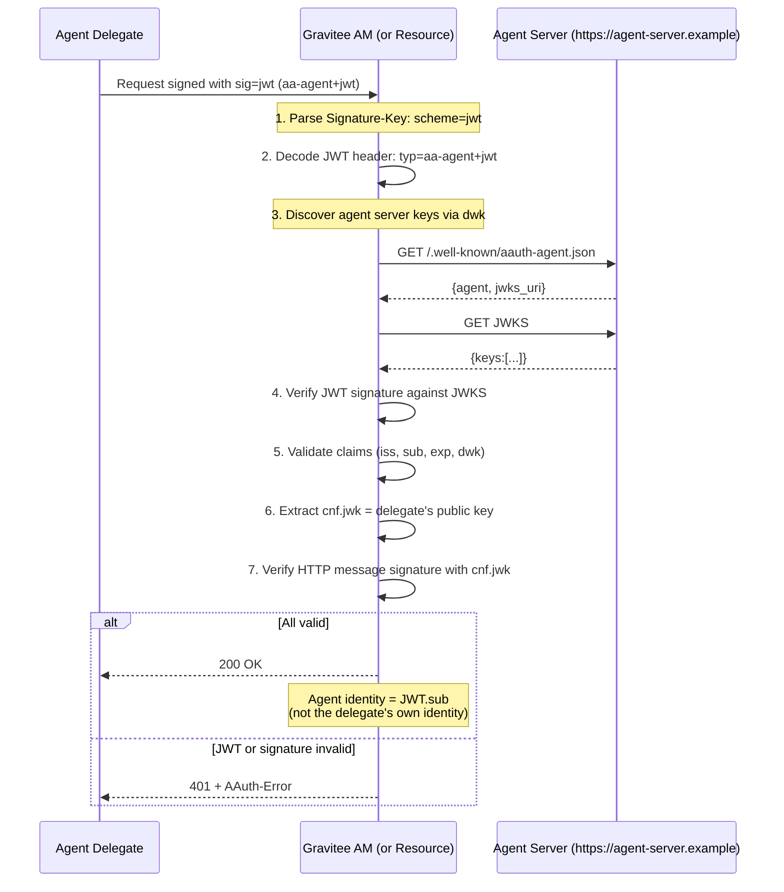
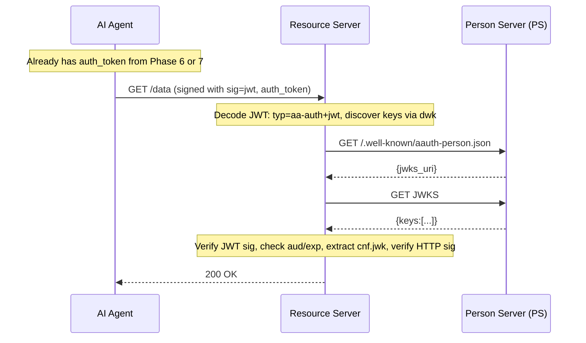

# Phase 9: JWT Signature Scheme + Agent Token Support

## Goal

Add the `jwt` signature scheme where agents present a JWT token (either `aa-agent+jwt` or `aa-auth+jwt`) in the Signature-Key header instead of bare keys or JWKS references. This enables three key capabilities:

1. **PS token endpoint compliance**: Per spec Section 7.1.3, the PS token endpoint requires `scheme=jwt` — the agent must present its agent token. This phase enforces that constraint at all PS endpoints.
2. **Auth token re-presentation**: An agent uses a previously-obtained `aa-auth+jwt` token as its credential when accessing a resource (the resource extracts `cnf.jwk` from the token to verify the message signature).
3. **Agent delegation**: An agent server issues `aa-agent+jwt` tokens to delegate instances, binding each delegate's signing key to the original agent's identity.

```
+------------------+                       +-------------------------+
|                  |                       |                         |
|  Agent Delegate  |  Signature-Key:       |  Resource Server        |
|  (delegate key)  |  sig=jwt;             |  or Person Server (PS)  |
|                  |  jwt="<aa-agent+jwt>" |                         |
|                  |                       |  1. Extract JWT         |
|                  |  The JWT contains:    |  2. Verify JWT          |
|                  |  - iss: agent server  |     signature vs        |
|                  |  - sub: agent id      |     agent JWKS          |
|                  |  - cnf.jwk: delegate  |  3. Extract             |
|                  |    public key         |     cnf.jwk             |
|                  |                       |  4. Verify HTTP         |
|                  |                       |     sig with            |
|                  |                       |     cnf.jwk             |
+------------------+                       +-------------------------+
```

## Discovery

**Specification references:**
- AAUTH Protocol spec: [Section 9 -- Agent Tokens](https://github.com/dickhardt/AAuth) -- Agent tokens (aa-agent+jwt) structure and claims
- AAUTH Protocol spec: [Section 11 -- Auth Tokens](https://github.com/dickhardt/AAuth) -- Auth tokens used as credentials
- AAUTH Protocol spec: [Section 15 -- Request Verification](https://github.com/dickhardt/AAuth) -- Verifying JWT-based signatures
- AAUTH Headers spec: [Section 5.2 -- Keying Material](https://github.com/dickhardt/AAuth) -- `jwt` scheme in Signature-Key
- AAUTH Protocol spec: [Appendix A -- Agent Token Acquisition Patterns](https://github.com/dickhardt/AAuth) -- How agents obtain tokens

**Dependency on Phase 4:** the `jwt` scheme is the mechanism that enables [Scenario 2 (delegated multi-instance) and Scenario 4 (centralized brand, distributed user-installed processes)](./04-agent-application-lifecycle.md) -- many short-lived per-process keypairs all rolling up to one stable Agent Server identity. Phase 4's `AAuthAgentRegistry` resolves the canonical Agent Server URL via a per-scheme strategy: for `hwk`/`jwks_uri` requests it reads the `dwk` parameter on the Signature-Key header, and for `jwt` requests it reads the `iss` claim of the verified `aa-agent+jwt` (NOT the per-process signing key). Both paths feed the same registry, so a hundred pods sharing one Agent Server become one `Application(type=AAUTH_AGENT)` row, with each pod's signing-key thumbprint recorded as the `agent_jkt` audit attribute on its individual token-issuance event. The registration of the `jwt` resolver strategy (`JwtSchemeUrlResolver`) is part of this phase's wiring.

## Design

### Agent Token Structure (`aa-agent+jwt`)

```json
// Header
{"typ": "aa-agent+jwt", "alg": "EdDSA", "kid": "agent-server-key-1"}

// Payload (per spec Section 9)
{
  "iss": "https://agent-server.example",    // Agent server (the identity authority)
  "dwk": "aauth-agent.json",               // Well-known metadata document for key discovery
  "sub": "aauth:assistant@agent-server.example",   // Agent identifier (aauth:local@domain, stable across key rotations)
  "jti": "uuid",                            // Unique token ID (REQUIRED)
  "cnf": {                                  // Delegate's signing key
    "jwk": {
      "kty": "OKP", "crv": "Ed25519",
      "x": "delegate-public-key-base64url"
    }
  },
  "iat": 1712345678,
  "exp": 1712432078,                        // SHOULD NOT exceed 24 hours
  "ps": "https://ps.example",               // Optional: agent's Person Server URL
  "aud": ["https://am.gravitee.io/..."]     // Optional audience restriction
}
```

### JWT Scheme Verification Flow



### Auth Token as Credential (sig=jwt with aa-auth+jwt)



## Implementation

### Files to Create

```
aauth/
  signing/
    schemes/
      JWTScheme.java                     -- JWT scheme: extract JWT, verify, get cnf.jwk
  service/token/
    AgentTokenValidator.java             -- Validate aa-agent+jwt tokens
    AuthTokenValidator.java              -- Validate aa-auth+jwt tokens (for re-presentation)
    AAuthAgentTokenService.java          -- Issue aa-agent+jwt tokens (for delegation)
```

### Files to Modify

```
aauth/
  signing/
    schemes/
      SignatureSchemeFactory.java         -- Add "jwt" scheme dispatch
  spring/AAuthConfiguration.java         -- Register new beans
```

### Key Implementation Details

**JWTScheme.java:**
```java
public class JWTScheme implements SignatureScheme {
    
    @Override
    public ResolvedKey resolve(SignatureKeyInfo keyInfo) {
        String jwtString = keyInfo.getParam("jwt");
        
        // 1. Decode header without verification
        JWTHeader header = decodeHeader(jwtString);
        String typ = header.getTyp();  // "aa-agent+jwt" or "aa-auth+jwt"
        
        // 2. Determine verification strategy based on typ
        PublicKey jwtSigningKey;
        String agentIdentity;
        
        if ("aa-agent+jwt".equals(typ)) {
            // Fetch issuer's JWKS and verify
            String iss = decodeClaims(jwtString).get("iss");
            jwtSigningKey = fetchIssuerKey(iss, header.getKid());
            verifySig(jwtString, jwtSigningKey);
            agentIdentity = decodeClaims(jwtString).get("sub"); // Agent identity
        } else if ("aa-auth+jwt".equals(typ)) {
            // Fetch auth server's JWKS and verify
            String iss = decodeClaims(jwtString).get("iss");
            jwtSigningKey = fetchIssuerKey(iss, header.getKid());
            verifySig(jwtString, jwtSigningKey);
            agentIdentity = decodeClaims(jwtString).get("agent"); // Or use agent claim
        } else {
            throw new InvalidJWTException("Unsupported JWT type: " + typ);
        }
        
        // 3. Validate standard claims
        Map<String, Object> claims = decodeClaims(jwtString);
        validateExpiration(claims);
        
        // 4. Extract cnf.jwk (the actual signing key for HTTP message signature)
        Map<String, Object> cnf = (Map) claims.get("cnf");
        Map<String, Object> jwk = (Map) cnf.get("jwk");
        PublicKey signingKey = jwkToPublicKey(jwk);
        
        return new ResolvedKey(signingKey, agentIdentity, null);
    }
}
```

**AgentTokenValidator.java:**
```java
public class AgentTokenValidator {
    
    public AgentTokenInfo validate(String agentToken) {
        // 1. Decode and verify typ=aa-agent+jwt
        // 2. Fetch issuer's JWKS
        // 3. Verify JWT signature
        // 4. Validate claims: iss, sub, cnf.jwk, exp
        // 5. Return AgentTokenInfo(agentId=sub, delegateKey=cnf.jwk, issuer=iss)
    }
}
```

**AAuthAgentTokenService.java** (for future use -- issuing agent tokens for delegated agents):
```java
public class AAuthAgentTokenService {
    
    public String createAgentToken(String agentId, PublicKey delegateKey, 
            List<String> audience, int ttlSeconds) {
        Map<String, Object> claims = Map.of(
            "iss", issuerUrl,
            "sub", agentId,
            "cnf", Map.of("jwk", publicKeyToJwk(delegateKey)),
            "aud", audience,
            "iat", Instant.now().getEpochSecond(),
            "exp", Instant.now().plusSeconds(ttlSeconds).getEpochSecond(),
            "jti", UUID.randomUUID().toString()
        );
        // Sign with domain certificate, set typ=aa-agent+jwt in header
        return jwtService.sign(claims, "aa-agent+jwt");
    }
}
```

## Validation

### Unit Tests

Add the following `*Test.java` classes under `gravitee-am-gateway-handler-aauth/src/test/java/io/gravitee/am/gateway/handler/aauth/`. The agent server is mocked through `MockAgentMetadataServer` (from Phase 3 fixtures).

**`signing/schemes/JWTSchemeTest`** (`@RunWith(MockitoJUnitRunner.class)`, uses WireMock)
- `shouldResolveAgentTokenScheme()` -- given `sig=jwt;jwt="<aa-agent+jwt>"`, decodes the JWT, validates signature against the issuer's JWKS, returns `cnf.jwk` as the signing key.
- `shouldResolveAuthTokenScheme()` -- given `sig=jwt;jwt="<aa-auth+jwt>"`, validates against this AS's keys, returns `cnf.jwk`.
- `shouldExtractAgentIdentityFromAgentTokenSub()` -- agent identity = JWT `sub`, NOT the JWT `iss`.
- `shouldExtractAgentIdentityFromAuthTokenAgentClaim()`.
- `shouldRejectUnknownTyp()` -- typ other than `aa-agent+jwt` or `aa-auth+jwt`.
- `shouldRejectMissingCnfJwk()` -- per spec, the JWT MUST include `cnf.jwk`.
- `shouldRejectExpiredJwt()` -- throws with `expired_jwt` error code.
- `shouldRejectInvalidJwtSignature()` -- throws with `invalid_jwt` error code.

**`service/token/AgentTokenValidatorTest`** (uses WireMock)
- `shouldAcceptValidAgentToken()`.
- `shouldValidateDwkClaim_asAauthAgentJson()` -- per spec Section 15.1.1.
- `shouldRejectMissingDwk()`.
- `shouldRejectWrongDwkValue()`.
- `shouldValidateIssClaim_pointsToAgentServer()`.
- `shouldFetchIssuerJwksViaDwkDiscovery()` -- WireMock asserts the agent server's `/.well-known/aauth-agent.json` was fetched.
- `shouldExtractSubAsAgentIdentity()`.
- `shouldExpose_ps_optionalClaim()` -- per spec Section 9, `ps` is forwarded as user hint.
- `shouldRejectExpiredAgentToken()` -- emits `expired_agent_token` error code (per spec Section 17.3).
- `shouldRejectAgentTokenExpExceeding24Hours()` -- per spec Section 9.

**`service/token/AuthTokenValidatorTest`** (re-presentation case)
- `shouldAcceptAuthTokenIssuedByThisAs()`.
- `shouldValidateDwkClaim_asAauthIssuerJson()` -- per spec Section 15.1.2.
- `shouldRejectAuthTokenIssuedByDifferentAs()`.
- `shouldExtractAgentClaim_asAgentIdentity()`.
- `shouldRejectExpiredAuthToken()` -- when the token is presented as a credential (not for refresh), expired tokens are rejected.

**`service/token/AAuthAgentTokenServiceTest`** (`@RunWith(MockitoJUnitRunner.class)`)
- `shouldCreateAgentTokenWithAllRequiredClaims()` -- asserts `iss`, `dwk: "aauth-agent.json"`, `sub`, `cnf.jwk`, `iat`, `exp` are set.
- `shouldSetTypToAgentJwtInJoseHeader()`.
- `shouldEmbedDelegatePublicKeyInCnfJwk()`.
- `shouldNotExceed24HourMaxLifespan()`.
- `shouldSupportOptionalAudClaim()` -- when an audience restriction is provided.

**`signing/schemes/SignatureSchemeFactoryJwtTest`** (extends Phase 3's factory test)
- `shouldDispatchToJwtScheme_forSchemeNameJwt()`.
- `shouldStillDispatchHwkAndJwksUri_unchanged()`.

**`resources/handler/AAuthSignatureHandlerJwtSchemeTest`** (`extends RxWebTestBase`, uses WireMock)
- `shouldAcceptRequestSignedWithJwtScheme_andValidAgentToken()`.
- `shouldAcceptRequestSignedWithJwtScheme_andValidAuthToken()`.
- `shouldRejectExpiredJwt_withExpiredJwtErrorCode()`.
- `shouldRejectInvalidJwt_withInvalidJwtErrorCode()`.
- `shouldRejectKeyMismatch()` -- HTTP signature uses a different key than the JWT's `cnf.jwk`.
- `shouldStoreAgentIdentityFromJwtSub_inRoutingContext()`.

### Test Fixtures

Adds to `gravitee-am-gateway-handler-aauth/src/test/java/io/gravitee/am/gateway/handler/aauth/test/fixtures/`:

- `TestAgentTokenBuilder` -- mints an `aa-agent+jwt` token with all required claims (`iss`, `dwk`, `sub`, `cnf.jwk`, `iat`, `exp`, optional `aud`, optional `ps`), signed by a configurable issuer key. Used by Phases 8, 12.
- Updates `TestSignatureBuilder` (from Phase 2/3) -- adds the `jwt` scheme variant accepting a pre-built JWT string.
- `TestAuthTokenBuilder` -- a small helper to mint a self-signed `aa-auth+jwt` for tests that need to present an auth token as a credential without going through the full Phase 6 flow.

### Checklist

- [ ] PS token endpoint rejects requests that do not use `scheme=jwt` (per spec Section 7.1.3)
- [ ] `scheme=jwt` with valid `aa-agent+jwt` accepted, agent identity = JWT `sub`
- [ ] `scheme=jwt` with valid `aa-auth+jwt` accepted, agent identity = JWT `agent`
- [ ] JWT signature verified against issuer's JWKS
- [ ] `cnf.jwk` in JWT used to verify HTTP message signature
- [ ] Expired JWT returns 401 with `AAuth-Error: error=expired_jwt`
- [ ] Invalid JWT signature returns 401 with `AAuth-Error: error=invalid_jwt`
- [ ] HTTP signature with wrong key (doesn't match `cnf.jwk`) returns 401
- [ ] HWK and JWKS schemes still work (Phase 2, 3 unchanged)
- [ ] Agent token `dwk` claim validated as `"aauth-agent.json"` (per [spec Section 15.1.1](https://github.com/dickhardt/AAuth))
- [ ] Auth token `dwk` claim validated as `"aauth-person.json"` when presented as credential (per [spec Section 15.1.2](https://github.com/dickhardt/AAuth))
- [ ] `ps` optional claim in agent token forwarded to auth server as user hint (per [spec Section 9](https://github.com/dickhardt/AAuth))
- [ ] Token endpoint error `invalid_agent_token` (400) returned for invalid agent token (per [spec Section 17.3](https://github.com/dickhardt/AAuth))
- [ ] Token endpoint error `expired_agent_token` (400) returned for expired agent token
