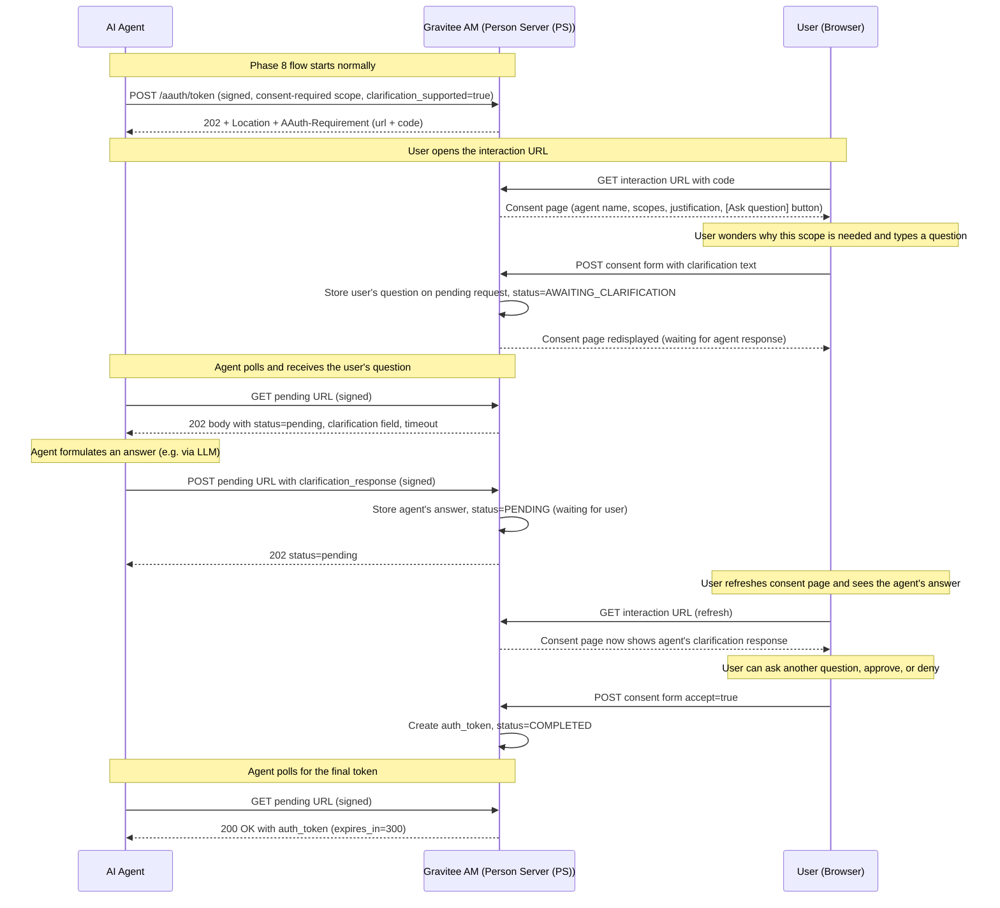
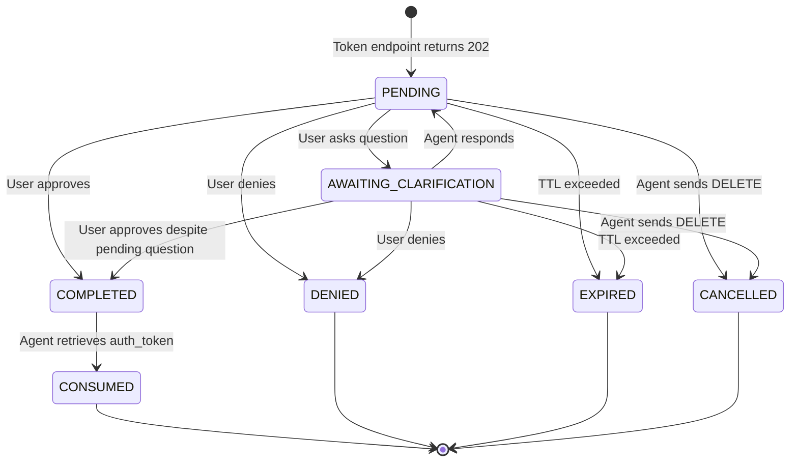

# Phase 10: Clarification Chat

> **Spec update note (latest main branch):** The `clarification_supported` field has been **removed from agent server metadata**. Agents now declare their capabilities (interaction, clarification, payment) via the new **`AAuth-Capabilities` request header** sent on each request. This phase's internal references to `clarification_supported` in metadata need to be reworked to use the capabilities header instead. The core clarification flow (user asks → PS delivers to agent → agent responds) is unchanged. `requirement=clarification` is now a first-class requirement value in the spec.

## Goal

Implement the clarification chat feature defined in [Protocol spec Clarification Chat section](https://github.com/dickhardt/AAuth). During a deferred authorization (Phase 8), the **user** can ask the agent clarification questions before making a consent decision. The PS delivers the user's question to the agent in the next polling response, the agent answers via a signed `POST` to the pending URL, and the answer is shown back to the user. The user can ask multiple questions, then finally approve or deny.

This phase also implements the two other agent responses defined in Section 13.4.2:
- **Updated request**: the agent can replace its original request by `POST`ing a new `resource_token` to the pending URL (e.g. with reduced scope).
- **Cancel**: the agent can abandon the request by sending `DELETE` to the pending URL.

```
Clarification Chat:
+----------+          +-------------------------+           +----------+
|          | poll     |                         | question  |          |
|  Agent   |--------->| Gravitee AM             |<--------->|   User   |
|          |<---------| (Person Server (PS))    |  consent  | (Browser)|
|          | question |                         |  page     |          |
|          |          |                         |           |          |
|          | respond  |                         |           |          |
|          |--------->| Forward to user         |           |          |
|          |          |                         |           |          |
|          | poll     |                         |           |          |
|          |--------->|                         |           |          |
|          |<---------|                         |           |          |
|          | token    |                         |           |          |
+----------+          +-------------------------+           +----------+
```

## Discovery

**Specification references:**
- AAUTH Protocol spec: [Section 13.4 -- Clarification Chat](https://github.com/dickhardt/AAuth) -- Full clarification flow definition
- AAUTH Protocol spec: [Section 13.4.1 -- Clarification Flow](https://github.com/dickhardt/AAuth) -- `clarification` and `timeout` fields in polling response
- AAUTH Protocol spec: [Section 13.4.2 -- Agent Response to Clarification](https://github.com/dickhardt/AAuth) -- Three response types: clarification_response, updated request, cancel
- AAUTH Protocol spec: [Section 13.4.3 -- Clarification Limits](https://github.com/dickhardt/AAuth) -- Recommended max 5 rounds
- AAUTH Protocol spec: [Section 14.1 -- Agent Server Metadata](https://github.com/dickhardt/AAuth) -- `clarification_supported` field declaration
- AAUTH Protocol spec: [Section 12 -- Deferred Responses](https://github.com/dickhardt/AAuth) -- Underlying polling mechanism
- AAUTH Protocol spec: [Section 3 -- Markdown String](https://github.com/dickhardt/AAuth) -- Sanitization requirements for clarification text

### `clarification_supported` Capability Discovery

Per the spec, clarification chat is **opt-in** for agents. The auth server MUST NOT send a `clarification` field unless the agent has indicated support. There are two ways an agent declares support:

1. **At the agent level**, in the agent server metadata at `/.well-known/aauth-agent.json` (per [Section 14.1](https://github.com/dickhardt/AAuth)):
   ```json
   {
     "agent": "https://foo.bar",
     "jwks_uri": "https://foo.bar/jwks.json",
     "clarification_supported": true
   }
   ```
   This is a `Boolean (OPTIONAL)` field with default `false`. Setting it to `true` means **all** requests from this agent server support clarification.

2. **Per request**, in the token endpoint request body (per [Section 13.4](https://github.com/dickhardt/AAuth)):
   ```json
   {
     "resource_token": "eyJ...",
     "clarification_supported": true
   }
   ```
   A specific request can opt in even if the agent server metadata does not declare support, or override it for a single call.

**Implementation impact for Gravitee AM:**
- The agent metadata fetcher (Phase 3) must parse and cache `clarification_supported` from `/.well-known/aauth-agent.json`.
- The token endpoint request parser (Phase 6) must accept `clarification_supported` in the JSON body.
- The pending request must record an `effectiveClarificationSupported` flag computed as `request_body.clarification_supported OR agent_metadata.clarification_supported`.
- The consent UI MUST only offer the "Ask a question" button when this flag is `true`. Otherwise the user can only Approve or Deny.
- The auth server MUST NOT include a `clarification` field in any polling response if the flag is `false`.

## Design

### Clarification Chat Flow

The clarification chat lets the **user** ask the agent a question during consent. The user types a question in the consent UI; the auth server delivers it to the agent in the next polling response; the agent answers; the answer is shown to the user; and the user can ask more questions or finally approve/deny.



The diagram above shows a single round of clarification. The spec recommends a maximum of 5 rounds (per [Section 13.4.3](https://github.com/dickhardt/AAuth)). Each round repeats the "user types question → agent receives → agent responds → user sees answer" cycle.

**Per spec [Section 13.4.2](https://github.com/dickhardt/AAuth)**, instead of a `clarification_response`, the agent MAY also:
- POST a new `resource_token` to the pending URL (updated request -- e.g. with reduced scope), or
- DELETE the pending URL to cancel the request entirely.

### Pending Request State Machine (Updated)



## Implementation

### Files to Modify

```
aauth/
  model/
    AAuthPendingRequest.java             -- Add clarification, clarificationResponse, clarificationSupported, timeout, roundCount
    PendingRequestStatus.java            -- Add AWAITING_CLARIFICATION and CANCELLED statuses
    AAuthTokenRequest.java               -- Add clarification_supported boolean field
    AgentMetadata.java                   -- Already parsed in Phase 3; ensure clarification_supported is exposed
  resources/endpoint/
    AAuthPendingEndpoint.java            -- Handle POST (clarification_response or updated resource_token), DELETE (cancel), and updated GET
    AAuthInteractionEndpoint.java        -- Add "Ask question" form, render agent's response, gate on clarification_supported
  service/pending/
    AAuthPendingRequestService.java      -- askClarification(), respondClarification(), updateRequest(), cancel()
  resources/handler/
    AAuthTokenRequestParseHandler.java   -- Parse clarification_supported field
  AAuthProvider.java                     -- Add POST /pending/:id and DELETE /pending/:id routes
```

### Key Implementation Details

**AAuthPendingRequest** -- new fields:
```java
// Add to existing model
private String clarification;              // The user's question (delivered to agent in next poll)
private String clarificationResponse;      // Agent's response (displayed back to user)
private boolean clarificationSupported;    // Effective flag: agent metadata OR token request body
private Integer clarificationTimeout;      // Optional seconds until interaction times out (per spec 13.4.1)
private int clarificationRoundCount;       // Counter (recommended max 5 per spec 13.4.3)
private PendingRequestStatus status;       // Now includes AWAITING_CLARIFICATION and CANCELLED
```

**AAuthPendingEndpoint** -- updated to handle POST (clarification response or updated request) and DELETE (cancel):

```java
// POST /aauth/pending/:id -- agent sends clarification response OR updated resource_token
public void handlePost(RoutingContext ctx) {
    String pendingId = ctx.pathParam("id");
    VerificationResult agentSig = ctx.get("aauth.verification");
    String agentJkt = computeJwkThumbprint(agentSig.getPublicKey());
    
    JsonObject body = ctx.body().asJsonObject();
    
    // Per spec Section 13.4.2, the body carries one of:
    //   { "clarification_response": "..." }  -- 13.4.2.1
    //   { "resource_token": "..." }          -- 13.4.2.2 (updated request)
    if (body.containsKey("clarification_response")) {
        AAuthPendingRequest pending = pendingService.respondClarification(
            pendingId, agentJkt, body.getString("clarification_response"));
        if (pending == null) {
            ctx.response().setStatusCode(410).end("{\"error\":\"invalid_code\"}");
            return;
        }
        ctx.response().setStatusCode(202).end("{\"status\":\"pending\"}");
    } else if (body.containsKey("resource_token")) {
        AAuthPendingRequest pending = pendingService.updateRequest(
            pendingId, agentJkt, body.getString("resource_token"));
        if (pending == null) {
            ctx.response().setStatusCode(410).end("{\"error\":\"invalid_code\"}");
            return;
        }
        ctx.response().setStatusCode(202).end("{\"status\":\"pending\"}");
    } else {
        ctx.response().setStatusCode(400).end("{\"error\":\"invalid_request\"}");
    }
}

// DELETE /aauth/pending/:id -- agent cancels the pending request (spec 13.4.2.3)
public void handleDelete(RoutingContext ctx) {
    String pendingId = ctx.pathParam("id");
    VerificationResult agentSig = ctx.get("aauth.verification");
    String agentJkt = computeJwkThumbprint(agentSig.getPublicKey());
    
    boolean cancelled = pendingService.cancel(pendingId, agentJkt);
    if (!cancelled) {
        ctx.response().setStatusCode(410).end("{\"error\":\"invalid_code\"}");
        return;
    }
    ctx.response().setStatusCode(204).end();
}

// GET /aauth/pending/:id -- updated to deliver user clarification questions
// Per spec Section 13.4.1, the body uses status="pending" with an extra
// "clarification" field (and optional "timeout"). It is NOT a new status value.
public void handleGet(RoutingContext ctx) {
    // ... existing logic ...
    
    switch (pending.getStatus()) {
        case AWAITING_CLARIFICATION:
            // Spec: status remains "pending", clarification field carries the question
            Map<String, Object> body = new LinkedHashMap<>();
            body.put("status", "pending");
            body.put("location", pendingUrl);
            body.put("clarification", pending.getClarification());
            if (pending.getClarificationTimeout() != null) {
                body.put("timeout", pending.getClarificationTimeout());
            }
            ctx.response().setStatusCode(202)
                .putHeader("Content-Type", "application/json")
                .end(json(body));
            break;
        // ... existing cases (PENDING, COMPLETED, DENIED, EXPIRED, CANCELLED) ...
    }
}
```

**AAuthPendingRequestService** -- new methods:
```java
private static final int MAX_CLARIFICATION_ROUNDS = 5; // per spec Section 13.4.3

public AAuthPendingRequest askClarification(String pendingId, String question, Integer timeout) {
    AAuthPendingRequest req = store.get(pendingId);
    if (req == null) return null;
    
    // Per spec Section 13.4: clarification requires opt-in
    if (!req.isClarificationSupported()) {
        throw new ClarificationNotSupportedException(
            "Agent did not declare clarification_supported");
    }
    
    // Per spec Section 13.4.3: recommended max 5 rounds
    if (req.getClarificationRoundCount() >= MAX_CLARIFICATION_ROUNDS) {
        throw new ClarificationLimitExceededException(
            "Maximum clarification rounds reached");
    }
    
    if (req.getStatus() != PENDING) return null;
    req.setClarification(question);
    req.setClarificationTimeout(timeout);
    req.setClarificationRoundCount(req.getClarificationRoundCount() + 1);
    req.setStatus(AWAITING_CLARIFICATION);
    return req;
}

public AAuthPendingRequest respondClarification(String pendingId, 
        String agentJkt, String response) {
    AAuthPendingRequest req = store.get(pendingId);
    if (req == null) return null;
    if (!req.getAgentJkt().equals(agentJkt)) throw new ForbiddenException();
    if (req.getStatus() != AWAITING_CLARIFICATION) {
        throw new InvalidStateException("Not awaiting clarification");
    }
    req.setClarificationResponse(response);
    req.setStatus(PENDING); // Back to pending for user review
    return req;
}

// Per spec Section 13.4.2.2: agent may replace the original request
public AAuthPendingRequest updateRequest(String pendingId, 
        String agentJkt, String newResourceToken) {
    AAuthPendingRequest req = store.get(pendingId);
    if (req == null) return null;
    if (!req.getAgentJkt().equals(agentJkt)) throw new ForbiddenException();
    // Re-validate and replace the original request context
    req.setResourceTokenJwt(newResourceToken);
    req.setClarification(null);
    req.setStatus(PENDING); // Back to pending for user review
    return req;
}

// Per spec Section 13.4.2.3: agent may cancel the pending request
public boolean cancel(String pendingId, String agentJkt) {
    AAuthPendingRequest req = store.get(pendingId);
    if (req == null) return false;
    if (!req.getAgentJkt().equals(agentJkt)) throw new ForbiddenException();
    req.setStatus(CANCELLED);
    store.remove(pendingId);
    return true;
}
```

**AAuthInteractionEndpoint** -- consent page renders the "Ask question" affordance only when the agent supports clarification:
```html
<!-- Show the agent's previous response, if any -->
{{#if clarificationResponse}}
<div class="clarification">
    <p><strong>{{agentClientName}} responded:</strong></p>
    <blockquote>{{clarificationResponse}}</blockquote>
</div>
{{/if}}

<!-- Ask-question form: ONLY shown if agent declared clarification_supported -->
{{#if clarificationSupported}}
<form method="POST" action="{{interactionUrl}}">
    <input type="hidden" name="code" value="{{interactionCode}}"/>
    <label>Ask the agent a question:</label>
    <input type="text" name="clarification" placeholder="e.g. Why do you need this access?"/>
    <button type="submit" name="action" value="clarify">Ask Question</button>
</form>
{{/if}}

<!-- Approve / Deny is always available -->
<form method="POST" action="{{interactionUrl}}">
    <input type="hidden" name="code" value="{{interactionCode}}"/>
    <button type="submit" name="accept" value="true">Approve</button>
    <button type="submit" name="accept" value="false">Deny</button>
</form>
```

**AAuthTokenRequestParseHandler** -- accept the per-request opt-in:
```java
// Parse top-level fields from JSON body (Phase 6 already parses resource_token, scope, etc.)
JsonObject body = ctx.body().asJsonObject();
AAuthTokenRequest req = new AAuthTokenRequest();
req.setResourceToken(body.getString("resource_token"));
req.setScope(body.getString("scope"));
// New for Phase 10:
req.setClarificationSupported(body.getBoolean("clarification_supported", Boolean.FALSE));
ctx.put("aauth.token.request", req);
```

**Effective `clarification_supported` computation** (when creating the pending request):
```java
// Per spec Section 13.4: agent metadata OR per-request flag
boolean effective = (agentMetadata != null && agentMetadata.isClarificationSupported())
                 || tokenRequest.isClarificationSupported();
pendingRequest.setClarificationSupported(effective);
```

**Route registration:**
```java
// POST to pending (clarification response OR updated request)
aAuthRouter.route(HttpMethod.POST, "/pending/:id")
    .handler(bodyHandler)
    .handler(signatureHandler)
    .handler(pendingPostEndpoint);

// DELETE to pending (cancel)
aAuthRouter.route(HttpMethod.DELETE, "/pending/:id")
    .handler(signatureHandler)
    .handler(pendingDeleteEndpoint);
```

## Validation

### Unit Tests

Add the following `*Test.java` classes under `gravitee-am-gateway-handler-aauth/src/test/java/io/gravitee/am/gateway/handler/aauth/`. These extend the Phase 8 pending-request infrastructure with clarification, updated-request, and cancel behaviors.

**`service/pending/AAuthPendingRequestServiceClarificationTest`** (`@RunWith(MockitoJUnitRunner.class)`)
- `shouldThrowClarificationNotSupportedException_whenAgentDidNotOptIn()` -- if `clarificationSupported` is `false` on the pending request, `askClarification()` rejects with this exception.
- `shouldAcceptClarification_whenAgentMetadataDeclaresSupport()`.
- `shouldAcceptClarification_whenTokenRequestBodyDeclaresSupport()` -- per-request opt-in.
- `shouldComputeEffectiveSupport_asLogicalOr()` -- agent metadata OR token request body.
- `shouldStoreUserQuestion_andTransitionToAwaitingClarification()`.
- `shouldStoreOptionalTimeout()`.
- `shouldIncrementRoundCounter_onEachAsk()`.
- `shouldThrowClarificationLimitExceeded_atFifthRound()` -- per spec Section 13.4.3.
- `shouldRespondAndTransitionBackToPending()` -- agent's `respondClarification()` clears the question and resets state.
- `shouldRejectResponse_whenAgentJktMismatch()` -- only the original agent can respond.
- `shouldRejectResponse_whenStateNotAwaitingClarification()`.
- `shouldUpdateRequest_replacingResourceTokenJwt()` -- per Section 13.4.2.2.
- `shouldRejectUpdate_whenAgentJktMismatch()`.
- `shouldCancelPendingRequest()` -- per Section 13.4.2.3.
- `shouldRejectCancel_whenAgentJktMismatch()`.
- `shouldRejectCancel_whenAlreadyTerminal()`.

**`resources/endpoint/AAuthPendingEndpointPostTest`** (`extends RxWebTestBase`)
- `shouldAcceptClarificationResponseBody_andReturn202()`.
- `shouldAcceptUpdatedResourceTokenBody_andReturn202()`.
- `shouldReturn400InvalidRequest_whenBodyContainsNeither()`.
- `shouldReturn410Gone_whenPendingIdUnknown()`.
- `shouldReturn403_whenAgentJktDoesNotMatch()`.
- `shouldOmitAAuthRequirementAndAAuthErrorHeaders_on403()` -- per Headers spec Section 6.3.

**`resources/endpoint/AAuthPendingEndpointGetClarificationTest`** (`extends RxWebTestBase`)
- `shouldReturnPendingStatus_withClarificationField()` -- per spec Section 13.4.1, status remains `"pending"` and the question is in the `clarification` field, not a new status value.
- `shouldIncludeOptionalTimeoutField()`.
- `shouldNotIncludeClarificationField_whenNotInClarificationState()`.

**`resources/endpoint/AAuthPendingEndpointDeleteTest`** (`extends RxWebTestBase`)
- `shouldReturn204_onSuccessfulCancel()`.
- `shouldReturn403_whenAgentJktMismatch()`.
- `shouldReturn410Gone_onSubsequentPoll()` -- after DELETE, polling returns 410.

**`resources/endpoint/AAuthInteractionEndpointClarificationTest`** (`extends RxWebTestBase`)
- `shouldRenderAskQuestionForm_whenClarificationSupported()`.
- `shouldNotRenderAskQuestionForm_whenClarificationNotSupported()`.
- `shouldDisplayPriorClarificationResponse_fromAgent()`.
- `shouldSanitizeMarkdownInResponse()` -- per spec Section 3.

**`resources/endpoint/AAuthInteractionPostClarificationTest`** (`extends RxWebTestBase`)
- `shouldStoreUserQuestionOnPendingRequest_whenActionIsClarify()`.
- `shouldRejectClarification_whenAgentDoesNotSupport()` -- returns an error or hides the affordance.
- `shouldNormalizeWhitespaceAndLength_inUserQuestion()`.

**`resources/handler/AAuthTokenRequestParseHandlerClarificationTest`** (`extends RxWebTestBase`)
- `shouldParseClarificationSupportedField()` -- defaults to `false` when absent.
- `shouldRejectNonBooleanClarificationSupported()`.

**`service/agent/AgentMetadataClarificationFieldTest`** (extension of Phase 3 metadata fetcher)
- `shouldParseClarificationSupportedFromAgentMetadata()` -- default `false` per spec.

### Test Fixtures

Adds to `gravitee-am-gateway-handler-aauth/src/test/java/io/gravitee/am/gateway/handler/aauth/test/fixtures/`:

- Updates `TestPendingRequestStore` (from Phase 8) to include pre-seeded requests in the `AWAITING_CLARIFICATION` and `CANCELLED` states.
- Updates `TestAgentMetadataServer` (Phase 3) to allow setting `clarification_supported: true|false` in the served metadata.
- `TestClarificationFlowOrchestrator` -- a small helper that drives a full clarification round (user asks, agent polls, agent responds, user approves, agent retrieves) end to end inside a single test, used by integration-style unit tests.

### Checklist

**Clarification opt-in (`clarification_supported`)** -- per [spec Section 13.4](https://github.com/dickhardt/AAuth) and [Section 14.1](https://github.com/dickhardt/AAuth):

- [ ] Agent metadata fetcher parses `clarification_supported` (Boolean, default false) from `/.well-known/aauth-agent.json`
- [ ] Token endpoint accepts `clarification_supported` Boolean field in JSON request body
- [ ] Effective flag computed as `agent_metadata.clarification_supported OR token_request.clarification_supported`, stored on the pending request
- [ ] Consent UI shows the "Ask a question" form ONLY when the effective flag is `true`
- [ ] When the flag is `false`, the auth server MUST NOT include any `clarification` field in polling responses
- [ ] When the flag is `false`, attempting to ask a clarification via the consent UI returns an error or hides the input

**Clarification flow** -- per [spec Section 13.4.1](https://github.com/dickhardt/AAuth) and [Section 13.4.2](https://github.com/dickhardt/AAuth):

- [ ] Polling a pending request with a pending user question returns 202 with body `{"status": "pending", "location": "...", "clarification": "<user question>"}` (status remains "pending"; the question is delivered via the `clarification` field)
- [ ] Optional `timeout` field included in the polling response when the auth server has a deadline for the agent's response
- [ ] Agent can POST clarification response to the pending URL with `{"clarification_response": "..."}` (Markdown string) -- per [Section 13.4.2.1](https://github.com/dickhardt/AAuth)
- [ ] Agent can POST an updated request to the pending URL with new `{"resource_token": "..."}` -- per [Section 13.4.2.2](https://github.com/dickhardt/AAuth)
- [ ] Agent can cancel the request via `DELETE` on the pending URL -- per [Section 13.4.2.3](https://github.com/dickhardt/AAuth)
- [ ] After agent responds, pending request returns to the regular `pending` state and the user sees the response
- [ ] User sees agent's clarification response on the consent page
- [ ] User can ask multiple questions (multiple round-trips supported)
- [ ] Clarification limited to recommended max 5 rounds (per [spec Section 13.4.3](https://github.com/dickhardt/AAuth))
- [ ] Markdown content in `clarification` (user question) and `clarification_response` (agent answer) sanitized before display (per [spec Section 3](https://github.com/dickhardt/AAuth))
- [ ] Only the original agent can respond to clarification (verified via `agent_jkt`)
- [ ] Cancelled / consumed pending URL returns `410 Gone` on subsequent polls

**Cross-cutting:**

- [ ] All previous phases (4, 6, 7, 8, 9) continue to work unchanged
- [ ] Complete AAuth-Error headers on all 401 responses
- [ ] Complete AAuth-Requirement headers on all 401 and 202 responses
- [ ] 403 responses MUST NOT include AAuth-Requirement or AAuth-Error headers (per [Headers spec Section 6.3](https://github.com/dickhardt/AAuth))
