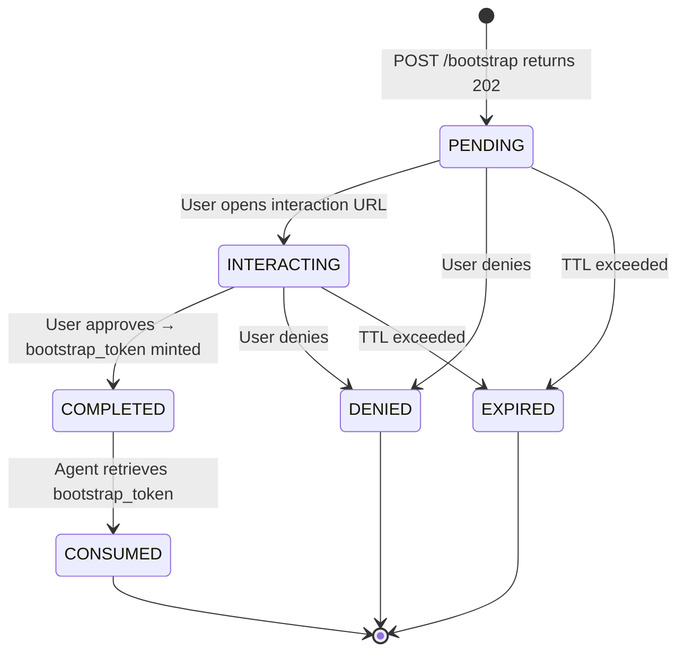

# Phase 11: AAUTH Bootstrap (PS-side)

## Goal

Implement the Person Server (PS) side of the AAUTH Bootstrap extension (`draft-hardt-aauth-bootstrap`) in Gravitee AM. Bootstrap is the ceremony by which a SaaS agent establishes its initial `aauth:local@domain` identity through the user's PS. The PS authenticates the user, collects consent, issues a `bootstrap_token` (a short-lived JWT directed at the Agent Server), and records the resulting agent binding after the Agent Server announces completion.

This phase implements:
- `POST /aauth/bootstrap` — initial request (signed `hwk`): accepts `agent_server` parameter, triggers deferred interaction, issues `bootstrap_token`
- `POST /aauth/bootstrap` — completion announcement (signed `jwt` with `aa-agent+jwt`, empty body): records the `(user, agent_identifier)` binding
- `GET /aauth/bootstrap/pending/:id` — polling endpoint for bootstrap deferred flow
- Bootstrap consent screen — shows the Agent Server's name/logo, asks the user to approve the binding
- `bootstrap_token` minting — JWT with `typ=aa-bootstrap+jwt`, `iss=PS`, `aud=Agent Server`, `sub=pairwise user id`, `cnf.jwk=agent's ephemeral key`

This phase does NOT implement the Agent Server side (that lives in the demo project), platform attestation (WebAuthn, App Attest), or the refresh endpoint. It focuses purely on what Gravitee AM (the PS) must do.

## Discovery

**Specification references:**
- [draft-hardt-aauth-bootstrap](../specs/draft-hardt-aauth-bootstrap.md) — Full bootstrap spec
- Section 6.2 — Request to PS /bootstrap: `hwk` signature, `agent_server` body parameter, optional `domain_hint`, `login_hint`, `tenant`
- Section 6.3 — Interaction Response: `202 Accepted`, `Location` header with pending URL, `AAuth-Requirement: requirement=interaction`
- Section 6.4 — bootstrap_token Issuance: JWT claims (`iss`, `dwk`, `aud`, `sub`, `cnf`, `jti`, `iat`, `exp`), `typ=aa-bootstrap+jwt`
- Section 6.7 — Bootstrap Completion: announcement POST with `jwt` scheme (empty body), PS records binding
- Section 3 — Terminology: `bootstrap_token`, binding, ephemeral key
- Section 5 — Agent Server Metadata Extensions: `bootstrap_endpoint`, `refresh_endpoint`, `webauthn_endpoint` in `aauth-agent.json`

**Existing code to reuse:**
- The 202 deferred interaction pattern from Phase 8 (pending request, polling, consent, interaction URL)
- `AAuthSignatureHandler` + `AAuthSignatureVerifier` for `hwk` signature verification on the initial request
- `JWTScheme` for `jwt` signature verification on the completion announcement
- `AAuthPendingRequestService` pattern for the bootstrap pending flow (or a dedicated bootstrap pending entity)
- `CertificateManager` + `JWTBuilder` for signing the `bootstrap_token`
- `AgentMetadataFetcher` to fetch the Agent Server's metadata for the consent screen (name, logo)
- Thymeleaf template engine for the bootstrap consent page

### Key differences from the authorization deferred flow

| Aspect | Authorization (Phase 8) | Bootstrap (this phase) |
|--------|------------------------|----------------------|
| Trigger | `POST /aauth/token` with `resource_token` | `POST /aauth/bootstrap` with `agent_server` |
| Signature scheme | `jwt` (aa-agent+jwt required) | `hwk` (ephemeral key, no agent identity yet) |
| Consent screen | Shows scopes, justification, clarification | Shows Agent Server name/logo, no scopes |
| Result | `auth_token` (aa-auth+jwt) | `bootstrap_token` (aa-bootstrap+jwt) |
| Completion | Agent polls, gets auth_token, done | Agent polls, gets bootstrap_token, then announces back to PS |
| User identifier | Existing user (already authenticated) | Pairwise directed identifier (`sub`) for the Agent Server |

### bootstrap_token vs auth_token

The `bootstrap_token` is NOT an `auth_token`. It:
- Has `typ=aa-bootstrap+jwt` (not `aa-auth+jwt`)
- Is directed at the Agent Server (`aud`), not at a resource
- Contains a pairwise `sub` directed at `aud` (not the user's internal ID)
- Contains `cnf.jwk` binding the agent's ephemeral public key
- Does NOT contain `scope`, `agent`, or user attributes
- Has a very short lifetime (5 minutes max per spec)
- Is consumed by the Agent Server, not by a resource

## Design

### Bootstrap Flow (PS perspective)

```mermaid
sequenceDiagram
    participant CLI as Agent CLI
    participant PS as Gravitee AM (PS)
    participant Browser as User Browser
    participant AS as Agent Server

    Note over CLI: Generate ephemeral<br/>Ed25519 keypair

    CLI->>PS: POST /aauth/bootstrap<br/>{ "agent_server": "https://agent-server.example" }<br/>Signature-Key: sig=hwk (ephemeral key)
    
    Note over PS: Verify hwk signature<br/>Fetch Agent Server metadata<br/>Create bootstrap pending request

    PS-->>CLI: 202 Accepted<br/>Location: /aauth/bootstrap/pending/{id}<br/>AAuth-Requirement: requirement=interaction;<br/>url=".../aauth/interact"; code="BOOT-XXXX"

    CLI->>Browser: Print interaction URL
    Browser->>PS: GET /aauth/interact?code=BOOT-XXXX
    PS->>Browser: Login page
    Browser->>PS: Authenticate as alice
    PS->>Browser: Bootstrap consent screen<br/>"Agent Server agent-server.example<br/>wants to create an agent identity"
    Browser->>PS: Approve

    Note over PS: Mint bootstrap_token JWT<br/>typ=aa-bootstrap+jwt<br/>iss=PS, aud=AS<br/>sub=pairwise(alice, AS)<br/>cnf.jwk=ephemeral key

    CLI->>PS: GET /aauth/bootstrap/pending/{id}<br/>signed hwk
    PS-->>CLI: 200 OK<br/>{ "bootstrap_token": "eyJ..." }

    Note over CLI: CLI sends bootstrap_token<br/>to Agent Server (out of scope)
    Note over CLI: Agent Server returns<br/>aa-agent+jwt (out of scope)

    CLI->>PS: POST /aauth/bootstrap (empty body)<br/>Signature-Key: sig=jwt;jwt="<aa-agent+jwt>"
    
    Note over PS: Verify jwt signature<br/>Verify agent_token.ps == this PS<br/>Look up bootstrap record by cnf.jwk thumbprint<br/>Record binding: agent_token.sub ↔ (user, agent_server)

    PS-->>CLI: 204 No Content
```

### Pending Request Lifecycle

Bootstrap reuses the same deferred interaction pattern as authorization but with a dedicated entity (`AAuthBootstrapRequest`) to avoid overloading the existing `AAuthPendingRequest` which carries authorization-specific fields (scope, resource_iss, auth_token, clarification, etc.).



### Pairwise User Identifier

The `bootstrap_token.sub` MUST be a pairwise identifier directed at the Agent Server. This prevents cross-vendor user correlation. The identifier should be:
- Deterministic: same `(user, agent_server)` always produces the same `sub`
- Opaque: the Agent Server cannot derive the user's internal ID from it
- Directed: different Agent Servers get different `sub` values for the same user

Implementation: `SHA-256(user_internal_id + agent_server_url + domain_secret)`, base64url-encoded, truncated to a reasonable length (32 chars).

### Bootstrap Binding Storage

After the Agent Server announces completion (Step 8), the PS records the binding:
- `userId` — the AM user who approved
- `agentServerUrl` — the Agent Server URL from the initial request
- `agentIdentifier` — the `aauth:local@domain` from `agent_token.sub`
- `ephemeralKeyThumbprint` — JWK thumbprint of the ephemeral key (used to correlate the announcement)
- `createdAt` — binding creation timestamp

This can be stored in a new `aauth_bootstrap_bindings` collection/table, or as metadata on the auto-registered `Application(type=AAUTH_AGENT)`.

## Implementation

### Data Model

**New entity: `AAuthBootstrapRequest`** — similar to `AAuthPendingRequest` but for bootstrap:

```java
public class AAuthBootstrapRequest {
    private String id;
    private String status;                  // PENDING, INTERACTING, COMPLETED, DENIED, EXPIRED
    private String domain;
    private String agentServerUrl;          // from request body "agent_server"
    private String agentServerName;         // fetched from Agent Server metadata
    private String agentServerLogoUri;      // fetched from Agent Server metadata
    private String ephemeralKeyJwk;         // serialized JWK of the agent's ephemeral public key
    private String ephemeralKeyThumbprint;  // JWK thumbprint for correlating announcement
    private String interactionCode;         // human-readable code (XXXX-NNNN)
    private String bootstrapToken;          // the minted bootstrap_token JWT (set on COMPLETED)
    private String userId;                  // set when user authenticates
    private String pairwiseSub;             // the directed sub for this (user, agent_server)
    private String domainHint;              // optional, from request
    private String loginHint;               // optional, from request
    private String tenant;                  // optional, from request
    private Date createdAt;
    private Date lastAccessAt;
    private Date expireAt;
}
```

**New entity: `AAuthBootstrapBinding`** — records the user-agent binding after completion:

```java
public class AAuthBootstrapBinding {
    private String id;
    private String domain;
    private String userId;
    private String agentServerUrl;
    private String agentIdentifier;         // aauth:local@domain from agent_token.sub
    private String pairwiseSub;             // the directed sub issued to this agent server
    private Date createdAt;
    private Date updatedAt;
}
```

### Files to Create

```
aauth/
  model/
    AAuthBootstrapRequest.java           -- Bootstrap pending request entity
    AAuthBootstrapBinding.java           -- User-agent binding entity
  resources/endpoint/
    AAuthBootstrapEndpoint.java          -- POST /aauth/bootstrap (both initial + announcement)
    AAuthBootstrapPendingEndpoint.java   -- GET /aauth/bootstrap/pending/:id (polling)
  resources/handler/
    AAuthBootstrapConsentHandler.java    -- GET /aauth/bootstrap/consent (renders consent page)
    AAuthBootstrapConsentPostEndpoint.java -- POST /aauth/bootstrap/consent (approve/deny)
    AAuthBootstrapInteractHandler.java   -- GET /aauth/interact for bootstrap codes (may reuse existing)
  service/
    AAuthBootstrapService.java           -- Business logic: create, poll, approve, deny, announce
    PairwiseSubjectGenerator.java        -- Generates pairwise sub for (user, agent_server)
    BootstrapTokenMinter.java            -- Mints aa-bootstrap+jwt
```

### Files to Modify

```
aauth/
  AAuthProvider.java                     -- Register bootstrap routes
  spring/AAuthConfiguration.java         -- Wire bootstrap beans
  resources/handler/AAuthInteractionResolveHandler.java  -- Handle bootstrap interaction codes
```

### Templates

```
webroot/views/
  aauth_bootstrap_consent.html           -- Bootstrap consent screen (Agent Server name/logo, approve/deny)
```

### Repository (MongoDB + JDBC + Liquibase)

```
repository-api/
  AAuthBootstrapRequestRepository.java   -- CRUD for bootstrap requests
  AAuthBootstrapBindingRepository.java   -- CRUD for bindings

repository-mongodb/
  MongoAAuthBootstrapRequestRepository.java
  AAuthBootstrapRequestMongo.java
  MongoAAuthBootstrapBindingRepository.java
  AAuthBootstrapBindingMongo.java

repository-jdbc/
  JdbcAAuthBootstrapRequestRepository.java
  JdbcAAuthBootstrapRequest.java
  JdbcAAuthBootstrapBindingRepository.java
  JdbcAAuthBootstrapBinding.java

liquibase/
  4.12.0-aauth-bootstrap-requests.yml
  4.12.0-aauth-bootstrap-bindings.yml
```

### Key Implementation Details

**`AAuthBootstrapEndpoint` (POST /aauth/bootstrap)**

This endpoint handles TWO different requests distinguished by signature scheme and body:
1. **Initial request** (`hwk` scheme, JSON body with `agent_server`): creates a bootstrap pending request, returns 202
2. **Completion announcement** (`jwt` scheme with `aa-agent+jwt`, empty body): records the binding, returns 204

```java
public void handle(RoutingContext ctx) {
    VerificationResult verification = ctx.get("aauth.verification");
    
    if ("jwt".equals(verification.scheme())) {
        // Completion announcement: empty body, jwt signature with agent_token
        handleAnnouncement(ctx, verification);
    } else if ("hwk".equals(verification.scheme())) {
        // Initial bootstrap request: JSON body with agent_server
        handleInitialRequest(ctx, verification);
    } else {
        ctx.fail(new InvalidRequestException("Unsupported signature scheme for bootstrap"));
    }
}
```

**`BootstrapTokenMinter`**

Mints `aa-bootstrap+jwt` using the PS's signing certificate (same as auth_token signing):
```java
JWT bootstrapToken = new JWT();
bootstrapToken.setIss(psIssuerUrl);
bootstrapToken.set("dwk", "aauth-person.json");
bootstrapToken.setAud(agentServerUrl);
bootstrapToken.setSub(pairwiseSub);
bootstrapToken.set("cnf", Map.of("jwk", ephemeralKeyJwk));
bootstrapToken.setJti(UUID.randomUUID().toString());
bootstrapToken.setIat(now);
bootstrapToken.setExp(now + 300);  // 5 minutes

// Sign with typ=aa-bootstrap+jwt
return jwtBuilder.sign(bootstrapToken, "aa-bootstrap+jwt");
```

**`PairwiseSubjectGenerator`**

Generates a deterministic pairwise `sub` for `(user, agent_server)`:
```java
public String generate(String userId, String agentServerUrl, String domainSecret) {
    byte[] hash = MessageDigest.getInstance("SHA-256")
        .digest((userId + "|" + agentServerUrl + "|" + domainSecret).getBytes(UTF_8));
    return Base64.getUrlEncoder().withoutPadding()
        .encodeToString(Arrays.copyOf(hash, 24));  // 32-char base64url
}
```

**Bootstrap consent screen (`aauth_bootstrap_consent.html`)**

Simpler than the authorization consent screen — no scopes, no clarification:
```html
<div class="header-description">
    
    <span th:text="${agentServerName}"></span>
    <span> wants to create an agent identity for you</span>
</div>
<div class="section">
    <button name="user_approval" value="true">Approve</button>
    <button name="user_approval" value="false">Deny</button>
</div>
```

**Completion announcement processing**

When the agent POSTs back with `jwt` scheme and empty body:
1. Verify HTTP Message Signature under `jwt` scheme
2. Extract `agent_token` from `Signature-Key` header
3. Verify `agent_token` by fetching Agent Server JWKS via `iss` + `dwk`
4. Check `agent_token.ps == this PS URL`
5. Compute thumbprint of `agent_token.cnf.jwk`
6. Look up bootstrap request by ephemeral key thumbprint
7. Record binding: `(userId, agentServerUrl) → agent_token.sub`
8. Return 204

### Route Registration

```java
// In AAuthProvider.java
// Bootstrap routes
router.post("/aauth/bootstrap")
    .handler(signatureHandler)           // verifies hwk or jwt
    .handler(bootstrapEndpoint);         // dispatches based on scheme

router.get("/aauth/bootstrap/pending/:id")
    .handler(signatureHandler)           // verifies hwk
    .handler(bootstrapPendingEndpoint);  // polling

// Bootstrap interaction (reuse existing interact pattern)
router.get("/aauth/bootstrap/consent")
    .handler(authenticationFlowHandler)  // ensures user is logged in
    .handler(bootstrapConsentHandler);   // renders consent page

router.post("/aauth/bootstrap/consent")
    .handler(csrfHandler)
    .handler(bootstrapConsentPostEndpoint);  // approve/deny
```

### PS Metadata Extension

Add `bootstrap_endpoint` to the PS metadata at `/.well-known/aauth-person.json`:

```json
{
  "issuer": "https://am.example/aauth-demo/aauth",
  "jwks_uri": "https://am.example/aauth-demo/aauth/.well-known/jwks.json",
  "token_endpoint": "https://am.example/aauth-demo/aauth/token",
  "bootstrap_endpoint": "https://am.example/aauth-demo/aauth/bootstrap"
}
```

## Validation

### Unit tests
- `PairwiseSubjectGeneratorTest` — deterministic, different for different agent servers, opaque
- `BootstrapTokenMinterTest` — correct claims, typ=aa-bootstrap+jwt, signed by PS key
- `AAuthBootstrapServiceTest` — create, poll, approve, deny, announce lifecycle
- `AAuthBootstrapEndpointTest` — initial request (hwk) vs announcement (jwt) dispatch

### Integration tests
- Full bootstrap ceremony with mock Agent Server: hwk request → 202 → consent → poll → bootstrap_token → announcement → 204
- Rejection: user denies → agent polls → denied status
- Expiration: TTL exceeded → expired status
- Announcement with invalid ephemeral key thumbprint → 404

### Manual test
- Use `AAuthTokenEndpointManualTest` pattern: extend with bootstrap ceremony
- Verify bootstrap_token JWT structure and claims
- Verify pairwise sub is consistent across requests for same (user, agent_server)
- Verify binding is recorded after announcement

## Dependencies

| Phase | Why needed |
|-------|-----------|
| P1 | PS metadata at `/.well-known/aauth-person.json` — add `bootstrap_endpoint` |
| P2 | HTTP Message Signature verification (`hwk` scheme) |
| P8 | Deferred interaction pattern (202, pending URL, consent UI) — architectural pattern reuse |
| P9 | JWT signature scheme verification (for the completion announcement with `aa-agent+jwt`) |
