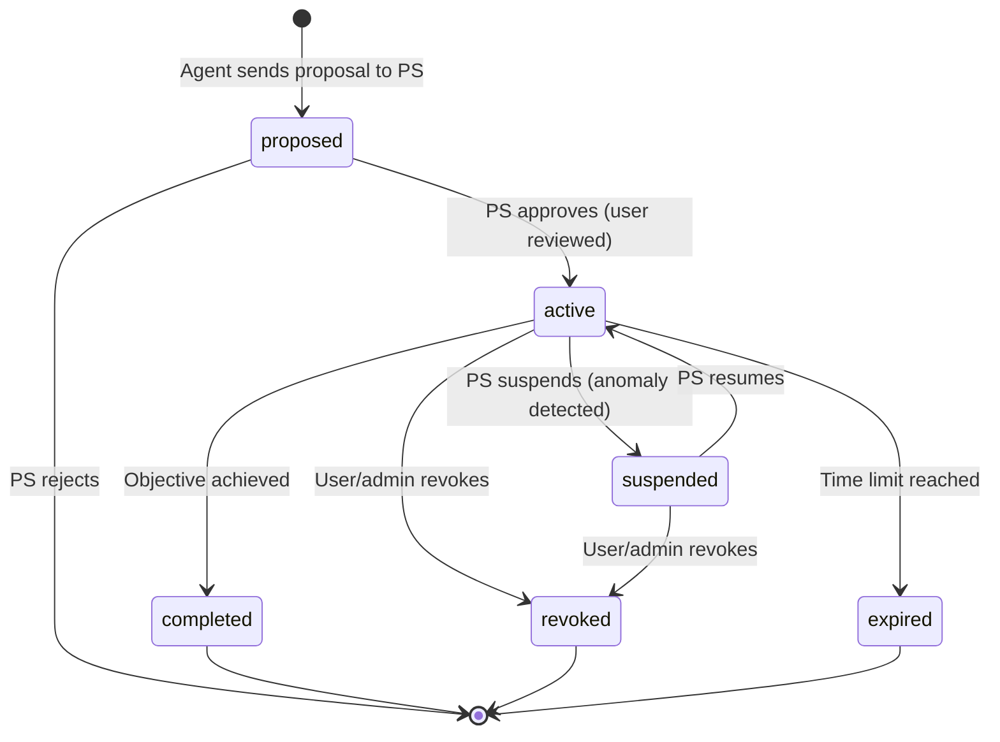

# Phase 14: Missions

## Goal

Implement AAUTH missions — optional scoped authorization contexts that guide an agent's work across multiple resource accesses. An agent proposes a mission to its PS, the PS may involve the user for review, clarification, or approval, and the approved mission is identified by the SHA-256 hash of the mission JSON. The agent includes the mission context on all subsequent requests via the `AAuth-Mission` request header.

Missions enable:
- **Scope pre-approval**: the user approves a mission once, reducing per-resource consent fatigue
- **Tool governance**: the mission's `approved_tools` list lets agents call pre-approved tools without hitting the permission endpoint
- **Centralized audit**: the PS sees all authorizations under a single mission context
- **Lifecycle control**: suspend/revoke a mission to cut off all associated access

Missions are **OPTIONAL** in all adoption modes. The protocol works without them.

**Spec reference:** AAUTH Protocol spec (2026-04-09): [Missions section](https://github.com/dickhardt/AAuth)

## Discovery

**Specification references:**
- AAUTH Protocol spec (2026-04-09): Mission Creation — mission proposal, mission approval, `AAuth-Mission` header
- AAUTH Protocol spec (2026-04-09): Mission Management — lifecycle states, mission control endpoint
- AAUTH Protocol spec (2026-04-09): PS Metadata — `mission_endpoint`, `mission_control_endpoint`

## Design

### Mission lifecycle



### Mission JSON structure

```json
{
  "approver": "https://ps.example",
  "agent": "aauth:assistant@agent.example",
  "approved_at": "2026-04-07T14:30:00Z",
  "description": "# Research Competitors\n\nResearch top 3 competitors...",
  "approved_tools": [
    {"name": "WebSearch", "description": "Search the web"},
    {"name": "Read", "description": "Read files and web pages"}
  ]
}
```

The `s256` identifier is the base64url-encoded SHA-256 hash of the mission JSON response body bytes.

### AAuth-Mission request header

```http
AAuth-Mission: approver="https://ps.example"; s256="dBjftJeZ4CVP-mB92K27uhbUJU1p1r_wW1gFWFOEjXk"
```

The agent includes this header on all requests to resources when operating in a mission context. Mission-aware resources include the `mission` object in their resource tokens.

## Implementation

TBD — will be detailed during Wave 4 execution.

## Validation

TBD.
