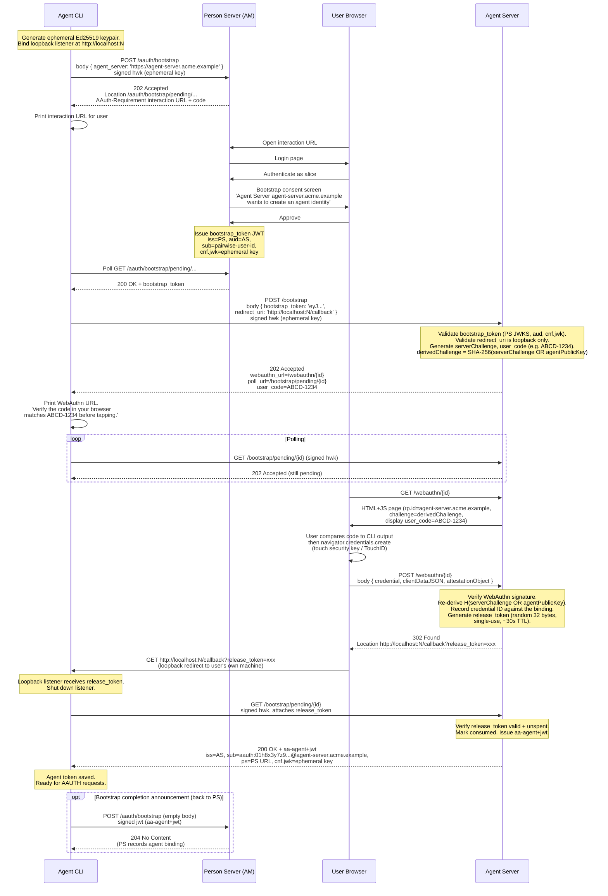

# Phase 17: AAUTH-Secured MCP Demo (`gravitee-acme-assistant`)

## Goal

Build a self-contained, end-to-end demonstration showcasing Gravitee AM's AAUTH protocol implementation through a fictional product, **ACME Assistant** — a polished CLI agent that connects to a calendar MCP via AAUTH, with Gravitee AM as the Person Server. The demo uses the AAUTH Bootstrap extension to establish agent identity, with a WebAuthn step at the Agent Server for platform attestation and a loopback redirect (RFC 8252-style, layered as a *gate* on the existing polling channel) so the `agent_token` can only be released to a process running on the same machine as the user's browser. It then demonstrates the full authorization flow including consent and clarification chat, all wrapped in a Claude-Code-style interactive shell.

The demo has clear runtime entity separation reflecting a real production environment:

- **ACME Assistant Agent Server** — vendor-operated, runs the WebAuthn ceremony, gates `agent_token` release on a loopback-delivered proof.
- **ACME Assistant** (the CLI) — a Spring Shell REPL that the user runs on their own machine. Guides bootstrap with `[Y/n]` prompts and a branded UI, then routes user prompts to the right calendar scenario.
- **ACME Calendar MCP** — a Spring AI MCP server, protected by AAUTH.

The CLI supports three layered viewing modes — clean UX by default, inline `--verbose` annotations, and a split-pane `--teach` mode (Lanterna TUI) showing the live wire trace beside the chat — and always writes a persistent `trace.md` artifact. Together they make the protocol's *why* visible alongside the user's *what*. See "Educational mode" below.

> **Note on spec fidelity.** The AAUTH bootstrap spec defines the AS `/bootstrap` step as synchronous (agent POSTs `bootstrap_token` + attestation, AS returns 200 + `agent_token`). That works for browser SaaS and mobile because they have the attestation result in hand at POST time. CLIs are explicitly out-of-scope of spec bootstrap precisely because the WebAuthn ceremony requires a browser the CLI doesn't own. The demo's `202 + poll` shape is a CLI-specific extension that borrows AAuth's existing deferred-interaction idiom (already used at the PS for consent). The loopback gate is layered on top of polling without changing that shape.

## Why MCP?

Model Context Protocol (MCP) currently defines OAuth 2.1 as its auth layer. That model has well-known limitations for AI agents — which is exactly the problem AAUTH was designed to solve. An MCP server protected by AAUTH is a strict improvement: no client pre-registration, cryptographic proof-of-possession on every request, first-class user-consent semantics, and built-in clarification chat for explainability.

## Runtime Entities

```
┌──────────────────────┐     ┌────────────────────────┐     ┌───────────────────────┐
│  Agent Server        │     │  Gravitee AM           │     │ MCP Calendar (AAUTH)  │
│  (port 9000)         │     │  (port 8092)           │     │ (port 8081)           │
│                      │     │                        │     │                       │
│  /.well-known/       │     │  Person Server (PS)    │     │  calendar.read        │
│   aauth-agent.json   │     │   POST /aauth/token    │     │  calendar.write       │
│  /jwks.json          │     │   POST /aauth/bootstrap│     │                       │
│  POST /bootstrap     │     │   GET  /aauth/pending  │     │  aauth-resource filter│
│  GET  /webauthn/{id} │     │   GET  /aauth/interact │     └───────────────────────┘
│  POST /webauthn/{id} │     └──────────┬─────────────┘
│  POST /refresh       │                │
└──────────┬───────────┘                │
           │ aa-agent+jwt               │
           ▼                            │
┌─────────────────────────────────┐     │
│  Agent CLI                      │─────┘
│  (ephemeral process)            │
│                                 │
│  1. Generate keypair +          │
│     bind loopback localhost:N   │
│  2. Bootstrap via PS            │
│  3. WebAuthn at AS (browser)    │
│  4. Loopback callback delivers  │
│     release_token               │
│  5. Poll AS w/ release_token    │
│     → agent_token               │
│  6. Call MCP tools              │
└─────────────────────────────────┘
```

### Entity Descriptions

**ACME Assistant Agent Server** (AAUTH "Agent Server" role) — A stable, long-lived service that:
- Holds the agent identity keypair and publishes `/.well-known/aauth-agent.json` + `/jwks.json`
- Exposes `POST /bootstrap` that validates a `bootstrap_token` from the PS, validates `redirect_uri` is loopback-only (host `localhost` / `127.0.0.1`, scheme `http`, host literal not via DNS), computes the WebAuthn channel-binding challenge, generates a `user_code`, and returns 202 with `webauthn_url`, `poll_url`, and `user_code`
- Exposes `GET /webauthn/{id}` (serves the small static HTML+JS page that runs the WebAuthn ceremony, displaying `user_code` for visual comparison) and `POST /webauthn/{id}` (verifies the resulting credential, generates a single-use `release_token`, and 302s the browser to the registered `redirect_uri` with `release_token` as a query param)
- Exposes `GET /bootstrap/pending/{id}` — the polling endpoint. Returns 202 until the CLI presents a valid, unspent `release_token` in the request; then issues the `aa-agent+jwt` and marks the token consumed. **`agent_token` is never released without a valid `release_token`** — this is the loopback gate
- Exposes `POST /refresh` for token renewal without PS involvement
- Uses **channel binding** when computing the WebAuthn challenge: `derivedChallenge = SHA-256(serverChallenge || agentPublicKey)`. The user's authenticator therefore signs over a value that cryptographically commits to the CLI's ephemeral key, preventing a post-hoc key swap
- Issues a short, human-comparable **user_code** (e.g. `XAEL-5656`) per bootstrap session. The CLI prints it; the WebAuthn page displays it prominently. Primary purpose: fallback for SSH / remote-dev cases where the loopback redirect can't reach the CLI's machine — the user can then manually retype the code at the WebAuthn page. Secondary purpose: belt-and-suspenders comparison check
- The agent identifier follows the form `aauth:<local>@agent-server.acme.example` (no port in identifiers per spec). The `<local>` part is a **lowercased ULID** the AS generates at first bootstrap for each unique `(ps_url, user_sub)` pair and persists on the binding. Subsequent bootstraps from the same user (multi-device, re-bootstrap after revocation) reuse the existing identifier — the binding is one-to-one per user, not per product. Lowercased because the AAuth identifier rules permit only `[a-z0-9._+\-]` (Crockford base32 is case-insensitive at parse, so lowercasing is lossless). Example: `aauth:01h8x3y7z9kqvmg2p5w4dr9f8c@agent-server.acme.example`

**ACME Assistant** (the CLI, AAUTH "Agent" role) — A Spring Shell REPL the user runs on their own machine. Designed to feel like Claude Code: branded ASCII banner on launch, guided `[Y/n]` prompts during bootstrap, animated spinners while waiting for the user, persistent prompt loop after setup. It:

- Generates an Ed25519 keypair on first run; persists it (along with the eventual `aa-agent+jwt`) under `~/.acme-assistant/` with strict per-user permissions: directory mode `0700`, key/token files mode `0600` on POSIX systems; equivalent owner-only ACLs on Windows. Files are created with these permissions atomically (`PosixFilePermissions.asFileAttribute`) so there's no race window where another user could open them.
- Binds an ephemeral loopback HTTP listener at `http://localhost:N` (port 0 → OS-picked) before starting bootstrap. Sends that URL as `redirect_uri` to the Agent Server.
- Runs the bootstrap as a guided wizard: detects no agent identity → asks *"May I open your browser to sign you in?"* → opens the browser via `Desktop.getDesktop().browse(...)` → shows a spinner → on PS bootstrap completion, asks *"May I open the browser to confirm with your security key?"* → opens the WebAuthn URL → shows a spinner → loopback callback fires → CLI's poll attaches `release_token` → AS releases `aa-agent+jwt`. Falls back to `user_code` retype mode for headless / SSH sessions.
- After bootstrap, drops into a REPL with prompt `assistant›`. Routes each user input to a scenario by regex (deliberately simple for the demo — see "Scenario routing" below).
- Calls MCP tools via signed HTTP, handles 401 → resource_token → authorization → auth_token → retry transparently. The AAUTH-driven consent + clarification round-trips are surfaced inline in the REPL — *"I need permission for `calendar.write`. May I open the browser to ask?"*

**Gravitee AM (Person Server)** — Provides:
- `POST /aauth/bootstrap` — accepts signed request with `agent_server` parameter, triggers user authentication + consent, issues `bootstrap_token` (JWT directed at the Agent Server)
- `POST /aauth/token` — standard AAUTH token endpoint for resource access authorization
- `GET /aauth/pending/:id` — polling endpoint for deferred flows
- `GET /aauth/interact` — user interaction endpoint (consent screen)

**MCP Calendar** — An MCP server exposing `calendar.read` and `calendar.write` tools, protected by AAUTH via the `aauth-resource` filter. User identity comes from the validated auth_token's `sub` claim.

## The Bootstrap Ceremony

The AAUTH Bootstrap extension (`draft-hardt-aauth-bootstrap`) specifies how an agent establishes its initial identity through a ceremony mediated by the Person Server.

### Flow



After bootstrap, the CLI holds an `aa-agent+jwt` with identity `aauth:01h8x3y7z9kqvmg2p5w4dr9f8c@agent-server.acme.example` and uses it for all AAUTH resource access.

## The Story

### Setup (one-time, automated)

`docker compose up -d` brings up the **server-side** stack:

1. **Gravitee AM** — pre-provisioned domain `acme-assistant`, inline IdP with user `alice@acme.example / wAth0RvYpw`, AAUTH enabled, bootstrap endpoint active.
2. **ACME Assistant Agent Server** — publishes metadata at `http://localhost:9000/.well-known/aauth-agent.json`, JWKS, bootstrap/refresh endpoints, and the WebAuthn ceremony page.
3. **ACME Calendar MCP** — HTTP MCP server at `http://localhost:8081`, AAUTH-protected, seeded with sample events for alice.

The **client-side** is the `acme-assistant` CLI. It is **not** a docker service — it's a fat JAR (or jpackage installer) that the user installs and runs on their host. This matches the real-world deployment shape (the CLI is a tool the user downloads; the AS, PS, and MCP services run somewhere else) and is structurally required for the loopback gate to work — see "Distribution model" below.

```bash
# Server-side: one command, runs once
docker compose up -d

# Client-side: install the CLI on the host
brew install acme-assistant      # or: download .dmg / .msi / .deb
                                  # or: java -jar acme-assistant.jar
```

No agent tokens, no ScopeApproval rows are pre-seeded. Everything starts from scratch.

### Scenario A — First launch: guided bootstrap, then a chat

Alice runs `acme-assistant` for the first time. The CLI greets her, walks her through bootstrap, and drops into a Claude-Code-style REPL.

```
$ acme-assistant

   █████  ██████ ███    ███ ███████      ACME ASSISTANT
  ██   ██ ██     ████  ████ ██              v0.1.0 (preview)
  ███████ ██     ██ ████ ██ █████
  ██   ██ ██     ██  ██  ██ ██
  ██   ██ ██████ ██      ██ ███████

  ! No agent identity found.
  Let's get you set up. This takes about 30 seconds.

  Step 1 of 2 — Sign in to ACME with your identity provider.

  ? May I open your browser to continue?  [Y/n]_
```

Alice presses Enter. The CLI binds a loopback listener on a free port, runs the PS bootstrap, opens her default browser via `Desktop.getDesktop().browse(...)`, and shows a spinner:

```
  ⠋  Waiting for you to sign in and approve…
```

Alice signs in to her IdP, sees the PS bootstrap consent screen ("ACME Assistant Agent Server wants to create an agent identity for you"), and clicks **Approve**. The PS issues the `bootstrap_token`, the CLI receives it, posts it to the AS along with `redirect_uri=http://localhost:51002/callback`. The CLI continues:

```
  ✓ Sign-in approved.

  Step 2 of 2 — Bind this device with your security key.

  Verification code:    XAEL-5656

  ? May I open the browser to confirm with your authenticator?  [Y/n]_
```

Alice presses Enter. The browser opens the WebAuthn page; she sees the page leads with the same `XAEL-5656`, then taps her authenticator. CLI shows:

```
  ⠹  Waiting for your security key… (verify the code in the browser
                                       matches XAEL-5656 before tapping)
```

The AS verifies the WebAuthn ceremony, issues a `release_token`, redirects her browser to `http://localhost:51002/callback?release_token=…`. The CLI's loopback listener receives it, attaches it to the next poll, gets the `aa-agent+jwt` back, persists it under `~/.acme-assistant/tokens/agent_token.jwt` (mode `0600`), shuts down the listener, and drops into the REPL:

```
  ✓ Device bound to your account.
  ✓ All set! Connected as alice@acme.example as aauth:01h8x3y7z9kqvmg2p5w4dr9f8c@agent-server.acme.example.

  Type a question, or "help" / "exit" anytime.

assistant› hello

  ACME Assistant: Hello — what can I do for you today?

assistant› what's on my calendar today?

  I need permission to read your calendar.
  ? Open your browser to approve?  [Y/n] y

  ⠋  Waiting for you to approve calendar.read…
```

Alice sees the standard PS scope consent screen (rendered by Gravitee AM):

```
  ┌────────────────────────────────────────────────────┐
  │  Agent Authorization Request                       │
  │                                                    │
  │  ACME Assistant wants:                             │
  │    ○ calendar.read  (read your calendar events)    │
  │                                                    │
  │  [Approve]  [Deny]                                 │
  └────────────────────────────────────────────────────┘
```

She clicks **Approve**. Behind the scenes the PS persists a `ScopeApproval(alice, aauth:01h8x3y7z9kqvmg2p5w4dr9f8c@agent-server.acme.example, calendar.read)` and mints the `auth_token`. The CLI's poll succeeds; it retries the MCP call with the `auth_token` attached and prints:

```
  ✓ Permission granted.

  ACME Assistant: Here's your day:

     10:00 – 10:30   Engineering standup
     14:00 – 15:00   Product review
     16:30 – 17:00   1:1 with Bob

assistant›_
```

### Scenario B — Continuing the conversation: calendar write with clarification

Same REPL session. Alice continues:

```
assistant› schedule a 30-minute meeting tomorrow at 10am

  I need permission to create calendar events.
  ? Open your browser to approve?  [Y/n] y

  ⠋  Waiting for you to approve calendar.write…
```

Alice opens the browser, sees the consent screen for `calendar.write`, decides she wants to know why before granting it, and clicks **Ask a question**:

```
  ┌────────────────────────────────────────────────────┐
  │  Agent Authorization Request                       │
  │                                                    │
  │  ACME Assistant wants:                             │
  │    ○ calendar.write  (create/modify events)        │
  │                                                    │
  │  [Ask a question]                                  │
  │  ┌──────────────────────────────────────────────┐  │
  │  │ Why do you need write access?                │  │
  │  └──────────────────────────────────────────────┘  │
  │  [Send]                                            │
  └────────────────────────────────────────────────────┘
```

The PS sets the pending request status to `AWAITING_CLARIFICATION` and surfaces the question through the polling response. The CLI sees it and answers inline (in the demo: a scripted response; the design swap point for an LLM is documented below):

```
  ↺  Approver asked: "Why do you need write access?"
  ↺  Answering: "I need calendar.write to create the meeting event
                  you asked for. Without it, I can only read your
                  existing events."
  ⠹  Waiting for you to review the answer and approve…
```

Alice sees the assistant's answer rendered in the consent screen, clicks **Approve**. The CLI's poll returns `200 OK + auth_token`. The CLI retries `calendar.write` with the new auth_token and prints:

```
  ✓ Permission granted.

  ACME Assistant: Done. Created "Meeting" tomorrow 10:00 – 10:30.

assistant› exit
  ✓ Goodbye.
```

### After both scenarios

Alice has two ScopeApprovals: `calendar.read` and `calendar.write`. The agent_token, the keypair, and the PS+AS URLs are persisted under `~/.acme-assistant/` with `0600` permissions. On her next launch:

```
$ acme-assistant

  ✓ Welcome back, alice. (using cached agent_token, expires in 47m)

assistant›_
```

— no bootstrap, no consent screens. Cached consents at the PS skip the `202 deferred` path entirely; the cached agent_token at the CLI skips re-bootstrap. The Gravitee AM admin console shows ACME Assistant under Applications (auto-registered), with all audit events, per-request `agentIdentifier`, and the user who approved each scope.

## Architecture

### Agent identity model: delegated multi-instance (Pattern B)

The Agent Server is a separate stable service from the CLI. The CLI generates an ephemeral keypair on startup and obtains an `aa-agent+jwt` via the bootstrap ceremony. This mirrors production deployments where:
- The Agent Server holds the stable identity and long-lived signing key
- Multiple ephemeral CLI/agent instances can bootstrap independently
- Key rotation and revocation are centralized at the Agent Server
- A leaked ephemeral key only compromises one short-lived `aa-agent+jwt`

The Agent Server does NOT hold the CLI's private key. It only binds the CLI's public key (via `cnf.jwk`) to the agent identity. The CLI signs all requests with its own ephemeral key.

### Security properties demonstrated (and not demonstrated)

What the demo's WebAuthn + loopback-gate design **catches**:

- **Bearer-token theft of the bootstrap_token** — `cnf.jwk` already binds the token to the ephemeral key; an attacker who steals the token without the key cannot present it to the AS.
- **Post-hoc key swap** — an attacker cannot take a successful WebAuthn ceremony and re-present it alongside a different `agentPublicKey` claim; the AS's re-derivation of `H(serverChallenge || agentPublicKey)` fails.
- **Cross-RP phishing of the WebAuthn step** — WebAuthn's standard origin binding rejects ceremonies run against the wrong relying party.
- **Attacker-initiated ceremonies (CLI relay phishing) — for the typical desktop case** — a phisher who runs their own malicious CLI from elsewhere cannot obtain the `release_token`, because the loopback redirect lands on the user's own machine where there is nothing the attacker controls. Without the `release_token`, the attacker's poll never gets `agent_token`. This closes the OAuth-device-code-flow-class phishing for co-located CLI+browser deployments.
- **Unsigned / replayed requests across the chain** — every request from the CLI is signed under the spec's HTTP Message Signatures profile; replays are rejected by `nonce` / `created` checks.

What the demo **does not catch**:

- **Attacker-initiated ceremonies in SSH / remote-dev shapes** — when the user runs the CLI on a remote dev box and the browser on their laptop, the loopback redirect lands on the laptop where there's no listener. The `user_code` retype mode is the fallback; it depends on the user diligently comparing the code their CLI prints to the code the AS browser page shows. Same brittleness as OAuth device-code flow.
- **Local malware on the user's machine** — anything able to listen on the user's localhost or sniff localhost traffic defeats the loopback gate. Out of protocol scope; if the user's machine is compromised, all bets are off.
- **OS-layer device proof** — the demo does not perform App Attest, Play Integrity, or TPM remote attestation.

The honest framing: this demo demonstrates the AAUTH protocol's value at the consent / scoped authorization / clarification layer, plus the user-visible WebAuthn gesture, channel binding to the agent's key, and a structural defense (loopback gate) against remote-attacker phishing for the typical desktop case. It does not deliver SaaS-grade device-bound bootstrap, which on the spec is reserved for browser- or mobile-resident agents. A README block at the top of the demo will state this plainly.

#### User-code verification (fallback for SSH / remote-dev)

For every bootstrap session the AS generates a short, human-comparable `user_code` (e.g. `XAEL-5656`) and returns it alongside the WebAuthn URL. The CLI prints it with the instruction *"verify the code shown in your browser matches"*. The AS's WebAuthn page displays it prominently and offers a manual-retype mode where the user can paste it back, which the AS uses as the gate signal in lieu of the loopback `release_token`.

The code is generated server-side, scoped to the pending bootstrap, and discarded once the ceremony completes. It is not a cryptographic factor — it's a comparison aid and a manual fallback channel.

This is the same primitive OAuth 2.0 Device Authorization Grant has used (`user_code`) for years and what RFC 9700 §4.4 recommends. It is a brittle defense — humans frequently skip visual comparisons under flow — but it covers the SSH / remote-dev case where the loopback gate cannot bind on the user's browser machine, and it serves as belt-and-suspenders even in the local case.

#### Anatomy of the residual attack

The residual attack now lives only in the SSH / remote-dev shape. For typical desktop CLI deployments — CLI and browser on the same machine — the loopback gate closes it: the `release_token` is delivered to the user's own localhost, and an off-machine attacker has no way to observe it, so their poll never produces `agent_token`. The classic phishing window is structurally closed there.

The remaining edge case is the user-runs-CLI-on-remote-host configuration. Concretely:

**Setup (attacker side, before Alice runs the CLI on her remote dev box):**

1. The attacker has their own copy of the same CLI on their machine. They run `agent-cli bootstrap` against the same PS Alice will use, also requesting `--manual-code` (the same fallback path Alice will need to use). The pending state at the PS is bound to the **attacker's** ephemeral public key.
2. The attacker's CLI sits in manual-code mode, ready to receive the user_code typed back to it.
3. The attacker sends Alice a phishing message containing the WebAuthn URL.

**Encounter (Alice side, on her laptop):**

1. Alice — who runs her dev tooling SSH'd into a remote box — clicks the phishing link on her laptop, lands on the **real** PS, authenticates, sees the **real** consent screen, approves.
2. PS releases `bootstrap_token` to the attacker's CLI (which polls successfully because it presented the right thumbprint at the PS).
3. Attacker's CLI hits the AS, gets the WebAuthn URL + `user_code` (call it `KZQM-7841`).
4. Alice opens the URL, taps her key, the WebAuthn page shows `KZQM-7841` and prompts her: *"if your CLI is not on this machine, retype this code in your CLI."*
5. **If Alice does not compare** the code shown here to what her own CLI prints (`XAEL-5656`), she retypes `KZQM-7841` into the attacker's chat or wherever the attacker has positioned themselves to receive it. The attacker's CLI now has the user_code, presents it to AS, AS releases `aa-agent+jwt` to the attacker. Attack succeeds.
6. **If Alice does compare codes**, she sees her CLI shows `XAEL-5656` and the browser page shows `KZQM-7841`, the codes differ, she stops. Attack fails.

The attack is substantially harder than in the no-loopback baseline because the attacker now needs Alice to *retype* a value they control into a channel they control, rather than just clicking a link. But it remains possible against a sufficiently disoriented user — same brittleness as OAuth device-code flow.

The framing for the README: in the desktop case the attack is structurally closed; in the SSH/remote-dev case the user is expected to compare codes manually, and the demo is honest that this last hop relies on user diligence.

## Educational mode

The demo is built for two audiences: end users (who see the polished CLI) and protocol learners (who want to see *why* AAUTH does what it does). Three layered viewing modes make the same session legible to both, plus an always-on persistent trace.

### Mode 1 — Inline verbose (`--verbose` / `-v`)

Same single-pane CLI, but each step is followed by an indented, dimmed annotation block explaining the protocol moves that just happened. Lives in the existing flow, doesn't fight for attention. Best for screencasts with voice-over.

```
assistant› what's on my calendar today?

  I need permission to read your calendar.
  ? Open your browser to approve?  [Y/n] y

      ┊  ① CLI ─► MCP   GET /calendar  (signed sig=jwt with aa-agent+jwt)
      ┊  ② MCP ─► CLI   401 + AAuth-Requirement (resource_token attached)
      ┊
      ┊  💡 Why: the MCP doesn't directly know which scopes alice has
      ┊     approved. It mints a resource_token (a signed challenge)
      ┊     and refers the agent to the PS to swap it for an auth_token.
      ┊     This is the AAUTH "PS-managed" mode (§3.4).
      ┊
      ┊  ③ CLI ─► PS    POST /aauth/token  (body: resource_token)
      ┊  ④ PS  ─► CLI   202 + interaction URL (no cached consent)
      ┊  ⌛ waiting for browser approval...

  ⠋  Waiting for you to approve calendar.read…
```

### Mode 2 — Split-pane TUI (`--teach`)

Side-by-side TUI: left pane is the polished REPL, right pane is a live wire trace built up as events happen. Implemented with **Lanterna**.

```
┌─ ACME Assistant ────────────────┬─ Behind the scenes  [Phase 4/5] ───┐
│                                 │                                    │
│ assistant› what's on my         │ ═══ Resource Authorization ═══     │
│ calendar today?                 │                                    │
│                                 │ ① CLI ──── HTTPSig (jwt) ────► MCP │
│ I need permission to read       │   GET /calendar                    │
│ your calendar.                  │   Signature-Key sig=jwt;           │
│ ? Open your browser?  [Y/n] y   │           jwt=<aa-agent+jwt>       │
│                                 │   [d] decode token                 │
│ ⠋  Waiting for you to approve   │                                    │
│    calendar.read…               │ ② MCP ─────────────────────► CLI   │
│                                 │   401 Unauthorized                 │
│                                 │   AAuth-Requirement                │
│                                 │     resource-token=<eyJ…>          │
│                                 │   [d] decode token                 │
│                                 │                                    │
│                                 │ 💡 Why: the MCP doesn't know what  │
│                                 │   scopes alice has approved. It    │
│                                 │   mints a resource_token (signed   │
│                                 │   challenge) and refers the agent  │
│                                 │   to the PS. AAUTH PS-managed §3.4.│
│                                 │                                    │
│                                 │ ③ CLI ──── HTTPSig (jwt) ────► PS  │
│                                 │   POST /aauth/token                │
│                                 │   body: { resource_token: <eyJ…> } │
│                                 │                                    │
│                                 │ ④ PS  ─────────────────────► CLI   │
│                                 │   202 Accepted                     │
│                                 │   AAuth-Requirement                │
│                                 │     interaction url=…              │
│                                 │     code=KZQM-7841                 │
│                                 │                                    │
│                                 │ 💡 Why: first time alice has been  │
│                                 │   asked for calendar.read. PS      │
│                                 │   defers to the user via the       │
│                                 │   standard interaction pattern.    │
│                                 │                                    │
│                                 │ ↓ press d on a line to drill in    │
│                                 │   ? for spec section reference     │
└─────────────────────────────────┴────────────────────────────────────┘
```

**Visual primitives:**

- **Color-coded actors** — CLI cyan, PS blue, AS green, MCP magenta, User yellow. Same color shows up wherever that actor appears, in any pane.
- **Step numbers** as Unicode circled digits `①②③④⑤…` (ASCII fallback `[1] [2] [3]…` on terminals without Unicode).
- **Direction-aware arrows** — `────►` for outbound, `◄────` for response. Arrow color matches the requesting actor.
- **Phase banners** — `═══ … ═══` between conceptual chapters: *PS Bootstrap*, *Agent Server Bootstrap*, *WebAuthn*, *Resource Authorization*, *Clarification*. A `[Phase N/M]` counter in the pane header tracks progress.
- **Token icons** — `🪪` bootstrap_token, `🎫` resource_token, `🔑` auth_token, `🤖` agent_token. ASCII fallback `[BOOT] [RSRC] [AUTH] [AGNT]` for terminals without emoji.
- **"Why" callouts** — `💡` lines in dimmed italic, set off from action lines.
- **Drill-down on demand** — `d` on a step line opens a transient overlay showing the full HTTP request/response, decoded JWT claims (with security-relevant fields like `cnf.jwk`, `aud`, `ps`, `sub` highlighted in bold), and HTTP signatures expanded. `?` shows the spec section.
- **OAuth-comparison callouts** — periodic boxes like *"In OAuth 2.0, this token would be a bearer token — anyone who steals it can use it. AAUTH binds it to the agent's signing key, so theft is not enough."* Specifically for evaluators who know OAuth and want the contrast.

### Mode 3 — Persistent trace artifact (always on)

Every session — regardless of mode — writes a structured trace under `~/.acme-assistant/sessions/<UTC-timestamp>/`:

```
trace.json    — structured event log (timestamps, actors, payloads, why)
trace.md      — human-readable Markdown rendering of trace.json
diagram.mmd   — auto-generated mermaid sequence diagram of the session
tokens.md     — every token issued in the session, decoded, claim-by-claim
```

`trace.md` is the artifact people share. It renders cleanly on GitHub and reads like a tutorial — actor swimlanes, step-by-step messages, decoded tokens with security-relevant fields highlighted, "why" paragraphs at each phase boundary, and a final summary section listing the total tokens issued, what each one bound, and what would have failed without it.

The CLI prints at the end of every session:

```
  📖 Session trace saved to:
     ~/.acme-assistant/sessions/2026-05-05_14-32-08Z/trace.md
     Open in your editor or share with a teammate.
```

### Token decoding view

When a token is issued — anywhere in the trace — the renderer expands it into a compact two-column view: serialized JWT on the left in dim text, decoded claims on the right with bolded security-relevant fields and short inline annotations. Example for `aa-agent+jwt`:

```
  eyJhbGciOiJFZERTQSIs        │ {                                       │
  InR5cCI6ImFhLWFnZW50K…      │   "alg": "EdDSA",                       │
  …                           │   "typ": "aa-agent+jwt",                │
                              │   "iss": "https://agent-server…",  ←AS  │
                              │   "sub": "aauth:01h8x3y7z9…",      ←me  │
                              │   "ps":  "https://ps.acme/aauth",  ←PS  │
                              │   "cnf": { "jwk": { "kty":"OKP",        │
                              │            "crv":"Ed25519",             │
                              │            "x":"…" } },           ←key │
                              │   "iat": 1748123456,                    │
                              │   "exp": 1748127056                     │
                              │ }                                       │
                              │                                         │
                              │  💡 cnf.jwk binds this token to the     │
                              │     agent's ephemeral key — possession  │
                              │     is required to use it. Theft of the │
                              │     serialized JWT alone is useless.    │
```

### Implementation notes

- **Event sourcing.** The CLI emits a structured event for every action it takes and every response it receives, plus canned "why" annotations keyed off the protocol step. Events are written to an in-memory ring buffer (for the live pane) and to `trace.json` (for the artifact). `trace.md` is rendered from `trace.json` at session end.
- **Canned narratives.** The CLI knows the AAUTH protocol shape, so the AS-side and PS-side "why" explanations are baked in — no special headers needed from those services. (A future enhancement: services emit `X-AAuth-Teach-Reason` headers in dev mode for live, server-attributed annotations. Out of scope for v1.)
- **Lanterna for split-pane** — Lanterna's `MultiWindowTextGUI` handles the split, ANSI rendering, and key bindings. Split orientation, pane sizing, and scrolling-state are persisted across sessions in `~/.acme-assistant/teach.json`.
- **Color-blind & monochrome safety** — every actor has both a color *and* an ASCII identifier (e.g. `[CLI]`, `[PS]`, `[AS]`, `[MCP]`); the renderer falls back to bold/italic/dim for hierarchy when color is disabled (`NO_COLOR=1` or detected).
- **Unicode safety** — the renderer detects terminal capabilities (`TERM`, `LANG`, `LC_ALL`) and falls back to ASCII alternatives for circled digits, arrows, and emoji icons.


```
gravitee-acme-assistant/
├── pom.xml                         (parent POM, JDK 21, Spring Boot BOM)
├── README.md
├── docker-compose.yml
├── .env.example
├── am-config/
│   ├── provision.sh                (provisions domain, IdP, AAUTH settings via AM Management API)
│   ├── domain.json
│   └── inline-idp.json
├── aauth-client/
│   ├── pom.xml
│   └── src/main/java/.../
│       ├── AAuthClient.java                 (high-level facade)
│       ├── HttpMessageSigner.java           (RFC 9421 signing)
│       ├── SignatureKeyBuilder.java          (Signature-Key header construction)
│       ├── ContentDigestBuilder.java         (RFC 9530)
│       ├── AAuthRequirementParser.java       (parse AAuth-Requirement from 401/202)
│       ├── PendingPoller.java               (polling helper for 202/pending URLs)
│       ├── AuthTokenStore.java              (in-memory cache of auth_tokens)
│       ├── AgentKeyPairProvider.java         (generates Ed25519 keypair)
│       ├── BootstrapClient.java             (PS bootstrap + Agent Server bootstrap)
│       └── AgentTokenHolder.java            (holds aa-agent+jwt, handles refresh)
├── aauth-resource/
│   ├── pom.xml
│   └── src/main/java/.../
│       ├── AAuthResourceFilter.java          (Spring HTTP filter, verifies signatures)
│       ├── HttpMessageSignatureVerifier.java
│       ├── ResourceTokenMinter.java          (mints aa-resource+jwt)
│       ├── AuthTokenValidator.java           (validates aa-auth+jwt from PS)
│       ├── AAuthRequirementWriter.java       (writes 401 + AAuth-Requirement)
│       ├── ResourceKeyPairProvider.java
│       └── config/
│           └── AAuthResourceProperties.java
├── agent-server/
│   ├── pom.xml
│   └── src/main/
│       ├── java/.../
│       │   ├── AgentServerApplication.java
│       │   ├── metadata/
│       │   │   ├── AgentMetadataController.java  (/.well-known/aauth-agent.json)
│       │   │   └── AgentJwksController.java      (/jwks.json)
│       │   ├── bootstrap/
│       │   │   ├── BootstrapController.java      (POST /bootstrap, GET /bootstrap/pending/{id} with release_token gate)
│       │   │   ├── BootstrapTokenValidator.java  (validates PS bootstrap_token)
│       │   │   ├── RedirectUriValidator.java     (loopback-only host/scheme/literal-IP check)
│       │   │   ├── ChannelBinding.java           (computes SHA-256(serverChallenge || agentPublicKey))
│       │   │   ├── AgentIdentifierGenerator.java (lowercased ULID; reuse-existing per (ps_url, user_sub))
│       │   │   ├── UserCodeGenerator.java        (XXXX-NNNN code, primary fallback for SSH/remote-dev)
│       │   │   ├── ReleaseTokenStore.java        (random 32-byte token, single-use, ~30s TTL)
│       │   │   ├── BootstrapPendingStore.java    (in-memory pending bootstrap state)
│       │   │   └── AgentTokenIssuer.java         (issues aa-agent+jwt)
│       │   ├── webauthn/
│       │   │   ├── WebauthnController.java       (GET /webauthn/{id} page, POST /webauthn/{id} verify)
│       │   │   ├── WebauthnVerifier.java         (Yubico java-webauthn-server wrapper)
│       │   │   └── WebauthnCredentialStore.java  (records credential IDs against bindings)
│       │   ├── refresh/
│       │   │   └── RefreshController.java        (POST /refresh)
│       │   ├── store/
│       │   │   └── BindingStore.java             (in-memory user→identity bindings)
│       │   └── config/
│       │       └── AgentServerProperties.java
│       └── resources/static/
│           └── webauthn-page.html                (small JS page — calls navigator.credentials.create)
├── agent-cli/
│   ├── pom.xml
│   └── src/main/java/.../
│       ├── AgentCliApplication.java          (Spring Boot main + CLI runner)
│       ├── BootstrapCommand.java             (runs the bootstrap ceremony)
│       ├── LoopbackCallbackServer.java       (ephemeral HTTP listener for release_token)
│       ├── BootstrapCallbackResult.java      (carries release_token from callback to poll loop)
│       ├── AskCommand.java                   (calls MCP tools)
│       ├── McpAAuthInterceptor.java          (signs MCP calls, handles 401→retry)
│       ├── ClarificationHandler.java         (handles clarification questions)
│       ├── storage/
│       │   ├── DataDir.java                  (resolves ~/.acme-assistant, creates 0700-mode dir atomically)
│       │   ├── KeyStore.java                 (load/save Ed25519 keypair under PKCS#8, 0600-mode)
│       │   ├── TokenStore.java               (atomic writes for agent_token.jwt, 0600-mode)
│       │   └── PermissionGuard.java          (POSIX 0700/0600 enforcement; AclFileAttributeView fallback on Windows)
│       ├── teach/
│       │   ├── TeachEvent.java               (structured event record: actor, action, payload, why)
│       │   ├── TeachEventBus.java            (in-memory ring buffer + JSON sink)
│       │   ├── TeachAnnotations.java         (canned 'why' narratives keyed by protocol step)
│       │   ├── TokenDecoder.java             (decodes JWTs and highlights cnf.jwk / aud / ps / sub)
│       │   ├── InlineRenderer.java           (--verbose mode: indented dimmed annotations)
│       │   ├── TeachPaneApp.java             (--teach mode: Lanterna MultiWindowTextGUI split pane)
│       │   ├── TraceMarkdownRenderer.java    (writes trace.md from trace.json on session end)
│       │   ├── DiagramRenderer.java          (writes diagram.mmd: mermaid sequence diagram)
│       │   └── TerminalCapabilities.java     (detects color / Unicode / emoji support; falls back gracefully)
│       └── config/
│           └── CliConfig.java
├── mcp-calendar/
│   ├── pom.xml
│   └── src/main/java/.../
│       ├── CalendarMcpApplication.java
│       ├── tools/
│       │   ├── CalendarReadTool.java         (@Tool, returns events)
│       │   └── CalendarWriteTool.java        (@Tool, creates event)
│       ├── store/
│       │   └── InMemoryCalendarStore.java    (seeded with events for alice)
│       └── config/
│           └── ResourceConfig.java
└── scripts/
    ├── run-demo.sh
    └── reset-am.sh
```

## Key Implementation Details

### `aauth-client` library

Framework-agnostic Java 21 library that:
- Generates or loads an Ed25519 keypair
- Implements HTTP Message Signatures (RFC 9421) signing for `hwk`, `jwks_uri`, and `jwt` schemes
- Builds `Signature-Key`, `Signature-Input`, `Signature`, and `Content-Digest` headers
- Provides `BootstrapClient` that runs the full bootstrap ceremony (PS → consent → bootstrap_token → Agent Server → aa-agent+jwt)
- Provides `AAuthClient.requestAuthToken(resourceToken)` that posts to the PS token endpoint
- Provides `PendingPoller` that polls until terminal response
- Caches auth_tokens per audience

### `aauth-resource` library

Spring Boot starter that adds AAUTH protection to any Spring HTTP service:
- `AAuthResourceFilter` intercepts requests on configured paths
- Verifies HTTP Message Signatures
- For `sig=jwt` with `aa-auth+jwt`: validates against PS JWKS, checks `aud`, `dwk`, `exp`, verifies HTTP signature with `cnf.jwk`
- For unauthenticated requests: mints `aa-resource+jwt` and returns 401 + `AAuth-Requirement`
- Populates Spring Security `Authentication` with verified agent identity and scopes

### Agent Server

Spring Boot service that:
- Publishes `/.well-known/aauth-agent.json` with `issuer`, `jwks_uri`, `bootstrap_endpoint`, `webauthn_endpoint`, `refresh_endpoint`
- `POST /bootstrap`: validates PS `bootstrap_token` (signature via PS JWKS, `aud` match, `cnf.jwk` match), validates `redirect_uri` is loopback-only (host literal `localhost` or `127.0.0.1`, scheme `http`, no DNS lookup), generates a 32-byte `serverChallenge`, generates a short `user_code` (`XXXX-NNNN`), computes `derivedChallenge = SHA-256(serverChallenge || agentPublicKey)`, persists pending state, returns `202 Accepted` with the WebAuthn URL, the poll URL, and the `user_code`.
- `GET /webauthn/{id}`: serves a small static HTML+JS page that runs `navigator.credentials.create()` against `derivedChallenge` with `rp.id = agent-server domain`. The page renders the `user_code` prominently for visual comparison and offers a manual-retype mode (the SSH/remote-dev fallback path).
- `POST /webauthn/{id}`: receives the WebAuthn credential, verifies the signature via [Yubico's java-webauthn-server](https://github.com/Yubico/java-webauthn-server), re-derives `H(serverChallenge || agentPublicKey)`, confirms it matches `clientDataJSON.challenge`, records the credential ID, creates the `(ps_url, user_sub) → aauth:local@domain` binding. **Generates a single-use `release_token`** (32 random bytes, ~30 s TTL) and 302s the browser to the bootstrap session's registered `redirect_uri` with `release_token` as a query param.
- `GET /bootstrap/pending/{id}`: the polling endpoint. Returns 202 while no `release_token` is presented. When the CLI's poll attaches a valid, unspent `release_token` (header or body), the AS marks it consumed and returns 200 + `aa-agent+jwt`. **The `agent_token` is never released to a poll that does not present a valid `release_token`** — this is the loopback gate.
- `POST /refresh`: re-issues `aa-agent+jwt` for an existing binding using a fresh WebAuthn assertion against the recorded credential ID. No PS involvement.

**Channel-binding rationale:** the WebAuthn signature commits to the agent's specific public key, preventing post-hoc key swap.

**Loopback-gate rationale:** the `release_token` is delivered to the URL the CLI registered as `redirect_uri`. Because the AS only accepts loopback redirect URIs, the redirect lands on the user's own machine. A remote attacker who initiated the bootstrap from elsewhere cannot reach that loopback and therefore cannot ever obtain the `release_token` — so cannot poll successfully. See "Security properties demonstrated" below for the residual SSH/remote-dev edge case.

### Agent CLI

Spring Boot CLI that:
- `bootstrap` command:
  - Generates ephemeral keypair.
  - Binds an ephemeral loopback HTTP listener (port 0 → OS-picked, `LoopbackCallbackServer`). The listener has a single handler that captures `release_token` from `?release_token=…` and signals the bootstrap flow.
  - Runs the PS bootstrap ceremony, then POSTs to AS `/bootstrap` with `redirect_uri=http://localhost:N/callback`.
  - Polls AS `/bootstrap/pending/{id}`. Once the loopback callback fires, attaches `release_token` to the next poll. On 200, stores the `aa-agent+jwt`.
  - Shuts the loopback listener down after the callback (or on timeout).
  - Falls back to `--manual-code` mode (CLI prompts for `release_token` interactively, user retypes it from the AS WebAuthn page) when the user is in a remote-dev session.
- `ask` command: calls MCP tools via signed HTTP, handles 401 → token → retry transparently
- Clarification handler: when polling returns a clarification question, generates a response (scripted or LLM) and posts it back

#### Storage and key protection

The Ed25519 private key and the cached `aa-agent+jwt` are the load-bearing secrets in this demo. Compromise of either is equivalent to full account takeover for that agent identity. Storage rules:

- **Location:** `${user.home}/.acme-assistant/` (override via `--data-dir`).
- **Files:**
  - `keys/agent.key` — PKCS#8-encoded Ed25519 private key.
  - `keys/agent.pub` — public key (not sensitive, but co-located for convenience).
  - `tokens/agent_token.jwt` — most recent `aa-agent+jwt` (sensitive — short-lived but full agent capability while valid).
  - `config.json` — non-secret configuration (PS URL, agent server URL, last-bootstrap timestamp).
- **Permissions on POSIX (Linux/macOS):**
  - Directory: `0700` (`rwx------`), set at `Files.createDirectory(dir, PosixFilePermissions.asFileAttribute(EnumSet.of(OWNER_READ, OWNER_WRITE, OWNER_EXECUTE)))` so creation and permission application are atomic — no race window where another user could enumerate the directory.
  - Sensitive files: `0600` (`rw-------`), set the same way at file-creation time.
  - On startup, the CLI verifies the existing permissions and refuses to use the directory if they're loose (e.g. group-readable). It re-applies `chmod`-equivalent and warns; on a second consecutive lax-permission detection (e.g. user manually re-loosened), it aborts with a clear error.
- **Permissions on Windows:**
  - The `.acme-assistant` directory is created with an explicit ACL that grants `Full Control` to the current user only (no inherited "Users" group access). Implemented via `AclFileAttributeView` on the directory at creation time. Subsequent files inherit this restrictive ACL.
- **Atomic writes for the agent_token:** the cached token is written to `tokens/.agent_token.jwt.tmp` first (with `0600`), then `Files.move(... ATOMIC_MOVE, REPLACE_EXISTING)`. Prevents readers from seeing partial state, prevents leftover world-readable tmp files.
- **No swap exposure:** the in-process key material never leaves heap as a `String`. Keys are loaded into `byte[]` / `PrivateKey` and zeroized on shutdown where the API allows.
- **Out of demo scope but documented in README:** OS keychain integration (macOS Keychain / Windows Credential Manager / freedesktop Secret Service) is the production-grade upgrade. The demo's file-based storage with strict permissions is the correct dev-tier baseline; the README will note the upgrade path explicitly.

If `0600` enforcement fails on a platform that doesn't support POSIX permissions and the CLI can't establish equivalent owner-only ACLs (e.g. exotic filesystem mounted with broad permissions), the CLI refuses to write the key and aborts with a clear message. Better to fail closed than to silently leak.

#### CLI tech stack

| Concern | Library | Notes |
|---|---|---|
| REPL framework + line editing | **JLine 3** | History, emacs/vi modes, Ctrl+C, multi-line input. Used by Spring Shell, Quarkus dev, jshell. |
| Command parsing + interactive prompts | **Picocli** | `[Y/n]` confirmation, ANSI styling, password masking. |
| All-in-one orchestration | **Spring Shell 3.x** | Recommended top-level — wraps JLine + Picocli, integrates with Spring DI. Built-in `ConfirmationInput`, `SingleItemSelector`, `StringInput` widgets. |
| Colors + spinners | **Jansi** + a small hand-rolled spinner using ANSI cursor save/restore | No Ink-equivalent in Java; assemble it. |
| Split-pane TUI for `--teach` mode | **Lanterna** | `MultiWindowTextGUI`, terminal capability detection, key bindings. Used by Apache Maven Daemon and several JetBrains tooling demos. |
| Browser launch | `java.awt.Desktop.getDesktop().browse(uri)` | Falls back to printing the URL on headless. |
| Loopback HTTP listener | `com.sun.net.httpserver.HttpServer` (JDK built-in) | ~30 LoC for the callback handler. |
| MCP client | **Spring AI MCP client** | We attach our HTTP-signing interceptor on the underlying WebClient. |
| Distribution | **jpackage** for native installers (.dmg / .msi / .deb), or fat JAR for `java -jar` | jpackage gives single-file installers per OS; fat JAR is the cross-platform fallback. GraalVM native-image is possible but overkill for the demo. |

#### Scenario routing (and why it's deliberately simple)

User input is dispatched to a scenario by **regex match**, not by an LLM. Three handlers:

```java
@Component
class ScenarioRouter {
    private static final Pattern GREETING =
        Pattern.compile("^(hi|hello|hey|good (morning|afternoon|evening))[?!.]*$",
                        Pattern.CASE_INSENSITIVE);
    private static final Pattern READ_CALENDAR =
        Pattern.compile("(what'?s|what is)\\s+on\\s+my\\s+calendar.*",
                        Pattern.CASE_INSENSITIVE);
    private static final Pattern WRITE_CALENDAR =
        Pattern.compile("(schedule|create|book|add)\\s+.*(meeting|event|appointment).*",
                        Pattern.CASE_INSENSITIVE);

    Scenario route(String input) {
        if (GREETING.matcher(input.trim()).matches()) return new GreetingScenario();
        if (READ_CALENDAR.matcher(input).find())     return new CalendarReadScenario();
        if (WRITE_CALENDAR.matcher(input).find())    return new CalendarWriteScenario();
        return new FallbackScenario();   // "I'm not sure how to help with that."
    }
}
```

**This is deliberate for the demo.** Regex routing makes the scenario plumbing immediately legible to the audience: there's no LLM call hiding the fact that AAUTH is doing the security work. The routing is the simplest possible component, and the AAUTH bootstrap + consent + clarification flow is the star.

**Production-ready upgrade path** (one-line comment in code, ~1 day of work to swap):
- Replace `ScenarioRouter` with a Spring AI `ChatClient.prompt(...)` call against any provider (Anthropic, OpenAI, local Ollama via Spring AI's adapter).
- Same trick for the clarification handler — generate the response via the LLM rather than scripting it.
- The MCP layer below is unchanged; the LLM just chooses *which* MCP tool to call. This is exactly the shape "real" AI assistants use today.

The demo's README explicitly notes both paths and points evaluators at the swap point.

### MCP Calendar

Spring Boot MCP server:
- `calendar.read` and `calendar.write` tools via Spring AI MCP annotations
- `aauth-resource` filter enforces AAUTH on all MCP endpoints
- User identity from auth_token `sub` claim scopes data per user
- In-memory event store seeded with sample events for alice

## Gravitee AM Provisioning

`am-config/provision.sh` runs at startup and provisions:
1. Domain `acme-assistant` with `path: /acme-assistant`
2. Inline IdP with user `alice / wAth0RvYpw`
3. Signing certificate (Ed25519)
4. AAUTH settings: `enabled: true`, `authTokenLifespan: 300`
5. Default IdPs assigned for auto-registered agents

No ScopeApproval rows pre-seeded. No agents pre-registered.

## Distribution model

The CLI runs on the **user's host**, not in the docker-compose network. This is structurally required for the loopback gate to work: the AS-issued redirect to `http://localhost:N/callback` must land on the same host the user's browser runs on, which (for a desktop user) is the host machine, not a container's localhost.

Server-side stack runs in `docker compose`. CLI ships separately:

- **Fat JAR** — `acme-assistant.jar`, runs anywhere with JDK 21+: `java -jar acme-assistant.jar`. Cross-platform fallback.
- **jpackage installers** (preferred for the demo experience) — produce `.dmg` (macOS), `.msi` (Windows), `.deb` (Debian/Ubuntu). Each installer bundles a JRE so the user doesn't need Java preinstalled. Built per-OS via `jpackage` from JDK 21.
- **Homebrew tap** (optional, post-demo) — `brew install graviteeio/tap/acme-assistant`.

The AS's port 9000 is forwarded from the docker-compose network to the host so the user's browser can reach it via `http://localhost:9000/...`. Same for AM's `8092` and MCP's `8081`. Inside the compose network, services still reach each other via service names (`http://agent-server:9000`); the URLs the AS embeds in `AAuth-Requirement` headers and WebAuthn redirects use `http://localhost:9000` so the user-facing flow works from the browser.

## Docker Compose

```yaml
services:
  mongo:
    image: mongo:7

  am:
    image: graviteeio/am-gateway:4.12.x-aauth
    depends_on: [mongo]
    ports: ["8092:8092"]

  am-management:
    image: graviteeio/am-management-api:4.12.x-aauth
    depends_on: [mongo]
    ports: ["8093:8093"]

  am-bootstrap:
    image: alpine:3
    depends_on: [am-management]
    volumes: ["./am-config:/work"]
    command: ["/work/provision.sh"]

  agent-server:
    build: ./agent-server
    depends_on: [am-bootstrap]
    ports: ["9000:9000"]
    environment:
      # Browser-visible (host port-forwarded) URL. The AS embeds this in
      # AAuth-Requirement headers and WebAuthn redirects so the user-facing
      # flow works from the host browser.
      AGENT_SERVER_ISSUER: "http://localhost:9000"
      AGENT_SERVER_DOMAIN: "agent-server.acme.example"
      PS_JWKS_URI: "http://am:8092/acme-assistant/aauth/.well-known/jwks.json"

  mcp-calendar:
    build: ./mcp-calendar
    depends_on: [am-bootstrap]
    ports: ["8081:8081"]
    environment:
      AAUTH_RESOURCE_ID: "http://localhost:8081"
      AAUTH_PS_ISSUER: "http://localhost:8092/acme-assistant/aauth"
```

Run order from a clean checkout:

```bash
# 1. Server-side stack (one command, runs in the background)
docker compose up -d

# 2. Wait for am-bootstrap to finish provisioning (~5s)
docker compose logs -f am-bootstrap | grep -q "provisioning complete"

# 3. Run the CLI on your host
acme-assistant            # interactive REPL — guides bootstrap on first launch
```

Subsequent runs of `acme-assistant` reuse the cached agent_token in `~/.acme-assistant/`. To reset and re-bootstrap: `acme-assistant --reset` (deletes the data dir after confirmation).

## Dev Relaxations

- **HTTP, not HTTPS** — the AAUTH spec mandates HTTPS. The demo runs HTTP inside the docker network. WebAuthn requires HTTPS *or* `http://localhost`; localhost is fine for the demo's user-facing browser flow.
- **Local hostnames** — docker network aliases, not real DNS.
- **Test user** — `alice / wAth0RvYpw`, hard-coded.
- **Loopback gate + WebAuthn channel binding, no OS-layer device proof** — the demo runs WebAuthn registration at the AS with the channel binding `H(serverChallenge || agentPublicKey)` (catches post-hoc key swap) and gates `agent_token` release on a `release_token` delivered through a CLI-bound loopback redirect (closes the remote-attacker case structurally for co-located CLI+browser). The remaining gap is the SSH / remote-dev shape — when the browser is on a different machine than the CLI, the loopback redirect lands on the wrong host. The `user_code` retype mechanism is the manual fallback for that case (same brittleness as OAuth device-code flow). The demo does not perform OS-layer attestation (App Attest / Play Integrity / TPM remote attestation) — that remains out of scope.

## Implementation Phases

### Phase A: `aauth-client` + `aauth-resource` libraries
Core building blocks. HTTP Message Signatures, token handling, resource filter.

### Phase B: Agent Server
Metadata, JWKS, `POST /bootstrap` (validates `redirect_uri` is loopback-only, returns 202 + WebAuthn URL + `user_code`), the `GET/POST /webauthn/{id}` ceremony pair (channel-bound challenge, registration verification via [Yubico's java-webauthn-server](https://github.com/Yubico/java-webauthn-server)), small static page with `navigator.credentials.create()` + manual-retype mode, `release_token` store + browser redirect on WebAuthn success, gated `GET /bootstrap/pending/{id}` polling endpoint, agent identifier generator (lowercased ULID, persisted, reused across devices for the same `(ps_url, user_sub)`), `POST /refresh` with WebAuthn assertion, binding store, credential store, `aa-agent+jwt` issuance.

### Phase C: MCP Calendar
Calendar tools, `aauth-resource` filter wiring, in-memory store.

### Phase D: ACME Assistant CLI
Spring Shell-based REPL with branded ASCII banner. Guided bootstrap wizard with `[Y/n]` confirmations and animated spinners (Spring Shell's `ConfirmationInput` + Jansi for cursor save/restore). Browser auto-launch via `Desktop.getDesktop().browse(...)`. Loopback HTTP listener on an OS-picked port for `release_token` callback receipt. Manual-code retype fallback for headless / SSH sessions. Persistent agent identity under `~/.acme-assistant/` with `0700`/`0600` permissions enforced atomically at creation. Regex-based scenario routing (greeting / calendar.read / calendar.write / fallback) with a documented swap point for an LLM-driven router. Spring AI MCP client wired through an HTTP-signing interceptor.

### Phase E: Docker Compose + AM provisioning
Full stack, provisioning script, README walkthrough.

### Phase F: Educational mode
The three-mode educational layer (see "Educational mode" section above):
- **Always-on:** structured event emission (`TeachEvent` / `TeachEventBus`), canned protocol-step "why" narratives (`TeachAnnotations`), JWT decoder with security-relevant field highlighting (`TokenDecoder`), session-end rendering of `trace.md`, `diagram.mmd`, `tokens.md` from `trace.json`.
- **`--verbose` mode:** inline indented annotations rendered into the existing Spring Shell pane (`InlineRenderer`).
- **`--teach` mode:** split-pane Lanterna TUI (`TeachPaneApp`) with color-coded actors, step-numbered messages, drill-down on `d` key, spec reference on `?` key, OAuth-comparison callouts.
- Terminal capability detection (`TerminalCapabilities`) with ASCII / no-color fallbacks for monochrome terminals, Windows `cmd.exe`, and `NO_COLOR=1` environments.
- README documents how to switch modes mid-session and how to share `trace.md`.

## Validation

### Unit tests (per module)
- `aauth-client`: signature signing, header building, requirement parsing, polling
- `aauth-resource`: filter behavior (unsigned → 401, signed → resource_token, auth_token → 200)
- `agent-server`: bootstrap_token validation, aa-agent+jwt issuance, binding store, agent identifier generator (lowercased ULID, reuse-existing for same `(ps_url, user_sub)`)
- `agent-cli`: bootstrap ceremony, MCP interceptor 401→retry sequence, storage permission enforcement (POSIX 0700/0600, Windows ACL fallback), educational-mode rendering (golden-file tests for `trace.md` from a recorded `trace.json`)
- `mcp-calendar`: tool implementations, store operations

### End-to-end walkthrough
1. `docker compose up -d` — all services start.
2. Bootstrap: CLI obtains `aa-agent+jwt` via PS-mediated ceremony.
3. Scenario A: `calendar.read` with first-time consent → works.
4. Scenario B: `calendar.write` with clarification → works.
5. Re-run Scenario A: cached consent → instant response, no consent screen.
6. Confirm `~/.acme-assistant/sessions/<timestamp>/trace.md` exists and renders cleanly on GitHub.
7. Repeat the bootstrap with `--verbose`: confirm inline annotations appear under each step.
8. Repeat with `--teach`: confirm split-pane TUI renders, drill-down on `d` works, color falls back to bold/italic when `NO_COLOR=1` is set.

## Dependencies on Previous Phases

| Phase | Why needed |
|-------|-----------|
| P1 | PS metadata at `/.well-known/aauth-person.json` |
| P2 | HTTP Message Signature verification |
| P3 | `jwks_uri` scheme for agent key verification |
| P6 | Token endpoint (resource_token → auth_token) |
| P8 | 202 deferred response, pending URL, consent UI |
| P9 | `sig=jwt` scheme, auth token signing with `aa-auth+jwt` |
| P10 | Clarification chat |
| Bootstrap | PS `POST /aauth/bootstrap` endpoint |
