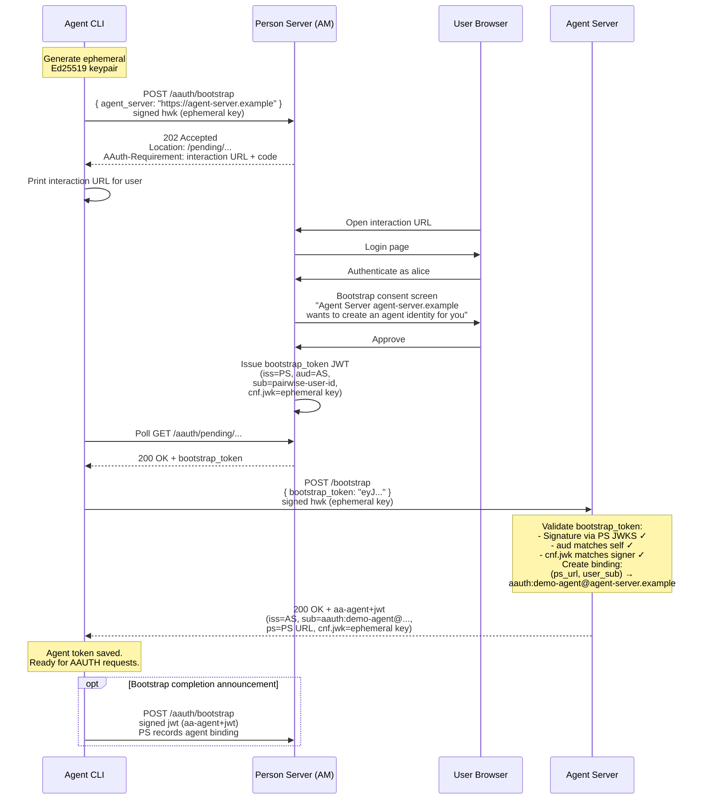

# Phase 17: AAUTH-Secured MCP Demo (`gravitee-aauth-demo`)

## Goal

Build a self-contained, end-to-end demonstration showcasing Gravitee AM's AAUTH protocol implementation with **a real agent accessing an MCP Calendar server secured by AAUTH**, with Gravitee AM as the Person Server. The demo uses the AAUTH Bootstrap extension to establish agent identity, then demonstrates the full authorization flow including consent and clarification chat.

The demo has clear runtime entity separation reflecting a real production environment: an **Agent Server** that manages agent identity, an **Agent CLI** that bootstraps through the Person Server and calls MCP tools, and an **MCP Calendar** protected by AAUTH.

## Why MCP?

Model Context Protocol (MCP) currently defines OAuth 2.1 as its auth layer. That model has well-known limitations for AI agents — which is exactly the problem AAUTH was designed to solve. An MCP server protected by AAUTH is a strict improvement: no client pre-registration, cryptographic proof-of-possession on every request, first-class user-consent semantics, and built-in clarification chat for explainability.

## Runtime Entities

```
┌──────────────────────┐     ┌────────────────────────┐     ┌───────────────────────┐
│  Agent Server        │     │  Gravitee AM           │     │ MCP Calendar (AAUTH)  │
│  (port 9000)         │     │  (port 8092)           │     │ (port 8081)           │
│                      │     │                        │     │                       │
│  /.well-known/       │     │  Person Server (PS)    │     │  calendar.read        │
│   aauth-agent.json   │     │   POST /aauth/token    │     │  calendar.write       │
│  /jwks.json          │     │   POST /aauth/bootstrap│   c │                       │
│  POST /bootstrap     │     │   GET  /aauth/pending  │     │  aauth-resource filter│
│  POST /refresh       │     │   GET  /aauth/interact │     └───────────────────────┘
└──────────┬───────────┘     └──────────┬─────────────┘
           │                            │
           │ aa-agent+jwt               │
           ▼                            │
┌─────────────────────────┐             │
│  Agent CLI              │─────────────┘
│  (ephemeral process)    │
│                         │
│  1. Generate keypair    │
│  2. Bootstrap via PS    │
│  3. Receive agent_token │
│  4. Call MCP tools      │
└─────────────────────────┘
```

### Entity Descriptions

**Agent Server** — A stable, long-lived service that:
- Holds the agent identity keypair and publishes `/.well-known/aauth-agent.json` + `/jwks.json`
- Exposes `POST /bootstrap` that validates a `bootstrap_token` from the PS and issues `aa-agent+jwt` tokens binding the CLI's ephemeral key to the agent identity
- Exposes `POST /refresh` for token renewal without PS involvement
- The agent identifier is `aauth:demo-agent@agent-server.example` (no port in identifiers per spec)

**Agent CLI** — An ephemeral process that:
- Generates an Ed25519 keypair on startup
- Runs the AAUTH Bootstrap ceremony: PS → consent → `bootstrap_token` → Agent Server → `aa-agent+jwt`
- Uses the `aa-agent+jwt` for all subsequent requests via `sig=jwt`
- Calls MCP tools, handles 401 → resource_token → authorization → auth_token → retry flows
- Handles clarification chat by forwarding user questions to an LLM (or scripted responses)

**Gravitee AM (Person Server)** — Provides:
- `POST /aauth/bootstrap` — accepts signed request with `agent_server` parameter, triggers user authentication + consent, issues `bootstrap_token` (JWT directed at the Agent Server)
- `POST /aauth/token` — standard AAUTH token endpoint for resource access authorization
- `GET /aauth/pending/:id` — polling endpoint for deferred flows
- `GET /aauth/interact` — user interaction endpoint (consent screen)

**MCP Calendar** — An MCP server exposing `calendar.read` and `calendar.write` tools, protected by AAUTH via the `aauth-resource` filter. User identity comes from the validated auth_token's `sub` claim.

## The Bootstrap Ceremony

The AAUTH Bootstrap extension (`draft-hardt-aauth-bootstrap`) specifies how an agent establishes its initial identity through a ceremony mediated by the Person Server.

### Flow



After bootstrap, the CLI holds an `aa-agent+jwt` with identity `aauth:demo-agent@agent-server.example` and uses it for all AAUTH resource access.

## The Story

### Setup (one-time, automated)

`docker compose up -d` brings up:
1. **Gravitee AM** — pre-provisioned domain `aauth-demo`, inline IdP with user `alice / wAth0RvYpw`, AAUTH enabled, bootstrap endpoint active
2. **Agent Server** — publishes metadata at `http://agent-server:9000/.well-known/aauth-agent.json`, JWKS, and bootstrap/refresh endpoints
3. **MCP Calendar** — HTTP MCP server at `http://mcp-calendar:8081`, AAUTH-protected, seeded with sample events for alice

No agent tokens, no ScopeApproval rows are pre-seeded. Everything starts from scratch.

### Scenario A — Bootstrap + first calendar access

The user registers a new agent CLI and reads their calendar for the first time.

```
$ ./agent-cli bootstrap \
    --ps http://am:8092/aauth-demo \
    --agent-server http://agent-server:9000

[cli] Generated ephemeral Ed25519 keypair
[cli] POST http://am:8092/aauth-demo/aauth/bootstrap
      { "agent_server": "http://agent-server:9000" }
      signed with hwk scheme (ephemeral key)

[am]  Received bootstrap request for agent server http://agent-server:9000
[am]  202 Accepted — user interaction required
      Location: /aauth/pending/a1b2...
      AAuth-Requirement: requirement=interaction;
        url="http://am:8092/aauth-demo/aauth/interact";
        code="BOOT-7K2L"

[cli] Open this URL in your browser to authorize the agent:

      http://am:8092/aauth-demo/aauth/interact?code=BOOT-7K2L

[cli] Polling for completion...
```

User opens the URL, signs in as alice, sees:

```
┌────────────────────────────────────────────────────┐
│  Agent Bootstrap Request                           │
│                                                    │
│  Agent Server: agent-server.example                │
│  wants to create an agent identity for you.        │
│                                                    │
│  [Approve]  [Deny]                                 │
└────────────────────────────────────────────────────┘
```

User clicks **Approve**.

```
[am]  User approved → issuing bootstrap_token
      (iss=PS, aud=http://agent-server:9000,
       sub=<pairwise-alice-id>, cnf.jwk=<ephemeral>)

[cli] Received bootstrap_token from PS
[cli] POST http://agent-server:9000/bootstrap
      { "bootstrap_token": "eyJ..." }
      signed with hwk scheme

[as]  Validating bootstrap_token...
[as]  ✓ Signature valid (verified via PS JWKS)
[as]  ✓ aud matches http://agent-server:9000
[as]  ✓ cnf.jwk matches request signer
[as]  Creating binding: alice → aauth:demo-agent@agent-server.example
[as]  Issuing aa-agent+jwt

[cli] ✓ Bootstrapped as aauth:demo-agent@agent-server.example
[cli] Agent token saved (expires in 3600s)
```

Now the agent reads the calendar:

```
$ ./agent-cli ask "What is on my calendar today?"

[cli] Calling MCP calendar.read...
[cli] POST http://mcp-calendar:8081/mcp
      Signature-Key: sig=jwt;jwt="<aa-agent+jwt>"
      ...signed with HTTP Message Signatures (RFC 9421)

[mcp] Verified agent signature via Agent Server JWKS
[mcp] No auth_token presented → minting resource_token
[mcp] 401 + AAuth-Requirement: requirement=auth-token; resource-token="eyJ..."

[cli] Got 401 with resource_token. Requesting auth_token from PS...
[cli] POST http://am:8092/aauth-demo/aauth/token
      { "resource_token": "eyJ..." }
      signed with sig=jwt (aa-agent+jwt)

[am]  Validated resource_token, agent = aauth:demo-agent@agent-server.example
[am]  No cached consent for calendar.read → 202 deferred
      Location: /aauth/pending/3b1a...
      AAuth-Requirement: requirement=interaction;
        url="http://am:8092/aauth-demo/aauth/interact";
        code="QPX9-4M8N"

[cli] User consent required. Open this URL:

      http://am:8092/aauth-demo/aauth/interact?code=QPX9-4M8N

[cli] Polling...
```

User sees the consent screen:

```
┌────────────────────────────────────────────────────┐
│  Agent Authorization Request                       │
│                                                    │
│  demo-agent (agent-server.example) wants:          │
│    ○ calendar.read  (read your calendar events)    │
│                                                    │
│  [Approve]  [Deny]                                 │
└────────────────────────────────────────────────────┘
```

User clicks **Approve**.

```
[am]  User approved → minting auth_token
[am]  Persisting ScopeApproval (alice, aauth:demo-agent@agent-server.example, calendar.read)

[cli] Polling → 200 OK with auth_token (expires_in=300)
[cli] Retrying calendar.read with auth_token...

[mcp] Verified auth_token, sub=alice → returning calendar

Today you have:
  10:00 – 10:30  Engineering standup
  14:00 – 15:00  Product review
  16:30 – 17:00  1:1 with Bob
```

### Scenario B — Calendar write with clarification

```
$ ./agent-cli ask "Schedule a 30-minute meeting tomorrow at 10am"

[cli] Calling MCP calendar.write...
[mcp] auth_token does NOT cover calendar.write → 401 + resource_token

[cli] Requesting auth_token for calendar.write...
[am]  No cached consent for calendar.write → 202 deferred
      code="ABCD-1234"

[cli] User consent required. Open this URL:

      http://am:8092/aauth-demo/aauth/interact?code=ABCD-1234
```

User sees the consent screen and clicks **Ask the agent a question**:

```
┌────────────────────────────────────────────────────┐
│  Agent Authorization Request                       │
│                                                    │
│  demo-agent wants:                                 │
│    ○ calendar.write  (create/modify events)        │
│                                                    │
│  [Ask a question]                                  │
│  ┌──────────────────────────────────────────────┐  │
│  │ Why do you need write access?                │  │
│  └──────────────────────────────────────────────┘  │
│  [Send]  [Approve]  [Deny]                         │
└────────────────────────────────────────────────────┘
```

The clarification round-trips:

```
[am]  User asked: "Why do you need write access?"
[am]  status → AWAITING_CLARIFICATION

[cli] Polling → clarification question received
[cli] Generating response...
[cli] POST /aauth/pending/... { clarification_response: "I need calendar.write
      to create the meeting event you asked for. Without it, I can only
      read your existing events." }

[am]  Agent responded → status back to INTERACTING
```

User sees the response, clicks **Approve**:

```
[am]  Approved → minting auth_token, persisting ScopeApproval

[cli] Polling → 200 OK with auth_token
[cli] Retrying calendar.write...
[mcp] Verified auth_token, sub=alice, creating event...

Done. Created "Meeting" tomorrow from 10:00 to 10:30.
```

### After both scenarios

Alice has two ScopeApprovals: `calendar.read` and `calendar.write`. Re-running either scenario is friction-free — cached consents skip the 202 deferred path entirely. The Gravitee AM admin console shows the agent under Applications (auto-registered), with all audit events, per-request `agentIdentifier`, and the user who approved each scope.

## Architecture

### Agent identity model: delegated multi-instance (Pattern B)

The Agent Server is a separate stable service from the CLI. The CLI generates an ephemeral keypair on startup and obtains an `aa-agent+jwt` via the bootstrap ceremony. This mirrors production deployments where:
- The Agent Server holds the stable identity and long-lived signing key
- Multiple ephemeral CLI/agent instances can bootstrap independently
- Key rotation and revocation are centralized at the Agent Server
- A leaked ephemeral key only compromises one short-lived `aa-agent+jwt`

The Agent Server does NOT hold the CLI's private key. It only binds the CLI's public key (via `cnf.jwk`) to the agent identity. The CLI signs all requests with its own ephemeral key.

## Repository Layout

```
gravitee-aauth-demo/
├── pom.xml                         (parent POM, JDK 21, Spring Boot BOM)
├── README.md
├── docker-compose.yml
├── .env.example
├── am-config/
│   ├── provision.sh                (provisions domain, IdP, AAUTH settings via AM Management API)
│   ├── domain.json
│   └── inline-idp.json
├── aauth-client/
│   ├── pom.xml
│   └── src/main/java/.../
│       ├── AAuthClient.java                 (high-level facade)
│       ├── HttpMessageSigner.java           (RFC 9421 signing)
│       ├── SignatureKeyBuilder.java          (Signature-Key header construction)
│       ├── ContentDigestBuilder.java         (RFC 9530)
│       ├── AAuthRequirementParser.java       (parse AAuth-Requirement from 401/202)
│       ├── PendingPoller.java               (polling helper for 202/pending URLs)
│       ├── AuthTokenStore.java              (in-memory cache of auth_tokens)
│       ├── AgentKeyPairProvider.java         (generates Ed25519 keypair)
│       ├── BootstrapClient.java             (PS bootstrap + Agent Server bootstrap)
│       └── AgentTokenHolder.java            (holds aa-agent+jwt, handles refresh)
├── aauth-resource/
│   ├── pom.xml
│   └── src/main/java/.../
│       ├── AAuthResourceFilter.java          (Spring HTTP filter, verifies signatures)
│       ├── HttpMessageSignatureVerifier.java
│       ├── ResourceTokenMinter.java          (mints aa-resource+jwt)
│       ├── AuthTokenValidator.java           (validates aa-auth+jwt from PS)
│       ├── AAuthRequirementWriter.java       (writes 401 + AAuth-Requirement)
│       ├── ResourceKeyPairProvider.java
│       └── config/
│           └── AAuthResourceProperties.java
├── agent-server/
│   ├── pom.xml
│   └── src/main/java/.../
│       ├── AgentServerApplication.java
│       ├── metadata/
│       │   ├── AgentMetadataController.java  (/.well-known/aauth-agent.json)
│       │   └── AgentJwksController.java      (/jwks.json)
│       ├── bootstrap/
│       │   ├── BootstrapController.java      (POST /bootstrap)
│       │   ├── BootstrapTokenValidator.java  (validates PS bootstrap_token)
│       │   └── AgentTokenIssuer.java         (issues aa-agent+jwt)
│       ├── refresh/
│       │   └── RefreshController.java        (POST /refresh)
│       ├── store/
│       │   └── BindingStore.java             (in-memory user→identity bindings)
│       └── config/
│           └── AgentServerProperties.java
├── agent-cli/
│   ├── pom.xml
│   └── src/main/java/.../
│       ├── AgentCliApplication.java          (Spring Boot main + CLI runner)
│       ├── BootstrapCommand.java             (runs the bootstrap ceremony)
│       ├── AskCommand.java                   (calls MCP tools)
│       ├── McpAAuthInterceptor.java          (signs MCP calls, handles 401→retry)
│       ├── ClarificationHandler.java         (handles clarification questions)
│       └── config/
│           └── CliConfig.java
├── mcp-calendar/
│   ├── pom.xml
│   └── src/main/java/.../
│       ├── CalendarMcpApplication.java
│       ├── tools/
│       │   ├── CalendarReadTool.java         (@Tool, returns events)
│       │   └── CalendarWriteTool.java        (@Tool, creates event)
│       ├── store/
│       │   └── InMemoryCalendarStore.java    (seeded with events for alice)
│       └── config/
│           └── ResourceConfig.java
└── scripts/
    ├── run-demo.sh
    └── reset-am.sh
```

## Key Implementation Details

### `aauth-client` library

Framework-agnostic Java 21 library that:
- Generates or loads an Ed25519 keypair
- Implements HTTP Message Signatures (RFC 9421) signing for `hwk`, `jwks_uri`, and `jwt` schemes
- Builds `Signature-Key`, `Signature-Input`, `Signature`, and `Content-Digest` headers
- Provides `BootstrapClient` that runs the full bootstrap ceremony (PS → consent → bootstrap_token → Agent Server → aa-agent+jwt)
- Provides `AAuthClient.requestAuthToken(resourceToken)` that posts to the PS token endpoint
- Provides `PendingPoller` that polls until terminal response
- Caches auth_tokens per audience

### `aauth-resource` library

Spring Boot starter that adds AAUTH protection to any Spring HTTP service:
- `AAuthResourceFilter` intercepts requests on configured paths
- Verifies HTTP Message Signatures
- For `sig=jwt` with `aa-auth+jwt`: validates against PS JWKS, checks `aud`, `dwk`, `exp`, verifies HTTP signature with `cnf.jwk`
- For unauthenticated requests: mints `aa-resource+jwt` and returns 401 + `AAuth-Requirement`
- Populates Spring Security `Authentication` with verified agent identity and scopes

### Agent Server

Spring Boot service that:
- Publishes `/.well-known/aauth-agent.json` with `issuer`, `jwks_uri`, `bootstrap_endpoint`, `refresh_endpoint`
- `POST /bootstrap`: validates PS `bootstrap_token` (signature via PS JWKS, `aud` match, `cnf.jwk` match), creates `(ps_url, user_sub) → aauth:local@domain` binding, issues `aa-agent+jwt` with `cnf.jwk` = CLI's ephemeral key
- `POST /refresh`: re-issues `aa-agent+jwt` for existing binding without PS involvement

### Agent CLI

Spring Boot CLI that:
- `bootstrap` command: generates ephemeral keypair, runs bootstrap ceremony, stores `aa-agent+jwt` locally
- `ask` command: calls MCP tools via signed HTTP, handles 401 → token → retry transparently
- Clarification handler: when polling returns a clarification question, generates a response (scripted or LLM) and posts it back

### MCP Calendar

Spring Boot MCP server:
- `calendar.read` and `calendar.write` tools via Spring AI MCP annotations
- `aauth-resource` filter enforces AAUTH on all MCP endpoints
- User identity from auth_token `sub` claim scopes data per user
- In-memory event store seeded with sample events for alice

## Gravitee AM Provisioning

`am-config/provision.sh` runs at startup and provisions:
1. Domain `aauth-demo` with `path: /aauth-demo`
2. Inline IdP with user `alice / wAth0RvYpw`
3. Signing certificate (Ed25519)
4. AAUTH settings: `enabled: true`, `authTokenLifespan: 300`
5. Default IdPs assigned for auto-registered agents

No ScopeApproval rows pre-seeded. No agents pre-registered.

## Docker Compose

```yaml
services:
  mongo:
    image: mongo:7

  am:
    image: graviteeio/am-gateway:4.12.x-aauth
    depends_on: [mongo]
    ports: ["8092:8092"]

  am-management:
    image: graviteeio/am-management-api:4.12.x-aauth
    depends_on: [mongo]
    ports: ["8093:8093"]

  am-bootstrap:
    image: alpine:3
    depends_on: [am-management]
    volumes: ["./am-config:/work"]
    command: ["/work/provision.sh"]

  agent-server:
    build: ./agent-server
    depends_on: [am-bootstrap]
    ports: ["9000:9000"]
    environment:
      AGENT_SERVER_ISSUER: "http://agent-server:9000"
      AGENT_SERVER_DOMAIN: "agent-server.example"
      PS_JWKS_URI: "http://am:8092/aauth-demo/aauth/.well-known/jwks.json"

  mcp-calendar:
    build: ./mcp-calendar
    depends_on: [am-bootstrap]
    ports: ["8081:8081"]
    environment:
      AAUTH_RESOURCE_ID: "http://mcp-calendar:8081"
      AAUTH_PS_ISSUER: "http://am:8092/aauth-demo/aauth"
```

The Agent CLI is not a long-running service — it's run interactively by the user:

```bash
docker compose exec agent-cli ./agent-cli bootstrap \
  --ps http://am:8092/aauth-demo \
  --agent-server http://agent-server:9000

docker compose exec agent-cli ./agent-cli ask "What is on my calendar today?"
```

## Dev Relaxations

- **HTTP, not HTTPS** — the AAUTH spec mandates HTTPS. The demo runs HTTP inside the docker network.
- **Local hostnames** — docker network aliases, not real DNS.
- **Test user** — `alice / wAth0RvYpw`, hard-coded.
- **No platform attestation** — the bootstrap spec allows WebAuthn/App Attest. The demo skips attestation for simplicity.

## Implementation Phases

### Phase A: `aauth-client` + `aauth-resource` libraries
Core building blocks. HTTP Message Signatures, token handling, resource filter.

### Phase B: Agent Server
Metadata, JWKS, `POST /bootstrap`, `POST /refresh`, binding store, `aa-agent+jwt` issuance.

### Phase C: MCP Calendar
Calendar tools, `aauth-resource` filter wiring, in-memory store.

### Phase D: Agent CLI
Bootstrap command, ask command, MCP transport interceptor, clarification handler.

### Phase E: Docker Compose + AM provisioning
Full stack, provisioning script, README walkthrough.

## Validation

### Unit tests (per module)
- `aauth-client`: signature signing, header building, requirement parsing, polling
- `aauth-resource`: filter behavior (unsigned → 401, signed → resource_token, auth_token → 200)
- `agent-server`: bootstrap_token validation, aa-agent+jwt issuance, binding store
- `agent-cli`: bootstrap ceremony, MCP interceptor 401→retry sequence
- `mcp-calendar`: tool implementations, store operations

### End-to-end walkthrough
1. `docker compose up -d` — all services start
2. Bootstrap: CLI obtains `aa-agent+jwt` via PS-mediated ceremony
3. Scenario A: `calendar.read` with first-time consent → works
4. Scenario B: `calendar.write` with clarification → works
5. Re-run Scenario A: cached consent → instant response, no consent screen

## Dependencies on Previous Phases

| Phase | Why needed |
|-------|-----------|
| P1 | PS metadata at `/.well-known/aauth-person.json` |
| P2 | HTTP Message Signature verification |
| P3 | `jwks_uri` scheme for agent key verification |
| P6 | Token endpoint (resource_token → auth_token) |
| P8 | 202 deferred response, pending URL, consent UI |
| P9 | `sig=jwt` scheme, auth token signing with `aa-auth+jwt` |
| P10 | Clarification chat |
| Bootstrap | PS `POST /aauth/bootstrap` endpoint |
