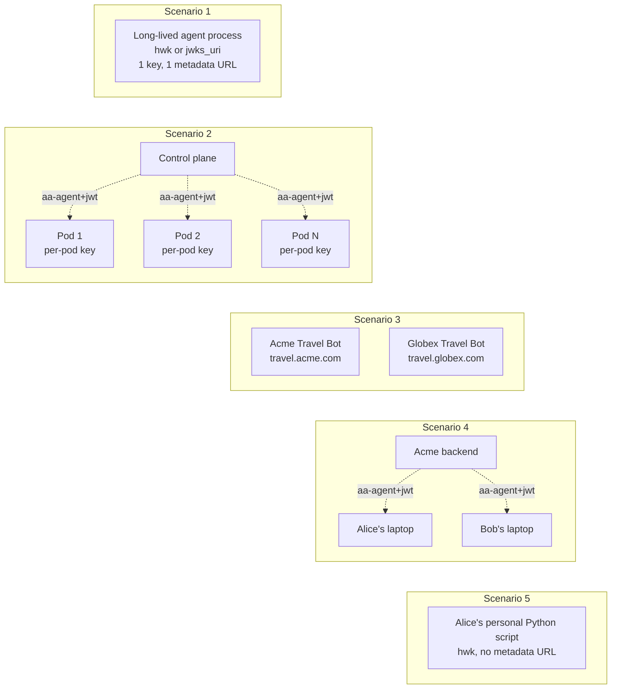

# Agent Modeling Reference

> Companion document to [Phase 4: Agent Application Lifecycle](./04-agent-application-lifecycle.md). This file is **not a phase** -- it does not introduce any code. It exists as a single, scenario-driven reference for the question "how does Gravitee AM model an AAUTH agent across all five canonical deployment topologies?". Read it when Phase 4's contracts feel abstract or when adding a new scenario.

## The two concepts the spec defines

| Concept | What it is | Stable? | Example |
|---------|-----------|---------|---------|
| **Agent Server** | The logical product/brand. Identified by its metadata URL (the `/.well-known/aauth-agent.json` location). What appears as `iss`/`aud`/`agent` in tokens. | Yes -- lives as long as the product. | `https://travel.acme.com/.well-known/aauth-agent.json` |
| **Agent Identity** | A concrete signing key (JWK + thumbprint) used by *some process* to prove "I am acting on behalf of that Agent Server". | No -- per-process, often ephemeral. | jkt `aBc12...` (Ed25519 public key thumbprint) |

In single-instance deployments, the Agent Server **is** the Agent Identity (one product, one key, forever). In delegated multi-instance deployments, one Agent Server can have hundreds of Agent Identities at once -- each pod, each desktop install, each spawned worker has its own keypair.

## The modeling rule

> **`Application(type=AAUTH_AGENT)` = Agent Server (one per metadata URL).**
> **Agent Identity = audit event attribute (no first-class entity).**

That single rule is enough to handle all five canonical scenarios below without special cases. The detailed rationale for *why* this rule (and not "1 Application per identity") is in [Phase 4's Design section](./04-agent-application-lifecycle.md#design).

## The five canonical scenarios

The five subgraphs above are: **(1)** single-instance long-lived agent, **(2)** delegated multi-instance with `aa-agent+jwt`, **(3)** two independent Agent Servers running the same software, **(4)** centralized brand with user-distributed processes via `aa-agent+jwt`, **(5)** truly local pseudonymous agent. Each is detailed in its own subsection below.

### Scenario 1 -- Single-instance long-lived agent

- **Topology**: one process, one keypair, one metadata URL. Lives at e.g. `http://agent:9000`. The Phase 16 demo agent looks like this.
- **Signature scheme**: `hwk` or `jwks_uri`. Both carry a `dwk` parameter pointing at the agent's metadata document.
- **What AM does**:
  1. Phase 3 verifies the signature.
  2. Phase 4's registry resolves the metadata URL from the `dwk` parameter.
  3. On first contact, AM auto-creates an `Application(type=AAUTH_AGENT)` with `clientId = http://agent:9000/.well-known/aauth-agent.json`.
  4. On every subsequent contact, the same Application is reused.
  5. If the agent rotates its key (same metadata URL, new thumbprint), the same Application is still reused -- only the audit event's `agent_jkt` attribute changes.
- **Application count**: **1**.
- **User binding**: No. Single-instance agents are autonomous backend services. They request machine-to-machine auth_tokens (`scope` only, no `sub`). User consent does not apply.
- **First-party mode**: Yes — agent can request permissions from the PS (Phase 12).

### Scenario 2 -- Delegated multi-instance (data-center pods)

- **Topology**: a control plane holds the long-lived Agent Server identity (`https://travel.acme.com`). Worker pods spawn on demand, each with a fresh per-pod keypair. The control plane mints a short-lived `aa-agent+jwt` for each pod, binding the pod's key to the Agent Server identity.
- **Signature scheme**: `jwt`. The pod signs its requests with its own per-pod key and presents the `aa-agent+jwt` via `Signature-Key: sig=jwt; jwt="<aa-agent+jwt>"` (per [spec Section 9.2](https://github.com/dickhardt/AAuth)).
- **What AM does**:
  1. Phase 3 verifies the request signature against the pod's `cnf.jwk` AND verifies the `aa-agent+jwt` against the control plane's JWKS.
  2. Phase 4's registry resolves the canonical Agent Server URL from the `aa-agent+jwt`'s `iss` claim (= `https://travel.acme.com/.well-known/aauth-agent.json`), **NOT** from the per-pod signing key.
  3. The first ever pod triggers auto-create. Every subsequent pod reuses the same Application.
  4. Each pod's signing-key thumbprint is recorded as the `agent_jkt` audit attribute on its individual token-issuance event.
- **Application count**: **1**, regardless of pod count.
- **User binding**: No. Pods are autonomous backend workers -- no human is in front of a browser when the pod makes the request. They request machine-to-machine auth_tokens (`scope` only, no `sub`). User consent does not apply. If a use case involves a user-facing frontend that can redirect a browser to AM's interaction endpoint, that frontend is a classic OIDC client, not an AAUTH agent.
- **First-party mode**: Yes — agent can request permissions from the PS (Phase 12).

### Scenario 3 -- Two independent Agent Servers running the same software

- **Topology**: Acme deploys "Travel Bot" at `travel.acme.com` and Globex deploys the same bot image at `travel.globex.com`. Two distinct metadata URLs, two independent deployments. This is Scenario 1 × 2.
- **Signature scheme**: `hwk` or `jwks_uri` (same as Scenario 1 -- each server is a single-instance long-lived agent).
- **What AM does**: two distinct metadata URLs → two distinct registry lookups → **two distinct Applications**. Independent audit, independent allow/deny pattern matching, independent kill switches.
- **Application count**: **2** (one per metadata URL).
- **User binding**: No. Same reasoning as Scenario 1 -- each server is an autonomous backend service.
- **First-party mode**: Yes, independently per server.

### Scenario 4 -- Centralized brand, distributed user-installed processes

- **Topology**: Acme publishes an AI assistant. Alice installs it on her laptop, Bob installs it on his. Both processes act on behalf of "Acme Assistant" (the centralized brand). The metadata URL is centralized: `https://assistant.acme.com/.well-known/aauth-agent.json`. Only the running processes are distributed.
- **Signature scheme**: `jwt` (required). Each local install generates a fresh per-instance keypair on launch and asks Acme's backend for an `aa-agent+jwt` binding that key to the Acme Assistant identity. Acme authenticates the user via its own login (outside AAUTH's scope). The local process then signs with its own key and presents the `aa-agent+jwt` via `Signature-Key: sig=jwt; jwt="<aa-agent+jwt>"`.
- **What AM does**:
  1. Phase 3 verifies the request signature against the local install's `cnf.jwk` AND verifies the `aa-agent+jwt` against Acme's control-plane JWKS.
  2. Phase 4's registry resolves the Agent Server URL from the `aa-agent+jwt`'s `iss` claim (= `https://assistant.acme.com/.well-known/aauth-agent.json`).
  3. One Application for the Agent Server, regardless of how many user installs exist. Each install's thumbprint appears as `agent_jkt` in audit events.
- **Application count**: **1**, regardless of user count.
- **User binding**: Yes. A human (Alice, Bob) is sitting in front of the device running the agent. When the agent requests a user-bound auth_token, AM returns 202, the agent surfaces the interaction URL to the human, and the human authenticates to AM in their own browser. The consent cache is keyed on `(domain, user, agent metadata URL)`. Alice's entry is `(domain, alice, assistant.acme.com)`; Bob's is `(domain, bob, assistant.acme.com)` -- completely independent. See "Why consent never leaks across users" below.
- **First-party mode**: Yes — agent can request permissions from the PS (Phase 12).
- **Why `jwt` is the only viable scheme here**: with `hwk` or `jwks_uri`, AM has no way to know that Alice's laptop key is "an instance of Acme Assistant" -- those schemes only prove "I hold this key", not "I belong to that brand". The `jwt` scheme is the spec's mechanism for delegated identity.

### Scenario 5 -- Truly local pseudonymous agent

- **Topology**: Alice writes a personal Python script that uses an LLM library. There is no centralized brand, no metadata URL.
- **Signature scheme**: `hwk` with **no** `dwk` parameter. This is the AAUTH spec's [pseudonym mode (Section 4.3)](https://github.com/dickhardt/AAuth): no name, no description, no recognizable brand. All AM sees is "some entity holding this keypair".
- **What AM does**:
  1. Phase 3 verifies the signature.
  2. Phase 4's registry attempts to resolve a metadata URL → no `dwk` parameter, no `aa-agent+jwt` → returns empty (`Maybe.empty()`).
  3. Phase 4 does **NOT** create an Application.
  4. Phase 6's token endpoint sees `aauth.application` is absent. If the request is user-bound, the endpoint refuses with `403 reason=pseudonymous_user_binding`. Pure machine flows (scope-only via resource_token) proceed without an Application actor.
- **Application count**: **0**.
- **User binding**: No -- refused. Pseudonymous agents have no stable identity for users to recognize at consent time. User-bound flows require a named agent (Scenarios 1-4).
- **First-party mode**: Yes — agent can request permissions from the PS (Phase 12).
- **Why no Application**: no stable name for the management UI, no brand for meaningful consent, and would explode the Application table if every script generates a fresh keypair per session.
- **Audit**: the token-issuance audit event still records `agent_jkt` and `signature_scheme`, but `actor.id` is null (no Application). This is the only place in AAUTH audit events where `actor.id` can be null.

## Why consent never leaks across users

The consent cache key is `(domain, AM user ID, agent metadata URL)`. All three components must match for a cache hit. The critical question is: where does the AM user ID come from?

**It comes from the user authenticating directly to AM — never from the agent or the resource_token.**

A `resource_token` carries `iss`, `dwk`, `aud`, `jti`, `agent`, `agent_jkt`, `iat`, `exp`, and optional `scope` ([Section 10.1](https://github.com/dickhardt/AAuth)). There is no user claim of any kind. The token endpoint request can include a `login_hint` ([Section 13.2](https://github.com/dickhardt/AAuth)), but per [OpenID Connect Core 3.1.2.1](https://openid.net/specs/openid-connect-core-1_0.html#AuthRequest) this is just a hint — the AS does not trust it for authorization decisions.

The only way a user identity enters the flow is at the **interaction endpoint**: the agent surfaces the pending URL to a real human, the human opens it in their own browser, and authenticates to AM with their own credentials. AM's session then identifies the user authoritatively.

This means:
- Every user-bound `POST /aauth/token` returns 202 — no shortcut, because the user is unknown.
- Each pending request carries a unique, single-use interaction code. Bob's code is not Alice's code.
- When Bob opens his pending URL and authenticates as Bob, AM looks up `(domain, bob, agent metadata URL)` — a separate cache entry from Alice's `(domain, alice, agent metadata URL)`.
- There is no path by which Bob's authentication can reach Alice's `ScopeApproval` row.
- A user-bound auth_token with `sub=alice` can only be minted if Alice herself authenticates to AM. No agent process, no resource server, and no other user can substitute for this step.

## Quick decision table

| Question | Answer |
|----------|--------|
| Did the request resolve to a metadata URL? | If no → pseudonym mode → no Application, refuse user-bound flows. If yes → continue. |
| Does an Application with that metadata URL already exist? | If yes → reuse it, refresh `lastSeenAt` (debounced). If no → continue. |
| Is `autoRegisterAgents` true for this domain? | If yes → fetch metadata, auto-create the Application, return it. If no → throw `AgentRegistrationException`, token endpoint returns `403 reason=agent_not_registered`. |
| Was this a `jwt`-scheme request? | The metadata URL is the `aa-agent+jwt.iss`, not the per-process signing key. |
| Was this a `hwk`/`jwks_uri` request? | The metadata URL is the `dwk` parameter on the Signature-Key header. |
| Should I create an `AgentIdentity` entity for this thumbprint? | **No.** Identities live in audit event attributes, not in their own table. |

## When to update this document

Add a new scenario here whenever a deployment topology comes up that doesn't cleanly map to one of the five above. Examples that have been *considered* and folded into the existing five:

- "Same software, two regions of the same company" → Scenario 3 (each region publishes its own metadata URL).
- "Mobile app installed from the app store" → Scenario 4 (one centralized brand, many per-device installs, `jwt` scheme).
- "User-installed agent that polls a centralized auth service for credentials at startup" → Scenario 4 (the centralized auth service is the Acme backend; the agent process is the local install).
- "An agent that rotates its signing key every hour" → Scenario 1 (key rotation, same metadata URL, same Application, audit shows changing thumbprints).

## See also

- [Phase 4: Agent Application Lifecycle](./04-agent-application-lifecycle.md) -- the executable spec for the registry, audit attribute schema, and `autoRegisterAgents` flag.
- [Phase 9: JWT Signature Scheme + Agent Token Support](./09-jwt-scheme-agent-tokens.md) -- enables Scenarios 2 and 4 by registering the `JwtSchemeUrlResolver` strategy.
- [Phase 8: Deferred Authorization](./08-deferred-authorization.md) -- consumes `Application.id` as the actor on consent-grant audit events.
- [Phase 7: Domain Model + AAuth Settings](./07-domain-model-settings.md) -- defines the `autoRegisterAgents` flag.
