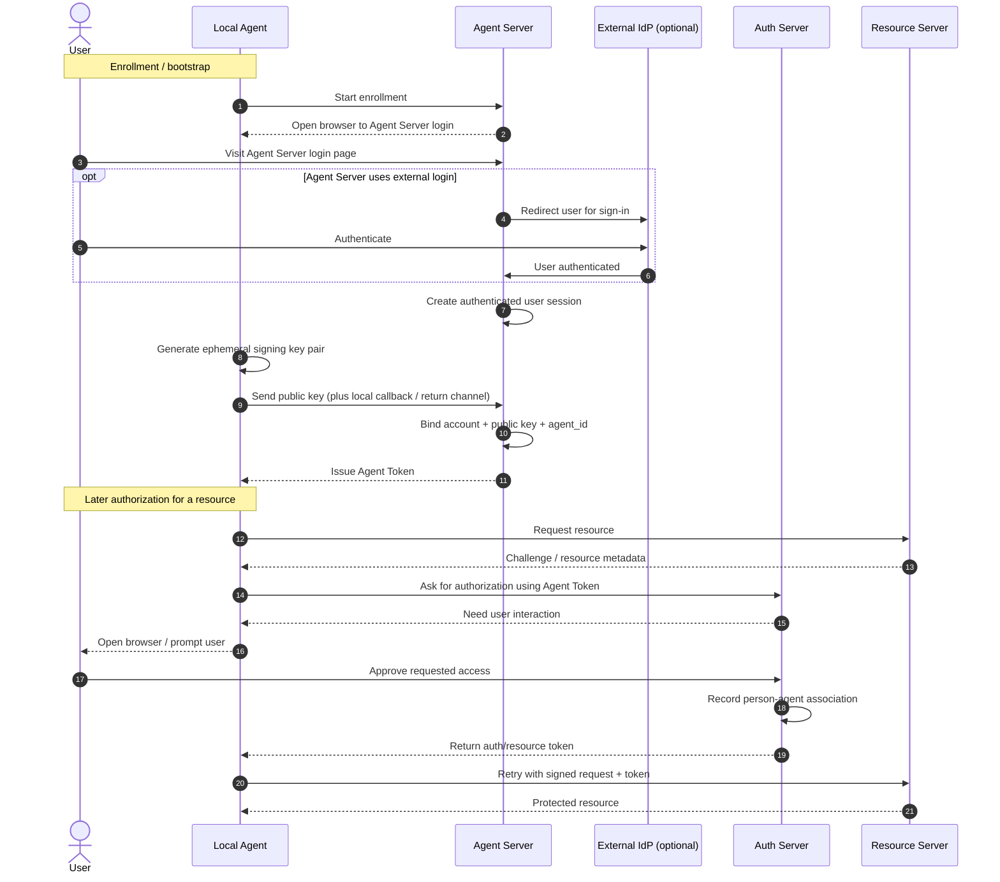

```mermaid
sequenceDiagram
    autonumber
    actor U as User
    participant A as Local Agent
    participant AS as Agent Server
    participant IdP as External IdP (optional)
    participant Au as Auth Server
    participant R as Resource Server

    Note over U,A: Enrollment / bootstrap
    A->>AS: Start enrollment
    AS-->>A: Open browser to Agent Server login
    U->>AS: Visit Agent Server login page

    opt Agent Server uses external login
        AS->>IdP: Redirect user for sign-in
        U->>IdP: Authenticate
        IdP->>AS: User authenticated
    end

    AS->>AS: Create authenticated user session
    A->>A: Generate ephemeral signing key pair
    A->>AS: Send public key (plus local callback / return channel)
    AS->>AS: Bind account + public key + agent_id
    AS-->>A: Issue Agent Token

    Note over U,A: Later authorization for a resource
    A->>R: Request resource
    R-->>A: Challenge / resource metadata
    A->>Au: Ask for authorization using Agent Token
    Au-->>A: Need user interaction
    A-->>U: Open browser / prompt user
    U->>Au: Approve requested access
    Au->>Au: Record person-agent association
    Au-->>A: Return auth/resource token
    A->>R: Retry with signed request + token
    R-->>A: Protected resource
```