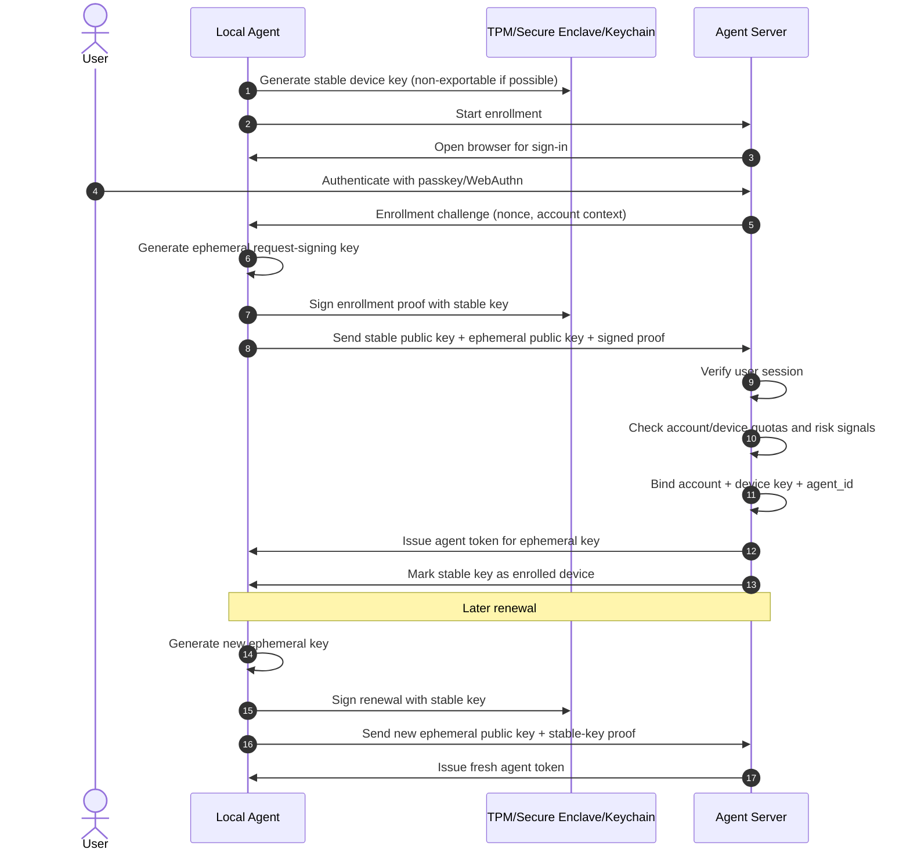

```mermaid
sequenceDiagram
    autonumber
    actor U as User
    participant A as Local Agent
    participant K as TPM/Secure Enclave/Keychain
    participant S as Agent Server

    A->>K: Generate stable device key (non-exportable if possible)
    A->>S: Start enrollment
    S->>A: Open browser for sign-in
    U->>S: Authenticate with passkey/WebAuthn
    S->>A: Enrollment challenge (nonce, account context)

    A->>A: Generate ephemeral request-signing key
    A->>K: Sign enrollment proof with stable key
    A->>S: Send stable public key + ephemeral public key + signed proof

    S->>S: Verify user session
    S->>S: Check account/device quotas and risk signals
    S->>S: Bind account + device key + agent_id
    S->>A: Issue agent token for ephemeral key
    S->>A: Mark stable key as enrolled device

    Note over A,S: Later renewal
    A->>A: Generate new ephemeral key
    A->>K: Sign renewal with stable key
    A->>S: Send new ephemeral public key + stable-key proof
    S->>A: Issue fresh agent token
```