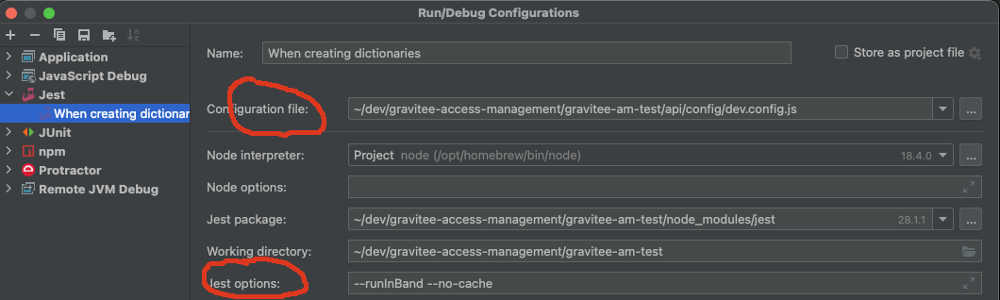

= Integration Tests

The AM integration tests run on Jest using Supertest to make calls to the AM APIs.
To run the tests from a terminal you need to be in the `gravitee-am-test` directory.

==== Build

Execute `npm install`.
You usually only need to do this once, i.e. after cloning the AM repo or when dependencies have changed.

==== Run tests with default config

Executing `npm test` will run all the tests.
To run individual tests use `npm test` followed by the name of the spec file.

    npm test my.jest.spec.ts

If you have Jest installed globally you can also run tests in the standard Jest way, although you will have to explicitly reference one of the environment variable config files:

    jest --config=api/config/dev.config.js

==== Run tests against a specific environment

The file `api/config/dev.setup.js` contains environment variables used by the tests to interact with AM.
Change these values to point to a specific instance of AM.

==== Run tests using Intellij run configuration

It's easy to run Jest specs in Intellij and makes debugging far simpler.
Simply click on the green arrow/triangle icon you see on your spec and select "Modify run configuration" (this will also create a run configuration), or right click the spec in the project navigation panel to select this same option.
You will have to ensure that any run configurations you create reference the appropriate jest config file (see the first circled field in the picture below). You also have the option of passing Jest CLI options (second circled example). All the other necessary fields are populated automatically by Intellij.



==== Writing tests

Commands required for setting up and configuring AM for testing can be found in the `commands` directory.
Each function returns an asynchronous request to an AM endpoint which can be executed using standard ES6 promises, async/await syntax or Supertest's own provided callback functions.

===== async/await example

    describe("when an endpoint is called", () => {
        it('gives an expected response', async () => {
            let response = await createApplication(domainId, accessToken, app);
            expect(response.body.name).toEqual(app.name);
        }
    }

===== promise example

    describe("when an endpoint is called", () => {
        it('gives an expected response', () => {
            return createApplication(domainId, accessToken, app)
                .then(response => {
                    expect(response.body.name).toEqual(app.name);
                });
        }
    }

See the https://github.com/visionmedia/supertest[supertest] github page for a more detailed explanation of its api.

==== Management API - OpenAPI specification

All Management API are generated using the OpenAPI generator from the `swagger.json` exposed by AM.

In order to update them, execute:

```
$ npm run update:sdk:mapi `http://AM_MANAGEMENT_API/management`
```

<<<<<<< HEAD
=== Exterenal resources
To run tests locally you need to have configure following resources:

==== Plugins:
Add following plugins to your `plugin` directory:

* gravitee-am-resource-sfr
* gravitee-am-factor-sms
* gravitee-service-geoip
* gravitee-am-gateway-handler-saml2-idp

==== CIBA delegated service
Build `gravitee-am-ciba-delegated-service`

and run `java -jar gravitee-am-ciba-delegated-service/target/gravitee-am-ciba-delegated-service-${AM_VERSION}.jar`

==== Mock email provider:

Run with command:
```
docker run -d --rm -p 5080:5080 -p 5025:5025 gessnerfl/fake-smtp-server:1.10.4
```

==== Wiremock:

Run with command:
```
docker run -d --rm --name wiremock -p 8181:8080 wiremock/wiremock:3.13.1 --verbose --global-response-templating
```

Configure with following script:
```
curl -X POST http://localhost:8181/__admin/mappings \
  -H "Content-Type: application/json" \
  -d '{
    "request": {
      "method": "POST",
      "url": "/sfr"
    },
    "response": {
      "status": 200,
      "headers": {
        "Content-Type": "application/json"
      },
      "body": "{{{request.body}}}",
      "transformers": ["response-template"]
    }
  }'

```

==== OpenFGA:

OpenFGA is required for testing the authorization engine plugin integration.

Run with command:
```
docker run -d --rm --name openfga -p 8090:8080 -p 8091:8081 -p 3000:3000 openfga/openfga:v1.8.5 run
```

Verify OpenFGA is running:
```
curl http://localhost:8090/healthz
```

=======
==== Provisioning CLI

You can provision a predictable environment from a JSON file.

Prerequisites:

- AM_MANAGEMENT_URL, AM_MANAGEMENT_ENDPOINT, AM_DEF_ORG_ID, AM_DEF_ENV_ID, AM_ADMIN_USERNAME, AM_ADMIN_PASSWORD exported in your shell.
- Install dev deps once: `npm i`

Usage:

. Copy and edit the example config:
+
----
cp scripts/provision.example.json my-provision.json
----
. Run the provisioner:
+
----
npm run provision -- ./my-provision.json
----

Config fields:

- namePrefix: string prefix for all created resources
- domains: number of domains to create
- applicationsPerDomain: apps per domain
- usersPerDomain: users per domain
- idp: default or mongo
- grantTypes: random | code-only | all
- features: optional array; currently logged and skipped (mfa, ciba, ratelimit)
- scopes: optional array; reserved for future use
>>>>>>> d714f2050 (Add provisioning CLI tool to automate Gravitee domain, application, and user creation)
