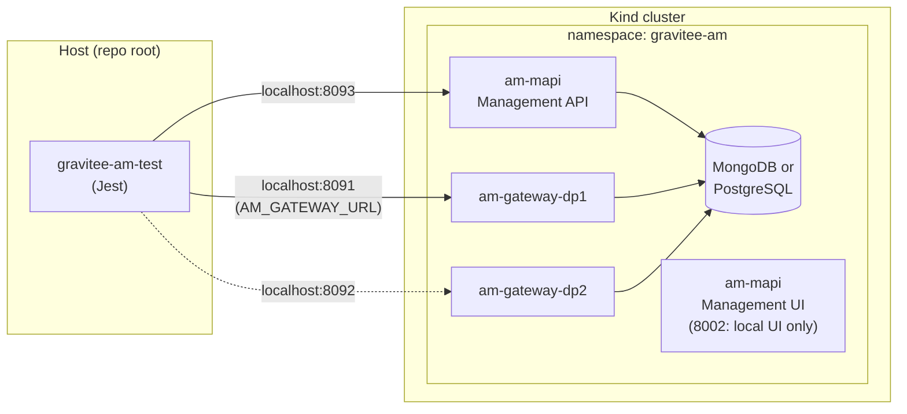

# AM Migration Test Tool

Orchestrates Gravitee AM migration tests: deploy an initial version (“from” tag), run verification tests, upgrade Management API and Gateways to a target version (“to” tag), verify again, and optionally downgrade back and re-verify.

**Supported environments:** Kubernetes (Kind) and Docker Compose (Docker Compose is **not functional** at the moment; see [Limitations and known issues](#limitations-and-known-issues)).  
**Supported databases (K8s):** MongoDB and PostgreSQL.

All commands must be run from the **repository root** (e.g. `./scripts/migration-test.mjs`) so paths to Helm charts, values files, and `gravitee-am-test` resolve correctly.

---

## Prerequisites

### Kubernetes (Kind)
- A running Kind cluster (e.g. `kind create cluster --name am-migration`).
- `kubectl` and `helm` installed.
- Gravitee license: set `GRAVITEE_LICENSE` (base64) or place a license file and set path via config (see `LicenseManager`).

### Docker Compose
- `docker-compose` and Docker daemon.  
- **Note:** The Docker Compose provider is not functional at the moment; use K8s for migration runs until it is fixed (see [Limitations and known issues](#limitations-and-known-issues)).

### All
- Node.js (for the tool and for running `gravitee-am-test` Jest suites).
- From repo root: `gravitee-am-test` and its dependencies (e.g. `npm install` in `gravitee-am-test` if needed).

---

## Workflow and design

### Stages (in order)
1. **clean** – Remove existing releases, secrets, namespace (K8s) or compose stack (Docker).
2. **k8s:setup** – (K8s only) Create namespace, deploy DB (MongoDB or PostgreSQL), create auth/license secrets; skip for Docker Compose.
3. **deploy-from** – Deploy AM at “from” tag (K8s: 1 Management API + 2 Gateways; Docker: 1 API + 1 Gateway). K8s starts port-forwards.
4. **verify-baseline** – Run management Jest tests (`gravitee-am-test`) against the deployed “from” version.
5. **upgrade-mapi** – Upgrade Management API (and UI) to “to” tag.
6. **verify-mapi** – Run management tests again.
7. **upgrade-gw** – Upgrade Gateways to “to” tag.
8. **verify-all** – Run gateway Jest tests (K8s: targets dp1 on port 8091).
9. *Optional, with `--with-downgrade`:* **downgrade-mapi** → **verify-after-downgrade-mapi** → **downgrade-gw** → **verify-after-downgrade**.

### K8s multi-dataplane
- One Management API release and two Gateway releases (dp1, dp2) per run.
- Ports (local port-forward): Management API **8093**, UI **8002** (local browser testing only; Jest uses 8093), Gateway dp1 **8091**, Gateway dp2 **8092**.
- `AM_GATEWAY_URL` is set to `http://localhost:8091` for verify-all and verify-after-downgrade so gateway tests hit dp1.

### System diagram (K8s)

When running with `--provider k8s`, the tool deploys the following into a Kind cluster. Port-forwards expose services on localhost: Jest (gravitee-am-test) uses **8093** (Management API) and **8091** (Gateway dp1). Port **8002** (Management UI) is for local browser testing only; Jest does not access it.



*(Dashed line: dp2 is forwarded but gateway tests currently target dp1 only. UI on 8002 is for manual/browser testing, not Jest.)*

### Common and specific values (base + override)

For **MAPI** (Management API + UI), shared configuration lives in a **common** values file so the long env list is not duplicated:

- **MongoDB:** `am-mongodb-common.yaml` (labels, mongodb-replicaset, full `commonEnv`, api/gateway disabled, license) + `am-mongodb-mapi.yaml` (only api enabled, ui, gateway disabled).
- **PostgreSQL:** `am-postgres-common.yaml` (labels, jdbc, full `commonEnv`, api/gateway disabled, license) + `am-postgres-mapi.yaml` (only api enabled, ui, gateway disabled).

**How they are loaded:** The tool passes **multiple values files** to Helm in order: `helm upgrade … -f <common> -f <override>`. Helm **merges** them: the first file is the base, the second overrides. For nested keys (e.g. `api.enabled`), the override replaces only what it sets; keys not set in the override (e.g. `api.env`) stay from the base. So MAPI gets `api.env` from the common file and only enables api/ui in the override.

**Gateways** (dp1, dp2) still use a **single** values file each (`am-mongodb-gateway-dp1.yaml`, etc.) because each adds data-plane–specific env (e.g. `gravitee_repositories_gateway_dataPlane_id`, gateway/oauth2 URIs to the data-plane DB). They do not use the common file so each file is self-contained with its own env list.

Override via env: `AM_HELM_VALUES_PATH_MONGO_MAPI=path1,path2` or `AM_HELM_VALUES_PATH_POSTGRES_MAPI=path1,path2` (comma-separated for MAPI base + override).

### Limitations and known issues

- **Docker Compose:** The Docker Compose provider is **not functional** at the moment. The full migration flow (deploy → verify → upgrade → verify) does not work with `--provider docker-compose`. Use `--provider k8s` for migration runs. Next step: fix Docker Compose (compose file, env, and provider logic) so it can run the same stages as K8s.
- **Jest with K8s:** Jest tests (gravitee-am-test) are **not fully working** with the K8s environment; some environment or wiring fix is required (e.g. URLs, ports, dataplane IDs, or test timeout/readiness). Management and gateway specs may pass with a test filter or after manual env tweaks, but the full suite is not yet reliable. Next step: identify and fix the remaining environment/configuration gaps so all relevant Jest tests pass against the K8s-deployed AM.

### Configuration
- Release definitions (which Helm releases and values files to use) come from `Config.getK8sReleases(dbType)` in `lib/core/Config.mjs`.
- Paths for charts and values can be overridden via environment variables (see `Config.mjs`).

---

## Commands

### Help
```bash
./scripts/migration-test.mjs --help
```

### One-time setup (K8s)
Clean, run K8s setup (DB + namespace + secrets), deploy “from” version. No cleanup at the end.
```bash
./scripts/migration-test.mjs --provider k8s setup
```

### Run full migration
Runs all stages (clean → setup → deploy-from → verify-baseline → … → verify-all, and optionally downgrade stages).
```bash
./scripts/migration-test.mjs --provider k8s run
./scripts/migration-test.mjs --provider k8s run --db-type postgres --with-downgrade
```
Docker Compose (single API + single Gateway). **Not functional at the moment**; use K8s.
```bash
./scripts/migration-test.mjs --provider docker-compose run
```

### Run a single stage
Useful for debugging.
```bash
./scripts/migration-test.mjs --provider k8s run --stage deploy-from
./scripts/migration-test.mjs --provider k8s run --stage verify-baseline --test-filter specs/management/certificates/certificates.jest.spec.ts
```

### Trigger CircleCI migration pipeline
Requires `CIRCLECI_TOKEN`. Sends parameters (from-tag, to-tag, db-type, provider, test-filter, with-downgrade) to CircleCI.
```bash
./scripts/migration-test.mjs trigger --from-tag 4.10.0 --to-tag latest --provider k8s --db-type postgres --with-downgrade
```

---

## Options

| Option | Description | Default |
|-------|-------------|---------|
| `--from-tag` | Initial AM version (Docker image tag) | `4.10.0` |
| `--to-tag` | Target AM version after upgrade | `latest` |
| `--db-type` | Database: `mongodb` or `postgres` (K8s) | `mongodb` |
| `--provider` | Infrastructure: `k8s` or `docker-compose` | `docker-compose` |
| `--stage` | Run only this stage (see list above) | (all stages) |
| `--test-filter` | Jest path pattern (e.g. `specs/management/certificates/certificates.jest.spec.ts`) | (none) |
| `--with-downgrade` | After verify-all, downgrade to from-tag and run downgrade verification | `false` (CLI); CircleCI migration workflow may default to `true` |
| `--test-dir` | Test suite directory (relative or absolute); overrides config default | From `Config.test.dir` or `AM_MIGRATION_TEST_DIR` |

---

## Running a single stage (--stage)

**`--stage <name>`** runs **only that one stage** instead of the full pipeline. Use it to re-run or debug a single step without redoing earlier stages.

- **Without `--stage`:** the tool runs the full list of stages (clean → k8s:setup → deploy-from → … → verify-all, and optionally the downgrade stages if you pass `--with-downgrade`).
- **With `--stage <name>`:** only the stage you name runs; no other stages run.

**Valid stage names:**

| Stage | What it does |
|-------|----------------|
| `clean` | Tear down: uninstall Helm releases, delete secrets/namespace (K8s) or compose stack (Docker). |
| `k8s:setup` | (K8s only) Create namespace, deploy DB (Mongo/Postgres), create auth secrets. Skipped for Docker Compose. |
| `deploy-from` | Deploy AM at `--from-tag` (e.g. 4.10.0). K8s also starts port-forwards. |
| `verify-baseline` | Run Jest management tests against the “from” version. |
| `upgrade-mapi` | Upgrade Management API (and UI) to `--to-tag`. |
| `verify-mapi` | Run Jest management tests after MAPI upgrade. |
| `upgrade-gw` | Upgrade Gateways to `--to-tag`. |
| `verify-all` | Run Jest gateway tests (e.g. against dp1). |
| `downgrade-mapi` | Downgrade MAPI back to `--from-tag`. |
| `verify-after-downgrade-mapi` | Run Jest management tests after MAPI downgrade. |
| `downgrade-gw` | Downgrade Gateways back to `--from-tag`. |
| `verify-after-downgrade` | Run Jest gateway tests after full downgrade. |

**Caveat:** `--stage` does **not** run previous stages. If you use `--stage verify-baseline`, the tool assumes the cluster is already set up and “from” is already deployed (e.g. you ran `deploy-from` earlier or used `setup`). It is mainly for re-running or debugging one step in an already-prepared environment.

**Examples:**

```bash
# Only tear down and redeploy “from” version (no tests, no upgrade)
./scripts/migration-test.mjs run --provider k8s --stage deploy-from

# Only run baseline Jest tests (assumes env already deployed)
./scripts/migration-test.mjs run --provider k8s --stage verify-baseline --test-filter specs/management/certificates/certificates.jest.spec.ts

# Only run the “upgrade MAPI” step (assumes deploy-from already done)
./scripts/migration-test.mjs run --provider k8s --stage upgrade-mapi
```

---

## Secrets and Aqua scan

To avoid hardcoded secrets and Aqua (or similar) scan findings:

- **License:** Inject via `GRAVITEE_LICENSE` (base64) in CI; do not commit license files. Path override: `AM_LICENSE_PATH`.
- **MongoDB (K8s):** Inject `MONGODB_ROOT_PASSWORD` and `MONGODB_GRAVITEE_PASSWORD` in CI; the tool uses safe defaults only when these are unset (local use). The MongoDB K8s secret is created from env at deploy time.
- **AM Helm values** (e.g. `env/k8s/am/am-mongodb-*.yaml`) still contain test-only connection strings with a default password for local runs. For strict scan compliance, either exclude these env files from secret scanning or (future) override connection strings via Helm `--set` from env.

---

## Databases (K8s)

### MongoDB
- Bitnami MongoDB chart; credentials via `auth.existingSecret`. The tool creates the secret from `MONGODB_ROOT_PASSWORD` (or a safe default) and `MONGODB_GRAVITEE_PASSWORD` (or a default for local). For CI/Aqua, inject these via env so no secrets are hardcoded.

### PostgreSQL
- **Internal minimal chart** at `env/k8s/db/postgres` using the **official postgres:16.6** image (no Bitnami), so Liquibase `md5()` is available.
- Values: `env/k8s/db/db-postgres.yaml`. One Postgres instance; init script creates DBs: `gravitee-am`, `gravitee-am-gateway`, `gravitee-am-dp1`, `gravitee-am-dp2`.
- Service name: `postgres-postgresql`. Same namespace → host `postgres-postgresql`.
- **Password in values is for local/migration test only;** override in production.
- Verify: `kubectl get statefulset,pods,svc -n gravitee-am | grep postgres`. Test md5:  
  `kubectl -n gravitee-am exec -it postgres-postgresql-0 -- psql -h 127.0.0.1 -U gravitee -d gravitee-am -c "select md5('test');"`

---

## Architecture

- **Entry point:** `index.mjs` – parses CLI (Node `parseArgs`), loads `.env`, selects provider, and runs command (`run`, `setup`, or `trigger`).
- **Orchestrator** (`lib/Orchestrator.mjs`) – Runs stages in sequence; calls provider (`clean`, `setup`, `deploy`, `upgradeMapi`, `upgradeGw`) and runs Jest in `gravitee-am-test` for verify stages. On failure or success, calls `provider.cleanup()` unless `skipCleanup` is set.
- **Providers:** Abstract deployment and teardown.
  - **K8sProvider** – Uses Helm (graviteeio/am + optional internal Postgres chart), Kubectl (namespace, secrets), LicenseManager (license for Helm `--set`), PortForwarder (8093, 8002, 8091, 8092), and a DatabaseStrategy (MongoDB or PostgreSQL). Multi-release: one API + two Gateways; version validated via `VersionValidator` (Docker Hub) before deploy/upgrade.
  - **DockerComposeProvider** – Uses `env/docker-compose/docker-compose.yml`; single API + single Gateway; `AM_VERSION` env drives image tag.
- **Config** (`lib/core/Config.mjs`) – Paths for Helm values and charts; `getK8sReleases(dbType)` returns the three releases (mapi, gateway-dp1, gateway-dp2) for the chosen DB.
- **Strategies** (`lib/strategies/database/`) – `MongoK8sStrategy`, `PostgresK8sStrategy`: deploy/clean/waitForReady for the DB layer.
- **Infra** (`lib/infra/kubernetes/`) – `Helm`, `Kubectl`, `LicenseManager`, `PortForwarder` – no direct dependency on zx in interfaces so they can be mocked in unit tests.
- **CircleCI** (`lib/CircleCI.mjs`) – Used by `trigger` to POST pipeline parameters to CircleCI.

Unit tests live under `test/unit/` and mock shell/spawn and external services.

---

## Testing the tool

Run the migration-tool unit tests (from repo root or from `scripts/migration-tool`):

```bash
cd scripts/migration-tool
npm install
npm test
```

See also `docs/agent-standards/commands.md` for canonical build/test and migration-tool commands.

---

## Next steps

- **Fix Docker Compose** – Make the Docker Compose provider functional so the full migration flow (clean → setup → deploy-from → verify-baseline → … → verify-all) runs with `--provider docker-compose`. Requires fixing compose file, env, and provider logic to align with the K8s flow.
- **Fix Jest/K8s environment** – Resolve remaining environment or wiring issues so Jest tests (gravitee-am-test) run reliably against the K8s-deployed AM (management and gateway specs, URLs, ports, dataplane IDs, timeouts). Aim for the full suite (or a well-defined subset) to pass without manual tweaks.
- **Integrate Gatling performance tests** – Consider integrating the existing Gatling performance tests into the migration flow: use them for data seeding (organisations, applications, users, tokens) before migration runs, and extend the scope of Gatling scenarios to cover migration-specific cases (e.g. upgrade/downgrade behaviour, schema compatibility). Prefer this over creating a new test project dedicated to the migration tool.
- **Add a `teardown` command** – Add a new command (e.g. `teardown`) that removes the entire Kind cluster (e.g. `kind delete cluster --name am-migration`), so users can fully tear down the K8s environment from the tool instead of running Kind commands manually.
- Run unit tests and fix any failures.
- Run a full migration locally (e.g. Kind + `--provider k8s run --db-type postgres --with-downgrade`).
- Use `--stage` and `--test-filter` to iterate on a single stage or a single Jest file.
- Trigger the CircleCI migration workflow via `trigger` (with `CIRCLECI_TOKEN`) or from the GitHub Actions “Trigger Migration Test” workflow.
- Extend: add a new stage in `Orchestrator.executeStage`, a new provider in `lib/providers/`, or new K8s release config in `Config.getK8sReleases` and corresponding values in `env/k8s/am/`.

---

## Future work

- **Infrastructure via configuration** – Manage K8s resources and dependencies more via configuration than code, so adding new resources or dependencies (e.g. OpenFGA, SMTP, LDAP, Kafka) requires minimal code change. For example: declare releases, ports, and env in config or YAML; have the provider and orchestrator drive behaviour from that config instead of hardcoding topology and wiring in code.
- **Seeded dataset** – Create a repeatable dataset (organisations, applications, users, tokens, etc.) that can be seeded before each migration run so verification tests run against known state and assertions are deterministic. Prefer reusing Gatling for seeding and extending its scenarios over a separate migration-only test project.
- **Migration-specific test scenarios** – Extend existing test assets (e.g. Gatling scenarios, gravitee-am-test specs) to cover migration-specific behaviour (upgrade/downgrade, schema compatibility, regression) rather than introducing a new test project solely for the migration tool.
- **Use both dp1 and dp2** – Extend verification to exercise both gateway dataplanes (dp1 on 8091, dp2 on 8092): run gateway tests against each, or add load/HA checks that involve both.
- **Additional dependencies** – Add optional or configurable dependencies (e.g. SMTP, LDAP, Kafka) in K8s/Docker Compose so migration tests cover a wider range of integrations and configurations.
