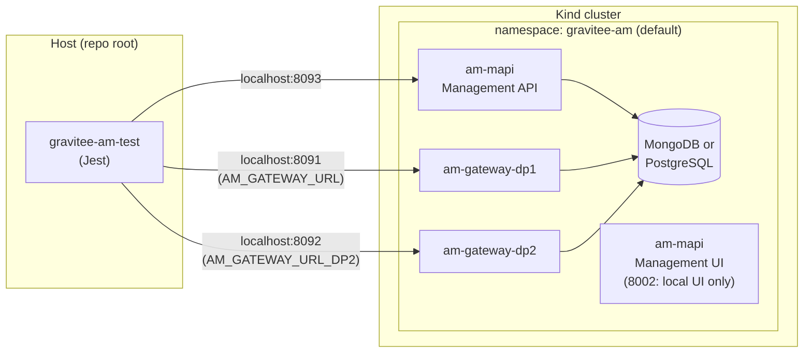

# AM Migration Test Tool

Orchestrates Gravitee AM migration tests: deploy an initial version (“from” tag), run verification tests, upgrade Management API and Gateways to a target version (“to” tag), verify again, and optionally downgrade back and re-verify.

**Supported environments:** Kubernetes (Kind) and Docker Compose (Docker Compose is **not functional** at the moment; see [Limitations and known issues](#limitations-and-known-issues)).  
**Supported databases (K8s):** MongoDB and PostgreSQL.

All commands must be run from the **repository root** (e.g. `./scripts/migration-test.mjs`) so paths to Helm charts, values files, and `gravitee-am-test` resolve correctly.

---

## Prerequisites

### Kubernetes (Kind)
- A running Kind cluster (e.g. `kind create cluster --name am-migration`).
- `kubectl` and `helm` installed.
- Gravitee license: set `GRAVITEE_LICENSE` (base64) or place a license file and set path via config (see `LicenseManager`).

### Docker Compose
- `docker-compose` and Docker daemon.  
- **Note:** The Docker Compose provider is not functional at the moment; use K8s for migration runs until it is fixed (see [Limitations and known issues](#limitations-and-known-issues)).

### All
- Node.js (for the tool and for running `gravitee-am-test` Jest suites).
- From repo root: `gravitee-am-test` and its dependencies (e.g. `npm install` in `gravitee-am-test` if needed).

---

## Workflow and design

**Terminology:** seeded data is keyed by an **instance label** = *channel label* + *data plane id*, not by version, so the alpha and beta data sets stay distinct even when both sides share the same minor version (e.g. a `4.10.7 → 4.10.8` patch migration). The **`alpha`** channel is seeded with the **`--from-tag`** data; the **`beta`** channel is seeded with the **`--to-tag`** data. The `mapi`/`all` prefix on a verify stage only describes the system state at that point (Management API upgraded vs. full stack); the suffix (`alpha`/`beta`) picks which channel is asserted.

**Multi–data-plane:** each channel is duplicated onto every configured data plane (one domain per data plane). K8s deploys two gateways — **dp1** (port-forward `8091`) and **dp2** (port-forward `8092`) — so the alpha channel produces domains `migration-seeded-domain-alpha-dp1` and `migration-seeded-domain-alpha-dp2` (beta → `…-beta-dp1` / `…-beta-dp2`); all child entities (apps — including a SERVICE app with a jwt-bearer extension grant, factor, custom IdP, users, and the IdP user store) carry the same `-<dataPlaneId>` suffix so the two domains stay fully isolated. The gateway/MAPI verify specs are parameterized (`describe.each`) over the data planes, so the suite runs once per data plane (`AM_GATEWAY_URL` → dp1, `AM_GATEWAY_URL_DP2` → dp2). Locally (single data plane) only one domain is seeded and tested.

Floating tags (`latest`, `4`, `4.11`) are accepted on `--from-tag` and `--to-tag`. Before the
pipeline runs they are resolved to the concrete `X.Y.Z` version they currently point to (matched
by Docker image digest on Docker Hub), and the resolved version is printed, e.g.
`🔖 Resolved --to-tag latest → 4.11.9`. Variant-suffixed tags such as `latest-debian` are not
supported and fail fast — use a plain tag.

> The channel asserted is derived automatically from the stage suffix (`-alpha` / `-beta`) — no `--test-label` needed.

### Stages (in order)
1. **clean** – Remove existing releases, secrets, namespace (K8s) or compose stack (Docker).
2. **k8s:setup** – (K8s only) Create namespace, deploy DB (MongoDB or PostgreSQL), create auth/license secrets; skip for Docker Compose.
3. **deploy-from** – Deploy AM at “from” tag (K8s: 1 Management API + 2 Gateways; Docker: 1 API + 1 Gateway). K8s starts port-forwards.
4. **seed-alpha** – Seed deterministic data for the “from” minor version (creates the alpha domain).
5. **verify-all-alpha** – Verify the alpha domain on the full “from” stack.
6. **upgrade-mapi** – Upgrade Management API to “to” tag.
7. **seed-beta** – Seed deterministic data for the “to” minor version (creates the beta domain).
8. **verify-mapi-alpha** – Verify the alpha domain with MAPI on “to”, Gateways still on “from”.
9. **verify-mapi-beta** – Verify the beta domain with MAPI on “to”, Gateways still on “from”.
10. **upgrade-gw** – Upgrade Gateways to “to” tag.
11. **verify-all-alpha** – Verify the alpha domain on the full “to” stack.
12. **verify-all-beta** – Verify the beta domain on the full “to” stack.

#### Optional with `--with-downgrade`
1. **downgrade-gw** – Downgrade Gateways back to “from” tag.
2. **verify-all-alpha** – Verify the alpha domain (Gateways on “from”, MAPI still on “to”).
3. **verify-all-beta** – Verify the beta domain (Gateways on “from”, MAPI still on “to”).
4. **downgrade-mapi** – Downgrade Management API back to “from” tag.
5. **verify-all-alpha** – Verify the alpha domain on the full “from” stack.
6. **verify-all-beta** – Verify the beta domain on the full “from” stack.

> For ad-hoc, single-stage debugging there is also a generic **verify** stage which asserts the channel from `--test-label` (default: `alpha`). It is not part of the default pipeline.

### K8s multi-dataplane
- One Management API release and two Gateway releases (dp1, dp2) per run.
- Ports (local port-forward): Management API **8093**, UI **8002** (local browser testing only; Jest uses 8093), Gateway dp1 **8091**, Gateway dp2 **8092**.
- `AM_GATEWAY_URL` (dp1, `http://localhost:8091`) and `AM_GATEWAY_URL_DP2` (dp2, `http://localhost:8092`) are both set for multi-dataplane verify stages; the gateway specs run against each in turn.

### System diagram (K8s)

When running with `--provider k8s`, the tool deploys the following into a Kind cluster. Port-forwards expose services on localhost: Jest (gravitee-am-test) uses **8093** (Management API), **8091** (Gateway dp1) and **8092** (Gateway dp2). Port **8002** (Management UI) is for local browser testing only; Jest does not access it.


```mermaid
flowchart LR
    subgraph host["Host (repo root)"]
        Jest["gravitee-am-test\n(Jest)"]
    end

    subgraph kind["Kind cluster"]
        subgraph ns["namespace: gravitee-am (default)"]
            DB[(MongoDB or\nPostgreSQL)]
            MAPI["am-mapi\nManagement API"]
            UI["am-mapi\nManagement UI\n(8002: local UI only)"]
            DP1["am-gateway-dp1"]
            DP2["am-gateway-dp2"]
        end
    end

    MAPI --> DB
    DP1 --> DB
    DP2 --> DB

    Jest -->|"localhost:8093"| MAPI
    Jest -->|"localhost:8091\n(AM_GATEWAY_URL)"| DP1
    Jest -->|"localhost:8092\n(AM_GATEWAY_URL_DP2)"| DP2
```

*(Gateway specs run against both dp1 and dp2, each with its own seeded domain. UI on 8002 is for manual/browser testing, not Jest.)*

### Common and specific values (base + override)

For **MAPI** (Management API + UI), shared configuration lives in a **common** values file so the long env list is not duplicated:

- **MongoDB:** `am-mongodb-common.yaml` (labels, mongodb-replicaset, full `commonEnv`, api/gateway disabled, license) + `am-mongodb-mapi.yaml` (only api enabled, ui, gateway disabled).
- **PostgreSQL:** `am-postgres-common.yaml` (labels, jdbc, full `commonEnv`, api/gateway disabled, license) + `am-postgres-mapi.yaml` (only api enabled, ui, gateway disabled).

**How they are loaded:** The tool passes **multiple values files** to Helm in order: `helm upgrade … -f <common> -f <override>`. Helm **merges** them: the first file is the base, the second overrides. For nested keys (e.g. `api.enabled`), the override replaces only what it sets; keys not set in the override (e.g. `api.env`) stay from the base. So MAPI gets `api.env` from the common file and only enables api/ui in the override.

**Gateways** (dp1, dp2) still use a **single** values file each (`am-mongodb-gateway-dp1.yaml`, etc.) because each adds data-plane–specific env (e.g. `gravitee_repositories_gateway_dataPlane_id`, gateway/oauth2 URIs to the data-plane DB). They do not use the common file so each file is self-contained with its own env list.

Override via env: `AM_HELM_VALUES_PATH_MONGO_MAPI=path1,path2` or `AM_HELM_VALUES_PATH_POSTGRES_MAPI=path1,path2` (comma-separated for MAPI base + override).

### Limitations and known issues

- **Docker Compose:** The Docker Compose provider is **not functional** at the moment. The full migration flow (deploy → verify → upgrade → verify) does not work with `--provider docker-compose`. Use `--provider k8s` for migration runs. Next step: fix Docker Compose (compose file, env, and provider logic) so it can run the same stages as K8s.
- **Jest with K8s:** The migration flow runs the focused `specs/migration` suite by default. Broader management and gateway specs may still require explicit `--test-filter` selection or additional environment fixes.

### Configuration
- Release definitions (which Helm releases and values files to use) come from `Config.getK8sReleases(dbType)` in `lib/core/Config.mjs`.
- Paths for charts and values can be overridden via environment variables (see `Config.mjs`).

---

## Commands

### Help
```bash
./scripts/migration-test.mjs --help
```

### One-time setup (K8s)
Clean, run K8s setup (DB + namespace + secrets), deploy “from” version. No cleanup at the end.
```bash
./scripts/migration-test.mjs --provider k8s setup
```

### Run full migration
Runs all stages (clean → setup → deploy-from → seed-alpha → verify-all-alpha → upgrade-mapi → seed-beta → verify-mapi-alpha/beta → upgrade-gw → verify-all-alpha/beta, and optionally downgrade stages). Floating tags (e.g. `latest`, `4.11`) are resolved automatically.
```bash
./scripts/migration-test.mjs --provider k8s run
./scripts/migration-test.mjs --provider k8s run --db-type postgres --with-downgrade
```
Docker Compose (single API + single Gateway). **Not functional at the moment**; use K8s.
```bash
./scripts/migration-test.mjs --provider docker-compose run
```

### Run a single stage
Useful for debugging.
```bash
./scripts/migration-test.mjs --provider k8s run --stage deploy-from
./scripts/migration-test.mjs --provider k8s run --stage verify --test-filter specs/management/certificates/certificates.jest.spec.ts
```

### Trigger CircleCI migration pipeline
Requires `CIRCLECI_TOKEN`. Sends parameters (from-tag, to-tag, db-type, provider, test-filter, with-downgrade) to CircleCI.
```bash
./scripts/migration-test.mjs trigger --from-tag 4.10.0 --to-tag latest --provider k8s --db-type postgres --with-downgrade
```

---

## Options

| Option | Description | Default |
|-------|-------------|---------|
| `--from-tag` | Initial AM version (Docker image tag) | `4.10.0` |
| `--to-tag` | Target AM version after upgrade | `latest` |
| `--db-type` | Database: `mongodb` or `postgres` (K8s) | `mongodb` |
| `--provider` | Infrastructure: `k8s` or `docker-compose` | `docker-compose` |
| `--namespace` | K8s namespace to deploy into (overrides `AM_K8S_NAMESPACE`) | `gravitee-am` |
| `--registry` | Override AM image repositories, e.g. `graviteeio.azurecr.io` for unpublished images | (none) |
| `--stage` | Run only this stage (see list above) | (all stages) |
| `--test-filter` | Jest path pattern (e.g. `specs/management/certificates/certificates.jest.spec.ts`) | (none) |
| `--test-label` | Seed channel (`alpha`/`beta`) asserted by ad-hoc migration Jest tests | `alpha` |
| `--with-downgrade` | After the full upgrade, downgrade back to from-tag and re-verify | `false` (CLI); CircleCI migration workflow may default to `true` |
| `--test-dir` | Test suite directory (relative or absolute); overrides config default | From `Config.test.dir` or `AM_MIGRATION_TEST_DIR` |
| `--no-seed-worktree` | Seed from the current checkout for all tags (disable per-tag worktree seeding) | worktree seeding on |
| `--keep-worktrees` | Keep the `.worktrees/seed-<ref>` dirs after the run (debugging) | `false` (removed) |

---

## Running a single stage (--stage)

**`--stage <name>`** runs **only that one stage** instead of the full pipeline. Use it to re-run or debug a single step without redoing earlier stages.

- **Without `--stage`:** the tool runs the full list of stages (clean → k8s:setup → deploy-from → … → verify-all-beta, and optionally the downgrade stages if you pass `--with-downgrade`).
- **With `--stage <name>`:** only the stage you name runs; no other stages run.

**Valid stage names:**

| Stage | What it does |
|-------|----------------|
| `clean` | Tear down: uninstall Helm releases, delete secrets/namespace (K8s) or compose stack (Docker). |
| `k8s:setup` | (K8s only) Create namespace, deploy DB (Mongo/Postgres), create auth secrets. Skipped for Docker Compose. |
| `deploy-from` | Deploy AM at `--from-tag` (e.g. 4.10.0). K8s also starts port-forwards. |
| `seed-alpha` | Seed deterministic data for the “from” minor version (alpha domain). Starts port-forwards if not already up. *(alias: `seed`)* |
| `verify-all-alpha` | Verify the **`--from-tag`** (alpha) domain. |
| `verify-all-beta` | Verify the **`--to-tag`** (beta) domain. |
| `upgrade-mapi` | Upgrade Management API (and UI) to `--to-tag`. |
| `seed-beta` | Seed deterministic data for the “to” minor version (beta domain). Floating `--to-tag` values are resolved before this stage runs. *(alias: `seed-upgrade`)* |
| `verify-mapi-alpha` | Verify the **`--from-tag`** (alpha) domain after MAPI upgrade (Gateways still on “from”). |
| `verify-mapi-beta` | Verify the **`--to-tag`** (beta) domain after MAPI upgrade (Gateways still on “from”). |
| `upgrade-gw` | Upgrade Gateways to `--to-tag`. |
| `downgrade-mapi` | Downgrade MAPI back to `--from-tag`. |
| `downgrade-gw` | Downgrade Gateways back to `--from-tag`. |
| `verify` | Generic ad-hoc verify (not in the default pipeline); asserts the channel from `--test-label` (default: `alpha`). |

> `verify-all-alpha` / `verify-all-beta` are reused at several points in the pipeline (initial alpha, post-full-upgrade, and post-downgrade). The stage name picks **which** seeded domain is asserted (`alpha` → `--from-tag`, `beta` → `--to-tag`), independent of where it runs.

**Caveat:** `--stage` does **not** run previous stages. If you use `--stage verify-all-alpha`, the tool assumes the cluster is already set up and the relevant version is deployed (e.g. you ran `deploy-from`/`upgrade-*` earlier or used `setup`). It is mainly for re-running or debugging one step in an already-prepared environment. Single verify stages start the port-forwards themselves.

**Examples:**

```bash
# Only tear down and redeploy “from” version (no tests, no upgrade)
./scripts/migration-test.mjs run --provider k8s --stage deploy-from

# Only verify the alpha (from-tag) domain (assumes env already deployed)
./scripts/migration-test.mjs run --provider k8s --stage verify-all-alpha

# Only verify the beta (to-tag) domain (assumes MAPI already upgraded + seed-beta run)
./scripts/migration-test.mjs run --provider k8s --to-tag 4.11.8 --stage verify-mapi-beta

# Ad-hoc: verify a specific seeded channel via --test-label (alpha or beta)
./scripts/migration-test.mjs run --provider k8s --stage verify --test-label beta

# Only run the “upgrade MAPI” step (assumes deploy-from already done)
./scripts/migration-test.mjs run --provider k8s --stage upgrade-mapi
```

---

## Migration seeding

The migration tool seeds deterministic data through the generated Management API SDK in `gravitee-am-test/api/management`.

Seed files live in `gravitee-am-test/migration-seeding/versions/<major.minor>/seed.ts`. Each seed file must be idempotent and use stable identifiers, names, or metadata so migration specs can find the same objects after upgrade and downgrade. A seed file exposes `seed(label)` and names every entity by that **label** (not the version), so the same version's data can be seeded twice under different labels without colliding.

The seed runner takes `--version <major.minor>` (which seed module / data shape to run) and `--label <name>` (the channel suffix used for naming). The `seed-alpha` stage runs the `--from-tag` module under label `alpha`; the `seed-beta` stage runs the `--to-tag` module under label `beta`. Because each channel targets a single version+label, this works for patch migrations too (e.g. `4.10.7 → 4.10.8` seeds the `4.10` module twice, as `alpha` and `beta`).

For each channel, the seed duplicates the full data set onto every data plane id listed by `AM_DOMAIN_DATA_PLANE_ID` (primary) and `AM_DOMAIN_DATA_PLANE_ID_DP2` (second, set automatically by the k8s tool). Entities are named by an **instance label** (`<channel>-<dataPlaneId>`), so a single `seed(label)` call produces one isolated domain per data plane. With no second-data-plane env (local runs) it seeds just one.

Seed and verify through the orchestrator so the version (`--version`)/label/`AM_MIGRATION_TEST_LABEL` wiring — and the git-worktree seeding below — happen automatically. Each `--stage` assumes the environment is already deployed (see the single-stage caveat above):

```bash
# Seed the from-tag (alpha) channel into an already-deployed environment
./scripts/migration-test.mjs run --provider k8s --from-tag 4.10.3 --stage seed-alpha

# Seed the to-tag (beta) channel
./scripts/migration-test.mjs run --provider k8s --to-tag 4.11.8 --stage seed-beta

# Verify an already-seeded channel (alpha = from-tag, beta = to-tag)
./scripts/migration-test.mjs run --provider k8s --stage verify-all-alpha
```

When running through the migration tool, `AM_MIGRATION_TEST_LABEL` is set automatically per stage (`alpha` for `*-alpha` stages, `beta` for `*-beta` stages; ad-hoc generic verify stages use `--test-label`, default `alpha`).

> **Low-level escape hatch (debugging only).** The orchestrator stages ultimately invoke the `gravitee-am-test` npm scripts directly, which you can run by hand — but these run from the **current checkout** and bypass the worktree seeding below, so the version-correct SDK/scripts are *not* used:
> ```bash
> npm --prefix gravitee-am-test run migration:seed -- --version 4.10 --label alpha
> AM_MIGRATION_TEST_LABEL=alpha npm --prefix gravitee-am-test run ci:migration
> ```

### Version-correct seeding via git worktrees

By default each tag is seeded from a **git worktree of that tag**, so the seed runs against that
version's *own* committed Management API SDK (`gravitee-am-test/api/management`) and
`migration-seeding` scripts rather than the current branch's. The `seed-alpha` stage uses a worktree
of `--from-tag`; `seed-beta` uses a worktree of `--to-tag`. AM itself still runs from the published
`graviteeio/am-*:<tag>` Docker image — the worktree provides **only** the TS seed tooling, so there
is no Maven build.

Mechanics (`lib/core/SeedWorktree.mjs`):

- Worktrees are cached under `<repoRoot>/.worktrees/seed-<ref>` (git-ignored). The ref is fetched
  (`git fetch --tags`) if not present locally; tags, branches, and commits are all accepted.
- `npm ci` runs **once** per worktree (skipped when `node_modules` already exists), installing that
  tag's exact committed lockfile.
- Worktrees are removed after the run unless `--keep-worktrees` is passed.

**Going-forward fallback.** If a tag predates the `migration-seeding/` framework (i.e. the directory
is absent in that tag — today's `4.10.x`/`4.11.x`/`4.12.x`), the tool logs a notice and seeds from
the **current checkout** instead. So newer-vs-newer migrations get version-correct seeding while
older from-tags transparently keep working. Pass `--no-seed-worktree` to force current-checkout
seeding for every tag.

Because no published tag ships the framework yet, the mechanism can be exercised today by passing a
ref that *does* contain it — e.g. the current branch — as `--from-tag`.

Prefer adding seeds before or during the release where the data shape is introduced, so that release's
tag carries a version-correct seed. For older releases (fallback to current checkout), keep seed data
to API fields accepted by that older AM version.

---

## Secrets and Aqua scan

To avoid hardcoded secrets and Aqua (or similar) scan findings:

- **License:** Inject via `GRAVITEE_LICENSE` (base64) in CI; do not commit license files. Path override: `AM_LICENSE_PATH`.
- **MongoDB (K8s):** Inject `MONGODB_ROOT_PASSWORD` and `MONGODB_GRAVITEE_PASSWORD` in CI; the tool uses safe defaults only when these are unset (local use). The MongoDB K8s secret is created from env at deploy time.
- **AM Helm values** (e.g. `env/k8s/am/am-mongodb-*.yaml`) still contain test-only connection strings with a default password for local runs. For strict scan compliance, either exclude these env files from secret scanning or (future) override connection strings via Helm `--set` from env.

---

## Databases (K8s)

### MongoDB
- Bitnami MongoDB chart; credentials via `auth.existingSecret`. The tool creates the secret from `MONGODB_ROOT_PASSWORD` (or a safe default) and `MONGODB_GRAVITEE_PASSWORD` (or a default for local). For CI/Aqua, inject these via env so no secrets are hardcoded.

### PostgreSQL
- **Internal minimal chart** at `env/k8s/db/postgres` using the **official postgres:16.6** image (no Bitnami), so Liquibase `md5()` is available.
- Values: `env/k8s/db/db-postgres.yaml`. One Postgres instance; init script creates DBs: `gravitee-am`, `gravitee-am-gateway`, `gravitee-am-dp1`, `gravitee-am-dp2`.
- Service name: `postgres-postgresql`. Same namespace → host `postgres-postgresql`.
- **Password in values is for local/migration test only;** override in production.
- Verify: `kubectl get statefulset,pods,svc -n gravitee-am | grep postgres`. Test md5:  
  `kubectl -n gravitee-am exec -it postgres-postgresql-0 -- psql -h 127.0.0.1 -U gravitee -d gravitee-am -c "select md5('test');"`

---

## Architecture

- **Entry point:** `index.mjs` – parses CLI (Node `parseArgs`), loads `.env`, selects provider, and runs command (`run`, `setup`, or `trigger`).
- **Orchestrator** (`lib/Orchestrator.mjs`) – Runs stages in sequence; calls provider (`clean`, `setup`, `deploy`, `upgradeMapi`, `upgradeGw`) and runs Jest in `gravitee-am-test` for verify stages. On failure or success, calls `provider.cleanup()` unless `skipCleanup` is set.
- **Providers:** Abstract deployment and teardown.
  - **K8sProvider** – Uses Helm (graviteeio/am + optional internal Postgres chart), Kubectl (namespace, secrets), LicenseManager (license for Helm `--set`), PortForwarder (8093, 8002, 8091, 8092), and a DatabaseStrategy (MongoDB or PostgreSQL). Multi-release: one API + two Gateways; version validated via `VersionValidator` (Docker Hub) before deploy/upgrade.
  - **DockerComposeProvider** – Uses `env/docker-compose/docker-compose.yml`; single API + single Gateway; `AM_VERSION` env drives image tag.
- **Config** (`lib/core/Config.mjs`) – Paths for Helm values and charts; `getK8sReleases(dbType)` returns the three releases (mapi, gateway-dp1, gateway-dp2) for the chosen DB.
- **Strategies** (`lib/strategies/database/`) – `MongoK8sStrategy`, `PostgresK8sStrategy`: deploy/clean/waitForReady for the DB layer.
- **Infra** (`lib/infra/kubernetes/`) – `Helm`, `Kubectl`, `LicenseManager`, `PortForwarder` – no direct dependency on zx in interfaces so they can be mocked in unit tests.
- **CircleCI** (`lib/CircleCI.mjs`) – Used by `trigger` to POST pipeline parameters to CircleCI.

Unit tests live under `test/unit/` and mock shell/spawn and external services.

---

## Testing the tool

Run the migration-tool unit tests (from repo root or from `scripts/migration-tool`):

```bash
cd scripts/migration-tool
npm install
npm test
```

See also `docs/agent-standards/commands.md` for canonical build/test and migration-tool commands.

---

## Next steps

- **Fix Docker Compose** – Make the Docker Compose provider functional so the full migration flow (clean → setup → deploy-from → seed → verify-all-alpha → … → verify-all-beta) runs with `--provider docker-compose`. Requires fixing compose file, env, and provider logic to align with the K8s flow.
- **Fix Jest/K8s environment** – Resolve remaining environment or wiring issues so Jest tests (gravitee-am-test) run reliably against the K8s-deployed AM (management and gateway specs, URLs, ports, dataplane IDs, timeouts). Aim for the full suite (or a well-defined subset) to pass without manual tweaks.
- **Integrate Gatling performance tests** – Consider integrating the existing Gatling performance tests into the migration flow: use them for data seeding (organisations, applications, users, tokens) before migration runs, and extend the scope of Gatling scenarios to cover migration-specific cases (e.g. upgrade/downgrade behaviour, schema compatibility). Prefer this over creating a new test project dedicated to the migration tool.
- **Add a `teardown` command** – Add a new command (e.g. `teardown`) that removes the entire Kind cluster (e.g. `kind delete cluster --name am-migration`), so users can fully tear down the K8s environment from the tool instead of running Kind commands manually.
- Run unit tests and fix any failures.
- Run a full migration locally (e.g. Kind + `--provider k8s run --db-type postgres --with-downgrade`).
- Use `--stage` and `--test-filter` to iterate on a single stage or a single Jest file.
- Trigger the CircleCI migration workflow via `trigger` (with `CIRCLECI_TOKEN`) or from the GitHub Actions “Trigger Migration Test” workflow.
- Extend: add a new stage in `Orchestrator.executeStage`, a new provider in `lib/providers/`, or new K8s release config in `Config.getK8sReleases` and corresponding values in `env/k8s/am/`.

---

## Future work

- **Infrastructure via configuration** – Manage K8s resources and dependencies more via configuration than code, so adding new resources or dependencies (e.g. OpenFGA, SMTP, LDAP, Kafka) requires minimal code change. For example: declare releases, ports, and env in config or YAML; have the provider and orchestrator drive behaviour from that config instead of hardcoding topology and wiring in code.
- **Seeded dataset** – Create a repeatable dataset (organisations, applications, users, tokens, etc.) that can be seeded before each migration run so verification tests run against known state and assertions are deterministic. Prefer reusing Gatling for seeding and extending its scenarios over a separate migration-only test project.
- **Migration-specific test scenarios** – Extend existing test assets (e.g. Gatling scenarios, gravitee-am-test specs) to cover migration-specific behaviour (upgrade/downgrade, schema compatibility, regression) rather than introducing a new test project solely for the migration tool.
- **Use both dp1 and dp2** – Extend verification to exercise both gateway dataplanes (dp1 on 8091, dp2 on 8092): run gateway tests against each, or add load/HA checks that involve both.
- **Additional dependencies** – Add optional or configurable dependencies (e.g. SMTP, LDAP, Kafka) in K8s/Docker Compose so migration tests cover a wider range of integrations and configurations.
