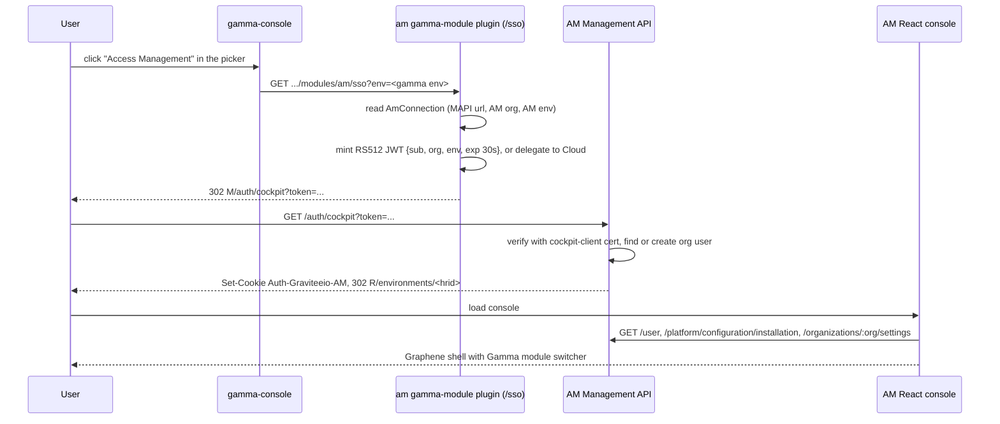
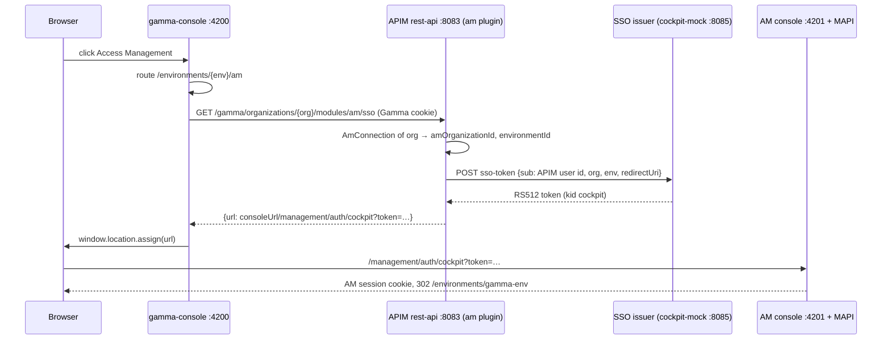

# AM in Gamma: spike plan

Epic: [AM-7349](https://gravitee.atlassian.net/browse/AM-7349). Spike: [AM-7769](https://gravitee.atlassian.net/browse/AM-7769).
PRD: [Prepare Access Management for Gamma Cloud](https://gravitee.atlassian.net/wiki/spaces/AM/pages/487817222).
Decision record: [Module boundaries for Cloud in Gamma](https://gravitee.atlassian.net/wiki/spaces/CLOUD/pages/464650241).

Date: 2026-09-24. Author: Stuart Clark. Status: draft for team review.

## 1. Goal

A Gamma user opens Access Management from the Gamma picker and lands in the AM console with a session. The AM console looks like Gamma and lists the Gamma modules the user may use. AM stays a separate application with its own console, Management API, gateway and database.

The agreed spike approach: build a second, React-based console runtime inside `gravitee-access-management` that reuses Graphene.

## 2. Target flow



The reverse path, an unauthenticated hit on the AM console:

1. The React console `/login` route sends the browser to `{baseURL}/auth/authorize?redirect_uri=...`.
2. The Management API stores the target in the `Redirect-Graviteeio-AM` cookie and sends the browser to `/auth/login`.
3. In Gamma mode, `/auth/login` sends the browser to `gamma.login.url` with a `return_to` parameter.
4. Gamma Cloud authenticates the user and sends the browser back through the picker flow above.

## 3. What exists today

### 3.1 AM

| Fact | Where |
|---|---|
| Console is Angular 19, served by a separate nginx image, not by the Management API | `gravitee-am-ui/`, `docker/management-ui/Dockerfile:17-51`, `ManagementApiServer.java:59-110` |
| Runtime config is `constants.json` `{baseURL}` plus `build.json`, read in `main.ts` before bootstrap | `gravitee-am-ui/src/main.ts:35-73`, `helm/templates/ui/ui-configmap.yaml:17-28` |
| Size: 250 routes in one file, 281 components, 61 services, 88 resolvers, 45,749 lines of TS, 25,409 lines of HTML | `gravitee-am-ui/src/app/app-routing.module.ts` (3,318 lines) |
| 229 components sit under `domain/`, 14 under org-level `settings/`, 30 shared | `gravitee-am-ui/src/app/` |
| Zero lazy routes, zero standalone components, 55 spec files | counts in section 8 |
| Login is a server redirect chain: `/auth/authorize` → `/auth/login` form → HttpOnly cookie `Auth-Graviteeio-AM` on the MAPI host → 302 to `redirect_uri` → UI calls `GET /user` | `LoginComponent.ts:26-31`, `CustomAuthenticationSuccessHandler.java:46-62`, `AuthorizationController.java:40-52` |
| The UI sends `withCredentials` and echoes `X-Xsrf-Token` from responses; it replaces `:organizationId` and `:environmentId` per request | `http-request.interceptor.ts:57-116` |
| Cookie has no SameSite attribute; CORS is `allowedOriginPatterns` from `http.cors.allow-origin`, default `*`, with credentials | `JWTGenerator.java:79-100`, `SecurityConfiguration.java:135-149` |
| `/auth/cockpit?token=` verifies an RS512 JWT with the cert under alias `cockpit-client` in the Cockpit mTLS keystore; claims `sub`, `org`, `env`, `preferred_username`, `redirect_uri`; sets the same cookie; 302 to `redirect_uri + /environments/<hrid>` | `CockpitAuthenticationFilter.java:117-157` |
| The filter is active only with `cockpit.enabled` or `cloud.enabled`. It checks no `iss` or `aud`, and does not check `redirect_uri` against the redirect allowlist | `CockpitAuthenticationFilter.java:160-162`, `DefaultJWTParser.java:91-124` |
| Real Cockpit sends no `redirect_uri`, so the redirect is relative to the MAPI host. Real Cockpit sends no `preferred_username`, so a user not pre-provisioned gets a null username | `RedirectUtils.java:67-92`, `AuthenticationServiceImpl.java:105-145` |
| A cloud mode exists: `cloud.enabled` plus `installation.type=managed`. `GET /platform/configuration/installation` returns `type`. The UI hides items flagged `hideInCloudMode`. The backend has `checkNotCloudMode` | `CloudProperties.java:26-52`, `ConfigurationResource.java:110-124`, `cloud-mode.service.ts:35-52`, `AbstractResource.java:62-75` |
| No login redirect exists. `/auth/login` is hard-wired to `org=DEFAULT`, which a managed install does not have | `LoginController.java:106-125` |
| The Cockpit connector already receives USER, MEMBERSHIP, ORGANIZATION and ENVIRONMENT commands. HELLO sends `console.ui.url` and `console.api.url` | `gravitee-am-management-api-service/.../impl/commands/`, `HelloCommandAdapter.java:52-119` |
| `gravitee-am-cockpit-mock` plays the Cockpit server and mints SSO tokens via `POST /_control/sso-token`. Jest and Playwright tests cover the Cockpit login | `gravitee-am-cockpit-mock/src/sso.ts:34-80`, `docker/local-stack/dev/docker-compose.cloud.yml:22-59`, `gravitee-am-test/api/commands/cloud/cockpit-commands.ts:98-159` |
| Org menu items are routes with `data.menu` and `data.perms.only`. The sidenav "Organization" link needs `organization_settings_read`. No flag hides the whole org menu | `app-routing.module.ts:763-1307`, `sidenav.component.ts:40-47` |
| No React, Tailwind, Graphene, rsbuild or Vite app exists in the repo | all 7 `package.json` files scanned |

### 3.2 Gamma, in `gravitee-api-management/gravitee-gamma`

| Fact | Where |
|---|---|
| The switcher is Graphene `AppContextBar` in `ShellLayout.tsx`. Entries come from `GET /gamma/organizations/{org}/modules`, filtered to modules with an `mfManifest` | `ShellLayout.tsx:55-68, 155-165`, `useGammaModules.ts:64-79`, `modules.types.ts:16-38` |
| `/modules` ignores the org, is `permitAll`, and returns every deployed plugin. Activation is boot-time and licence-based via `plugin.properties` `feature` | `GammaModuleService.java:64-66`, `BasicSecurityConfigurerAdapter.java:260-286` |
| Labels, icons and order are hard-coded: `MODULE_CATALOG`, `MODULE_ICONS`, `CARD_CONTENT`. All three are `Record<ModuleId, ...>`, so a new id forces edits in each | `modules.catalog.ts:34-42`, `modules.icons.ts:37-45`, `applications.ts:21-126` |
| Graphene `AppDefinition` is `{key, label, description?, icon, pinned?}`. It has no href | `graphene-core/src/composed/AppSwitcher/AppSwitcher.tsx:12-24` |
| One external-link precedent: `portals` opens the classic console URL with `window.open`, with no session handoff | `ShellLayout.tsx:106-121`, `PortalNextEditorRedirect.tsx:23-35` |
| Module SPI: plugin type `gamma-module`, `GammaModule.restResource()`, `GammaModuleDefinition {id, name, version, mfManifest}`. No external-URL field, no per-org module settings | `GammaModule.java:24-34`, `GammaModuleDefinition.java:30-43` |
| Gamma auth: HttpOnly cookie `Auth-Graviteeio-APIM`, host-only, local or OIDC login. APIM `/auth/cockpit` exists with an `app=GAMMA_CONSOLE` redirect. APIM holds only Cockpit's public cert, so it cannot mint an AM token | `CurrentUserResource.java:351-431`, `CockpitAuthenticationResource.java:78-239` |
| `/ui/bootstrap` returns `{gammaBaseURL, managementBaseURL, organizationId, consoleUrl}`. No AM console URL anywhere | `GammaUIResource.java:55-95` |
| An AM connection per org exists: `AmConnection(baseUrl, serviceAccountAccessToken, amOrganizationId, environmentId, defaultDomainId, defaultDomainHrid, gatewayUrl)`, shared SPI `AmConnectionRepository`, UI under Platform > System & Security > Access Management | `gravitee-gamma-plugin-module-api/.../identity/AmConnection.java:28-39`, `AmConnectionResource.java:54-121` |
| `@gravitee/gamma-modules-sdk` 1.2.1 covers permissions, environment, licence and routing. It has no user, auth or module-list domain | `gravitee-gamma-modules-sdk/src/index.ts` |
| The SDK docker stack runs gamma, the AM UI and APIM on separate `*.localhost` hosts behind nginx | `gravitee-gamma-modules-sdk/docker/docker-compose.yml:95-104`, `nginx/default.conf:35-118` |

### 3.3 Graphene and the AIM module template

| Fact | Where |
|---|---|
| `@gravitee/graphene-core` 3.23.1 on `latest`, lockstep with `graphene-charts` and `graphene-policy-studio`. Peers: React 19, `@tanstack/react-table`, `react-hook-form`, `@fontsource/dm-sans`. Tailwind 4 optional | `packages/core/package.json:103-162` |
| Tier 2 setup, the app runs its own Tailwind 4 and imports `tailwind-theme`, is the recommended path for a new shell | `packages/core/USAGE_GUIDE.md:51-71` |
| Shell parts exist: `AppLayout`, `AppSidebar`, `SidebarNavigation`, `ContentHeader`, `AppContextBar` with `AppSwitcher` and env selector, `TopNavUser`, `ContextSidebar`, `LayoutSlotsProvider` | `packages/core/src/composed/` |
| Data parts exist: `DataTable` on TanStack, `JsonSchemaForm`, `CodeEditor` subpath, `DataTableEmptyState`, `graphene-charts` | `packages/core/src/index.ts:1-85` |
| `GioIamIcon` is the Access Management product icon | `icons/index.ts:170-185` |
| Graphene has no org switcher, no i18n, no router and no data-fetch layer | grep, `USAGE_GUIDE.md` |
| Version skew: gamma-console pins 3.22.1, AIM pins 3.20.0, latest is 3.23.1. A missing export under skew is `undefined` at runtime | `gravitee-api-management/package.json:41`, `gravitee-gamma-module-aim/package.json:28-47` |
| The AIM module is a complete template: rsbuild, React 19, react-router 7, react-query 5, vitest, Graphene tsconfig and ESLint, a fetch wrapper with `credentials: 'include'` and XSRF echo, and a standalone dev mode | `gravitee-gamma-module-aim/rsbuild.config.ts`, `src/main/ui/app/LocalDevRoot.tsx`, `lib/api/csrf.ts` |
| Federation-specific parts are isolated: the MF plugin block, `assetPrefix: 'auto'`, `injectStyles`, the `import('./bootstrap')` boundary, `federation.tsx`, SDK stubs | `rsbuild.config.ts:94-137`, `src/main/ui/index.tsx` |

## 4. Work streams

### Stream A: the React console runtime in AM

This is the core of the spike.

**Location and build.** Add a Maven module `gravitee-am-ui-next` beside `gravitee-am-ui`. The pom copies the AIM pattern: `exec-maven-plugin` runs `yarn install` and `yarn build` in `generate-resources`. The assembly zips `dist/` the same way `gravitee-am-ui/assembly.xml` does. The name is a placeholder.

**Toolchain.** Copy the AIM module toolchain and remove federation: rsbuild, React 19, TypeScript strict via `@gravitee/graphene-core/tsconfig`, the Graphene ESLint config, vitest with jsdom, react-router 7, react-query 5. Use Graphene Tier 2 with the app's own Tailwind 4. Pin Graphene to the same version as gamma-console.

**Runtime contract.** Keep `constants.json` `{baseURL}` and `build.json`. The nginx image, the Helm configmap and docker-compose then work without change. Add a build argument to `docker/management-ui/Dockerfile-dev` that selects the new zip.

**Auth.** Keep the server redirect chain. `/login` sends the browser to `{baseURL}/auth/authorize?redirect_uri=.../login/callback`. `/logout` sends it to `/auth/logout`. A fetch wrapper sends `credentials: 'include'` and echoes `X-Xsrf-Token`. The console must accept `/environments/<hrid>` as the landing route from `/auth/cockpit`.

**Bootstrap.** `GET /user`, then `/user/preferences`, `/organizations/:org/environments`, `/organizations/:org/license`, `/platform/configuration/installation` and `/organizations/:org/settings`.

**Shell.** `AppLayout` with `AppSidebar` and `SidebarNavigation` from a nav config that carries `perms`, `ContentHeader` with `AppContextBar` for the environment selector and the module switcher, and `TopNavUser` from `/user`. The Organization link is gated by `organization_settings_read` and by Gamma mode.

**Spike slice.** Domains list, domain dashboard, and applications list and detail. Add one `JsonSchemaForm` for an identity provider plugin config and one `CodeEditor` for a login form template. These three pages exercise the riskiest Graphene mappings.

**Test bed.** `docker/local-stack` with `--ui`, plus `docker-compose.cloud.yml` and the cockpit-mock for the SSO path.

**Migration of the other 270 components.** Three options:

| Option | Shape | Cost | Risk |
|---|---|---|---|
| Big-bang parity | Ship the React console when every Angular page is ported | Highest, nothing ships for a long time | Gamma Cloud waits on org-level pages it hides anyway |
| Gamma-mode first | Ship the React console to Gamma Cloud installs only. The org surface is hidden there. Angular stays for self-hosted until parity | Medium | Two consoles in support for a period |
| Strangler | nginx serves both bundles on one host. React owns the shell and ported routes. Unported routes deep-link into the Angular bundle at `/legacy/...`. Both share the MAPI cookie, so no second login | Lowest per step | The look changes between ported and unported pages |

Recommendation: Gamma-mode first, with the strangler as the fallback for gaps. Self-hosted installs switch when parity is reached. The team needs a date after which new console features are built in React only.

Suggested port order, by dependency and by Graphene risk: shell, domains, applications, identity providers, users, groups, roles, OIDC settings, scopes, certificates, flows and policies, factors, audits, alerts, then org settings.

### Stream B: Gamma Cloud mode in the AM Management API

This stream does not depend on the UI and can start now.

| Change | Detail |
|---|---|
| Config | New `gamma.enabled` (default false) and `gamma.login.url` in `gravitee.yml`. A separate block is safer than `cloud.*`, because `cloud.enabled` also turns on the connector and managed mode |
| Org reference | `gammaManagementApiUrl` and `gammaOrganizationId` on the organisation settings: model, repositories, `PATCH /organizations/{org}/settings`, and the Cockpit ORGANIZATION command payload so Cloud can set them |
| Expose to the UI | Extend `GET /platform/configuration/installation` with `gammaCloud: {enabled, loginUrl}`. The React shell reads it at bootstrap |
| Login redirect | In `LoginController`, when `gamma.enabled`, `GET /auth/login` sends a 302 to `gamma.login.url` with `return_to` set from the `Redirect-Graviteeio-AM` cookie. `POST /auth/token` stays for API clients |
| Org-admin refusal | `checkNotGammaMode()` on org-scoped admin resources: users, groups, roles, identity providers, entrypoints, tags, settings, forms. Mirror `checkNotCloudMode` |
| `/auth/cockpit` hardening | Fall back to `console.ui.url` when `redirect_uri` is absent. Accept `email`, `given_name`, `family_name` and `preferred_username` claims so a first-time user is complete without a USER command. Check `redirect_uri` against `http.login.allow-redirect-urls`. Add an optional `aud` check |
| Module switcher data | New `GET /organizations/{org}/gamma/modules` that returns `{id, label, url}[]`. Source options are in section 5 |

### Stream C: the Gamma side

The switcher has one model: one tile per deployed `gamma-module` plugin. Nothing else produces a tile. The AM tile therefore needs an `am` plugin, plus a small set of host edits. The plugin does not have to live in `gravitee-api-management`.

**How a tile appears today.** The pipeline in gamma-console, with the gap for AM at each step:

| Step | Code | Gap for AM |
|---|---|---|
| Fetch | `GET /gamma/organizations/{org}/modules` returns every deployed plugin | AM has no plugin |
| Filter | `hasUi` keeps only entries with an `mfManifest` (`modules.types.ts:36-38`) | A plugin with no federated UI is dropped |
| Order | `orderByCatalog` sorts by `MODULE_CATALOG` position; unknown ids go last | AM lands after Platform Management |
| Label | `findModuleProduct(m.id)` reads `MODULE_CATALOG` (`modules.catalog.ts:33-41`) | Add `{ id: 'am', label: 'Access Management', tagline }` |
| Icon | `MODULE_ICONS[moduleId]` (`ShellLayout.tsx:50-53`); a miss renders `Globe` | Add `GioIamIcon` |
| Home card | `CARD_CONTENT: Record<ModuleId, ...>` renders one card per catalog id | The build fails until the `am` card exists |
| Click | `handleAppChange` navigates to `/environments/{envHrid}/{key}`; only `portals` is special-cased (`ShellLayout.tsx:106-121`) | AM needs a redirect, not a remote mount |
| Route | `AppRoutes.tsx:83-86` mounts `RemoteModuleRoute`, or `PortalNextEditorRedirect` for `portals` | AM needs an `AccessManagementRedirect` element |

**Host edits, in `gravitee-api-management`.** The catalog entry, the icon, the Home card, the click branch and the redirect route in `gravitee-gamma-control-plane-webui`. The click uses `window.location.assign`, same tab. The AM console gets its own switcher to come back, so a second tab has no purpose. In `gravitee-gamma-plugin`, add an `externalUrl` field on `GammaModuleDefinition` and accept it in `hasUi`. Until that lands, the plugin ships a one-page redirect remote in `ui/mf-manifest.json`.

**The `am` plugin.** Where it lives is a choice:

| Location | Shape | For | Against |
|---|---|---|---|
| New repo `gravitee-gamma-module-am` | Copy of `gravitee-gamma-module-authz`: Java plugin, rsbuild, own release | Proven pattern, AIM and AuthZ work this way. The AM team owns it. Ships a zip to APIM `plugins/` | One more repo |
| Inside `gravitee-api-management/gravitee-gamma/` | Like `gravitee-gamma-module-platform` | Ships with APIM | Public repo. Ties AM releases to APIM releases. The module-boundaries decision pushes Cloud code out of this repo |
| Inside `gravitee-access-management` | New Maven module | AM-first principle | The AM build gains a dependency on APIM's `gravitee-gamma-plugin-module-api` |
| The Cloud module in `gravitee-cockpit` | The Cloud team ships an `am` zip next to `cloud` | The issuer key is already there | Private repo. Self-hosted Gamma never gets the tile. Not in our hands |

Decision: a new repo `gravitee-gamma-module-am`, scaffolded from the AuthZ module. Size S. Content:

- `plugin.properties` with `id=am`, `type=gamma-module`, and a `feature` tied to the AM licence. The licence check at boot then hides the tile from accounts without AM.
- A `GammaModule` class that returns one JAX-RS resource.
- `GET .../organizations/{org}/environments/{env}/modules/am/sso` that produces the 302 to AM `/auth/cockpit?token=`. It reads the per-org `AmConnection` through the shared `AmConnectionRepository` SPI. That record already carries `baseUrl` for the MAPI, `amOrganizationId` and `environmentId`, so the plugin has the `org` and `env` claims and the target host without new settings. The `redirect_uri` claim can be omitted once Stream B makes AM fall back to `console.ui.url`.
- Token signature: for the spike, a configured private key whose certificate is loaded into AM's keystore under `cockpit-client`. In production, either the same with a key the Platform team provisions, or a delegation call to the Cloud backend that holds the Cockpit key. This is decision 4, still open.
- `sub` for the spike is the APIM user id. AM creates the org user on first login with `source=cockpit`. The profile claims from Stream B give it a username and an email.

The AIM module cannot stand in for this. One plugin gives one tile, and that tile already reads "Agent Management".

**Cloud team dependencies.**

- Login return path: Gamma Cloud login must accept a `return_to` parameter and send the user back to AM after login. Without it the user lands on the Gamma home page.
- Environment mapping: the token's `env` claim is an AM environment id. `AmConnection.environmentId` holds one per org today. Cloud owns the mapping when an account has several.
- Entitled modules for the AM switcher: see section 5.

## 5. Module switcher data source

| Option | How | Pros | Cons |
|---|---|---|---|
| A. Token claims | The issuer puts `modules: [{id, label, url}]` in the SSO token. AM stores it in the user's additional info. `/user` returns it | No AM to Gamma call, works in the spike | Stale until the next SSO. The issuer, not the Gamma MAPI, is the source |
| B. AM to Gamma MAPI | AM calls `gammaManagementApiUrl` with a per-org service token and filters by the user | Matches the PRD wording | Needs a Gamma per-user entitlement endpoint and a service token in AM |
| C. Browser to Gamma MAPI | The React console calls Gamma with the user's Gamma cookie | No new backend | The Gamma cookie is host-only; the call is cross-site and fails |

Recommendation: a lighter form of B now. `GET /gamma/organizations/{org}/modules` is already `permitAll` and needs no token. The AM Management API calls it server-side at `gammaManagementApiUrl`, which avoids CORS. The React console maps module ids to labels and `Gio*` icons with a small local catalog, and builds each URL from an org-level `gammaConsoleUrl`. Gamma effort: none. AM effort: S.

The per-user filter is the part Gamma cannot provide today. Module activation is a platform-wide licence check at boot. Modules declare no required permissions, so there is nothing to filter on per user. The gamma-console itself shows every deployed module to every user and only locks Home cards on a missing licence feature. A Gamma endpoint that returns deployed modules filtered by the org licence is S to M. A true per-user or per-account entitlement depends on the Cloud module's entitlement model, which does not exist in APIM.

## 6. Spike sequence

| Step | Output | Size |
|---|---|---|
| 1. Scaffold `gravitee-am-ui-next`, shell, login, callback, `/user` | A console that logs in through the MAPI redirect chain and shows the shell | S |
| 2. Domains and applications slice with `DataTable`, one `JsonSchemaForm`, one `CodeEditor` | Three real pages, a Graphene gap list | M |
| 3. SSO PoC: cockpit-mock token → `/auth/cockpit` → React console | A demo of the auto-login | S |
| 4. Picker PoC: new repo `gravitee-gamma-module-am` with the `/sso` resource, host edits in gamma-console, `redirect_uri` fallback in AM | A demo from the Gamma picker to the AM console | M |
| 5. Gamma mode in the MAPI: flag, login redirect, installation payload | The unauthenticated path | M |
| 6. Findings: bundle and build metrics, Graphene gaps, a per-area port estimate | Input for the epic breakdown | S |

Steps 1 to 4 are the demo. Step 5 can run in parallel. Step 6 closes AM-7769.

### Step 1 result (2026-09-24)

Done on branch `AM-7769-spike-react-console`, module `gravitee-am-ui-next`, not committed. Checked against a live MAPI on `:8093`:

- `GET /user` 401 → `/auth/authorize` → MAPI login form → cookie → `/login/callback` → back to the original URL.
- Shell with `AppContextBar`, environment selector, `TopNavUser`, and a server-paginated domains list.
- Sign-out clears the cookie; `/user` returns 401 after it.
- Lint clean, 8 unit tests pass, production build passes.

Findings:

| Finding | Detail |
|---|---|
| Monaco is a hard dependency | The root `@gravitee/graphene-core` entry imports `CodeEditorField`, which imports `monaco-editor`. Graphene lists Monaco as an optional peer, but the build fails without it |
| Page base mismatch | Graphene pagination is 1-based, AM list endpoints are 0-based. Every list page must convert |
| No sort on the domains list | The MAPI list has no sort parameter, so server-side tables show no sortable headers |
| Bundle size | Initial JS about 1.06 MB, 307 kB gzipped. Monaco is a 3.3 MB async chunk that loads only on use |
| Dev proxy | `/management` proxied with `changeOrigin: false` keeps the login redirects on the dev server origin. No MAPI change needed |
| Cookie scope | Cookies ignore the port, so an Angular console session on `localhost` also logs in the React console on `localhost:4201` |

### Step 3 result (2026-09-24)

Done against `local-stack.sh up --cloud --version master-latest` with the cockpit-mock. The mock provisioned `gamma-org`, a USER `gamma-user-1` with `ORGANIZATION_PRIMARY_OWNER`, and `gamma-env`.

- The mock minted a token with `sub`, `org` and `env` only, the way real Cockpit does. There was no `redirect_uri`.
- `GET /management/auth/cockpit?token=…` on the console origin returned one 302 to the relative `/environments/gamma-env`. The React console loaded the domains page for `gamma-org` as Jane Doe, with 328 permissions.
- No AM change was needed. When the console and the MAPI share one origin, the relative redirect is enough. The `redirect_uri` fallback in Stream B matters only when they are on different hosts.

Findings:

| Finding | Detail |
|---|---|
| Same-origin topology removes a Stream B item | Serving the console and `/management` on one host makes the `console.ui.url` fallback optional |
| Managed-mode login is dead | Unauthenticated, the chain reaches `/auth/login` with `org=DEFAULT`. The org does not exist, so every login fails with "Wrong user or password". Step 5 must redirect to Gamma login instead |
| `local-stack.sh --version` skips the mock build | Pulled mode does not build `dev-cockpit-mock`. Build it first with `docker build -t dev-cockpit-mock:latest gravitee-am-cockpit-mock` |

### Step 2 result (2026-09-24)

Done on the same branch, checked in a browser as the Cockpit user against the cloud stack. Seed data: a data plane, two domains, four applications each, and a JDBC identity provider.

| Page | Graphene parts | Result |
|---|---|---|
| Domains, applications, identity providers lists | `DataTable`, `BadgeCell`, `DateCell`, `DataTableEmptyState` | Work. Server pagination on domains and applications, client-side on identity providers |
| Application detail | `Tabs`, `CopyableCell`, `Badge`, `Field`, `Input`, `Textarea`, `Switch`, react-hook-form | Works. The PATCH save passes the MAPI CSRF check through the rotating `X-Xsrf-Token` |
| Identity provider detail | `JsonSchemaForm`, `composeResolvers`, `jsonSchemaResolver` | Works for the JDBC plugin: 22 fields, required markers, select with labels, masked password. PUT save keeps the stored secret, because the MAPI ignores the `********` mask |
| Login form | `CodeEditor` in HTML mode, `Switch` | Works. The first save POSTs the domain's own form, then later saves PUT |
| Shell | `LayoutSlotsProvider`, `useLayoutConfig`, `buildLinearBreadcrumbs`, `SidebarNavigation` | Breadcrumbs from each page. The sidebar switches to domain navigation inside a domain |

Lint clean, 10 unit tests pass, production build passes.

Findings:

| Finding | Detail | Effort |
|---|---|---|
| AM plugin schemas need an adapter | AM schemas use angular-schema-form keywords: `widget`, `x-schema-form.titleMap`, `titleMap`, `htmlClass`, `readonly`, `sensitive`. Graphene reads `format` and `gioConfig`. `am-schema.ts` translates them in about 70 lines with tests | S, done for IdPs |
| One widget has no Graphene field | `widget: datasource` on the Mongo IdP needs a data source picker. It falls back to a text input and the page says so | S per custom widget |
| Only 6 IdP schemas measured | The image ships `http`, `inline`, `jdbc`, `mongo`, `http-flow`, `ldap`. EE IdPs, factors, reporters, certificates, bot detection and policies were not surveyed | Survey in step 6 |
| Monaco needs a worker setup | Without `MonacoEnvironment.getWorker`, Monaco logs "Unexpected usage" and runs in the main thread. gamma-console sets this for its modules. A standalone console must copy it (`src/monaco-setup.ts`) | Done |
| Tailwind 4 border default | `divide-y` and `border` default to `currentColor` in Tailwind 4. Use `divide-border`/`border-border`. Graphene's lint does not catch it | Convention |
| Interface types break Graphene resolvers | `composeResolvers` and `jsonSchemaResolver` constrain values to `Record<string, unknown>`. Form value shapes must be `type` aliases, not `interface`s | Convention |
| Relative breadcrumb paths are route-relative | With nested routes, `..` goes to the parent route, not the parent URL. Pages build absolute paths from the domain scope | Convention |
| No lazy routes yet | Initial JS grew from 307 kB to 370 kB gzipped with five pages. A full port needs one lazy chunk per feature area | S, needed before more pages |
| Not tested | Flows and policies, the highest Graphene risk. Graphene's policy studio is APIM-shaped | Next spike candidate |

What the slice says about the port: the five page patterns here (server list, detail with tabs, plain form, plugin schema form, code editor) cover most of the Angular console's 281 components. None needed a workaround inside Graphene. The unknowns that remain are flows and policies, custom widgets beyond `datasource`, and the EE plugin schemas.

### Step 4a result: the AM-side switcher (2026-09-24)

Done on the same branch. The React console's app switcher now shows a pinned Home, then Access Management among the real Gamma modules, in gamma-console's order with gamma-console's names, taglines and icons. It matches the gamma-console picker. Checked in a browser against the live Gamma stack.

| Part | Detail |
|---|---|
| Config | Optional `gamma` block in `constants.json`: `consoleUrl`, `apiUrl`, `organizationId`, `environmentHrid`. Absent means AM alone in the switcher and no Home, which is the self-hosted behaviour. Spike stand-in for the Stream B `gamma.*` settings exposed by the MAPI |
| Module list | `GET {apiUrl}/organizations/{org}/modules`, the public Gamma endpoint. In dev, rsbuild proxies `/gamma` to the APIM rest-api on `:8083`. In production, the Stream B MAPI endpoint replaces this. Backend-only modules (no `mfManifest`) are dropped |
| Catalog | `src/app/gamma-apps.tsx` copies gamma-console's `MODULE_CATALOG` and `MODULE_ICONS`, with AM after Authorization Management. Unknown modules go last under their plugin name |
| Click | Home goes to `{consoleUrl}/environments/{environmentHrid}/home`. A module goes to `{consoleUrl}/environments/{environmentHrid}/{moduleId}`, same tab. AM itself does nothing |
| Tests | `buildApps` covered: AM alone outside Gamma, order and labels in Gamma, Home kept when the list fails. 13 unit tests pass in total |

Findings:

| Finding | Detail |
|---|---|
| The catalog is duplicated | Labels, taglines, icons and order live in gamma-console and now in AM. A module list endpoint that returns display data, or a shared package, would remove the copy |
| Environment mapping is a config value | `environmentHrid` is fixed per installation. With several Gamma environments, Cloud must supply the mapping |
| Gamma sessions are separate | The switch to gamma-console needs an APIM session there. The AM session cookie does not log the user into Gamma. In Gamma Cloud both come from the same Cockpit SSO |
| The local Gamma stack had its own skew | gamma-console `node_modules` held Graphene 3.21.0 while the lockfile pins 3.22.1, so Module Federation refused to start the console. `yarn install` in `gravitee-api-management` fixed it. Then commit `f378ce59a0` (2026-09-23) made gamma-console expect `consoleUrl` from `/gamma/ui/bootstrap`, which the built rest-api distribution did not return yet, and gamma-console crashed in `sanitizeBaseURL` |
| Landing checked | After the rest-api rebuild in step 4b, the click from AM to Agent Management lands on the AIM module's page in gamma-console. Home works the same way |

### Step 4b result: the Gamma-side tile and SSO (2026-09-24)

Done. The whole demo now runs in a browser. The Gamma user picks Access Management on Gamma Home or in the switcher, and lands signed in on the React AM console, with the AM data of that org. The AM switcher's Home link goes back. No AM code changed.



What was built:

| Part | Detail |
|---|---|
| `gravitee-gamma-module-am/` | New local folder at the workspace root, no git repo yet. Java only, no UI: `plugin.properties` (`id=am`, `type=gamma-module`), `AccessManagementModule`, `AmRootResource` (`GET /sso`), `AmSsoService`, `AmModuleConfiguration`. 4 classes, a 10 KB jar. `mvn package` gives `target/gravitee-gamma-module-am-0.1.0-SNAPSHOT.zip` |
| `/sso` resource | Mounted by the host at `/gamma/organizations/{org}/modules/am/sso` and under `/environments/{env}/`. It returns JSON `{url}`, not a 302, so gamma-console calls it with its normal credentials. `sub` is the APIM user id from the security context. `org` and `env` come from the org's `AmConnection` (`amOrganizationId`, `environmentId`) through the shared `ApimAmConnectionRepository` |
| Settings | `modules.am.console-url` (default `http://localhost:4201`) and `modules.am.sso.issuer-url` (default cockpit-mock's `/_control/sso-token`). Spike defaults only |
| gamma-console | 9 files, +71 −6, on the APIM working tree, not committed: `AM_MODULE_ID` and catalog entry after Authorization, `GioIamIcon`, a Home card with upgrade copy, `isExternalModule` so `am` survives the `hasUi` filter, a new `AccessManagementRedirect` route element, and the route in `AppRoutes.tsx`. The switcher click needed no change: it already navigates to `/environments/{env}/{key}` |
| Tests | 2 new tests for `isExternalModule`. `HomePage.spec.tsx` pins the card order and needed the new title. Module, Home, shell and app suites pass. Typecheck clean, formatter clean on the changed files |

Findings:

| Finding | Detail |
|---|---|
| AM needs the user before the first click | `/auth/cockpit` does not create a user. An unknown `sub` gives 403 and `IllegalStateException: Unable to read user information` in the MAPI log. The demo worked only after a USER command and two MEMBERSHIP commands for the APIM admin id went through cockpit-mock (`scratchpad/provision-gamma-admin.mjs`). In production either Cloud syncs every Gamma user to AM with USER and MEMBERSHIP commands before the tile is usable, or Stream B makes `/auth/cockpit` create the user from profile claims and give a default role. This is now the largest open design point after the issuer key |
| Whose id is `sub` | The spike uses the APIM user id. In Gamma Cloud, Cloud user ids are the natural `sub`, because Cloud also issues the Gamma login. The plugin must get that id from the APIM user (its `sourceId` for a Cloud-authenticated user) and not from the APIM technical id. Not tested |
| `AmConnection` is enough for routing | `amOrganizationId` and `environmentId` gave the token's `org` and `env` with no new settings. Saving it needs a service-account token, which SSO does not use: the demo saved a placeholder through the platform module's `PUT .../modules/platform/am/am-config` |
| No `hasUi`, no tile | gamma-console drops every module without an `mfManifest`. The spike keeps `am` by id. The plan's `externalUrl` on `GammaModuleDefinition` is the general fix and stays open |
| Licence gate | The spike plugin has no `feature` line, so it always loads. The licence that activates Gamma modules carries a pack named `identity-and-access-management`. The `feature` key inside that pack still has to be confirmed with the licence owners |
| JDK HTTP client | The default `HttpClient` tries an h2c upgrade, and cockpit-mock's Node server closes the connection. Pinned to HTTP/1.1. A real issuer on HTTPS does not have the problem |
| The local APIM distribution was 2 weeks old | The gamma rest-api jar from `master` needs classes that the 9 September distribution lacks (`SearchLogsFilters$EntrypointScope`). Swapping one jar does not work. The fix was a full engine build and distribution build (`mvn clean install -DskipTests -Dskip.validation -T 1C`, then the distribution reactor with `-Dapim.core.version`, `-nsu`, `-Dbundle=dev`) |
| `clean` removes the licence | The distribution `clean` deletes `target/distribution/license/`. The AM team licence (`gravitee-universe-v4.key`) has no Gamma packs, so aim, authz, esm and edge stop loading with `detected but not activated`. `~/Downloads/license.key` ("Gravitee Internal - Development and Testing") activates all of them |
| Restart log trap | `nohup ... > apim-restapi.log` truncates the log while the old process still writes its shutdown lines into it. The new process's start lines then look lost. The first failed restart was this plus the class skew above |

### Step 5a result: AM flows in Graphene's policy studio, read-only (2026-09-25)

The goal was to see how far AM flows get in Graphene's `PolicyStudio` with no change to Graphene.

**Approach.** The studio's organization scope (`scope="ORGANIZATION"`, `apiType="PROXY"`) takes one flat list of flows with request and response phases. APIM uses it for platform flows, which have the same v2 `pre`/`post` shape as AM flows. The page maps each AM flow into that list: `pre` goes to `request`, `post` goes to `response`, and the flow condition becomes a `CONDITION` selector.

| Part | Detail |
|---|---|
| Package | `@gravitee/graphene-policy-studio` 3.22.1, the same version as `graphene-core`. No separate CSS; one `@source` line in `styles.css` |
| API calls | `GET .../domains/{d}/flows`, `GET /platform/plugins/policies?expand=icon`, `GET .../policies/{id}/schema`, `GET .../policies/{id}/documentation` (AsciiDoc, read as text) |
| Code | `features/flows/am-flows.ts` (mapping, 2 tests), `features/flows/FlowsPage.tsx`, a Flows nav item, `httpText()` in `http.ts` |
| Test data | Sample steps on `acme-customers`: Enrich Authentication Flow in LOGIN pre, Enrich User Profile in LOGIN post, a disabled Rate Limit in ALL pre |

**What works with no Graphene change**

- The sidebar lists the 12 AM flow types, with a step count on each.
- The canvas shows pre and post steps in order, with the enabled state.
- A step opens the settings panel. The form comes from the AM policy schema through the existing `am-schema.ts` adapter, and the step description and condition show.
- The Documentation tab renders the AM AsciiDoc documentation, with a section list.
- The policy catalog keeps all 14 AM policies. AM policies declare no phase compatibility, and organization scope keeps those.
- Typecheck, lint and 15 unit tests pass. The browser console shows no errors or warnings.

Screenshots: `scratchpad/s5a-flows-1.png`, `s5a-flows-login.png`, `s5a-flows-step.png`, `s5a-flows-docs.png`.

**What is wrong without a Graphene change**

| Gap | Seen | Graphene change |
|---|---|---|
| Phase wording | "Request Phase: policies applied to the incoming client request before it reaches any API", "Response Phase", and the step panel badge "Request" | Phase labels and descriptions from the host |
| Actors | CLIENT and GATEWAY at each end of the canvas | Actor labels from the host, or none |
| Group label | "PLATFORM FLOWS", with APIM help text | Group label from the host |
| Flow grouping | One flat list. AM can hold several ordered flows per type (`FlowServiceImpl` sets an `order` per type), always with one default flow per type. AM also has application flows that inherit from the domain | Host-defined groups, one group per flow type |
| Flow form | Organization scope offers HTTP path, methods and sharding tags. AM flows have a name and a condition only. A new flow must get a type | A condition-only flow form that also sets the group |
| Step name | The card shows the policy name. The step name the user gave ("Remember login source") does not show | Show `step.name` when it is set |
| Save output | `SaveOutput.commonFlows`. Usable, but the AM shape comes from the mapping | None needed for AM. A generic flow list is cleaner |
| Policy icons | All AM policies show the default icon. The studio picks an icon from `category`, and AM policies have none | None. AM can send a category, or the studio can use `policy.icon` |

**Other findings**

- AM returns a default flow with `id: null` for each type that has never been saved. The mapping uses the type as the id.
- The policy list returns a `feature` field. It is the licence feature for each policy, so the licence check hook can use it.
- Some AM policy plugins return the parent POM description ("The Gravitee.IO Parent POM provides common settings…") as their description. That is an AM plugin packaging bug.
- The seeded Rate Limit step has an empty configuration, so the studio flags a validation error on the ALL flow. The studio validates step settings against the schema even when it is read-only.

**Verdict for 5b.** Organization scope gets AM flows on screen, readable and correct, with zero Graphene change. The gaps are wording, a condition-only flow form, host-defined groups and the step name. All of them are "take this from the host" changes. None needs a new flow model in Graphene. That makes 5b smaller than the plan assumed.

### Step 5b result: AM flows editable in Graphene's policy studio (2026-09-25)

The goal was to close the 5a gaps with the smallest Graphene change, then edit and save AM flows from the React console.

**The Graphene change.** One optional prop, `flowModel`, on `PolicyStudio` at organization scope. With no `flowModel`, the studio behaves exactly as before. It is on the local branch `spike/am-gamma` in `gravitee-ui-graphene`: 16 files, about +180 −30 lines.

| `FlowModel` field | What it replaces |
|---|---|
| `phases[phase]`: `label`, `title`, `description`, `startActorLabel`, `endActorLabel`, `guidance` | "Request Phase", the APIM descriptions and empty-phase hints, CLIENT and GATEWAY, the "Request" badge |
| `groups` and `groupOf(flow)` | The single "Platform flows" group. The sidebar shows one section per host group, each with its own add button |
| `conditionOnly` | The HTTP path, methods and tags fields in the flow form, and the "path and method" name hint |
| `showStepNames` | The policy name on step cards, when the step has its own name |

The save output gains `flowGroups: { id, flows }[]`, so the host gets each flow back with its group. The new-flow sheet takes its title from the group ("Create a new Login flow").

Checks: 513 policy studio tests pass (509 existing and 4 new). The `tsc` error count is unchanged at 233; they all come from the test and story setup on `main`. ESLint is clean. Prettier ran on the changed files.

**The AM side** (`features/flows/`)

- `AM_FLOW_MODEL`: Pre and Post phases with AM text, User and Access Management as the actors, one group per flow type (12), a condition-only form, and step names.
- The studio flow id is `<type>~<id>`, or `<type>~default` for a type's default flow that has never been saved. `groupOf` reads the type from it.
- `toAmFlows()` turns `flowGroups` back into AM flows. The group id becomes the flow type. Step configuration goes back to a JSON string, and the HTTP selector that the flow form still emits is dropped.
- Save sends the full list to `PUT .../domains/{d}/flows` and puts the response in the query cache.
- The package comes from `spike/vendor/graphene-policy-studio-am-spike.tgz`, a `yarn pack` of the Graphene branch. `graphene-core` moved to 3.23.1 to match. `scratchpad/relink-policy-studio.sh` runs tests, build, pack and reinstall.

**Proven in the browser, and checked through the API**

| Action | Result in AM |
|---|---|
| Edit a step's configuration key | Stored in `configuration` of the LOGIN pre step |
| Remove a step | Gone from the ALL flow |
| Add a flow "Partner login" with a condition to the Login group | New flow, `type: login`, with the condition and a new id |
| Add Latency from the catalog quick-insert to that flow | Pre step `latency` with `{"time":100,"timeUnit":"MILLISECONDS"}` |
| Reload | All 12 types keep their ids. No console errors or warnings |

Screenshots: `scratchpad/s5b-flows-final.png`, `s5b-flows-login.png`, `s5b-add-flow.png`, `s5b-flow-added.png`, `s5b-catalog.png`, `s5b-policy-added.png`, `s5b-flows-saved.png`.

**Findings**

| Finding | Detail | Action |
|---|---|---|
| A `:` in a flow id crashes the studio | The step-validity key is `flowId:phase:index`, split on `:`. An id with a `:` throws "Invalid step validity key" and blanks the page | Graphene: escape the key, or document the rule. AM uses `~` |
| One invalid step blocks every save | The studio counts invalid steps across all flows. A step with a bad configuration in one flow disables Save everywhere, with only a red dot on the flow | Graphene: say why Save is disabled |
| Selection resets after save | New flows get their AM id on save, so the selected flow disappears and the studio selects the first flow | AM: keep the id stable, or reselect by name |
| 2 of 14 policies missing in quick-insert | "Search 12 policies". Not investigated | Check the catalog filter against AM's policy list |
| The sidebar is long | 12 group headers, each with one flow. A flat list with type labels would be shorter | Design choice for the Graphene team |
| Gateway run not re-tested | The console writes the same flow shape AM already stores. The gateway reading it is AM's existing behaviour | Out of scope for the UI question |

**Styling findings from the same session**

- rsbuild puts `import '@gravitee/graphene-core/styles'` in the vendors chunk. That chunk loads before the app's `index.css`, so the app's Tailwind preflight overrode Graphene's base rules: black table borders everywhere. The fix was to import Graphene's CSS last, inside `styles.css`, and drop the JS import. Graphene's guide says to load app CSS first, but it does not warn that code splitting can reverse the order.
- In 5a, the `@source` line for the policy studio dist made the app's Tailwind build emit `.hidden`. That rule beat Graphene's `md:block` and hid the sidebar rail. The guide already says not to add that `@source` line.

**Verdict.** AM flows run in Graphene's policy studio with one additive, opt-in prop. The change does not alter APIM behaviour: all 509 existing tests pass unchanged. A new flow model is not needed. The flows epic drops from high risk to medium. The remaining work is Graphene review of the `FlowModel` API, application-level flows with inheritance, and the findings above.

### Current state and how to resume (2026-09-24, after step 4b)

| Item | State |
|---|---|
| AM branch | `AM-7769-spike-react-console` in `gravitee-access-management`, nothing committed. `gravitee-am-ui-next/`: lint clean, 13 unit tests pass, build passes |
| `am` plugin | `gravitee-gamma-module-am/` at the workspace root, no git repo. The zip is deployed in the APIM distribution `plugins/` |
| APIM working tree | gamma-console host edits, 9 files, not committed. `nx.json` was already modified before the spike |
| APIM distribution | Rebuilt from `master` (`afb346ca5b`). `license/license.key` is a copy of `~/Downloads/license.key`. `config/gravitee.yml` is restored from the old distribution (it holds hand-added `authz57-*` users). The old `plugins/` and `config/` are backed up in `scratchpad/dist-backup/` |
| APIM data | Org `DEFAULT` has an `AmConnection`: `baseUrl` `http://localhost:8093`, `amOrganizationId` `gamma-org`, `environmentId` `gamma-env`, placeholder service-account token |
| AM stack | Cloud mode from this checkout: `local-stack.sh up --cloud --version master-latest --registry graviteeio.azurecr.io --license ~/workspace/gravitee/gravitee-universe-v4.key`, with `AM_MONGO_HOST_PORT=27018`. The cockpit-mock image was built by hand: `docker build -t dev-cockpit-mock:latest gravitee-am-cockpit-mock` |
| AM seed data | `gamma-org`, `gamma-env`, data plane `cloud-test`, domains `acme-customers` and `acme-workforce` with 4 apps each, JDBC IdP "Acme customer database (Postgres)", a custom login form on `acme-customers`. Users: `gamma-user-1` (Jane Doe, primary owner) and the APIM admin `9de1b499-0d45-4feb-a1b4-990d450feb43` ("Gamma Admin", org and env owner) |
| Running | AM MAPI `:8093`, gateway `:8092`, cockpit-mock `:8085`, React console `:4201` (`yarn serve`). Gamma: Mongo `:27017`, ES, rest-api `:8083`, gamma-console `:4200`, AIM `:3002`, AuthZ `:3003`, classic console `:4000` |

To run the demo: sign in to `http://localhost:4200` as `admin` / `admin`, then click Access Management on Home or in the switcher.

To sign in to the React console directly as Jane Doe:

```bash
TOKEN=$(curl -sX POST localhost:8085/_control/sso-token -H 'content-type: application/json' \
  -d '{"sub":"gamma-user-1","org":"gamma-org","env":"gamma-env"}' | jq -r .token)
open "http://localhost:4201/management/auth/cockpit?token=$TOKEN"
```

To restart the APIM rest-api: `scratchpad/restart-apim.sh`. It prints the module ids when the API answers.

Next steps:

1. Step 5: Gamma mode in the MAPI (Stream B). It fixes the broken managed-mode login and is the place to decide user creation on first SSO.
2. Decide the user provisioning model with the Cloud team: USER commands ahead of time, or creation on first SSO.
3. Create the real `gravitee-gamma-module-am` repo and move the local folder into it. It needs a `feature` key and tests.
4. A short spike on flows and policies with the Graphene policy studio.
5. Step 6: findings and per-area estimates, which close AM-7769.

## 7. Risks

| Risk | Detail | Mitigation |
|---|---|---|
| Port size | 281 components and 250 routes dominate the cost. At one to two days per component with tests, the order of magnitude is 280 to 560 developer days. This is a rough bracket, not an estimate | Gamma-mode first. Calibrate with the spike slice |
| Graphene gaps for AM widgets | Flows and policies need a policy studio; Graphene's is APIM-shaped. AM uses ngx-formly and @ajsf schema forms with custom widgets, highcharts, ngx-datatable expandable rows, and an OpenFGA UI | List gaps in step 2, raise Graphene tickets early |
| Cookie topology | The console and the MAPI must be same-site. The cookie has no SameSite attribute. CORS `*` with credentials reflects any origin | Tighten `http.cors.allow-origin` in Gamma Cloud; keep console and MAPI on one registrable domain |
| SSO token trust | No `iss` or `aud` check, `redirect_uri` unchecked. Any holder of a key under `cockpit-client` can log any user in | Add `aud` and an allowlist check in Stream B. Keep the issuer inside Cloud |
| Two consoles | Double maintenance until parity | A feature-freeze date for the Angular console |
| Login return path | Depends on Cloud login accepting `return_to` | Raise with the Cloud team now |
| Version skew | Three Graphene versions across consumers | Pin to the gamma-console version and bump together |
| Signing key in production | The `am` plugin needs a private key whose certificate AM trusts under `cockpit-client`. Today only Cockpit holds one | Decision 4: a Platform-provisioned key pair, or delegation to the Cloud backend |
| `externalUrl` not yet in the SPI | Until `hasUi` accepts an external module, the plugin must ship a dummy federated remote | Land the SPI change in `gravitee-gamma-plugin` early |
| Helm keystore path | With `cloud.enabled`, the chart points the keystore at `/opt/graviteeio-am-management-api/cockpit/keystore.p12` but mounts the secret at `/opt/graviteeio-management-api/cloud`. `/auth/cockpit` would not find the key | Fix in `helm/templates/api/api-deployment.yaml:163, 222` |

## 8. Decisions

Recorded on 2026-09-24.

| Decision | Outcome |
|---|---|
| Scope | Gamma-mode first, with the strangler as the fallback for gaps |
| New UI module | `gravitee-am-ui-next` in the AM repo |
| Flag block | New `gamma.*` block |
| AM tile in the picker | A new `am` gamma-module plugin in a new repo `gravitee-gamma-module-am`, scaffolded from the AuthZ module. Host edits in `gravitee-api-management` |
| Click behaviour | Same tab, `window.location.assign` |
| Production signing key | Open. The token contract stays fixed so the issuer can move. Cloud team to confirm |
| Switcher data | AM calls the existing public Gamma `/modules` endpoint server-side. Per-user filter waits on Cloud's entitlement model |
| Token contract | Open: claims, `aud`, TTL, user source `cockpit` or `gamma` |

The Angular feature freeze moved to the risks table. It caps the port scope but is a product decision outside the spike.

## 9. What the spike did not prove

The spike tested one path through each layer. It did not test breadth, and breadth is where the cost is. Do not read the demo as the estimate.

| Area | Gap |
|---|---|
| Console scope | 6 screens built against 281 components and 250 routes. The application page has 30 child routes in Angular; the spike built 2 tabs and 3 fields. No create, delete, search, bulk actions or secret rotation |
| Hard areas untouched | Flows and policy studio, MFA factors, SAML, certificates, OpenFGA authorization UI, user management, alerts, analytics charts, MCP servers, agents |
| Permissions | None. The test user is primary owner with 328 permissions. Angular guards 139 routes and gates actions with permission directives |
| Auth in production | The dev proxy gives one origin; production needs nginx or ingress to do the same. The signing key holder is open. `/auth/cockpit` checks no `aud` or `iss`. Gamma login has no `return_to`. No Gamma-to-AM environment mapping beyond the one `environmentId` on `AmConnection`. The tile SSO works only for users that a USER command created in AM first; the spike's token issuer is cockpit-mock |
| `am` plugin | A local folder with no repo, no tests, no licence `feature` and dev defaults for its settings. The host keeps it by id, not by an `externalUrl` field |
| Backend | Stream B has no code: no `gamma.*` flag, no login redirect, no org-admin refusal. Managed-mode login is broken today |
| Shipping | No Docker image, Helm change or CI job for the new console. The Playwright suite covers Angular only. Two consoles to support |
| Coverage | The schema adapter covers 6 open-source IdP plugins. EE plugins, factors, reporters and policies not surveyed. 13 unit tests in AM and 2 in gamma-console, no review |

The spike removed the unknowns that could have stopped the approach. What remains is a large amount of known work. The 280 to 560 developer day bracket still holds.

## 10. Confidence

The plan started from code reading. Steps 1 to 4 then built and ran each high-confidence row below, except the cookie topology and the Cloud side.

| Claim | Confidence | Basis |
|---|---|---|
| The auto-login works through `/auth/cockpit` | High | The endpoint exists, the cockpit-mock mints tokens, Jest and Playwright tests cover it |
| A second React bundle fits the serving contract | High | `constants.json` and the nginx image are bundle-agnostic |
| The AIM toolchain transfers to a standalone console | High | The AIM module has a standalone dev mode and isolated federation parts |
| Graphene covers AM's pages | High for lists, detail pages, forms, plugin schema forms and the code editor. Low for flows and policies | Step 2 built each pattern against the live MAPI. Flows and policies are still untested |
| The cookie and CORS setup holds in the real Gamma Cloud topology | Medium | Same-site is achievable by ingress. The real hostnames are not known |
| The Cloud side delivers the signing key, `return_to` and env mapping | Unknown | Private repo, not readable from here |
| The `am` plugin and host edits produce the tile | High | AIM and AuthZ are external plugins that already produce tiles. The `portals` redirect is the click precedent |
| The port fits a budget | Unknown | 280 to 560 developer days is a bracket. Step 6 gives a calibrated number |

Spike steps 1 to 3 turn the high-confidence rows into a demo at low cost. Step 2 is the only step that can change the answer on viability.

## 11. Size counts

Run from `gravitee-am-ui/src/app`, non-spec files.

| Metric | Count |
|---|---|
| Route definitions | 250 |
| Routes with a menu entry | 88 |
| Components | 281 |
| Services | 61 |
| Resolvers | 88 |
| Guards | 4 |
| NgModules | 5 |
| Lazy routes | 0 |
| Standalone components | 0 |
| Non-spec TypeScript files | 472 |
| Spec files | 55 |
| Lines of TypeScript | 45,749 |
| Lines of HTML | 25,409 |

Components by area: `domain` 229, `components` 30, `settings` 14, `login` 2, `logout` 2, `home` 1, `environment` 1, `not-found` 1. Inside `domain`: `settings` 132, `applications` 44, `components` 22, `mcp-servers` 12, `alerts` 8, `authorization-engines` 5, `agents` 3.
